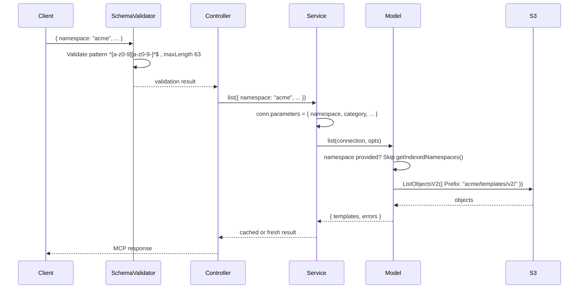

# Design Document: Add Namespace Filter to List Templates

## Overview

This design adds an optional `namespace` string parameter to four MCP tools (`list_templates`, `get_template`, `list_template_versions`, `check_template_updates`) so callers can filter template results to a single S3 namespace prefix. Templates are stored at `{namespace}/templates/v2/{category}/{templateName}.yml`. Today the system discovers all namespaces via `getIndexedNamespaces()` and searches them all. With this change, when `namespace` is provided the model layer skips discovery and uses `[namespace]` directly. When omitted, behavior is unchanged.

The change threads through four layers: schema validation, controller extraction, service cache-key inclusion, and model-layer filtering. `list_categories` is explicitly excluded.

## Architecture

The existing layered architecture remains unchanged. The namespace parameter flows top-down through each layer:



When `namespace` is omitted, the Model layer calls `getIndexedNamespaces(bucket)` as it does today, preserving full backward compatibility.

## Components and Interfaces

### 1. Schema Validator (`utils/schema-validator.js`)

Add a `namespace` property definition to four tool schemas:

```javascript
namespace: {
  type: 'string',
  pattern: '^[a-z0-9][a-z0-9-]*$',
  maxLength: 63,
  description: 'Filter to a specific namespace (S3 root prefix)'
}
```

Affected schemas: `list_templates`, `get_template`, `list_template_versions`, `check_template_updates`.

Not affected: `list_categories` (no `namespace` property added).

The property is optional (not in `required` array), so omitting it passes validation.

### 2. Templates Controller (`controllers/templates.js`)

Each handler (`list`, `get`, `listVersions`) extracts `namespace` from `input` alongside existing parameters and passes it to the corresponding service function.

```javascript
const { category, version, versionId, s3Buckets, namespace } = input;
// ...
const result = await Services.Templates.list({ category, version, versionId, s3Buckets, namespace });
```

When `namespace` is not in the input, it destructures as `undefined` and flows through unchanged.

### 3. Updates Controller (`controllers/updates.js`)

The `check` handler extracts `namespace` from input and passes it to `Services.Templates.checkUpdates()`:

```javascript
const { templateName, currentVersion, category, s3Buckets, namespace } = input;
// ...
const updateResults = await Services.Templates.checkUpdates({
  templates: [{ category, templateName, currentVersion }],
  s3Buckets,
  namespace
});
```

### 4. Templates Service (`services/templates.js`)

Each service function (`list`, `get`, `listVersions`, `checkUpdates`) includes `namespace` in `conn.parameters`:

```javascript
conn.parameters = { category, version, versionId, namespace };
```

This ensures:
- The cache key differs when namespace is provided vs omitted (different `conn.parameters` = different cache entry).
- The model layer receives the namespace filter via `connection.parameters.namespace`.

For `checkUpdates`, the `namespace` is passed through to the inner `get()` call via `s3Buckets` and the options object.

### 5. S3 Templates Model (`models/s3-templates.js`)

The key behavioral change lives here. In `list()`, `get()`, and `listVersions()`:

```javascript
const { category, version, versionId, namespace } = connection.parameters || {};

// Determine namespaces to search
const namespaces = namespace
  ? [namespace]                          // Use provided namespace directly
  : await getIndexedNamespaces(bucket);  // Discover all (current behavior)
```

When `namespace` is provided, `getIndexedNamespaces()` is skipped entirely. The model uses `[namespace]` as the namespace list and proceeds with the same iteration logic. If the namespace doesn't exist as a prefix in S3, `ListObjectsV2` returns empty results — no error is thrown.

## Data Models

### Namespace Parameter Schema

| Field | Type | Required | Pattern | MaxLength | Description |
|-------|------|----------|---------|-----------|-------------|
| `namespace` | `string` | No | `^[a-z0-9][a-z0-9-]*$` | 63 | S3 root-level prefix to filter templates |

Valid examples: `atlantis`, `acme`, `turbo-kiln`, `x1`
Invalid examples: `Acme` (uppercase), `giga hut` (space), `acme/co` (slash), `-start` (leading hyphen), `` (empty string)

### Cache Key Impact

The `CacheableDataAccess` cache key is derived from `conn.host` + `conn.parameters`. Adding `namespace` to `conn.parameters` means:

| Scenario | `conn.parameters` | Cache Key Effect |
|----------|-------------------|------------------|
| No namespace | `{ category: 'storage' }` | Same as today |
| With namespace | `{ category: 'storage', namespace: 'acme' }` | New, separate cache entry |
| Different namespace | `{ category: 'storage', namespace: 'turbo-kiln' }` | Another separate cache entry |

This is the correct behavior: results scoped to different namespaces must not share cache entries.

### Request/Response Contract

No changes to response schemas. The `namespace` field already exists in response objects from `get_template` (populated from S3 key parsing). The only change is the addition of the optional `namespace` input parameter to four tool schemas.


## Correctness Properties

*A property is a characteristic or behavior that should hold true across all valid executions of a system — essentially, a formal statement about what the system should do. Properties serve as the bridge between human-readable specifications and machine-verifiable correctness guarantees.*

### Property 1: Invalid namespace values are rejected by validation

*For any* string that does not match the pattern `^[a-z0-9][a-z0-9-]*$` or exceeds 63 characters, calling `SchemaValidator.validate()` on any of the four affected tools (`list_templates`, `get_template`, `list_template_versions`, `check_template_updates`) with that string as `namespace` should return `{ valid: false }` with at least one error message.

**Validates: Requirements 1.6, 1.7, 6.1, 6.2, 6.3, 6.4, 6.5**

### Property 2: Valid inputs without namespace continue to pass validation

*For any* valid input object (with valid `category`, `s3Buckets`, etc.) that does not include a `namespace` field, calling `SchemaValidator.validate()` on any of the four affected tools should return `{ valid: true }` with no errors, preserving backward compatibility.

**Validates: Requirements 1.8, 5.1, 5.2**

### Property 3: Controller passes namespace through to service layer

*For any* valid namespace string and any of the four tool handlers (`list`, `get`, `listVersions`, `check`), the controller should pass the exact namespace value to the corresponding service function. When namespace is omitted, the service should receive `undefined`.

**Validates: Requirements 2.1, 2.2, 2.3, 2.4, 2.5**

### Property 4: Service includes namespace in connection parameters

*For any* valid namespace string and any of the four service operations (`list`, `get`, `listVersions`, `checkUpdates`), the `conn.parameters` object passed to the model layer should contain the `namespace` value.

**Validates: Requirements 3.1, 3.2, 3.3, 3.4**

### Property 5: Different namespace values produce different cache keys

*For any* two distinct namespace values (including one being `undefined`), calling the same service operation with identical parameters except for namespace should result in different `conn.parameters` objects, and therefore different cache keys.

**Validates: Requirements 3.5, 3.6**

### Property 6: Model skips namespace discovery when namespace is provided

*For any* valid namespace string, when the model layer's `list`, `get`, or `listVersions` function receives a `connection.parameters.namespace` value, it should use `[namespace]` as the namespace list and should NOT call `getIndexedNamespaces()`.

**Validates: Requirements 4.1, 4.3, 4.5**

### Property 7: Non-existent namespace returns empty results without error

*For any* namespace string that does not exist as a prefix in any searched S3 bucket, the model layer should return an empty template list (for `list`), `null` (for `get`), or an object with an empty versions array (for `listVersions`) — without throwing an error.

**Validates: Requirements 4.7**

## Error Handling

### Validation Errors

When an invalid `namespace` value is provided, the `SchemaValidator.validate()` function returns `{ valid: false, errors: [...] }`. The controller then returns an MCP error response with code `INVALID_INPUT` and the validation error messages. This follows the existing pattern for all other parameter validation errors.

Error scenarios:
- Pattern mismatch (uppercase, spaces, slashes, leading hyphen): error message references the pattern
- Length violation (>63 chars): error message references maxLength
- Empty string: fails pattern match (pattern requires at least one character starting with `[a-z0-9]`)

### Non-Existent Namespace

When a valid namespace is provided but doesn't exist in S3:
- `list()`: Returns `{ templates: [], errors: undefined, partialData: false }` — no error, just empty results
- `get()`: Returns `null`, which the service layer converts to a `TEMPLATE_NOT_FOUND` error response with available templates
- `listVersions()`: Returns `{ templateName, category, versions: [] }` — no error, empty versions

This is consistent with how the system handles other "no results" scenarios (e.g., filtering by a category with no templates).

### Brown-Out Behavior

The existing brown-out support (continue on bucket failures) is unaffected. When namespace is provided, the model still iterates through buckets and handles per-bucket failures gracefully. The only difference is that within each bucket, it searches one namespace instead of discovering all.

## Testing Strategy

### Testing Framework

All new tests must be written in Jest (`.jest.mjs` files) per project conventions. Property-based tests use `fast-check`.

### Unit Tests (Jest)

Unit tests cover specific examples and edge cases:

- Schema validator: verify namespace property exists in four schemas, absent in `list_categories`
- Schema validator: verify specific invalid inputs (uppercase, spaces, slashes, leading hyphen, empty string, >63 chars)
- Schema validator: verify valid namespace values pass (`atlantis`, `acme`, `turbo-kiln`, `x1`)
- Controller: verify namespace is extracted and passed to service (mock service layer)
- Controller: verify namespace omission passes `undefined` to service
- Service: verify `conn.parameters` includes namespace
- Model: verify `getIndexedNamespaces` is NOT called when namespace is provided
- Model: verify `getIndexedNamespaces` IS called when namespace is omitted
- Model: verify empty results for non-existent namespace (no error thrown)
- Response schema: verify `get_template` response still includes `namespace` field

### Property-Based Tests (fast-check + Jest)

Each correctness property maps to a single property-based test with minimum 100 iterations. Each test is tagged with the design property it validates.

- **Feature: add-namespace-filter-to-list-templates, Property 1: Invalid namespace values are rejected by validation** — Generate random strings not matching `^[a-z0-9][a-z0-9-]*$` or exceeding 63 chars; verify all are rejected by `SchemaValidator.validate()`.
- **Feature: add-namespace-filter-to-list-templates, Property 2: Valid inputs without namespace continue to pass validation** — Generate random valid input objects without namespace; verify all pass validation.
- **Feature: add-namespace-filter-to-list-templates, Property 3: Controller passes namespace through to service layer** — Generate random valid namespaces; verify controller passes exact value to service (via mock).
- **Feature: add-namespace-filter-to-list-templates, Property 4: Service includes namespace in connection parameters** — Generate random valid namespaces; verify `conn.parameters.namespace` matches.
- **Feature: add-namespace-filter-to-list-templates, Property 5: Different namespace values produce different cache keys** — Generate pairs of distinct namespace values; verify `conn.parameters` objects differ.
- **Feature: add-namespace-filter-to-list-templates, Property 6: Model skips namespace discovery when namespace is provided** — Generate random valid namespaces; verify `getIndexedNamespaces` is not called (via mock/spy).
- **Feature: add-namespace-filter-to-list-templates, Property 7: Non-existent namespace returns empty results without error** — Generate random namespace strings; mock S3 to return empty; verify no error thrown and empty results returned.

### Property-Based Testing Configuration

- Library: `fast-check` (already available in project)
- Minimum iterations: 100 per property test
- Each test tagged with: `Feature: add-namespace-filter-to-list-templates, Property {N}: {title}`
- Each correctness property implemented by a single property-based test
