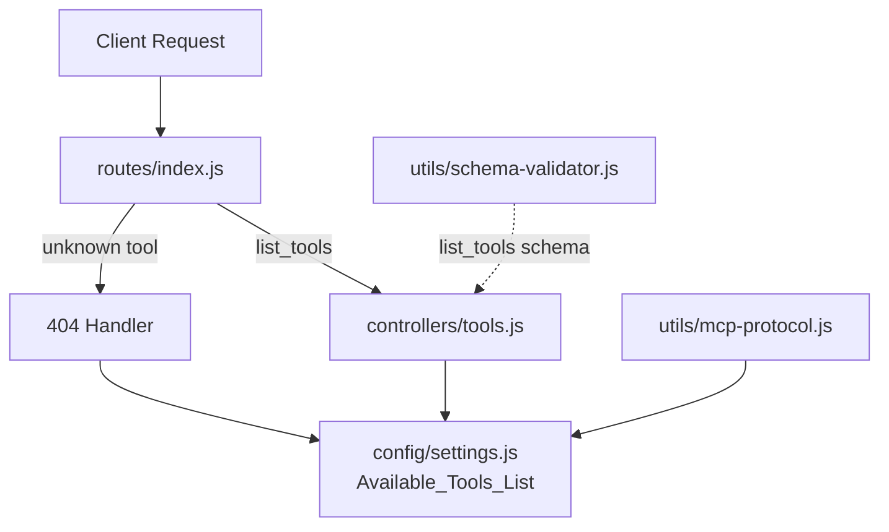

# Design Document: Add Tools Endpoint Which Lists Available Tools

## Overview

This feature centralizes tool definitions into `config/settings.js` and adds a `list_tools` endpoint so MCP clients can discover available tools at runtime. Currently, tool definitions are defined in `utils/mcp-protocol.js` as the `MCP_TOOLS` constant, and the router's 404 handler maintains a separate hardcoded array of tool names. This duplication creates a maintenance burden and a risk of the lists drifting out of sync.

The design moves the single source of truth for tool definitions into `config/settings.js` as `Available_Tools_List`, updates `mcp-protocol.js` to consume that list, adds a new `list_tools` route and controller, and updates the router's 404 handler to derive available tool names from the centralized list.

### Key Design Decisions

1. **Settings as source of truth**: Tool definitions move to `config/settings.js` because settings already serves as the centralized configuration module. All other modules import from it.
2. **No service layer for list_tools**: The `list_tools` controller returns static configuration data directly from settings. Adding a service layer would be unnecessary indirection.
3. **Schema validation still applied**: Even though `list_tools` takes no meaningful input, it still goes through `SchemaValidator.validate()` for consistency with the existing controller pattern.
4. **Existing MCP_TOOLS constant becomes a re-export**: `mcp-protocol.js` will import from settings and re-export as `MCP_TOOLS` to maintain backward compatibility for any code referencing `MCPProtocol.MCP_TOOLS`.

## Architecture

The change touches four layers of the existing architecture:



### Data Flow for `list_tools`

1. Client sends request with `tool: "list_tools"`
2. Router matches `list_tools` case, delegates to `ToolsController.list()`
3. Controller validates input via `SchemaValidator.validate('list_tools', input)`
4. Controller reads `Available_Tools_List` from settings (via `require('../config/settings')`)
5. Controller returns `MCPProtocol.successResponse('list_tools', { tools: Available_Tools_List })`

### Data Flow for 404 (unknown tool)

1. Router hits `default` case in switch
2. Router derives tool names: `settings.tools.availableToolsList.map(t => t.name)`
3. Router includes derived names in error response details

## Components and Interfaces

### 1. `config/settings.js` — New `tools` section

A new `tools` property is added to the settings object containing `availableToolsList`. This array holds all Tool_Definition objects (the current `MCP_TOOLS` array content plus the new `list_tools` entry).

```javascript
/**
 * @typedef {Object} ToolDefinition
 * @property {string} name - Tool name used for routing
 * @property {string} description - Human-readable description of the tool
 * @property {Object} inputSchema - JSON Schema for tool input validation
 */

// In settings object:
tools: {
  /**
   * Complete list of MCP tool definitions supported by this server.
   * This is the single source of truth for tool metadata.
   * @type {Array<ToolDefinition>}
   */
  availableToolsList: [ /* ...tool definitions... */ ]
}
```

### 2. `utils/mcp-protocol.js` — Updated imports

- Remove the local `MCP_TOOLS` constant definition
- Import `Available_Tools_List` from settings: `const settings = require('../config/settings');`
- Re-export: `const MCP_TOOLS = settings.tools.availableToolsList;`
- All existing functions (`listTools`, `getCapabilities`, `isValidTool`, `getTool`) continue to work unchanged since they reference `MCP_TOOLS`

### 3. `controllers/tools.js` — New controller

```javascript
/**
 * Tools Controller
 *
 * Handles MCP tool requests for tool discovery.
 * Returns the list of available tools with descriptions and input schemas.
 *
 * @module controllers/tools
 */

/**
 * List all available MCP tools
 *
 * @param {Object} props - Request properties from router
 * @returns {Promise<Object>} MCP-formatted response with tool list
 */
async function list(props) {
  // 1. Extract input, validate via SchemaValidator
  // 2. Read settings.tools.availableToolsList
  // 3. Return MCPProtocol.successResponse('list_tools', { tools })
  // 4. On error: return MCPProtocol.errorResponse('INTERNAL_ERROR', ...)
}
```

### 4. `controllers/index.js` — Updated exports

Add `Tools` to the exported controllers object.

### 5. `routes/index.js` — Updated routing

- Add `case 'list_tools':` before the `default:` case
- Update `default:` handler to derive available tool names from `settings.tools.availableToolsList`
- Remove hardcoded `availableTools` array

### 6. `utils/schema-validator.js` — New schema

Add `list_tools` schema (empty object, no required properties, `additionalProperties: false`).

## Data Models

### ToolDefinition

Each tool definition follows this structure (unchanged from existing `MCP_TOOLS` entries):

| Field | Type | Description |
|-------|------|-------------|
| `name` | `string` | Unique tool identifier used for routing (e.g., `"list_tools"`) |
| `description` | `string` | Human-readable description of what the tool does |
| `inputSchema` | `object` | JSON Schema object describing accepted input parameters |

### list_tools Response

The `list_tools` endpoint returns an MCP success response wrapping the tool list:

```json
{
  "protocol": "mcp",
  "version": "1.0",
  "tool": "list_tools",
  "success": true,
  "data": {
    "tools": [
      {
        "name": "list_templates",
        "description": "List all available CloudFormation templates...",
        "inputSchema": { ... }
      },
      {
        "name": "list_tools",
        "description": "List all available MCP tools...",
        "inputSchema": { ... }
      }
    ]
  },
  "timestamp": "2025-01-01T00:00:00.000Z"
}
```

### list_tools Input Schema

```json
{
  "type": "object",
  "properties": {},
  "additionalProperties": false
}
```


## Correctness Properties

*A property is a characteristic or behavior that should hold true across all valid executions of a system — essentially, a formal statement about what the system should do. Properties serve as the bridge between human-readable specifications and machine-verifiable correctness guarantees.*

### Property 1: Tool definition structural invariant

*For any* entry in `Available_Tools_List`, the entry must have a `name` property that is a non-empty string, a `description` property that is a non-empty string, and an `inputSchema` property that is a non-null object.

**Validates: Requirements 1.3, 3.3**

### Property 2: MCP Protocol passthrough from Settings

*For any* `Available_Tools_List` content in Settings, calling `MCPProtocol.listTools()` must return exactly that list, and calling `MCPProtocol.getCapabilities().tools` must return exactly that list.

**Validates: Requirements 1.2, 2.2, 2.3**

### Property 3: isValidTool consistency with Available_Tools_List

*For any* string `toolName`, `MCPProtocol.isValidTool(toolName)` must return `true` if and only if `toolName` appears as the `name` property of some entry in `Available_Tools_List`.

**Validates: Requirements 2.4**

### Property 4: 404 response tool names match centralized list

*For any* unknown tool name sent to the router, the error response `details.availableTools` array must contain exactly the set of `name` values from `Available_Tools_List` in Settings.

**Validates: Requirements 4.1, 4.2**

## Error Handling

### Tools Controller Errors

| Scenario | Error Code | HTTP Status | Details |
|----------|-----------|-------------|---------|
| Invalid input (unexpected properties) | `INVALID_INPUT` | 400 | Validation errors from SchemaValidator |
| Unexpected exception in controller | `INTERNAL_ERROR` | 500 | Generic error message, no internal details exposed |

The Tools controller follows the same error handling pattern as existing controllers:
- Input validation errors return `MCPProtocol.errorResponse('INVALID_INPUT', ...)` 
- Unexpected exceptions are caught, logged via `DebugAndLog.error()`, and return `MCPProtocol.errorResponse('INTERNAL_ERROR', ...)`

### Router 404 Errors

The existing 404 handler behavior is preserved but updated to derive tool names dynamically:
- Error code: `UNKNOWN_TOOL`
- HTTP status: 404
- Response includes `availableTools` array derived from `settings.tools.availableToolsList.map(t => t.name)`

## Testing Strategy

### Testing Framework

- **Unit tests**: Jest (`.test.js` files) — following existing project patterns
- **Property-based tests**: Jest + fast-check (`.property.test.js` files) — already a devDependency

### Unit Tests

Unit tests cover specific examples, edge cases, and error conditions:

1. **Tools Controller** (`tests/unit/controllers/tools-controller.test.js`):
   - `list_tools` returns successful MCP response with all tool definitions
   - `list_tools` returns error response when unexpected exception occurs
   - `list_tools` handles missing/empty body gracefully
   - `list_tools` rejects invalid input (unexpected properties)

2. **Router** (`tests/unit/lambda/` — update existing route tests):
   - `list_tools` route delegates to ToolsController.list()
   - Unknown tool 404 response includes tool names from centralized list
   - `list_tools` tool definition is present in Available_Tools_List

3. **MCP Protocol** (`tests/unit/utils/` — update existing tests):
   - `listTools()` returns Available_Tools_List from settings
   - `getCapabilities().tools` returns Available_Tools_List from settings
   - `isValidTool('list_tools')` returns true

4. **Settings**:
   - `settings.tools.availableToolsList` is a non-empty array
   - `list_tools` entry exists in the list

### Property-Based Tests

Each correctness property is implemented as a single property-based test using fast-check with minimum 100 iterations. Each test references its design document property.

1. **Property 1** — Feature: add-tools-endpoint-which-lists-available-tools, Property 1: Tool definition structural invariant
   - Generate random indices into Available_Tools_List, verify structure

2. **Property 2** — Feature: add-tools-endpoint-which-lists-available-tools, Property 2: MCP Protocol passthrough from Settings
   - Verify listTools() and getCapabilities().tools return the settings list

3. **Property 3** — Feature: add-tools-endpoint-which-lists-available-tools, Property 3: isValidTool consistency with Available_Tools_List
   - Generate random strings; verify isValidTool returns true iff name is in the list

4. **Property 4** — Feature: add-tools-endpoint-which-lists-available-tools, Property 4: 404 response tool names match centralized list
   - Generate random unknown tool names; verify 404 response contains exactly the centralized tool names
