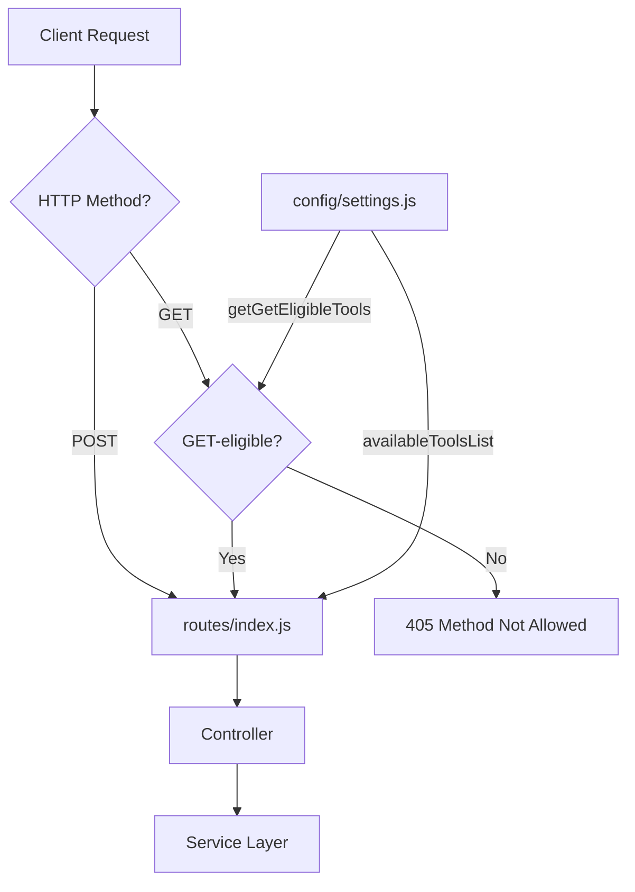
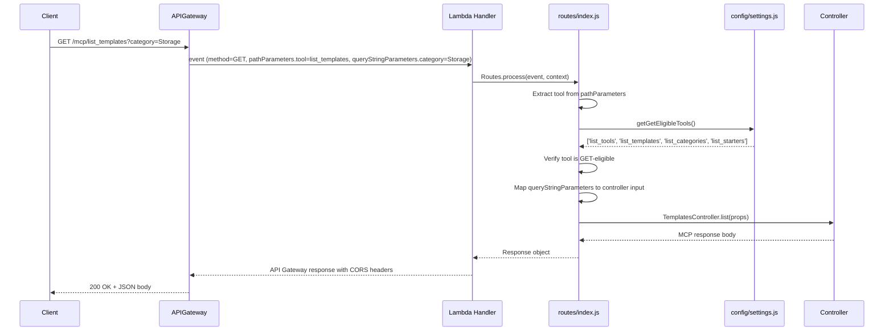
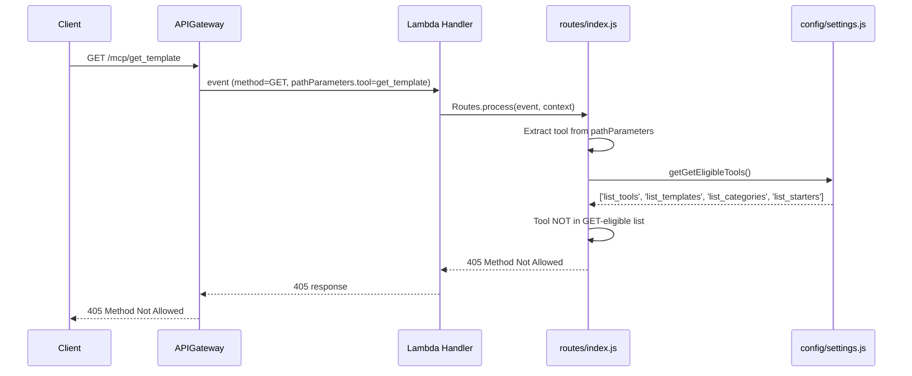

# Design Document: Allow GET on Tools That List

## Overview

This feature adds HTTP GET method support to MCP tool endpoints that have no required parameters. Currently, all tool endpoints only accept POST and OPTIONS. By adding GET support for tools whose `inputSchema` has no `required` array, we enable easier browser testing, curl exploration, and better REST convention compliance.

The design derives GET eligibility from the existing `availableToolsList` in `config/settings.js`, so adding or removing tools automatically updates GET eligibility without maintaining a separate list. The router enforces method restrictions: GET requests to tools with required parameters receive a 405 Method Not Allowed response. For eligible tools, query string parameters are mapped to the same structure controllers already expect, ensuring GET and POST return identical responses.

### Key Design Decisions

1. **Derive GET eligibility from inputSchema**: A tool is GET-eligible if and only if its `inputSchema` has no `required` array (or an empty one). This avoids maintaining a separate allowlist and keeps the single source of truth in `availableToolsList`.
2. **Catch-all route with method enforcement in router**: Rather than defining separate API Gateway routes per tool per method, we add a single GET event to the existing `/mcp/{tool}` catch-all. The router then checks GET eligibility and returns 405 for ineligible tools. This keeps the SAM template simple.
3. **Query string parameters mapped to controller input**: For GET requests, `props.queryStringParameters` are passed to controllers in the same structure as `props.bodyParameters.input`, so controllers need zero changes.
4. **POST remains available for all tools**: GET is additive. POST continues to work for every tool, including GET-eligible ones.

## Architecture

The change touches the infrastructure layer (SAM template, OpenAPI spec) and the application layer (settings, router). Controllers remain unchanged.



### Request Flow: GET to a GET-Eligible Tool



### Request Flow: GET to a POST-Only Tool



## Components and Interfaces

### 1. `config/settings.js` — New `getGetEligibleTools()` Method

A new method on the `tools` section that derives GET-eligible tool names from `availableToolsList` by checking for the absence of a `required` array in each tool's `inputSchema`.

```javascript
tools: {
  availableToolsList: [ /* ...existing tool definitions... */ ],

  /**
   * Get the list of tool names eligible for HTTP GET requests.
   * A tool is GET-eligible if its inputSchema has no `required` array.
   *
   * @returns {Array<string>} Array of GET-eligible tool names
   * @example
   * const eligible = settings.tools.getGetEligibleTools();
   * // ['list_tools', 'list_templates', 'list_categories', 'list_starters']
   */
  getGetEligibleTools() {
    return this.availableToolsList
      .filter(tool => !tool.inputSchema.required || tool.inputSchema.required.length === 0)
      .map(tool => tool.name);
  }
}
```

### 2. `routes/index.js` — GET Method Enforcement and Query String Mapping

Two changes to the router:

**a) After extracting the tool name, check if a GET request targets a non-GET-eligible tool:**

```javascript
// After extracting tool name and before the switch statement:
if (props.method === 'GET') {
  const getEligibleTools = settings.tools.getGetEligibleTools();
  if (!getEligibleTools.includes(tool)) {
    // Return 405 Method Not Allowed
    return RESP.reset({
      statusCode: 405,
      body: ErrorHandler.toUserResponse(
        ErrorHandler.createError({
          code: ErrorHandler.ErrorCode.METHOD_NOT_ALLOWED,
          message: `Tool '${tool}' requires POST method. GET is only supported for: ${getEligibleTools.join(', ')}`,
          category: ErrorHandler.ErrorCategory.CLIENT_ERROR,
          statusCode: 405,
          requestId: context.requestId,
          details: { tool, method: 'GET', allowedMethods: ['POST'], getEligibleTools }
        }),
        context.requestId
      )
    });
  }
}
```

**b) For GET requests, map query string parameters into the same structure controllers expect:**

```javascript
// Before routing to controller, normalize parameters for GET:
if (props.method === 'GET' && props.queryStringParameters) {
  props.bodyParameters = props.bodyParameters || {};
  props.bodyParameters.input = { ...props.queryStringParameters };
}
```

### 3. SAM Template (`template.yml`) — New GET Event

Add a GET method event alongside the existing POST event for the `/mcp/{tool}` catch-all route:

```yaml
Events:
  UseTool:
    Type: Api
    Properties:
      Path: /mcp/{tool}
      Method: post
      RestApiId: !Ref WebApi
  UseToolGet:
    Type: Api
    Properties:
      Path: /mcp/{tool}
      Method: get
      RestApiId: !Ref WebApi
```

Update CORS `AllowMethods`:

```yaml
Cors:
  AllowMethods: "'GET,POST,OPTIONS'"
```

### 4. OpenAPI Spec (`template-openapi-spec.yml`) — GET Method Definitions

Add `get` method definitions for each GET-eligible endpoint path. Also add the missing `/mcp/list_tools` path (both GET and POST).

For endpoints with optional query parameters (e.g., `list_templates`, `list_starters`), the GET definition includes `parameters` with `in: query` entries matching the tool's `inputSchema.properties`.

For endpoints with no parameters (e.g., `list_tools`, `list_categories`), the GET definition has no `parameters` or `requestBody`.

Example for `/mcp/list_templates`:

```yaml
/mcp/list_templates:
  post:
    # ...existing POST definition unchanged...
  get:
    summary: "List available templates (GET)"
    description: "Returns a list of available Atlantis templates. Supports optional query string filters."
    parameters:
      - name: category
        in: query
        required: false
        schema:
          type: string
          enum: ['storage', 'network', 'pipeline', 'service-role', 'modules']
        description: "Filter by template category"
      - name: version
        in: query
        required: false
        schema:
          type: string
        description: "Filter by Human_Readable_Version"
      - name: versionId
        in: query
        required: false
        schema:
          type: string
        description: "Filter by S3_VersionId"
    responses:
      '200':
        description: "Success response with template list"
        content:
          application/json:
            schema:
              $ref: '#/components/schemas/MCPResponse'
      '400':
        description: "Bad request"
        content:
          application/json:
            schema:
              $ref: '#/components/schemas/MCPError'
      '500':
        description: "Internal server error"
        content:
          application/json:
            schema:
              $ref: '#/components/schemas/MCPError'
    x-amazon-apigateway-integration:
      httpMethod: post
      type: aws_proxy
      uri:
        Fn::Sub: arn:aws:apigateway:${AWS::Region}:lambda:path/2015-03-31/functions/${ReadLambdaFunction.Arn}/invocations
```

### 5. Controllers — No Changes Required

Controllers already receive `props` and read parameters from `props.bodyParameters.input`. Since the router maps query string parameters into this same structure for GET requests, no controller modifications are needed.

## Data Models

### GET-Eligible Tool Derivation

GET eligibility is derived at runtime from the existing `availableToolsList`:

| Tool Name | Has `required` Array? | GET-Eligible? |
|-----------|----------------------|---------------|
| `list_tools` | No | Yes |
| `list_templates` | No | Yes |
| `list_categories` | No | Yes |
| `list_starters` | No | Yes |
| `get_template` | Yes (`templateName`, `category`) | No |
| `list_template_versions` | Yes (`templateName`, `category`) | No |
| `get_starter_info` | Yes (`starterName`) | No |
| `search_documentation` | Yes (`query`) | No |
| `validate_naming` | Yes (`resourceName`) | No |
| `check_template_updates` | Yes (`templateName`, `category`, `currentVersion`) | No |

### Query String to Controller Input Mapping

For GET requests, query string parameters are mapped directly:

| GET Request | Equivalent POST Body |
|-------------|---------------------|
| `GET /mcp/list_templates?category=Storage` | `POST /mcp/list_templates` with `{ "input": { "category": "Storage" } }` |
| `GET /mcp/list_starters?ghusers=63Klabs` | `POST /mcp/list_starters` with `{ "input": { "ghusers": "63Klabs" } }` |
| `GET /mcp/list_tools` | `POST /mcp/list_tools` with `{ "input": {} }` |
| `GET /mcp/list_categories` | `POST /mcp/list_categories` with `{ "input": {} }` |

### 405 Error Response

When a GET request targets a non-GET-eligible tool:

```json
{
  "statusCode": 405,
  "error": {
    "code": "METHOD_NOT_ALLOWED",
    "message": "Tool 'get_template' requires POST method. GET is only supported for: list_tools, list_templates, list_categories, list_starters",
    "details": {
      "tool": "get_template",
      "method": "GET",
      "allowedMethods": ["POST"],
      "getEligibleTools": ["list_tools", "list_templates", "list_categories", "list_starters"]
    }
  },
  "requestId": "abc-123"
}
```


## Correctness Properties

*A property is a characteristic or behavior that should hold true across all valid executions of a system — essentially, a formal statement about what the system should do. Properties serve as the bridge between human-readable specifications and machine-verifiable correctness guarantees.*

### Property 1: GET eligibility is determined by absence of required parameters

*For any* tool definition in `availableToolsList`, the tool appears in the GET-eligible list if and only if its `inputSchema` has no `required` array or has an empty `required` array. Conversely, any tool with a non-empty `required` array must be excluded.

**Validates: Requirements 1.2, 1.3**

### Property 2: Query string parameters are mapped to controller input

*For any* GET request to a GET-eligible tool with query string parameters, the parameters must be passed to the controller in the same structure as POST body parameters (`props.bodyParameters.input`), preserving all key-value pairs.

**Validates: Requirements 4.2**

### Property 3: GET to non-GET-eligible tools returns 405

*For any* tool in `availableToolsList` that has a non-empty `required` array in its `inputSchema`, sending a GET request to that tool must return a 405 Method Not Allowed response with an error body indicating the tool requires POST.

**Validates: Requirements 4.3**

### Property 4: POST continues to work for all tools

*For any* tool in `availableToolsList` (regardless of GET eligibility), sending a POST request must be accepted and routed to the appropriate controller — GET support does not break existing POST behavior.

**Validates: Requirements 4.4**

### Property 5: GET and POST response parity

*For any* GET-eligible tool and any set of valid optional parameters, a GET request with those parameters as query strings and an equivalent POST request with those parameters in the body must produce the same response body structure and the same CORS headers (including `Access-Control-Allow-Methods: GET, POST, OPTIONS`).

**Validates: Requirements 5.1, 5.2**

### Property 6: GET and POST error response parity

*For any* error condition that can occur while processing a GET request to a GET-eligible tool, the error response format (status code, error body structure, CORS headers) must match the format that would be returned for the same error triggered via POST.

**Validates: Requirements 5.3**

## Error Handling

### Router-Level Errors

| Scenario | Error Code | HTTP Status | Details |
|----------|-----------|-------------|---------|
| GET request to non-GET-eligible tool | `METHOD_NOT_ALLOWED` | 405 | Includes tool name, allowed methods, and list of GET-eligible tools |
| GET request to unknown tool | `UNKNOWN_TOOL` | 404 | Same as existing POST 404 behavior — includes available tool names |
| Unsupported HTTP method (e.g., PUT, DELETE) | `METHOD_NOT_ALLOWED` | 405 | Existing behavior unchanged |
| Missing tool parameter | `INVALID_INPUT` | 400 | Existing behavior unchanged |

### Controller-Level Errors

No changes. Controllers continue to handle errors the same way for both GET and POST since the router normalizes the input structure before routing.

### CORS Headers on Error Responses

All error responses (including 405) must include the same CORS headers as success responses:

```
Access-Control-Allow-Origin: *
Access-Control-Allow-Methods: GET, POST, OPTIONS
Access-Control-Allow-Headers: Content-Type, Authorization, X-Requested-With
```

## Testing Strategy

### Testing Framework

- **Unit tests**: Jest (`.test.js` files) — following existing project patterns
- **Property-based tests**: Jest + fast-check (`.property.test.js` files) — already a devDependency

### Unit Tests

Unit tests cover specific examples, edge cases, and error conditions:

1. **Settings — `getGetEligibleTools()`** (`tests/unit/config/settings-get-eligible.test.js`):
   - Returns an array containing `list_tools`, `list_templates`, `list_categories`, `list_starters`
   - Does not contain `get_template`, `list_template_versions`, `get_starter_info`, `search_documentation`, `validate_naming`, `check_template_updates`
   - Returns empty array if all tools have required parameters (edge case with mocked settings)

2. **Router — GET method handling** (`tests/unit/lambda/get-method-support.test.js`):
   - GET request to `list_tools` returns 200 with tool list
   - GET request to `list_templates?category=Storage` passes `category` to controller
   - GET request to `get_template` returns 405 with descriptive error
   - GET request to `search_documentation` returns 405
   - GET request to unknown tool returns 404 (not 405)
   - POST request to `list_tools` still works after GET support added
   - POST request to `get_template` still works after GET support added

3. **Response parity** (`tests/unit/lambda/get-post-parity.test.js`):
   - GET and POST to `list_tools` return same response body structure
   - GET and POST to `list_templates` return same response body structure
   - Error responses from GET have same format as POST errors
   - CORS headers are identical for GET and POST responses

### Property-Based Tests

Each correctness property is implemented as a single property-based test using fast-check with minimum 100 iterations. Each test references its design document property.

1. **Property 1** (`tests/unit/config/settings-get-eligible.property.test.js`):
   - Feature: allow-get-on-tools-that-list, Property 1: GET eligibility is determined by absence of required parameters
   - Generate random tool definitions with and without `required` arrays; verify `getGetEligibleTools()` returns exactly those without `required`

2. **Property 2** (`tests/unit/lambda/get-query-string-mapping.property.test.js`):
   - Feature: allow-get-on-tools-that-list, Property 2: Query string parameters are mapped to controller input
   - Generate random key-value pairs as query string parameters; verify they appear in `props.bodyParameters.input`

3. **Property 3** (`tests/unit/lambda/get-method-405.property.test.js`):
   - Feature: allow-get-on-tools-that-list, Property 3: GET to non-GET-eligible tools returns 405
   - For each tool with a non-empty `required` array, send a GET request and verify 405 response

4. **Property 4** (`tests/unit/lambda/post-still-works.property.test.js`):
   - Feature: allow-get-on-tools-that-list, Property 4: POST continues to work for all tools
   - For each tool in `availableToolsList`, send a POST request and verify it is accepted (not 405)

5. **Property 5** (`tests/unit/lambda/get-post-response-parity.property.test.js`):
   - Feature: allow-get-on-tools-that-list, Property 5: GET and POST response parity
   - For each GET-eligible tool, generate random optional parameters, send both GET and POST, verify response bodies and headers match

6. **Property 6** (`tests/unit/lambda/get-post-error-parity.property.test.js`):
   - Feature: allow-get-on-tools-that-list, Property 6: GET and POST error response parity
   - For each GET-eligible tool, trigger error conditions via both GET and POST, verify error response format matches
