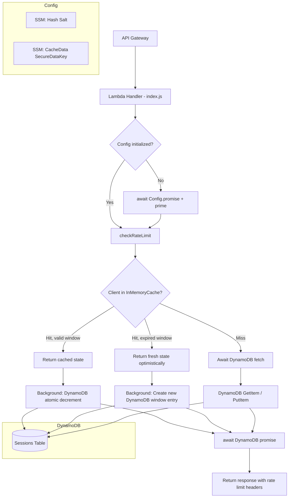

# Design Document: API Response Headers Return NaN

## Overview

This design addresses the bug where `X-RateLimit-Reset` and `X-RateLimit-Remaining` response headers return `NaN`, caused by incorrect argument passing in `rate-limiter.js`. The fix is part of a broader rearchitecture that replaces the fragile in-memory-only rate limiter with a distributed system backed by DynamoDB, an LRU in-memory cache for fast-path optimization, interval-aligned windows, and salted SHA-256 client identifier hashing.

The current bugs are:
1. `checkRateLimit()` passes a `client` object to `getRateLimitData()`, but that function expects three separate arguments `(user, limit, windowInMinutes)` — so `limit` and `windowInMinutes` are `undefined`, producing `NaN`.
2. Headers reference an undefined variable `limit` instead of `limitPerWindow`.
3. `incrementRequestCount()` receives `client.user` but the rate limit data was keyed by the full `client` object.

The new architecture fixes these bugs and adds distributed accuracy across Lambda instances via DynamoDB atomic counters, with graceful fallback to in-memory-only mode when DynamoDB is unavailable.

## Architecture



The system has three layers:

1. **In-Memory Cache (fast path)**: Per-Lambda-instance LRU Map storing last-known rate limit state. Provides sub-millisecond responses for known clients.
2. **DynamoDB Sessions Table (source of truth)**: Stores distributed rate limit counters with atomic updates. TTL-based automatic cleanup.
3. **Window Calculator (pure function)**: `nextIntervalInMinutes` computes interval-aligned reset times from `Etc/UTC` midnight.

Request flow:
1. Handler calls `await checkRateLimit(event, limits)` (now async).
2. Rate limiter computes the client identifier hash: `SHA-256(rawId + windowStartMinutes + salt)`.
3. Checks in-memory cache for a valid entry in the current window.
4. If cache hit with valid window: use cached state, trigger background DynamoDB sync.
5. If cache miss or expired window: await DynamoDB fetch/create.
6. DynamoDB atomic decrement (`remaining - 1` with condition `remaining > 0`).
7. Handler awaits the DynamoDB promise before returning the response.

## Components and Interfaces

### 1. `rate-limiter.js` (rewritten)

Exports:
- `async checkRateLimit(event, limits)` → `{allowed, headers, retryAfter, dynamoPromise}`
- `createRateLimitResponse(headers, retryAfter)` → API Gateway 429 response object
- `getRateLimitStats()` → `{totalTrackedClients, activeClients}`
- `TestHarness` (for testing private internals)

Internal components:
- `RateLimitCache` — LRU in-memory cache class (private)
- `hashClientIdentifier(rawId, windowStartMinutes, salt)` — SHA-256 hashing (private)
- `nextIntervalInMinutes(intervalInMinutes, offsetInMinutes)` — pure window calculator (private, exposed via TestHarness)
- `convertFromMinutesToMilli(minutes)` — utility (private, exposed via TestHarness)
- `convertFromMilliToMinutes(milliSeconds)` — utility (private, exposed via TestHarness)
- `fetchFromDynamo(pk)` — DynamoDB GetItem wrapper (private)
- `decrementInDynamo(pk, ttl, limitPerWindow)` — atomic update (private)
- `createInDynamo(pk, limitPerWindow, ttl)` — PutItem for new window (private)

### 2. `config/index.js` (modified)

Changes:
- Add `CachedSsmParameter` for `Mcp_SessionHashSalt` in `Config.init()`.
- Expose the salt via `Config.settings().sessionHashSalt`.

### 3. `config/settings.js` (modified)

Changes:
- Add `sessionHashSalt` property using `CachedSsmParameter`.
- Add `dynamoDbSessionsTable` property reading `process.env.MCP_DYNAMODB_SESSIONS_TABLE`.

### 4. `index.js` handler (modified)

Changes:
- `checkRateLimit` call becomes `await checkRateLimit(event, Config.settings().rateLimits)`.
- Await the returned `dynamoPromise` before returning the response.

### 5. CloudFormation `template.yml` (modified)

Changes:
- Add `DynamoDbSessions` DynamoDB table resource.
- Add `MCP_DYNAMODB_SESSIONS_TABLE` environment variable to Lambda.
- Add IAM permissions for `dynamodb:GetItem`, `dynamodb:PutItem`, `dynamodb:UpdateItem` scoped to the sessions table ARN.

### Interface: `checkRateLimit(event, limits)`

```javascript
/**
 * @async
 * @param {Object} event - API Gateway event
 * @param {Object} limits - Rate limit config from Config.settings().rateLimits
 * @returns {Promise<{allowed: boolean, headers: Object, retryAfter: number|null, dynamoPromise: Promise}>}
 */
```

The `dynamoPromise` must be awaited by the handler before returning the response. This ensures the DynamoDB atomic decrement completes before the client receives the response.

### Interface: `RateLimitCache`

```javascript
class RateLimitCache {
  constructor(options = {}) // maxEntries, entriesPerGB, defaultMaxEntries
  get(key)                  // → {cache: 0|-1|1, data: object|null}
  set(key, value, expiresAt)
  clear()
  cleanup()                 // Remove expired entries
  info()                    // → {size, maxEntries, memoryMB}
}
```

### Interface: `nextIntervalInMinutes`

```javascript
/**
 * @param {number} intervalInMinutes - Window size (e.g., 5, 60, 1440)
 * @param {number} [offsetInMinutes=0] - Timezone offset (future use)
 * @returns {number} Next reset time in minutes since epoch
 */
```

## Data Models

### DynamoDB Sessions Table

| Attribute   | Type   | Description |
|-------------|--------|-------------|
| `pk`        | String | Partition key — SHA-256 hash of `rawClientId + windowStartInMinutes + salt` |
| `remaining` | Number | Requests remaining in current window |
| `limit`     | Number | Max requests for this window (for reference) |
| `tier`      | String | Access tier: `public`, `registered`, `paid`, `private` |
| `ttl`       | Number | DynamoDB TTL — Unix timestamp in seconds for automatic cleanup |

Table configuration:
- Billing mode: `PAY_PER_REQUEST` (on-demand)
- Partition key: `pk` (String), no sort key
- TTL attribute: `ttl`
- Table name: `<Prefix>-<ProjectId>-<StageId>-sessions`

### In-Memory Cache Entry

```javascript
{
  remaining: number,      // Requests remaining
  limit: number,          // Max requests for window
  resetTimeMinutes: number, // Next reset time in minutes since epoch
  tier: string,           // Access tier
  windowStart: number     // Current window start in minutes (for hash computation)
}
```

### Rate Limit Headers (response)

| Header | Value |
|--------|-------|
| `X-RateLimit-Limit` | `limitPerWindow` for the client's tier |
| `X-RateLimit-Remaining` | Requests remaining in current window |
| `X-RateLimit-Reset` | Unix timestamp (seconds) of next window reset |
| `Retry-After` | Seconds until reset (only when rate limited) |


## Correctness Properties

*A property is a characteristic or behavior that should hold true across all valid executions of a system — essentially, a formal statement about what the system should do. Properties serve as the bridge between human-readable specifications and machine-verifiable correctness guarantees.*

### Property 1: Rate limit headers contain valid numeric values matching configuration

*For any* valid rate limit configuration (with positive `limitPerWindow` and positive `windowInMinutes`) and any valid API Gateway event, calling `checkRateLimit` shall return headers where `X-RateLimit-Limit` equals `limitPerWindow` (as a string), `X-RateLimit-Remaining` is a non-negative integer string, and `X-RateLimit-Reset` is a valid future Unix timestamp string. None of these header values shall be `NaN`.

**Validates: Requirements 1.1, 1.2, 9.1, 9.2, 9.3**

### Property 2: Client identifier hash determinism and cross-window uniqueness

*For any* raw client identifier string, any salt string, and any window start value in minutes, `hashClientIdentifier(rawId, windowStart, salt)` shall produce the same hash when called with the same inputs (determinism). Furthermore, *for any* two distinct `windowStart` values with the same `rawId` and `salt`, the resulting hashes shall be different (cross-window uniqueness).

**Validates: Requirements 3.3, 3.5**

### Property 3: Window calculator produces future-aligned reset times

*For any* timestamp (in milliseconds) and any valid `windowInMinutes` value (positive integer that divides evenly into 1440), `nextIntervalInMinutes(windowInMinutes)` shall return a value that is (a) strictly greater than the current time in minutes, and (b) evenly divisible by `windowInMinutes` when measured as minutes since midnight `Etc/UTC`.

**Validates: Requirements 4.1, 4.5, 4.6**

### Property 4: Cache hit returns last-known state within current window

*For any* in-memory cache entry that has not expired and belongs to the current rate limit window, `checkRateLimit` shall return headers derived from that cached entry's `remaining` and `resetTimeMinutes` values without awaiting DynamoDB.

**Validates: Requirements 5.1**

### Property 5: LRU cache never exceeds maximum capacity and contains no expired entries after cleanup

*For any* sequence of `set` operations on the `RateLimitCache`, the cache size shall never exceed `maxEntries`. After calling `cleanup()`, the cache shall contain zero entries whose `expiresAt` is less than or equal to the current time.

**Validates: Requirements 5.4, 5.5**

### Property 6: DynamoDB condition prevents remaining from going below zero

*For any* DynamoDB sessions entry where `remaining` equals 0, the atomic update with condition `remaining > 0` shall fail (ConditionalCheckFailedException), and the rate limiter shall return `allowed: false` with a `Retry-After` header.

**Validates: Requirements 6.2**

### Property 7: Window transition returns fresh state with full remaining count

*For any* in-memory cache entry from a previous rate limit window (where the cached `resetTimeMinutes` is less than or equal to the current time in minutes), `checkRateLimit` shall return `remaining` equal to `limitPerWindow` (optimistic fresh state) rather than the stale cached remaining count.

**Validates: Requirements 7.1**

### Property 8: DynamoDB failure falls back to in-memory rate limiting

*For any* DynamoDB operation that throws an error (network error, service unavailability, throttling), the rate limiter shall still return a valid `{allowed, headers, retryAfter}` response using in-memory state, and shall not throw an unhandled exception.

**Validates: Requirements 8.1, 8.3**

### Property 9: Rate limit exceeded returns 429 with Retry-After

*For any* client that has exhausted their rate limit (remaining equals 0), `checkRateLimit` shall return `allowed: false`, and `createRateLimitResponse` shall produce a response with HTTP status code 429 and a positive `Retry-After` header value.

**Validates: Requirements 9.4, 9.5**

### Property 10: Environment variable overrides take effect in settings

*For any* valid numeric string set as `MCP_PUBLIC_RATE_LIMIT`, `MCP_PUBLIC_RATE_TIME_RANGE_MINUTES`, or equivalent environment variables for other tiers, `settings.rateLimits` shall reflect the parsed integer value from the environment variable rather than the default.

**Validates: Requirements 10.3**

## Error Handling

### DynamoDB Errors

| Error | Handling |
|-------|----------|
| `ConditionalCheckFailedException` | Rate limit exceeded — return `allowed: false` with `Retry-After` header |
| Network timeout / `ServiceUnavailable` | Fall back to in-memory-only rate limiting, log warning via `DebugAndLog.warn()` |
| `ProvisionedThroughputExceededException` | Same as network timeout — fall back to in-memory |
| Any other DynamoDB error | Fall back to in-memory, log warning |

### SSM Parameter Errors

| Error | Handling |
|-------|----------|
| Hash salt unavailable | Fail closed — reject requests until salt is available. Log error via `DebugAndLog.error()` |
| SSM timeout | `CachedSsmParameter` handles retry/caching internally |

### Input Validation Errors

| Error | Handling |
|-------|----------|
| Missing `sourceIp` in event | Use `'unknown'` as fallback identifier (existing behavior) |
| Invalid `limitPerWindow` or `windowInMinutes` | Use defaults from settings, log warning |
| `windowInMinutes` is 0 or negative | Reject with error log, use default |

### Handler-Level Error Handling

The handler's existing `try/catch` block catches any unhandled errors from `checkRateLimit`. If the rate limiter throws unexpectedly, the handler returns a 500 response. The rate limiter itself should never throw — it catches all internal errors and falls back to in-memory mode.

## Testing Strategy

### Dual Testing Approach

Both unit tests and property-based tests are required for comprehensive coverage.

- **Unit tests**: Verify specific examples, edge cases, integration points, and error conditions
- **Property tests**: Verify universal properties across randomized inputs using `fast-check`

### Property-Based Testing Configuration

- **Library**: `fast-check` (add to `devDependencies` in `package.json`)
- **Minimum iterations**: 100 per property test
- **Framework**: Jest (all new tests in `.test.js` files per existing convention)
- **Tag format**: `Feature: 0-0-1-api-response-headers-return-NaN, Property {number}: {title}`
- **Each correctness property maps to exactly one property-based test**

### Test File Organization

```
tests/unit/utils/
  rate-limiter.test.js              — Unit tests for rate-limiter module
  rate-limiter-property.test.js     — Property-based tests for rate-limiter
  window-calculator.test.js         — Unit tests for nextIntervalInMinutes
  window-calculator-property.test.js — Property-based tests for window calculator
  rate-limit-cache.test.js          — Unit tests for RateLimitCache
  rate-limit-cache-property.test.js — Property-based tests for cache
```

### Unit Test Coverage

| Area | Tests |
|------|-------|
| `checkRateLimit` argument passing | Verify headers are not NaN (the original bug) |
| `hashClientIdentifier` | Verify SHA-256 output format, determinism, specific known values |
| `nextIntervalInMinutes` | Verify specific window sizes: 5, 60, 120, 240, 1440 minutes |
| `RateLimitCache` | LRU eviction, get/set, expiration, cleanup |
| DynamoDB integration | Mock DynamoDB calls, verify update expressions and condition expressions |
| DynamoDB fallback | Mock DynamoDB failures, verify in-memory fallback |
| Window transitions | Verify fresh state returned at window boundary |
| Handler integration | Verify `await` of `dynamoPromise` before response |
| Settings | Verify environment variable overrides |
| Config | Verify `sessionHashSalt` CachedSsmParameter initialization |

### Property Test Mapping

| Property | Test File | Description |
|----------|-----------|-------------|
| Property 1 | `rate-limiter-property.test.js` | Generate random configs, verify headers are valid numbers |
| Property 2 | `rate-limiter-property.test.js` | Generate random IDs/salts/windows, verify hash determinism and uniqueness |
| Property 3 | `window-calculator-property.test.js` | Generate random timestamps and window sizes, verify alignment and future |
| Property 4 | `rate-limiter-property.test.js` | Generate random cache states, verify cache hit returns cached values |
| Property 5 | `rate-limit-cache-property.test.js` | Generate random operation sequences, verify size invariant and cleanup |
| Property 6 | `rate-limiter-property.test.js` | Generate states with remaining=0, verify rejection |
| Property 7 | `rate-limiter-property.test.js` | Generate expired window entries, verify fresh state returned |
| Property 8 | `rate-limiter-property.test.js` | Generate random DynamoDB errors, verify fallback response validity |
| Property 9 | `rate-limiter-property.test.js` | Generate exhausted states, verify 429 and Retry-After |
| Property 10 | `rate-limiter-property.test.js` | Generate random env var values, verify settings reflect them |
