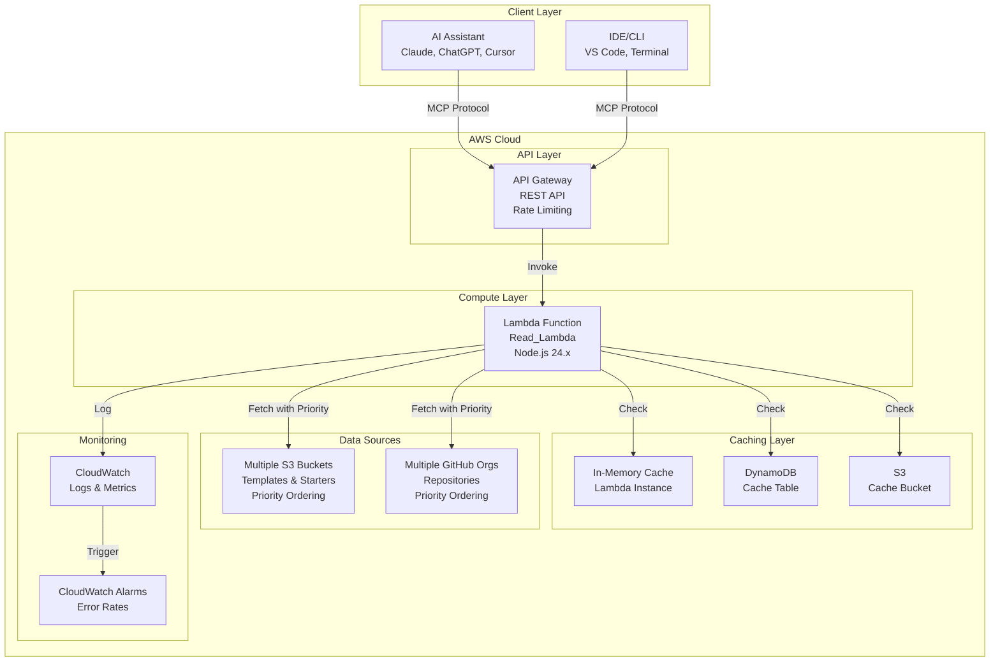
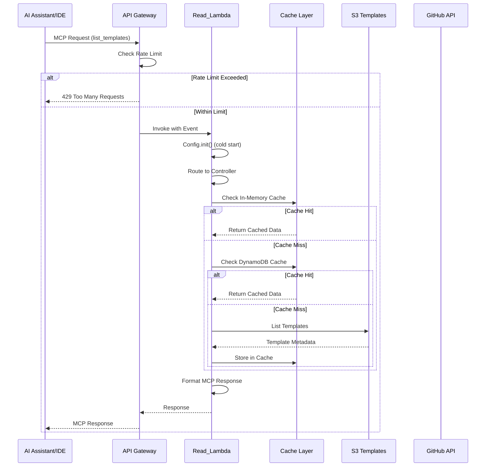
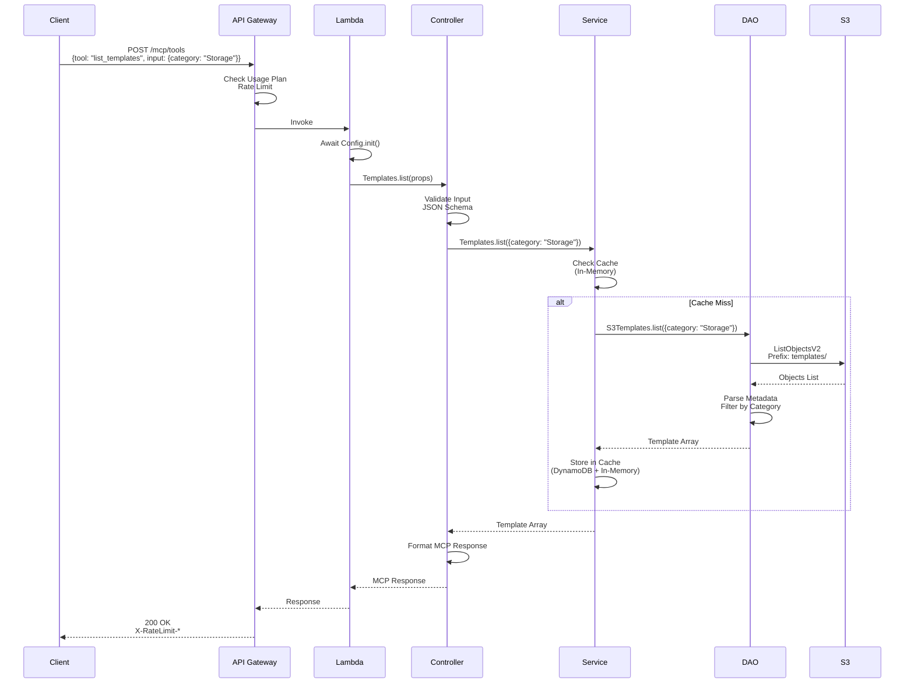
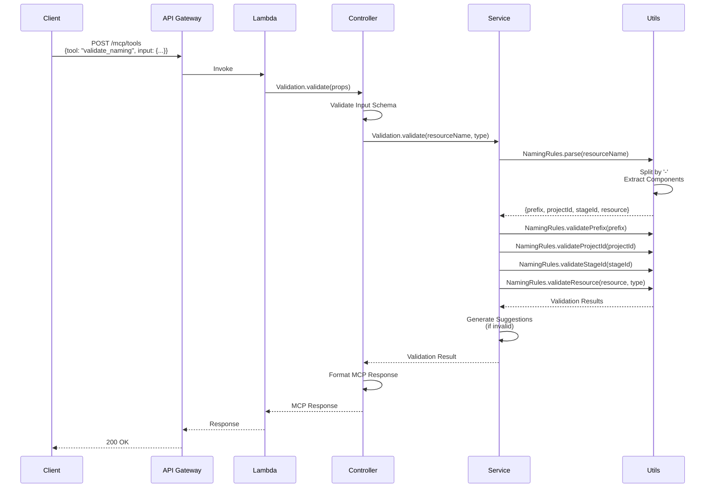
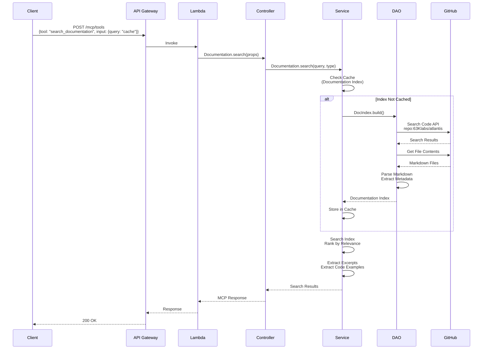

# Design Document: Atlantis MCP Server - Phase 1 (Core Read-Only)

## Overview

The Atlantis MCP (Model Context Protocol) Server Phase 1 provides AI-assisted development capabilities for the 63Klabs Atlantis Templates and Scripts Platform. It exposes read-only operations through a REST API that complies with the MCP protocol v1.0, enabling AI assistants and development tools to discover CloudFormation templates, starter code repositories, and documentation.

This phase establishes the foundational infrastructure using the atlantis-starter-02 repository structure, implements public access with rate limiting, and integrates with the @63klabs/cache-data package for efficient caching and routing. The server is deployed as a serverless application using AWS Lambda, API Gateway, DynamoDB, and S3, following Atlantis deployment patterns and naming conventions.

### Key Design Principles

1. **Serverless-First Architecture**: Leverage AWS Lambda, API Gateway, and managed services for scalability and cost efficiency
2. **Security by Design**: Separate read and write operations into different Lambda functions with least-privilege IAM permissions
3. **Performance Through Caching**: Use multi-tier caching (in-memory, DynamoDB, S3) via cache-data package with downstream caching support
4. **Protocol Compliance**: Fully implement MCP protocol v1.0 with JSON Schema validation
5. **Operational Excellence**: Comprehensive logging, monitoring, and error handling for production readiness
6. **Multi-Source Support**: Aggregate data from multiple S3 buckets and GitHub organizations with priority ordering
7. **Brown-Out Resilience**: Continue operation and return partial data when some sources fail
8. **Code Pattern Discovery**: Index and search code patterns from templates and starters alongside documentation

### Phase 1 Scope

Phase 1 focuses exclusively on read-only operations with public access:

**In Scope:**
- Template discovery and retrieval (list_templates, get_template, list_template_versions, list_template_history)
- Template category discovery (list_categories)
- Starter code discovery (list_starters, get_starter_info)
- Documentation and code pattern search (search_documentation)
- Naming convention validation (validate_naming)
- Template update checking (check_template_updates)
- Multiple S3 bucket support with namespace discovery and priority ordering
- Multiple GitHub user/org support with priority ordering
- GitHub custom properties for repository filtering
- Template versioning with dual identifiers (Human_Readable_Version and S3_VersionId)
- App starter sidecar metadata files
- Code pattern indexing from templates and starters
- Brown-out support for partial data when sources fail
- Public access with rate limiting
- MCP protocol implementation
- Caching strategy with configurable TTLs and downstream caching

**Out of Scope (Future Phases):**
- Write operations (repository creation, template modification)
- Authentication and authorization
- User-specific features
- Advanced AI integration (code generation, automated deployments)
- CodeCommit repository support
- Template version comparison tool

## Architecture

### High-Level Architecture



### Request Flow



### Component Architecture

The MCP server follows the MVC (Model-View-Controller) pattern with a multi-function directory structure. Each Lambda function is self-contained to avoid premature abstraction:

```
application-infrastructure/
├── src/
│   └── lambda/
│       ├── read/
│       │   ├── index.js              # Lambda handler
│       │   ├── package.json          # All dependencies
│       │   ├── package-lock.json
│       │   ├── config/
│       │   │   ├── index.js          # Config initialization (async)
│       │   │   ├── connections.js    # Cache-data connections and profiles
│       │   │   └── settings.js       # Application settings
│       │   ├── routes/
│       │   │   └── index.js          # Request routing (switch statement)
│       │   ├── controllers/
│       │   │   ├── templates.js      # Template operations controller
│       │   │   ├── starters.js       # Starter code controller
│       │   │   ├── documentation.js  # Documentation search controller
│       │   │   ├── validation.js     # Naming validation controller
│       │   │   └── updates.js        # Template updates controller
│       │   ├── services/
│       │   │   ├── templates.js      # Template service with caching
│       │   │   ├── starters.js       # Starter service with caching
│       │   │   ├── documentation.js  # Documentation service with caching
│       │   │   ├── github.js         # GitHub API service
│       │   │   └── validation.js     # Validation service
│       │   ├── models/
│       │   │   ├── s3-templates.js   # S3 template DAO
│       │   │   ├── github-api.js     # GitHub API DAO
│       │   │   └── doc-index.js      # Documentation index DAO
│       │   ├── views/
│       │   │   └── mcp-response.js   # MCP protocol response formatter
│       │   └── utils/
│       │       ├── mcp-protocol.js   # MCP protocol utilities
│       │       ├── schema-validator.js # JSON Schema validation
│       │       └── naming-rules.js   # AWS resource naming rules
│       └── write/                    # Phase 2 placeholder
│           └── .gitkeep
├── tests/
│   ├── unit/
│   ├── integration/
│   └── property/
├── build-scripts/
│   ├── generate-put-ssm.py
│   ├── update_template_configuration.py
│   └── update_template_timestamp.py
├── buildspec.yml
└── template.yml
```

**Key Design Decisions**:
- **Separate Function Directories**: Each Lambda function in its own directory under `src/lambda/`
- **Self-Contained Functions**: All code for read function lives in `src/lambda/read/` - no shared directories
- **Future Write Function**: `src/lambda/write/` placeholder created for Phase 2
- **Simple Build Process**: buildspec.yml packages each function directory independently
- **Import Pattern**: Modules import using relative paths (e.g., `require('./config')`)
- **Single package.json per function**: All dependencies in one place per function
- **Tests at Root**: Test directory at repository root, not within Lambda functions
- **No Premature Layers**: Shared code extraction deferred until Phase 2 shows actual duplication
- **YAGNI Principle**: Don't create shared infrastructure until multiple functions need it

## Components and Interfaces

### 1. Lambda Handler (src/lambda/read/index.js)

**Purpose**: Entry point for Read Lambda function, handles cold start initialization and request delegation.

**Responsibilities**:
- Initialize Config (connections, secrets, settings) during cold start
- Await Config.init() completion before processing requests
- Delegate to Router
- Handle top-level errors
- Return API Gateway-compatible responses

**Interface**:
```javascript
// Import modules using relative paths
const Config = require('./config');
const Routes = require('./routes');
const { tools: { Response } } = require('@63klabs/cache-data');

/**
 * Lambda handler for MCP server read-only requests
 * @param {Object} event - API Gateway event
 * @param {Object} context - Lambda context
 * @returns {Promise<Object>} API Gateway response
 */
exports.handler = async (event, context) => {
  // Ensure Config is initialized (cold start)
  await Config.init();
  
  // Delegate to router
  const response = await Routes.process(event, context);
  
  return response.toAPIGateway();
};
```

**Cold Start Initialization**:
- Parse environment variables
- Initialize cache-data Cache.init() with DynamoDB table and S3 bucket
- Load SSM parameters (if needed)
- Build documentation index (async, non-blocking)


### 2. Router (src/lambda/read/routes/index.js)

**Purpose**: Route incoming requests to appropriate controllers based on MCP tool name.

**Responsibilities**:
- Create ClientRequest object from event
- Extract MCP tool name from request
- Route to appropriate controller using switch statement
- Handle 404 for unknown tools
- Handle 405 for unsupported methods
- Return Response object

**Interface**:
```javascript
const { tools: { ClientRequest, Response } } = require('@63klabs/cache-data');
const Controllers = require('../controllers');

/**
 * Process incoming request and route to controller
 * @param {Object} event - API Gateway event
 * @param {Object} context - Lambda context
 * @returns {Promise<Response>} Response object
 */
const process = async (event, context) => {
  const REQ = new ClientRequest(event, context);
  const RESP = new Response(REQ);
  
  if (!REQ.isValid()) {
    return RESP.reset({statusCode: 400});
  }
  
  const props = REQ.getProps();
  const tool = props.body?.tool || props.queryStringParameters?.tool;
  
  switch (tool) {
    case 'list_templates':
      RESP.setBody(await Controllers.Templates.list(props));
      break;
    case 'get_template':
      RESP.setBody(await Controllers.Templates.get(props));
      break;
    case 'list_starters':
      RESP.setBody(await Controllers.Starters.list(props));
      break;
    case 'get_starter_info':
      RESP.setBody(await Controllers.Starters.get(props));
      break;
    case 'search_documentation':
      RESP.setBody(await Controllers.Documentation.search(props));
      break;
    case 'validate_naming':
      RESP.setBody(await Controllers.Validation.validate(props));
      break;
    case 'check_template_updates':
      RESP.setBody(await Controllers.Updates.check(props));
      break;
    case 'list_template_versions':
      RESP.setBody(await Controllers.Templates.listVersions(props));
      break;
    case 'list_categories':
      RESP.setBody(await Controllers.Templates.listCategories(props));
      break;
    default:
      RESP.reset({statusCode: 404});
  }
  
  return RESP;
};

module.exports = { process };
```

**Routing Strategy**:
- Use switch statement for clarity and performance
- Extract tool name from request body or query parameters
- Support both POST (with body) and GET (with query params) for flexibility
- Log routing decisions for debugging


### 3. Controllers

**Purpose**: Contain business logic, validate inputs, orchestrate service calls, format responses.

**Responsibilities**:
- Validate MCP tool inputs against JSON Schema
- Extract and validate parameters
- Call services (potentially multiple services in parallel)
- Handle service errors
- Format data for views
- Return structured data to router

**Example: Templates Controller (src/lambda/read/controllers/templates.js)**:
```javascript
const Services = require('../services');
const SchemaValidator = require('../utils/schema-validator');
const MCPProtocol = require('../utils/mcp-protocol');

/**
 * List all available CloudFormation templates
 * @param {Object} props - Request properties
 * @returns {Promise<Object>} MCP-formatted response
 */
const list = async (props) => {
  // Validate input against JSON Schema
  const input = props.body?.input || {};
  const validation = SchemaValidator.validate('list_templates', input);
  
  if (!validation.valid) {
    return MCPProtocol.errorResponse('INVALID_INPUT', validation.errors);
  }
  
  // Extract parameters
  const { category, version } = input;
  
  // Call service
  const templates = await Services.Templates.list({ category, version });
  
  // Return MCP-formatted response
  return MCPProtocol.successResponse('list_templates', templates);
};

/**
 * Get specific template details
 * @param {Object} props - Request properties
 * @returns {Promise<Object>} MCP-formatted response
 */
const get = async (props) => {
  const input = props.body?.input || {};
  const validation = SchemaValidator.validate('get_template', input);
  
  if (!validation.valid) {
    return MCPProtocol.errorResponse('INVALID_INPUT', validation.errors);
  }
  
  const { templateName, version } = input;
  
  try {
    const template = await Services.Templates.get(templateName, version);
    return MCPProtocol.successResponse('get_template', template);
  } catch (error) {
    if (error.code === 'TEMPLATE_NOT_FOUND') {
      // Get available templates for helpful error message
      const available = await Services.Templates.list({});
      return MCPProtocol.errorResponse('TEMPLATE_NOT_FOUND', {
        message: `Template '${templateName}' not found`,
        availableTemplates: available.map(t => t.name)
      });
    }
    throw error;
  }
};

module.exports = { list, get };
```

**Controller Design Patterns**:
- Always validate inputs using JSON Schema
- Use try-catch for service errors
- Provide helpful error messages with context
- Call multiple services in parallel when possible using Promise.all()
- Keep controllers thin - delegate complex logic to services


### 4. Services

**Purpose**: Implement caching at the service level, orchestrate data access, transform data.

**Responsibilities**:
- Implement pass-through caching using cache-data
- Define fetch functions for cache misses
- Transform data from DAOs into business objects
- Handle cache invalidation logic
- Aggregate data from multiple sources

**Example: Templates Service (src/lambda/read/services/templates.js)**:
```javascript
const {
	cache: { 
	 	CacheableDataAccess 
	},
	tools: {
		DebugAndLog,
		Timer
	}
} = require('@63klabs/cache-data');
const Config = require('../config');
const Models = require('../models');

/**
 * List templates with caching and multi-bucket support
 * @param {Object} options - Filter options
 * @param {string} options.category - Template category (optional)
 * @param {string} options.version - Template version (Human_Readable_Version, optional) 
 * @param {string} options.versionId - S3 object Version Id (optional)
 * @param {Array<string>} options.s3Buckets - Filter to specific buckets (optional, validated against settings)
 * @returns {Promise<Array>} Array of template metadata
 */
const list = async (options = {}) => {
  const { category, version, versionId, s3Buckets } = options;
  
  // Get connection and cache profile from config
  const { conn, cacheProfile } = Config.getConnCacheProfile('s3-templates', 'templates-list');
  
  // Determine which buckets to search (filtered or all)
  let bucketsToSearch = s3Buckets;
  if (!bucketsToSearch || bucketsToSearch.length === 0) {
    bucketsToSearch = Config.settings().atlantisS3Buckets;
  } else {
    // Validate that requested buckets are in configured buckets
    const validBuckets = Config.settings().atlantisS3Buckets;
    bucketsToSearch = bucketsToSearch.filter(b => validBuckets.includes(b));
    if (bucketsToSearch.length === 0) {
      throw new Error('No valid S3 buckets specified');
    }
  }
  
  // Set host to array of buckets (used in cache key)
  conn.host = bucketsToSearch;
  
  // Set parameters for cache key and DAO filtering
  conn.parameters = { category, version, versionId };

  // Define fetch function for cache miss
  const fetchFunction = async (connection, opts) => {
    return await Models.S3Templates.list(connection, opts);
  };
  
  // Use cache-data pass-through caching
  const result = await CacheableDataAccess.getData(
    cacheProfile,
    fetchFunction,
    conn,
    {}, // options: for functions, tokens, non-cache data
  );
  
  return result.body;
};

/**
 * Get specific template with caching and multi-bucket support
 * @param {Object} options - Template identification
 * @param {string} options.category - Template category
 * @param {string} options.templateName - Template name
 * @param {string} options.version - Template version (Human_Readable_Version, optional) 
 * @param {string} options.versionId - S3 object Version Id (optional)
 * @param {Array<string>} options.s3Buckets - Filter to specific buckets (optional)
 * @returns {Promise<Object>} Template details
 */
const get = async (options = {}) => {
  const { category, templateName, version, versionId, s3Buckets } = options;

  const { conn, cacheProfile } = Config.getConnCacheProfile('s3-templates', 'template-detail');

  // Determine which buckets to search
  let bucketsToSearch = s3Buckets;
  if (!bucketsToSearch || bucketsToSearch.length === 0) {
    bucketsToSearch = Config.settings().atlantisS3Buckets;
  } else {
    const validBuckets = Config.settings().atlantisS3Buckets;
    bucketsToSearch = bucketsToSearch.filter(b => validBuckets.includes(b));
  }
  
  conn.host = bucketsToSearch;

  // Update pathId for logging with specific template
  cacheProfile.pathId = `${cacheProfile.pathId}:${category}/${templateName}`;
  
  // Set parameters for cache key and DAO query
  conn.parameters = { category, templateName, version, versionId };
  
  const fetchFunction = async (connection, opts) => {
    const template = await Models.S3Templates.get(connection, opts);
    if (!template) {
      const p = connection.parameters || {};
      const error = new Error(`Template not found: ${p.category}/${p.templateName}${p.version ? `:${p.version}` : ''}${p.versionId ? `?versionId=${p.versionId}` : ''}`);
      error.code = 'TEMPLATE_NOT_FOUND';
      throw error;
    }
    return template;
  };
  
  const result = await CacheableDataAccess.getData(
    cacheProfile,
    fetchFunction,
    conn,
    {},
  );
  
  return result.body;
};

/**
 * List all versions of a specific template
 * @param {Object} options - Template identification
 * @param {string} options.category - Template category
 * @param {string} options.templateName - Template name
 * @param {Array<string>} options.s3Buckets - Filter to specific buckets (optional)
 * @returns {Promise<Object>} Template version history
 */
const listVersions = async (options = {}) => {
  const { category, templateName, s3Buckets } = options;
  
  const { conn, cacheProfile } = Config.getConnCacheProfile('s3-templates', 'template-versions');
  
  // Determine which buckets to search
  let bucketsToSearch = s3Buckets;
  if (!bucketsToSearch || bucketsToSearch.length === 0) {
    bucketsToSearch = Config.settings().atlantisS3Buckets;
  } else {
    const validBuckets = Config.settings().atlantisS3Buckets;
    bucketsToSearch = bucketsToSearch.filter(b => validBuckets.includes(b));
  }
  
  conn.host = bucketsToSearch;
  conn.parameters = { category, templateName };
  
  const fetchFunction = async (connection, opts) => {
    return await Models.S3Templates.listVersions(connection, opts);
  };
  
  const result = await CacheableDataAccess.getData(
    cacheProfile,
    fetchFunction,
    conn,
    {},
  );
  
  return result.body;
};

module.exports = { list, get, listVersions };
```

**Service Design Patterns**:
- Always use cache-data for external data access
- Define clear fetch functions that return data
- Use connection and cache profile from config
- Provide unique cache keys (path + id)
- Let cache-data handle cache hits/misses transparently
- Transform DAO data into business objects


### 5. Models / Data Access Objects (DAOs)

**Purpose**: Handle data access, API calls, retries, pagination, data transformation.

**Responsibilities**:
- Make S3 API calls to retrieve templates
- Make GitHub API calls for repository metadata
- Handle authentication and connection details
- Implement retry logic for transient failures
- Parse and transform raw data
- Handle pagination for large result sets

**Example: S3 Templates DAO (src/lambda/read/models/s3-templates.js)**:
```javascript
const { AWS, DebugAndLog } = require('@63klabs/cache-data').tools;
const Config = require('../config');

/**
 * List all templates from S3 buckets with brown-out support
 * @param {Object} connection - Connection object
 * @param {Array<string>|string} connection.host - S3 bucket name(s)
 * @param {string} connection.path - S3 object key prefix (e.g., "templates/v2")
 * @param {Object} connection.parameters - Query parameters
 * @param {string} connection.parameters.category - Template category filter
 * @param {string} connection.parameters.version - Human_Readable_Version filter
 * @param {string} connection.parameters.versionId - S3 VersionId filter
 * @param {Object} options - Reserved for future use (not in cache key)
 * @returns {Promise<Object>} { templates: Array, errors: Array }
 */
const list = async (connection, options = {}) => {
  const { category, version, versionId } = connection.parameters || {};
  
  // Ensure host is an array
  const buckets = Array.isArray(connection.host) ? connection.host : [connection.host];
  
  const allTemplates = [];
  const errors = [];
  
  // Iterate through buckets in priority order
  for (const bucket of buckets) {
    try {
      // Check if bucket has atlantis-mcp:Allow=true tag
      const allowAccess = await checkBucketAccess(bucket);
      if (!allowAccess) {
        DebugAndLog.warn(`Bucket ${bucket} does not have atlantis-mcp:Allow=true tag, skipping`);
        errors.push({
          source: bucket,
          sourceType: 's3',
          error: 'Bucket access not allowed',
          timestamp: new Date().toISOString()
        });
        continue;
      }
      
      // Get IndexPriority tag to determine which namespaces to index
      const namespaces = await getIndexedNamespaces(bucket);
      if (namespaces.length === 0) {
        DebugAndLog.warn(`Bucket ${bucket} has no namespaces in IndexPriority tag, skipping`);
        continue;
      }
      
      // List templates from each namespace
      for (const namespace of namespaces) {
        const prefix = `${namespace}/${connection.path}`;
        
        const params = {
          Bucket: bucket,
          Prefix: prefix
        };
        
        const s3 = AWS.s3;
        const response = await s3.client.send(new (require('@aws-sdk/client-s3').ListObjectsV2Command)(params));
        
        // Parse template metadata from S3 keys
        const templates = (response.Contents || [])
          .filter(obj => obj.Key.endsWith('.yml') || obj.Key.endsWith('.yaml'))
          .map(obj => parseTemplateMetadata(obj, bucket, namespace))
          .filter(t => filterByCategory(t, category))
          .filter(t => filterByVersion(t, version))
          .filter(t => filterByVersionId(t, versionId));
        
        allTemplates.push(...templates);
      }
    } catch (error) {
      // Brown-out support: log error but continue with other buckets
      DebugAndLog.warn(`Failed to list templates from bucket ${bucket}: ${error.message}`);
      errors.push({
        source: bucket,
        sourceType: 's3',
        error: error.message,
        timestamp: new Date().toISOString()
      });
    }
  }
  
  // Deduplicate templates (first occurrence wins due to priority ordering)
  const uniqueTemplates = deduplicateTemplates(allTemplates);
  
  return {
    templates: uniqueTemplates,
    errors: errors.length > 0 ? errors : undefined,
    partialData: errors.length > 0
  };
};

/**
 * Get specific template from S3 buckets with brown-out support
 * @param {Object} connection - Connection object
 * @param {Array<string>|string} connection.host - S3 bucket name(s)
 * @param {string} connection.path - S3 object key prefix
 * @param {Object} connection.parameters - Query parameters
 * @param {string} connection.parameters.category - Template category
 * @param {string} connection.parameters.templateName - Template name
 * @param {string} connection.parameters.version - Human_Readable_Version (optional)
 * @param {string} connection.parameters.versionId - S3 VersionId (optional)
 * @param {Object} options - Reserved for future use
 * @returns {Promise<Object>} Template details or null
 */
const get = async (connection, options = {}) => {
  const { category, templateName, version, versionId } = connection.parameters || {};
  
  const buckets = Array.isArray(connection.host) ? connection.host : [connection.host];
  
  // Search buckets in priority order
  for (const bucket of buckets) {
    try {
      const allowAccess = await checkBucketAccess(bucket);
      if (!allowAccess) {
        continue;
      }
      
      const namespaces = await getIndexedNamespaces(bucket);
      
      // Search namespaces in priority order
      for (const namespace of namespaces) {
        const key = buildTemplateKey(namespace, connection.path, category, templateName);
        
        const s3 = AWS.s3;
        
        try {
          const getParams = {
            Bucket: bucket,
            Key: key
          };
          
          // If versionId specified, add it to params
          if (versionId) {
            getParams.VersionId = versionId;
          }
          
          const response = await s3.get(getParams);
          
          const templateContent = response.Body.toString('utf-8');
          const parsed = parseCloudFormationTemplate(templateContent);
          
          // If version specified, check if it matches
          if (version && parsed.version !== version) {
            continue; // Try next namespace/bucket
          }
          
          return {
            name: templateName,
            version: parsed.version,
            versionId: response.VersionId,
            content: templateContent,
            parameters: parsed.Parameters,
            outputs: parsed.Outputs,
            description: parsed.Description,
            category: category,
            namespace: namespace,
            bucket: bucket,
            s3Path: `s3://${bucket}/${key}`,
            lastModified: response.LastModified,
            size: response.ContentLength
          };
        } catch (error) {
          if (error.name === 'NoSuchKey') {
            continue; // Try next namespace/bucket
          }
          throw error;
        }
      }
    } catch (error) {
      DebugAndLog.warn(`Failed to get template from bucket ${bucket}: ${error.message}`);
      // Continue to next bucket
    }
  }
  
  // Template not found in any bucket
  return null;
};

/**
 * List all versions of a specific template
 * @param {Object} connection - Connection object
 * @param {Object} options - Reserved for future use
 * @returns {Promise<Object>} Version history
 */
const listVersions = async (connection, options = {}) => {
  const { category, templateName } = connection.parameters || {};
  
  const buckets = Array.isArray(connection.host) ? connection.host : [connection.host];
  
  // Find the bucket/namespace where template exists
  for (const bucket of buckets) {
    try {
      const allowAccess = await checkBucketAccess(bucket);
      if (!allowAccess) continue;
      
      const namespaces = await getIndexedNamespaces(bucket);
      
      for (const namespace of namespaces) {
        const key = buildTemplateKey(namespace, connection.path, category, templateName);
        
        const s3 = AWS.s3;
        const { ListObjectVersionsCommand } = require('@aws-sdk/client-s3');
        
        const params = {
          Bucket: bucket,
          Prefix: key
        };
        
        const response = await s3.client.send(new ListObjectVersionsCommand(params));
        
        if (!response.Versions || response.Versions.length === 0) {
          continue;
        }
        
        // Parse versions and extract metadata
        const versions = await Promise.all(
          response.Versions.map(async (v) => {
            try {
              // Get template content to extract Human_Readable_Version
              const getParams = {
                Bucket: bucket,
                Key: key,
                VersionId: v.VersionId
              };
              const content = await s3.get(getParams);
              const parsed = parseCloudFormationTemplate(content.Body.toString('utf-8'));
              
              return {
                version: parsed.version,
                versionId: v.VersionId,
                lastModified: v.LastModified,
                size: v.Size,
                author: parsed.author || 'Unknown',
                isLatest: v.IsLatest
              };
            } catch (error) {
              DebugAndLog.warn(`Failed to parse version ${v.VersionId}: ${error.message}`);
              return null;
            }
          })
        );
        
        return {
          templateName,
          category,
          namespace,
          bucket,
          versions: versions.filter(v => v !== null).sort((a, b) => 
            new Date(b.lastModified) - new Date(a.lastModified)
          )
        };
      }
    } catch (error) {
      DebugAndLog.warn(`Failed to list versions from bucket ${bucket}: ${error.message}`);
    }
  }
  
  return { templateName, category, versions: [] };
};

/**
 * Check if bucket has atlantis-mcp:Allow=true tag
 */
const checkBucketAccess = async (bucket) => {
  try {
    const s3 = AWS.s3;
    const { GetBucketTaggingCommand } = require('@aws-sdk/client-s3');
    const response = await s3.client.send(new GetBucketTaggingCommand({ Bucket: bucket }));
    
    const allowTag = response.TagSet?.find(tag => 
      tag.Key === Config.settings().s3.allowTag
    );
    
    return allowTag && allowTag.Value === 'true';
  } catch (error) {
    DebugAndLog.warn(`Failed to check bucket tags for ${bucket}: ${error.message}`);
    return false;
  }
};

/**
 * Get indexed namespaces from bucket IndexPriority tag
 */
const getIndexedNamespaces = async (bucket) => {
  try {
    const s3 = AWS.s3;
    const { GetBucketTaggingCommand } = require('@aws-sdk/client-s3');
    const response = await s3.client.send(new GetBucketTaggingCommand({ Bucket: bucket }));
    
    const priorityTag = response.TagSet?.find(tag => 
      tag.Key === Config.settings().s3.indexPriorityTag
    );
    
    if (!priorityTag) {
      return [];
    }
    
    // Parse comma-delimited list and return in priority order
    return priorityTag.Value.split(',').map(ns => ns.trim()).filter(ns => ns.length > 0);
  } catch (error) {
    DebugAndLog.warn(`Failed to get IndexPriority tag for ${bucket}: ${error.message}`);
    return [];
  }
};

/**
 * Build S3 key for template
 */
const buildTemplateKey = (namespace, basePath, category, templateName) => {
  // Prefer .yml extension
  return `${namespace}/${basePath}/${category}/${templateName}.yml`;
};

/**
 * Parse CloudFormation template YAML and extract metadata
 */
const parseCloudFormationTemplate = (content) => {
  const yaml = require('js-yaml');
  const parsed = yaml.load(content);
  
  // Extract version from first 30 lines of comments
  // Pattern: # Version: vX.X.X/YYYY-MM-DD
  const lines = content.split('\n').slice(0, 30);
  let version = 'unknown';
  let author = 'Unknown';
  
  for (const line of lines) {
    const versionMatch = line.match(/# Version:\s*(v[\d.]+\/\d{4}-\d{2}-\d{2})/);
    if (versionMatch) {
      version = versionMatch[1];
    }
    
    const authorMatch = line.match(/# Author:\s*(.+)/);
    if (authorMatch) {
      author = authorMatch[1].trim();
    }
  }
  
  return {
    ...parsed,
    version,
    author
  };
};

/**
 * Deduplicate templates by name (first occurrence wins)
 */
const deduplicateTemplates = (templates) => {
  const seen = new Set();
  return templates.filter(t => {
    const key = `${t.category}/${t.name}`;
    if (seen.has(key)) {
      return false;
    }
    seen.add(key);
    return true;
  });
};

/**
 * Filter helpers
 */
const filterByCategory = (template, category) => {
  return !category || template.category === category;
};

const filterByVersion = (template, version) => {
  return !version || template.version === version;
};

const filterByVersionId = (template, versionId) => {
  return !versionId || template.versionId === versionId;
};

/**
 * Parse template metadata from S3 object
 */
const parseTemplateMetadata = (s3Object, bucket, namespace) => {
  // Extract category and name from key
  // Format: {namespace}/templates/v2/{category}/{templateName}.yml
  const keyParts = s3Object.Key.split('/');
  const category = keyParts[keyParts.length - 2];
  const fileName = keyParts[keyParts.length - 1];
  const name = fileName.replace(/\.(yml|yaml)$/, '');
  
  return {
    name,
    category,
    namespace,
    bucket,
    s3Path: `s3://${bucket}/${s3Object.Key}`,
    lastModified: s3Object.LastModified,
    size: s3Object.Size,
    // Version and versionId will be populated when template content is fetched
    version: null,
    versionId: s3Object.VersionId
  };
};

module.exports = { list, get, listVersions };
```

**DAO Design Patterns**:
- Use AWS SDK from cache-data tools
- Handle AWS SDK errors gracefully
- Return null for not found (not throw)
- Parse and transform data close to the source
- Keep DAOs focused on data access only
- No business logic in DAOs


### 6. Views

**Purpose**: Format responses according to MCP protocol specification.

**Responsibilities**:
- Format successful responses with MCP structure
- Format error responses with MCP error codes
- Include JSON Schema references
- Add metadata (request ID, timestamp)
- Ensure protocol compliance

**Example: MCP Response View (src/shared/views/mcp-response.js)**:
```javascript
/**
 * Format successful MCP response
 * @param {string} tool - Tool name
 * @param {*} data - Response data
 * @param {Object} metadata - Additional metadata
 * @returns {Object} MCP-formatted response
 */
const successResponse = (tool, data, metadata = {}) => {
  return {
    jsonrpc: '2.0',
    id: metadata.requestId || generateRequestId(),
    result: {
      tool: tool,
      data: data,
      metadata: {
        timestamp: new Date().toISOString(),
        cached: metadata.cached || false,
        ...metadata
      }
    }
  };
};

/**
 * Format error MCP response
 * @param {string} code - Error code
 * @param {string|Object} message - Error message or details
 * @param {Object} metadata - Additional metadata
 * @returns {Object} MCP-formatted error response
 */
const errorResponse = (code, message, metadata = {}) => {
  return {
    jsonrpc: '2.0',
    id: metadata.requestId || generateRequestId(),
    error: {
      code: code,
      message: typeof message === 'string' ? message : message.message,
      data: typeof message === 'object' ? message : undefined,
      metadata: {
        timestamp: new Date().toISOString(),
        ...metadata
      }
    }
  };
};

module.exports = { successResponse, errorResponse };
```

## Data Models

### Template Metadata Model

```javascript
{
  name: string,              // Template name (e.g., "template-storage-s3-artifacts")
  version: string,           // Human-readable version (e.g., "v2.0.5/2026-01-07")
  versionId: string,         // S3 Object Version ID
  category: string,          // Category: Storage, Network, Pipeline, Service Role, Modules
  namespace: string,         // Namespace (e.g., "atlantis", "finance", "devops")
  bucket: string,            // S3 bucket name
  description: string,       // Template description
  s3Path: string,           // S3 URI (e.g., "s3://bucket/namespace/templates/v2/...")
  lastModified: string,     // ISO 8601 timestamp
  size: number,             // File size in bytes
  parameters: Array<{       // CloudFormation parameters
    name: string,
    type: string,
    description: string,
    default: string,
    allowedValues: Array<string>
  }>,
  outputs: Array<{          // CloudFormation outputs
    name: string,
    description: string,
    exportName: string
  }>
}
```

### Starter Metadata Model

```javascript
{
  name: string,              // Starter name (e.g., "atlantis-starter-02")
  description: string,       // Short description
  language: string,          // "Node.js" or "Python"
  framework: string,         // Framework name (e.g., "Express", "FastAPI")
  features: Array<string>,   // List of features
  prerequisites: Array<string>, // Prerequisites for using starter
  author: string,            // Author name
  license: string,           // License type
  namespace: string,         // Namespace (e.g., "atlantis", "finance")
  bucket: string,            // S3 bucket name
  githubUrl: string,         // GitHub repository URL
  githubOrg: string,         // GitHub user/org name
  repositoryType: string,    // From custom property: "app-starter"
  readme: string,            // README content (markdown)
  latestRelease: {           // Latest release information
    version: string,
    releaseDate: string,
    notes: string
  },
  stats: {                  // Repository statistics
    stars: number,
    forks: number,
    lastUpdated: string
  },
  sidecarMetadata: boolean  // Whether metadata came from sidecar file
}
```


### Documentation Search Result Model

```javascript
{
  title: string,            // Document title
  excerpt: string,          // Relevant excerpt (200 chars)
  filePath: string,         // File path in repository
  githubUrl: string,        // Direct GitHub URL
  type: string,             // documentation, template-pattern, code-example
  subType: string,          // guide, tutorial, reference, troubleshooting, resource, function
  relevanceScore: number,   // 0-1 relevance score
  repository: string,       // Repository name
  repositoryType: string,   // From custom property: documentation, app-starter, templates, etc.
  namespace: string,        // Namespace if from S3-indexed content
  codeExamples: Array<{     // Extracted code examples
    language: string,
    code: string,
    lineNumbers: string     // e.g., "45-67"
  }>,
  context: {                // Additional context for code patterns
    templateSection: string, // For templates: Metadata, Parameters, Resources, etc.
    resourceType: string,    // For templates: AWS::S3::Bucket, etc.
    functionName: string     // For code: function/method name
  }
}
```

### Naming Validation Result Model

```javascript
{
  valid: boolean,           // Overall validation result
  resourceName: string,     // Full resource name validated
  components: {             // Individual component validation
    prefix: {
      valid: boolean,
      value: string,
      error: string
    },
    projectId: {
      valid: boolean,
      value: string,
      error: string
    },
    stageId: {
      valid: boolean,
      value: string,
      error: string
    },
    resourceName: {
      valid: boolean,
      value: string,
      error: string
    }
  },
  resourceType: string,     // S3, DynamoDB, Lambda, CloudFormation
  suggestions: Array<string> // Suggested corrections
}
```

### Template Update Check Model

```javascript
{
  templateName: string,     // Template name
  currentVersion: string,   // Current version (Human_Readable_Version)
  currentVersionId: string, // Current S3 VersionId
  latestVersion: string,    // Latest available version (Human_Readable_Version)
  latestVersionId: string,  // Latest S3 VersionId
  releaseDate: string,      // Latest version release date
  changelogSummary: string, // Summary of changes
  breakingChanges: boolean, // Whether update has breaking changes
  migrationGuideUrl: string, // URL to migration guide (if breaking)
  updateAvailable: boolean, // Whether an update is available
  namespace: string,        // Namespace where latest version found
  bucket: string            // Bucket where latest version found
}
```

### Template Version History Model

```javascript
{
  templateName: string,     // Template name
  category: string,         // Template category
  versions: Array<{         // All versions ordered by date (newest first)
    version: string,        // Human-readable version (e.g., "v2.0.5/2026-01-07")
    versionId: string,      // S3 VersionId
    lastModified: string,   // ISO 8601 timestamp
    size: number,           // File size in bytes
    author: string,         // Extracted from template comments
    isLatest: boolean       // Whether this is the latest version
  }>,
  namespace: string,        // Namespace
  bucket: string            // S3 bucket
}
```

### Template Category Model

```javascript
{
  name: string,             // Category name: Storage, Network, Pipeline, Service Role, Modules
  description: string,      // Category description
  templateCount: number,    // Number of templates in this category
  examples: Array<string>   // Example template names
}
```

### Namespace Discovery Model

```javascript
{
  namespace: string,        // Namespace name (e.g., "atlantis", "finance")
  bucket: string,           // S3 bucket name
  priority: number,         // Priority order (lower = higher priority)
  templateCount: number,    // Number of templates in namespace
  starterCount: number,     // Number of starters in namespace
  indexed: boolean          // Whether namespace is in IndexPriority tag
}
```

### Sidecar Metadata Model

```javascript
{
  name: string,             // App starter name
  description: string,      // Description
  language: string,         // Programming language
  framework: string,        // Framework name
  features: Array<string>,  // List of features
  prerequisites: Array<string>, // Prerequisites
  author: string,           // Author
  license: string,          // License type
  repositoryType: string,   // From GitHub custom property
  version: string,          // Version number
  lastUpdated: string       // ISO 8601 timestamp
}
```

### Brown-Out Error Model

```javascript
{
  source: string,           // Source that failed: bucket name or GitHub org
  sourceType: string,       // "s3" or "github"
  error: string,            // User-friendly error message
  timestamp: string         // ISO 8601 timestamp
}
```

## Cache-Data Integration Design

### Connection Configuration (src/config/connections.js)

**Note**: The `host` field in connections is set dynamically in services based on filtering. The connections define the base configuration, and services will set `conn.host` to the appropriate bucket(s) from `Config.settings().atlantisS3Buckets` based on optional filtering.

```javascript
const { tools: {DebugAndLog} } = require("@63klabs/cache-data");

const connections = [
  {
    name: "s3-templates",
    host: null, // Set dynamically in service based on atlantisS3Buckets from settings
    path: "templates/v2", // Namespace will be prepended in DAO
    cache: [
      {
        profile: "templates-list",
        overrideOriginHeaderExpiration: true,
        defaultExpirationInSeconds: (DebugAndLog.isProduction() ? (60 * 60) : (5 * 60)), // 1 hour prod, 5 min test
        expirationIsOnInterval: false,
        headersToRetain: "",
        hostId: "s3-templates",
        pathId: "list",
        encrypt: false
      },
      {
        profile: "template-detail",
        overrideOriginHeaderExpiration: true,
        defaultExpirationInSeconds: (DebugAndLog.isProduction() ? (24 * 60 * 60) : (5 * 60)), // 24 hours prod, 5 min test
        expirationIsOnInterval: false,
        headersToRetain: "",
        hostId: "s3-templates",
        pathId: "detail",
        encrypt: false
      },
      {
        profile: "template-versions",
        overrideOriginHeaderExpiration: true,
        defaultExpirationInSeconds: (DebugAndLog.isProduction() ? (5 * 60) : (1 * 60)), // 5 min prod, 1 min test
        expirationIsOnInterval: false,
        headersToRetain: "",
        hostId: "s3-templates",
        pathId: "versions",
        encrypt: false
      }
    ]
  },
  {
    name: "s3-app-starters",
    host: null, // Set dynamically in service based on atlantisS3Buckets from settings
    path: "app-starters/v2", // Namespace will be prepended in DAO
    cache: [
      {
        profile: "app-starters-list",
        overrideOriginHeaderExpiration: true,
        defaultExpirationInSeconds: (DebugAndLog.isProduction() ? (60 * 60) : (5 * 60)), // 1 hour prod, 5 min test
        expirationIsOnInterval: false,
        headersToRetain: "",
        hostId: "s3-app-starters",
        pathId: "list",
        encrypt: false
      },
      {
        profile: "starter-detail",
        overrideOriginHeaderExpiration: true,
        defaultExpirationInSeconds: (DebugAndLog.isProduction() ? (24 * 60 * 60) : (5 * 60)), // 24 hours prod, 5 min test
        expirationIsOnInterval: false,
        headersToRetain: "",
        hostId: "s3-app-starters",
        pathId: "detail",
        encrypt: false
      }
    ]
  },
  {
    name: "github-api",
    host: "api.github.com",
    path: "/repos",
    cache: [
      {
        profile: "repo-metadata",
        overrideOriginHeaderExpiration: true,
        defaultExpirationInSeconds: (DebugAndLog.isProduction() ? (30 * 60) : (5 * 60)), // 30 min prod, 5 min test
        expirationIsOnInterval: false,
        headersToRetain: "",
        hostId: "github",
        pathId: "metadata",
        encrypt: false
      },
      {
        profile: "repo-properties",
        overrideOriginHeaderExpiration: true,
        defaultExpirationInSeconds: (DebugAndLog.isProduction() ? (60 * 60) : (5 * 60)), // 1 hour prod, 5 min test
        expirationIsOnInterval: false,
        headersToRetain: "",
        hostId: "github",
        pathId: "properties",
        encrypt: false
      }
    ]
  },
  {
    name: "documentation-index",
    host: "internal",
    path: "/docs",
    cache: [
      {
        profile: "doc-index",
        overrideOriginHeaderExpiration: true,
        defaultExpirationInSeconds: (DebugAndLog.isProduction() ? (6 * 60 * 60) : (5 * 60)), // 6 hours prod, 5 min test
        expirationIsOnInterval: true, // Refresh on interval
        headersToRetain: "",
        hostId: "docs",
        pathId: "index",
        encrypt: false
      },
      {
        profile: "code-patterns",
        overrideOriginHeaderExpiration: true,
        defaultExpirationInSeconds: (DebugAndLog.isProduction() ? (6 * 60 * 60) : (5 * 60)), // 6 hours prod, 5 min test
        expirationIsOnInterval: false,
        headersToRetain: "",
        hostId: "docs",
        pathId: "patterns",
        encrypt: false
      }
    ]
  }
];

module.exports = connections;
```


### Cache Configuration Strategy

**Cache Tiers**:
1. **In-Memory Cache**: Fastest, per Lambda instance, cleared on cold start
2. **DynamoDB Cache**: Shared across invocations, millisecond latency
3. **S3 Cache**: For large objects, second latency

**Downstream Caching Support**:
- Cache-data supports caching processed data separately from source data
- Example: Cache raw templates (Cache A) → process/index → cache indexed patterns (Cache B)
- Each cache uses its own connection and cache profile configuration
- Enables efficient multi-stage data processing with independent TTLs

**TTL Configuration by Resource Type**:

| Resource Type | Production TTL | Test TTL | Tier | Rationale |
|--------------|----------------|----------|------|-----------|
| Template List | 1 hour | 5 minutes | DynamoDB | Changes infrequently, small payload |
| Template Detail | 24 hours | 5 minutes | S3 | Large YAML files, rarely change |
| Template Versions | 60 minutes | 5 minutes | DynamoDB | Version history, moderate change rate |
| Starter List | 1 hour | 5 minutes | DynamoDB | Changes infrequently, small payload |
| Starter Detail | 30 minutes | 5 minutes | DynamoDB | GitHub data, moderate change rate |
| Documentation Index | 6 hours | 5 minutes | DynamoDB | Large but compressible, daily updates |
| Code Patterns | 6 hours | 5 minutes | DynamoDB | Indexed from templates/starters |
| Namespace Discovery | 1 hour | 5 minutes | In-Memory | S3 bucket structure, rarely changes |

**Cache Key Strategy**:
- Include bucket array in cache key (order matters for priority)
- Include GitHub org array in cache key (order matters for priority)
- Include namespace in cache key for S3 resources
- Include version/versionId in cache key for specific versions
- Example: `s3-templates/list/Storage/atlantis/latest`
- Example: `github/metadata/63klabs/atlantis-starter-02`

**Cache Invalidation**:
- TTL-based expiration (no manual invalidation in Phase 1)
- Short TTLs in test environment for rapid iteration
- Longer TTLs in production for cost optimization
- Future: Add manual invalidation API in Phase 2

### Settings Configuration (src/config/settings.js)

```javascript
const settings = {
  // Multiple S3 buckets with priority ordering (first = highest priority)
  atlantisS3Buckets: process.env.ATLANTIS_S3_BUCKETS.split(',').map(b => b.trim()),
  
  // Multiple GitHub users/orgs with priority ordering (first = highest priority)
  githubUsers: process.env.ATLANTIS_GITHUB_USER_ORGS.split(',').map(u => u.trim()),
  
  // Template categories (extensible)
  templateCategories: [
    { name: 'Storage', description: 'S3, DynamoDB, and data storage templates' },
    { name: 'Network', description: 'CloudFront, Route53, and networking templates' },
    { name: 'Pipeline', description: 'CodePipeline, CodeBuild CI/CD templates' },
    { name: 'Service Role', description: 'IAM roles and policies templates' },
    { name: 'Modules', description: 'Reusable CloudFormation definitions' }
  ],
  
  // Repository types from GitHub custom properties
  repositoryTypes: [
    'documentation',
    'app-starter',
    'templates',
    'management',
    'package',
    'mcp'
  ],
  
  // Naming convention configuration
  naming: {
    prefix: process.env.NAMING_PREFIX,
    projectId: process.env.NAMING_PROJECT_ID,
    stageId: process.env.NAMING_STAGE_ID
  },
  
  // Cache TTL configuration (seconds) - organized by resource type
  ttl: {
    templateList: parseInt(process.env.ATLANTIS_TEMPLATE_LIST_TTL || '3600'), // 1 hour default
    templateDetail: parseInt(process.env.ATLANTIS_TEMPLATE_DETAIL_TTL || '86400'), // 24 hours default
    templateVersions: parseInt(process.env.ATLANTIS_TEMPLATE_VERSIONS_TTL || '3600'), // 1 hour default
    starterList: parseInt(process.env.ATLANTIS_STARTER_LIST_TTL || '3600'), // 1 hour default
    starterDetail: parseInt(process.env.ATLANTIS_STARTER_DETAIL_TTL || '3600'), // 1 hour default
    documentationIndex: parseInt(process.env.ATLANTIS_DOCUMENTATION_INDEX_TTL || '21600'), // 6 hours default
    codePatterns: parseInt(process.env.ATLANTIS_CODE_PATTERNS_TTL || '21600'), // 6 hours default
    githubMetadata: parseInt(process.env.ATLANTIS_GITHUB_METADATA_TTL || '1800'), // 30 minutes default
    githubProperties: parseInt(process.env.ATLANTIS_GITHUB_PROPERTIES_TTL || '3600'), // 1 hour default
    fullTemplateContent: parseInt(process.env.ATLANTIS_FULL_TEMPLATE_CONTENT_TTL || '86400') // 24 hours default
  },
  
  // GitHub configuration
  github: {
    tokenParameter: process.env.GITHUB_TOKEN_PARAMETER || '',
    apiBaseUrl: 'https://api.github.com'
  },
  
  // S3 configuration
  s3: {
    allowTag: 'atlantis-mcp:Allow',
    indexPriorityTag: 'atlantis-mcp:IndexPriority'
  },
  
  // Logging configuration
  logging: {
    level: process.env.LOG_LEVEL || 'INFO' // ERROR, WARN, INFO, DEBUG, DIAG
  }
};

module.exports = settings;
```
- Short TTLs in test environment for rapid iteration
- Longer TTLs in production for cost optimization
- Future: Add manual invalidation API in Phase 2

### Config Initialization (src/shared/config/index.js)

```javascript

const { 
	cache: {
		Cache,
		CacheableDataAccess
	},
	tools: {
		DebugAndLog,
		Timer,
		CachedParameterSecrets,
		CachedSSMParameter,
		_ConfigSuperClass,
		ClientRequest,
		Response,
		Connections
	} 
} = require("@63klabs/cache-data");

const settings = require("./settings.json");
const validations = require("./validations.js");
const connections = require("./connections.js");

/**
 * Extends tools._ConfigSuperClass
 * Used to create a custom Config interface
 */
class Config extends _ConfigSuperClass {

	/**
	 * This is custom initialization code for the application. Depending 
	 * upon needs, the _init functions from the super class may be used
	 * as needed. Init is async, and a promise is stored, allowing the 
	 * lambda function to wait until the promise is finished.
	 */
	static async init() {
		
		_ConfigSuperClass._promise = new Promise(async (resolve, reject) => {

			const timerConfigInit = new Timer("timerConfigInit", true);
				
			try {

				ClientRequest.init( { validations } );
				Response.init( { settings } );
				_ConfigSuperClass._connections = new Connections(connections);

				// Cache settings
				Cache.init({
					secureDataKey: new CachedSSMParameter(process.env.PARAM_STORE_PATH+'CacheData_SecureDataKey', {refreshAfter: 43200}), // 12 hours
				});

				DebugAndLog.debug("Cache: ", Cache.info());
				
				resolve(true);
			} catch (error) {
				DebugAndLog.error(`Could not initialize Config ${error.message}`, error.stack);
				reject(false);
			} finally {
				timerConfigInit.stop();
			};
			
		});

	};

	static async prime() {
		return Promise.all([
			CacheableDataAccess.prime(),
			CachedParameterSecrets.prime()
		]);
	};
};

module.exports = {
	Config
};
```


## MCP Protocol Implementation Design

### MCP Protocol Overview

The Model Context Protocol (MCP) v1.0 is a JSON-RPC 2.0 based protocol for exposing tools and resources to AI assistants. The Atlantis MCP Server implements MCP as a REST API (not WebSocket or stdio) for maximum compatibility with cloud deployments.

### MCP Server Library Selection

**Decision**: Use the official `@modelcontextprotocol/sdk` Node.js library.

**Rationale**:
- Well-maintained by Anthropic (MCP protocol creators)
- Handles protocol negotiation and capability discovery
- Provides JSON Schema validation
- Reduces maintenance burden vs. custom implementation
- High-profile library with security focus
- Active community and regular updates

**Alternative Considered**: Custom implementation was rejected due to:
- Significant maintenance overhead
- Risk of protocol compliance issues
- Security vulnerabilities in custom code
- Time to implement vs. using proven library

### MCP Tool Definitions

Each MCP tool is defined with JSON Schema for inputs and outputs:

**Tool: list_templates**
```javascript
{
  name: "list_templates",
  description: "List all available CloudFormation templates from the Atlantis platform. Filter by category (Storage, Network, Pipeline, Service Role) or version (latest, specific version, all versions).",
  inputSchema: {
    type: "object",
    properties: {
      category: {
        type: "string",
        enum: ["storage", "network", "pipeline", "service-role"],
        description: "Filter templates by category"
      },
      version: {
        type: "string",
        description: "Filter by version: 'latest', specific version (e.g., 'v1.3.5/2026-09-25'), or 'all'"
      },
      versionId: {
        type: "string",
        description: "Filter by versionId"
      }
    }
  },
  examples: [
    {
      input: { category: "Storage" },
      description: "List all storage templates"
    },
    {
      input: { category: "Pipeline", version: "latest" },
      description: "List latest pipeline templates"
    }
  ]
}
```

**Tool: get_template**
```javascript
{
  name: "get_template",
  description: "Retrieve detailed information about a specific CloudFormation template including parameters, outputs, and full YAML content.",
  inputSchema: {
    type: "object",
    properties: {
      templateName: {
        type: "string",
        description: "Template name (e.g., 'template-storage-s3-artifacts')"
      },
      version: {
        type: "string",
        description: "Template version (default: 'latest')"
      },
      versionId: {
        type: "string",
        description: "Filter by versionId"
      }
    },
    required: ["templateName"]
  },
  examples: [
    {
      input: { templateName: "template-storage-s3-artifacts" },
      description: "Get latest version of S3 artifacts template"
    }
  ]
}
```


**Tool: list_starters**
```javascript
{
  name: "list_starters",
  description: "List all available starter code repositories for bootstrapping serverless applications with Atlantis platform integration.",
  inputSchema: {
    type: "object",
    properties: {
      language: {
        type: "string",
        enum: ["Node.js", "Python"],
        description: "Filter by programming language"
      },
      features: {
        type: "array",
        items: { type: "string" },
        description: "Filter by features (e.g., 'cache-data', 'cloudfront')"
      }
    }
  }
}
```

**Tool: get_starter_info**
```javascript
{
  name: "get_starter_info",
  description: "Get detailed information about a specific starter repository including README, latest release, and example code.",
  inputSchema: {
    type: "object",
    properties: {
      starterName: {
        type: "string",
        description: "Starter repository name (e.g., 'atlantis-starter-02')"
      }
    },
    required: ["starterName"]
  }
}
```

**Tool: search_documentation**
```javascript
{
  name: "search_documentation",
  description: "Search Atlantis documentation and tutorials for relevant information. Returns excerpts with links to full documents.",
  inputSchema: {
    type: "object",
    properties: {
      query: {
        type: "string",
        description: "Search query (keywords)"
      },
      type: {
        type: "string",
        enum: ["guide", "tutorial", "reference", "troubleshooting"],
        description: "Filter by documentation type"
      },
      fullContent: {
        type: "boolean",
        description: "Return full document content (default: false)"
      }
    },
    required: ["query"]
  }
}
```

**Tool: validate_naming**
```javascript
{
  name: "validate_naming",
  description: "Validate AWS resource names against Atlantis naming convention: Prefix-ProjectId-StageId-ResourceName. Provides specific error messages and suggestions.",
  inputSchema: {
    type: "object",
    properties: {
      resourceName: {
        type: "string",
        description: "Full resource name to validate"
      },
      resourceType: {
        type: "string",
        enum: ["S3", "DynamoDB", "Lambda", "CloudFormation"],
        description: "AWS resource type for type-specific validation"
      },
      prefix: {
        type: "string",
        description: "Expected prefix (optional, for validation)"
      },
      projectId: {
        type: "string",
        description: "Expected project ID (optional, for validation)"
      },
      stageId: {
        type: "string",
        description: "Expected stage ID (optional, for validation)"
      }
    },
    required: ["resourceName", "resourceType"]
  }
}
```

**Tool: check_template_updates**
```javascript
{
  name: "check_template_updates",
  description: "Check if newer versions of CloudFormation templates are available. Indicates breaking changes and provides migration guides.",
  inputSchema: {
    type: "object",
    properties: {
      templates: {
        type: "array",
        items: {
          type: "object",
          properties: {
            name: { type: "string" },
            currentVersion: { type: "string" }
          },
          required: ["name", "currentVersion"]
        },
        description: "Array of templates to check"
      }
    },
    required: ["templates"]
  }
}
```


### MCP Protocol Utilities (src/utils/mcp-protocol.js)

```javascript
const { Server } = require('@modelcontextprotocol/sdk/server');
const { StdioServerTransport } = require('@modelcontextprotocol/sdk/server/stdio');

/**
 * Initialize MCP server with tool definitions
 * @returns {Server} MCP server instance
 */
const initializeMCPServer = () => {
  const server = new Server({
    name: 'atlantis-mcp-server',
    version: '0.0.1'
  }, {
    capabilities: {
      tools: {}
    }
  });
  
  // Register all tools
  server.setRequestHandler('tools/list', async () => {
    return {
      tools: [
        getToolDefinition('list_templates'),
        getToolDefinition('get_template'),
        getToolDefinition('list_starters'),
        getToolDefinition('get_starter_info'),
        getToolDefinition('search_documentation'),
        getToolDefinition('validate_naming'),
        getToolDefinition('check_template_updates')
      ]
    };
  });
  
  return server;
};

/**
 * Format successful MCP response
 * @param {string} tool - Tool name
 * @param {*} data - Response data
 * @returns {Object} MCP response
 */
const successResponse = (tool, data) => {
  return {
    content: [
      {
        type: 'text',
        text: JSON.stringify(data, null, 2)
      }
    ]
  };
};

/**
 * Format error MCP response
 * @param {string} code - Error code
 * @param {string} message - Error message
 * @param {Object} details - Error details
 * @returns {Object} MCP error response
 */
const errorResponse = (code, message, details = {}) => {
  return {
    isError: true,
    content: [
      {
        type: 'text',
        text: JSON.stringify({
          error: {
            code: code,
            message: message,
            details: details
          }
        }, null, 2)
      }
    ]
  };
};

module.exports = {
  initializeMCPServer,
  successResponse,
  errorResponse
};
```

### JSON Schema Validation (src/utils/schema-validator.js)

```javascript
const Ajv = require('ajv');
const ajv = new Ajv({ allErrors: true });

// Tool schemas
const schemas = {
  list_templates: {
    type: 'object',
    properties: {
      category: {
        type: 'string',
        enum: ['Storage', 'Network', 'Pipeline', 'Service Role']
      },
      version: { type: 'string' }
    },
    additionalProperties: false
  },
  get_template: {
    type: 'object',
    properties: {
      templateName: { type: 'string', minLength: 1 },
      version: { type: 'string' }
    },
    required: ['templateName'],
    additionalProperties: false
  },
  validate_naming: {
    type: 'object',
    properties: {
      resourceName: { type: 'string', minLength: 1 },
      resourceType: {
        type: 'string',
        enum: ['S3', 'DynamoDB', 'Lambda', 'CloudFormation']
      },
      prefix: { type: 'string' },
      projectId: { type: 'string' },
      stageId: { type: 'string' }
    },
    required: ['resourceName', 'resourceType'],
    additionalProperties: false
  }
  // ... other schemas
};

/**
 * Validate input against tool schema
 * @param {string} tool - Tool name
 * @param {Object} input - Input to validate
 * @returns {Object} Validation result
 */
const validate = (tool, input) => {
  const schema = schemas[tool];
  if (!schema) {
    return {
      valid: false,
      errors: [`Unknown tool: ${tool}`]
    };
  }
  
  const validateFn = ajv.compile(schema);
  const valid = validateFn(input);
  
  return {
    valid: valid,
    errors: valid ? [] : validateFn.errors.map(e => `${e.instancePath} ${e.message}`)
  };
};

module.exports = { validate };
```


## API Gateway Design

### API Gateway Configuration

The MCP server uses API Gateway REST API (not HTTP API) for:
- Usage plans and API keys for rate limiting
- Request/response models for validation
- CloudWatch logging integration
- CORS support

### Rate Limiting Strategy

**Implementation**: API Gateway Usage Plans (per API resource, not account-wide)

**Usage Plan Tiers**:

| Tier | Rate Limit | Burst Limit | Authentication | Use Case |
|------|-----------|-------------|----------------|----------|
| Public | 100 req/hour | 10 req/sec | None | Anonymous access |
| Free Auth | 1000 req/hour | 50 req/sec | API Key | Authenticated free tier (Phase 2) |
| Paid Auth | 10000 req/hour | 100 req/sec | API Key | Paid tier (Phase 2) |

**Phase 1 Implementation**:
- Only Public tier is active
- Rate limiting enforced per IP address via API Gateway
- Usage plan configured in template.yml
- Rate limit configurable via CloudFormation parameter

**API Gateway Usage Plan Configuration**:
```yaml
# In template.yml
MCPUsagePlan:
  Type: AWS::ApiGateway::UsagePlan
  Properties:
    UsagePlanName: !Sub '${Prefix}-${ProjectId}-${StageId}-PublicUsagePlan'
    Description: "Public access usage plan for MCP server"
    ApiStages:
      - ApiId: !Ref WebApi
        Stage: !Ref ApiPathBase
    Throttle:
      RateLimit: !Ref PublicRateLimit  # requests per second
      BurstLimit: 10  # burst capacity
    Quota:
      Limit: !Ref PublicRateLimit  # requests per hour
      Period: HOUR
```

### API Endpoints

All MCP tools are accessed through a single endpoint with tool routing:

**Endpoint**: `POST /mcp/tools`

**Request Format**:
```json
{
  "tool": "list_templates",
  "input": {
    "category": "Storage"
  }
}
```

**Response Format** (Success):
```json
{
  "tool": "list_templates",
  "data": [...],
  "metadata": {
    "timestamp": "2026-01-29T10:00:00Z",
    "cached": false,
    "requestId": "abc-123"
  }
}
```

**Response Format** (Error):
```json
{
  "error": {
    "code": "INVALID_INPUT",
    "message": "Validation failed",
    "details": {
      "errors": ["/category must be one of: Storage, Network, Pipeline, Service Role"]
    }
  },
  "metadata": {
    "timestamp": "2026-01-29T10:00:00Z",
    "requestId": "abc-123"
  }
}
```

### Rate Limit Response Headers

All responses include rate limit information:

```
X-RateLimit-Limit: 100
X-RateLimit-Remaining: 95
X-RateLimit-Reset: 1643457600
```

**429 Too Many Requests Response**:
```json
{
  "error": {
    "code": "RATE_LIMIT_EXCEEDED",
    "message": "Rate limit exceeded. Please try again later.",
    "details": {
      "limit": 100,
      "period": "hour",
      "resetAt": "2026-01-29T11:00:00Z"
    }
  }
}
```

**Response Headers**:
```
HTTP/1.1 429 Too Many Requests
Retry-After: 3600
X-RateLimit-Limit: 100
X-RateLimit-Remaining: 0
X-RateLimit-Reset: 1643457600
```


### OpenAPI Specification (template-openapi-spec.yml)

```yaml
openapi: 3.0.0
info:
  title: Atlantis MCP Server API
  version: 0.0.1
  description: Model Context Protocol server for Atlantis platform

paths:
  /mcp/tools:
    post:
      summary: Execute MCP tool
      description: Execute an MCP tool with provided input
      operationId: executeTool
      requestBody:
        required: true
        content:
          application/json:
            schema:
              type: object
              properties:
                tool:
                  type: string
                  description: Tool name to execute
                input:
                  type: object
                  description: Tool-specific input parameters
              required:
                - tool
      responses:
        '200':
          description: Successful response
          content:
            application/json:
              schema:
                type: object
                properties:
                  tool:
                    type: string
                  data:
                    type: object
                  metadata:
                    type: object
        '400':
          description: Invalid request
        '429':
          description: Rate limit exceeded
        '500':
          description: Internal server error
      x-amazon-apigateway-integration:
        type: aws_proxy
        httpMethod: POST
        uri: !Sub 'arn:aws:apigateway:${AWS::Region}:lambda:path/2015-03-31/functions/${AppFunction.Arn}/invocations'
        
  /mcp/tools/list:
    get:
      summary: List available MCP tools
      description: Get list of all available MCP tools with their schemas
      operationId: listTools
      responses:
        '200':
          description: List of available tools
          content:
            application/json:
              schema:
                type: object
                properties:
                  tools:
                    type: array
                    items:
                      type: object
      x-amazon-apigateway-integration:
        type: aws_proxy
        httpMethod: POST
        uri: !Sub 'arn:aws:apigateway:${AWS::Region}:lambda:path/2015-03-31/functions/${AppFunction.Arn}/invocations'
```

## Data Flow Diagrams

### list_templates Tool Flow




### validate_naming Tool Flow



### search_documentation Tool Flow



## Error Handling and Logging Design

### Error Categories

**Client Errors (4xx)**:
- 400 Bad Request: Invalid JSON, missing required fields
- 404 Not Found: Unknown tool, template not found
- 429 Too Many Requests: Rate limit exceeded

**Server Errors (5xx)**:
- 500 Internal Server Error: Unexpected errors
- 502 Bad Gateway: S3/GitHub API failures
- 503 Service Unavailable: DynamoDB throttling

### Error Response Format

All errors follow consistent structure:

```javascript
{
  error: {
    code: string,        // Machine-readable error code
    message: string,     // Human-readable message
    details: object,     // Additional context
    requestId: string    // For log correlation
  },
  metadata: {
    timestamp: string,
    tool: string         // Tool that failed (if applicable)
  }
}
```


### Error Codes

| Code | HTTP Status | Description | User Action |
|------|-------------|-------------|-------------|
| INVALID_INPUT | 400 | Input validation failed | Check input against schema |
| TOOL_NOT_FOUND | 404 | Unknown tool name | Use /mcp/tools/list to see available tools |
| TEMPLATE_NOT_FOUND | 404 | Template does not exist | Check template name spelling |
| RATE_LIMIT_EXCEEDED | 429 | Too many requests | Wait and retry after reset time |
| GITHUB_API_ERROR | 502 | GitHub API failure | Retry later, check GitHub status |
| S3_ACCESS_ERROR | 502 | S3 access failure | Contact administrator |
| CACHE_ERROR | 500 | Cache operation failed | Retry, data will be fetched fresh |
| INTERNAL_ERROR | 500 | Unexpected error | Contact support with request ID |

### Logging Strategy

**Log Levels**:
- ERROR: Errors requiring attention
- WARN: Potential issues (rate limits, cache misses)
- INFO: Request/response logging (production)
- DEBUG: Detailed execution flow (test/dev)

**Structured Logging Format**:
```javascript
{
  timestamp: "2026-01-29T10:00:00.000Z",
  level: "INFO",
  requestId: "abc-123",
  tool: "list_templates",
  event: "request_received",
  data: {
    category: "Storage",
    ipAddress: "203.0.113.1",
    userAgent: "Claude/1.0"
  },
  executionTime: 150  // milliseconds
}
```

**Log Entry Types**:

1. **Request Log** (INFO):
```javascript
{
  event: "request_received",
  tool: string,
  input: object,
  ipAddress: string,
  userAgent: string
}
```

2. **Response Log** (INFO):
```javascript
{
  event: "response_sent",
  tool: string,
  statusCode: number,
  executionTime: number,
  cached: boolean
}
```

3. **Error Log** (ERROR):
```javascript
{
  event: "error_occurred",
  tool: string,
  errorCode: string,
  errorMessage: string,
  stackTrace: string,
  context: object
}
```

4. **Cache Log** (DEBUG):
```javascript
{
  event: "cache_operation",
  operation: "hit" | "miss" | "store",
  cacheKey: string,
  tier: "memory" | "dynamodb" | "s3"
}
```

5. **External API Log** (DEBUG):
```javascript
{
  event: "external_api_call",
  service: "s3" | "github" | "dynamodb",
  operation: string,
  duration: number,
  success: boolean
}
```

### Logging Implementation (src/utils/logger.js)

```javascript
const { tools: { DebugAndLog } } = require('@63klabs/cache-data');

/**
 * Log request with metadata
 * @param {string} tool - Tool name
 * @param {Object} input - Tool input
 * @param {Object} context - Request context
 */
const logRequest = (tool, input, context) => {
  DebugAndLog.info('Request received', {
    event: 'request_received',
    tool: tool,
    input: sanitizeInput(input),
    requestId: context.requestId,
    ipAddress: context.identity?.sourceIp,
    userAgent: context.identity?.userAgent
  });
};

/**
 * Log response with execution time
 * @param {string} tool - Tool name
 * @param {number} statusCode - HTTP status code
 * @param {number} executionTime - Execution time in ms
 * @param {boolean} cached - Whether response was cached
 */
const logResponse = (tool, statusCode, executionTime, cached) => {
  DebugAndLog.info('Response sent', {
    event: 'response_sent',
    tool: tool,
    statusCode: statusCode,
    executionTime: executionTime,
    cached: cached
  });
};

/**
 * Log error with full context
 * @param {string} tool - Tool name
 * @param {Error} error - Error object
 * @param {Object} context - Additional context
 */
const logError = (tool, error, context = {}) => {
  DebugAndLog.error('Error occurred', {
    event: 'error_occurred',
    tool: tool,
    errorCode: error.code || 'INTERNAL_ERROR',
    errorMessage: error.message,
    stackTrace: error.stack,
    context: context
  });
};

/**
 * Sanitize input for logging (remove sensitive data)
 * @param {Object} input - Input to sanitize
 * @returns {Object} Sanitized input
 */
const sanitizeInput = (input) => {
  // Remove any potential sensitive fields
  const sanitized = { ...input };
  delete sanitized.apiKey;
  delete sanitized.token;
  delete sanitized.password;
  return sanitized;
};

module.exports = {
  logRequest,
  logResponse,
  logError
};
```


## CloudFormation Template Design

### Template Parameters

The template extends atlantis-starter-02 template.yml with MCP-specific parameters:

```yaml
Parameters:
  # Inherited from atlantis-starter-02
  Prefix:
    Type: String
    Description: "Team/org identifier (e.g., 'acme')"
    Default: "acme"
    
  ProjectId:
    Type: String
    Description: "Application identifier (e.g., 'atlantis-mcp')"
    Default: "atlantis-mcp"
    
  StageId:
    Type: String
    Description: "Stage identifier (e.g., 'test', 'prod')"
    
  DeployEnvironment:
    Type: String
    Description: "Deployment environment"
    AllowedValues: ["DEV", "TEST", "PROD"]
    Default: "PROD"
    
  # MCP-specific parameters
  PublicRateLimit:
    Type: Number
    Description: "Rate limit for public access (requests per hour)"
    Default: 100
    MinValue: 10
    MaxValue: 10000
    
  AtlantisS3Buckets:
    Type: CommaDelimitedList
    Description: "S3 bucket containing CloudFormation templates"
    Default: "63klabs"
    
  AtlantisS3Prefix:
    Type: String
    Description: "S3 key prefix for templates and app starters"
    Default: "atlantis/"

  AtlantisGitHubUserOrgs:
    Type: CommaDelimitedList
    Description: "GitHub Users and Organizations to include."
    Default: "63klabs"
    
  AtlantisTemplateCacheTTL:
    Type: Number
    Description: "Cache TTL for template metadata (seconds)"
    Default: 3600  # 1 hour
    
  AtlantisStarterCacheTTL:
    Type: Number
    Description: "Cache TTL for starter metadata (seconds)"
    Default: 3600  # 1 hour
    
  AtlantisDocumentationCacheTTL:
    Type: Number
    Description: "Cache TTL for documentation index (seconds)"
    Default: 21600  # 6 hours
    
  GitHubToken:
    Type: String
    Description: "SSM parameter name for GitHub access token (optional)"
    Default: ""
```

### Lambda Function Resource

```yaml
MCPReadFunction:
  Type: AWS::Serverless::Function
  Properties:
    FunctionName: !Sub '${Prefix}-${ProjectId}-${StageId}-MCPReadFunction'
    Description: "MCP Server Read-Only Operations"
    
    CodeUri: src/
    Handler: index.handler
    Runtime: nodejs24.x
    Architectures:
      - arm64
    Timeout: 30  # API Gateway max
    MemorySize: 1024
    
    Role: !GetAtt MCPReadLambdaExecutionRole.Arn
    
    Environment:
      Variables:
        NODE_ENV: "production"
        DEPLOY_ENVIRONMENT: !Ref DeployEnvironment
        LOG_LEVEL: !If [IsProduction, "INFO", "DEBUG"]
        
        # Template configuration
        ATLANTIS_S3_BUCKETS: !Ref AtlantisS3Buckets
        ATLANTIS_S3_PREFIX: !Ref AtlantisS3Prefix
        ATLANTIS_GITHUB_USER_ORGS: !Ref AtlantisGitHubUserOrgs
        ATLANTIS_TEMPLATE_CACHE_TTL: !Ref AtlantisTemplateCacheTTL
        ATLANTIS_STARTER_CACHE_TTL: !Ref AtlantisStarterCacheTTL
        ATLANTIS_DOCUMENTATION_CACHE_TTL: !Ref AtlantisDocumentationCacheTTL
        
        # Naming convention (from template parameters)
        NAMING_PREFIX: !Ref Prefix
        NAMING_PROJECT_ID: !Ref ProjectId
        NAMING_STAGE_ID: !Ref StageId
        
        # Cache-data configuration
        CACHE_DATA_DYNAMO_DB_TABLE: !If
          - HasCacheDataDynamoDbTableName
          - !Ref CacheDataDynamoDbTableName
          - Fn::ImportValue: !Sub '${Prefix}-CacheDataDynamoDbTable'
        CACHE_DATA_S3_BUCKET: !If
          - HasCacheDataS3BucketName
          - !Ref CacheDataS3BucketName
          - Fn::ImportValue: !Sub '${Prefix}-CacheDataS3Bucket'
        CACHE_DATA_TIME_ZONE_FOR_INTERVAL: !Ref CacheDataTimeZoneForInterval
        CACHE_DATA_AWS_X_RAY_ON: true
        
    Events:
      ExecuteTool:
        Type: Api
        Properties:
          Path: /mcp/tools
          Method: post
          RestApiId: !Ref WebApi
      ListTools:
        Type: Api
        Properties:
          Path: /mcp/tools/list
          Method: get
          RestApiId: !Ref WebApi
```


### IAM Execution Role (Least Privilege)

```yaml
MCPReadLambdaExecutionRole:
  Type: AWS::IAM::Role
  Properties:
    RoleName: !Sub "${Prefix}-${ProjectId}-${StageId}-MCPReadExecutionRole"
    Description: "IAM Role for MCP Read Lambda with least privilege"
    Path: !Ref RolePath
    PermissionsBoundary: !If [HasPermissionsBoundaryArn, !Ref PermissionsBoundaryArn, !Ref 'AWS::NoValue']
    
    AssumeRolePolicyDocument:
      Statement:
        - Effect: Allow
          Principal:
            Service: [lambda.amazonaws.com]
          Action: sts:AssumeRole
    
    ManagedPolicyArns:
      - 'arn:aws:iam::aws:policy/CloudWatchLambdaInsightsExecutionRolePolicy'
      - 'arn:aws:iam::aws:policy/AWSXRayDaemonWriteAccess'
      - !If
        - HasCacheDataStorageStack
        - Fn::ImportValue: !Sub '${Prefix}-CacheDataManagedLambdaExecutionRolePolicy'
        - !Ref 'AWS::NoValue'
    
    Policies:
      - PolicyName: MCPReadResourceAccessPolicies
        PolicyDocument:
          Statement:
            # CloudWatch Logs
            - Sid: LambdaAccessToWriteLogs
              Effect: Allow
              Action:
                - logs:CreateLogGroup
                - logs:CreateLogStream
                - logs:PutLogEvents
              Resource: !GetAtt MCPReadLogGroup.Arn
            
            # SSM Parameters (read-only)
            - Sid: LambdaAccessToSSMParameters
              Effect: Allow
              Action:
                - ssm:GetParameter
                - ssm:GetParameters
                - ssm:GetParametersByPath
              Resource:
                - !Sub "arn:aws:ssm:${AWS::Region}:${AWS::AccountId}:parameter${ParameterStoreHierarchy}*"
            
            # S3 Template Bucket (read-only)
            - Sid: LambdaAccessToAtlantisS3Bucket
              Effect: Allow
              Action:
                - s3:GetObject
                - s3:ListBucket
              Resource:
                - !Sub "arn:aws:s3:::${AtlantisS3Bucket}"
                - !Sub "arn:aws:s3:::${AtlantisS3Bucket}/${AtlantisS3Prefix}*"
            
            # NO write permissions (S3 PutObject, DynamoDB write, etc.)
            # Write operations reserved for Phase 2 Write Lambda
```

**Key Security Features**:
- No S3 PutObject permissions
- No DynamoDB write permissions (cache-data managed policy provides read-only)
- No repository creation permissions
- Resource-scoped permissions (specific S3 bucket, SSM path)
- Follows Atlantis naming convention for all resources

### API Gateway Usage Plan

```yaml
MCPPublicUsagePlan:
  Type: AWS::ApiGateway::UsagePlan
  Properties:
    UsagePlanName: !Sub '${Prefix}-${ProjectId}-${StageId}-PublicUsagePlan'
    Description: "Public access usage plan for MCP server"
    ApiStages:
      - ApiId: !Ref WebApi
        Stage: !Ref ApiPathBase
    Throttle:
      RateLimit: !Ref PublicRateLimit
      BurstLimit: 10
    Quota:
      Limit: !Ref PublicRateLimit
      Period: HOUR

# Associate usage plan with API stage
MCPUsagePlanKey:
  Type: AWS::ApiGateway::UsagePlanKey
  Properties:
    KeyId: !Ref MCPPublicApiKey
    KeyType: API_KEY
    UsagePlanId: !Ref MCPPublicUsagePlan

MCPPublicApiKey:
  Type: AWS::ApiGateway::ApiKey
  Properties:
    Name: !Sub '${Prefix}-${ProjectId}-${StageId}-PublicApiKey'
    Description: "API Key for public access (Phase 1)"
    Enabled: true
```


### CloudWatch Alarms (Production Only)

```yaml
MCPReadFunctionErrorsAlarm:
  Type: AWS::CloudWatch::Alarm
  Condition: CreateAlarms
  Properties:
    AlarmName: !Sub '${Prefix}-${ProjectId}-${StageId}-MCPReadErrors'
    AlarmDescription: "MCP Read Lambda errors > 1"
    MetricName: Errors
    Namespace: AWS/Lambda
    Statistic: Sum
    Period: 900
    EvaluationPeriods: 1
    Threshold: 1
    ComparisonOperator: GreaterThanThreshold
    Dimensions:
      - Name: FunctionName
        Value: !Ref MCPReadFunction
    AlarmActions:
      - !Ref AlarmNotificationTopic

MCPRateLimitAlarm:
  Type: AWS::CloudWatch::Alarm
  Condition: CreateAlarms
  Properties:
    AlarmName: !Sub '${Prefix}-${ProjectId}-${StageId}-MCPRateLimit'
    AlarmDescription: "High rate of 429 responses"
    MetricName: 4XXError
    Namespace: AWS/ApiGateway
    Statistic: Sum
    Period: 300
    EvaluationPeriods: 2
    Threshold: 100
    ComparisonOperator: GreaterThanThreshold
    Dimensions:
      - Name: ApiName
        Value: !Ref WebApi
    AlarmActions:
      - !Ref AlarmNotificationTopic
```

### Outputs

```yaml
Outputs:
  MCPApiEndpoint:
    Description: "MCP Server API Endpoint"
    Value: !Sub "https://${WebApi}.execute-api.${AWS::Region}.amazonaws.com/${ApiPathBase}/mcp/tools"
    Export:
      Name: !Sub '${Prefix}-${ProjectId}-${StageId}-MCPEndpoint'
  
  MCPToolsListEndpoint:
    Description: "MCP Tools List Endpoint"
    Value: !Sub "https://${WebApi}.execute-api.${AWS::Region}.amazonaws.com/${ApiPathBase}/mcp/tools/list"
  
  MCPReadFunctionArn:
    Description: "MCP Read Lambda Function ARN"
    Value: !GetAtt MCPReadFunction.Arn
    Export:
      Name: !Sub '${Prefix}-${ProjectId}-${StageId}-MCPReadFunctionArn'
  
  PublicRateLimitValue:
    Description: "Public access rate limit (requests per hour)"
    Value: !Ref PublicRateLimit
```

## Testing Strategy

### Testing Approach

The MCP server uses a dual testing approach:
1. **Unit Tests**: Verify specific examples, edge cases, and error conditions
2. **Property-Based Tests**: Verify universal properties across all inputs

### Test Organization

```
test/
├── unit/
│   ├── controllers/
│   │   ├── templates.test.js
│   │   ├── starters.test.js
│   │   ├── documentation.test.js
│   │   ├── validation.test.js
│   │   └── updates.test.js
│   ├── services/
│   │   ├── templates.test.js
│   │   ├── starters.test.js
│   │   └── validation.test.js
│   ├── models/
│   │   ├── s3-templates.test.js
│   │   ├── github-api.test.js
│   │   └── doc-index.test.js
│   └── utils/
│       ├── mcp-protocol.test.js
│       ├── schema-validator.test.js
│       └── naming-rules.test.js
├── property/
│   ├── naming-validation-property.test.js
│   ├── template-parsing-property.test.js
│   └── cache-behavior-property.test.js
└── integration/
    └── mcp-protocol-compliance.test.js  # Phase 2
```


### Unit Testing Strategy

**Framework**: Jest (as per test-requirements.md)

**Mocking Strategy**:
- Mock AWS SDK calls using Jest mocks
- Mock cache-data CacheableDataAccess for service tests
- Mock GitHub API responses
- Use test fixtures for CloudFormation templates

**Example Unit Test** (test/unit/controllers/templates.test.js):
```javascript
import { describe, it, expect, jest, beforeEach, afterEach } from '@jest/globals';
import { Templates } from '../../../src/controllers/templates';

// Mock services
jest.mock('../../../src/services/templates');
const ServicesTemplates = require('../../../src/services/templates');

describe('Templates Controller', () => {
  afterEach(() => {
    jest.restoreAllMocks();
  });

  describe('list', () => {
    it('should return templates for valid category', async () => {
      // Arrange
      const mockTemplates = [
        { name: 'template-storage-s3', category: 'Storage', version: '1.0.0' },
        { name: 'template-storage-dynamodb', category: 'Storage', version: '1.0.0' }
      ];
      ServicesTemplates.list = jest.fn().mockResolvedValue(mockTemplates);
      
      const props = {
        body: {
          tool: 'list_templates',
          input: { category: 'Storage' }
        }
      };
      
      // Act
      const result = await Templates.list(props);
      
      // Assert
      expect(result.tool).toBe('list_templates');
      expect(result.data).toEqual(mockTemplates);
      expect(ServicesTemplates.list).toHaveBeenCalledWith({ category: 'Storage', version: undefined });
    });

    it('should return error for invalid category', async () => {
      // Arrange
      const props = {
        body: {
          tool: 'list_templates',
          input: { category: 'InvalidCategory' }
        }
      };
      
      // Act
      const result = await Templates.list(props);
      
      // Assert
      expect(result.error).toBeDefined();
      expect(result.error.code).toBe('INVALID_INPUT');
      expect(result.error.message).toContain('category');
    });
  });

  describe('get', () => {
    it('should return template details for valid template name', async () => {
      // Arrange
      const mockTemplate = {
        name: 'template-storage-s3',
        version: '1.0.0',
        content: 'AWSTemplateFormatVersion: ...',
        parameters: []
      };
      ServicesTemplates.get = jest.fn().mockResolvedValue(mockTemplate);
      
      const props = {
        body: {
          tool: 'get_template',
          input: { templateName: 'template-storage-s3' }
        }
      };
      
      // Act
      const result = await Templates.get(props);
      
      // Assert
      expect(result.tool).toBe('get_template');
      expect(result.data).toEqual(mockTemplate);
    });

    it('should return helpful error with available templates when template not found', async () => {
      // Arrange
      const error = new Error('Template not found');
      error.code = 'TEMPLATE_NOT_FOUND';
      ServicesTemplates.get = jest.fn().mockRejectedValue(error);
      ServicesTemplates.list = jest.fn().mockResolvedValue([
        { name: 'template-storage-s3' },
        { name: 'template-storage-dynamodb' }
      ]);
      
      const props = {
        body: {
          tool: 'get_template',
          input: { templateName: 'invalid-template' }
        }
      };
      
      // Act
      const result = await Templates.get(props);
      
      // Assert
      expect(result.error).toBeDefined();
      expect(result.error.code).toBe('TEMPLATE_NOT_FOUND');
      expect(result.error.details.availableTemplates).toHaveLength(2);
    });
  });
});
```


### Property-Based Testing Strategy

**Framework**: fast-check with Jest

**Focus Areas**:
- Naming validation (validate_naming tool)
- Template parsing (CloudFormation YAML parsing)
- Cache behavior (cache hits/misses)
- Input validation (JSON Schema validation)

**Example Property Test** (test/property/naming-validation-property.test.js):
```javascript
import { describe, it, expect } from '@jest/globals';
import fc from 'fast-check';
import { NamingRules } from '../../../src/utils/naming-rules';

describe('Naming Validation Properties', () => {
  /**
   * Property 1: Valid names always pass validation
   * For any valid Prefix, ProjectId, StageId, and ResourceName,
   * the combined name should pass validation
   * 
   * Validates: Requirements 7.1, 7.2
   * Feature: 0-0-1-atlantis-mcp-phase-1-core-read-only, Property 1
   */
  it('Property 1: Valid names always pass validation', () => {
    fc.assert(
      fc.property(
        fc.stringMatching(/^[a-z][a-z0-9-]{0,6}[a-z0-9]$/),  // Valid prefix
        fc.stringMatching(/^[a-z][a-z0-9-]{0,24}[a-z0-9]$/), // Valid projectId
        fc.stringMatching(/^[a-z][a-z0-9-]{0,6}[a-z0-9]$/),  // Valid stageId
        fc.stringMatching(/^[a-zA-Z][a-zA-Z0-9-]{0,18}[a-zA-Z0-9]$/), // Valid resource
        (prefix, projectId, stageId, resource) => {
          const fullName = `${prefix}-${projectId}-${stageId}-${resource}`;
          const result = NamingRules.validate(fullName, 'Lambda');
          
          expect(result.valid).toBe(true);
          expect(result.components.prefix.valid).toBe(true);
          expect(result.components.projectId.valid).toBe(true);
          expect(result.components.stageId.valid).toBe(true);
          expect(result.components.resourceName.valid).toBe(true);
        }
      ),
      { numRuns: 100 }
    );
  });

  /**
   * Property 2: Invalid prefixes always fail validation
   * For any string that doesn't match the prefix pattern,
   * validation should fail with specific error message
   * 
   * Validates: Requirements 7.3, 7.7
   * Feature: 0-0-1-atlantis-mcp-phase-1-core-read-only, Property 2
   */
  it('Property 2: Invalid prefixes always fail validation', () => {
    fc.assert(
      fc.property(
        fc.string().filter(s => !/^[a-z][a-z0-9-]{0,6}[a-z0-9]$/.test(s) && s.length > 0),
        fc.stringMatching(/^[a-z][a-z0-9-]{0,24}[a-z0-9]$/),
        fc.stringMatching(/^[a-z][a-z0-9-]{0,6}[a-z0-9]$/),
        fc.stringMatching(/^[a-zA-Z][a-zA-Z0-9-]{0,18}[a-zA-Z0-9]$/),
        (invalidPrefix, projectId, stageId, resource) => {
          const fullName = `${invalidPrefix}-${projectId}-${stageId}-${resource}`;
          const result = NamingRules.validate(fullName, 'Lambda');
          
          expect(result.valid).toBe(false);
          expect(result.components.prefix.valid).toBe(false);
          expect(result.components.prefix.error).toBeDefined();
          expect(result.components.prefix.error).toContain('prefix');
        }
      ),
      { numRuns: 100 }
    );
  });

  /**
   * Property 3: Validation provides suggestions for invalid names
   * For any invalid name, the validation result should include
   * at least one suggestion for correction
   * 
   * Validates: Requirements 7.8
   * Feature: 0-0-1-atlantis-mcp-phase-1-core-read-only, Property 3
   */
  it('Property 3: Validation provides suggestions for invalid names', () => {
    fc.assert(
      fc.property(
        fc.string({ minLength: 1, maxLength: 100 }).filter(s => {
          const result = NamingRules.validate(s, 'Lambda');
          return !result.valid;
        }),
        (invalidName) => {
          const result = NamingRules.validate(invalidName, 'Lambda');
          
          expect(result.valid).toBe(false);
          expect(result.suggestions).toBeDefined();
          expect(result.suggestions.length).toBeGreaterThan(0);
        }
      ),
      { numRuns: 50 }
    );
  });

  /**
   * Property 4: Resource type validation is consistent
   * For any valid base name, validation should succeed for all
   * supported resource types (S3, DynamoDB, Lambda, CloudFormation)
   * 
   * Validates: Requirements 7.9
   * Feature: 0-0-1-atlantis-mcp-phase-1-core-read-only, Property 4
   */
  it('Property 4: Resource type validation is consistent', () => {
    fc.assert(
      fc.property(
        fc.stringMatching(/^[a-z][a-z0-9-]{0,6}[a-z0-9]$/),
        fc.stringMatching(/^[a-z][a-z0-9-]{0,24}[a-z0-9]$/),
        fc.stringMatching(/^[a-z][a-z0-9-]{0,6}[a-z0-9]$/),
        fc.stringMatching(/^[a-zA-Z][a-zA-Z0-9-]{0,18}[a-zA-Z0-9]$/),
        (prefix, projectId, stageId, resource) => {
          const fullName = `${prefix}-${projectId}-${stageId}-${resource}`;
          const resourceTypes = ['S3', 'DynamoDB', 'Lambda', 'CloudFormation'];
          
          resourceTypes.forEach(type => {
            const result = NamingRules.validate(fullName, type);
            expect(result.valid).toBe(true);
            expect(result.resourceType).toBe(type);
          });
        }
      ),
      { numRuns: 50 }
    );
  });
});
```


### Test Coverage Goals

- Unit test coverage: >80% for controllers, services, and utilities
- Property test coverage: All validation logic, parsing logic
- Integration test coverage: MCP protocol compliance (Phase 2)
- Edge case coverage: Error conditions, rate limiting, cache failures

### Mocking AWS Services

**S3 Mocking Example**:
```javascript
import { jest } from '@jest/globals';

// Mock cache-data tools
jest.mock('@63klabs/cache-data', () => ({
  tools: {
    AWS: {
      s3: {
        client: {
          listObjectsV2: jest.fn(),
          getObject: jest.fn()
        },
        get: jest.fn()
      }
    },
    DebugAndLog: {
      info: jest.fn(),
      error: jest.fn(),
      debug: jest.fn(),
      isProduction: jest.fn().mockReturnValue(false)
    }
  },
  CacheableDataAccess: {
    getData: jest.fn()
  }
}));
```

**GitHub API Mocking Example**:
```javascript
// Mock GitHub API responses
const mockGitHubResponse = {
  data: {
    name: 'atlantis-starter-02',
    description: 'Starter template',
    stargazers_count: 42,
    forks_count: 10,
    updated_at: '2026-01-29T10:00:00Z'
  }
};

jest.spyOn(global, 'fetch').mockResolvedValue({
  ok: true,
  json: async () => mockGitHubResponse
});
```

## Deployment Design

### Build Process (buildspec.yml)

The buildspec.yml is updated to support multi-function architecture with shared code:

```yaml
version: 0.2

phases:
  install:
    runtime-versions:
      nodejs: 24
    commands:
      - echo "Installing dependencies..."
      
      # Install shared dependencies
      - cd application-infrastructure/src/shared
      - npm ci --production
      - cd ../../..
      
      # Install read-function dependencies
      - cd application-infrastructure/src/lambda/read-function
      - npm ci --production
      - cd ../../../..
      
  pre_build:
    commands:
      - echo "Running tests..."
      - cd application-infrastructure/src/tests
      - npm test
      - cd ../../..
      
      - echo "Generating SSM parameters..."
      - cd application-infrastructure
      - python3 build-scripts/generate-put-ssm.py
      - cd ..
      
  build:
    commands:
      - echo "Building SAM application..."
      - cd application-infrastructure
      
      # Copy shared code into read-function deployment package
      - echo "Copying shared code to read-function..."
      - mkdir -p src/lambda/read-function/shared
      - cp -r src/shared/* src/lambda/read-function/shared/
      
      # Copy shared node_modules to read-function (cache-data, etc.)
      - echo "Copying shared node_modules to read-function..."
      - cp -r src/shared/node_modules src/lambda/read-function/
      
      # Replace variables in template-configuration.json
      - sed -i "s/\$DEPLOY_ENVIRONMENT/$DEPLOY_ENVIRONMENT/g" template-configuration.json
      - sed -i "s/\$STAGE_ID/$STAGE_ID/g" template-configuration.json
      
      - cd ..
      
  post_build:
    commands:
      - echo "Build completed"
      - echo "Read function package includes shared code and dependencies"

artifacts:
  files:
    - application-infrastructure/**/*
  name: mcp-server-artifacts
```

**Key Build Steps**:
1. **Install shared dependencies**: Install @63klabs/cache-data and other shared packages in `src/shared/`
2. **Install function-specific dependencies**: Install any function-specific packages in each Lambda function directory
3. **Run tests**: Execute all tests from `src/tests/` directory
4. **Copy shared code**: Copy `src/shared/` into each Lambda function's deployment package
5. **Copy shared node_modules**: Copy shared dependencies into each Lambda function
6. **Package for deployment**: SAM packages each Lambda function with its shared code

**Directory Structure After Build**:
```
src/lambda/read-function/
├── index.js                    # Lambda handler
├── package.json                # Function-specific dependencies
├── node_modules/               # Shared + function-specific dependencies
│   └── @63klabs/
│       └── cache-data/
└── shared/                     # Copied from src/shared/
    ├── config/
    ├── routes/
    ├── controllers/
    ├── services/
    ├── models/
    ├── views/
    └── utils/
```

**Import Pattern in Lambda Handler**:
```javascript
// src/lambda/read-function/index.js
const Config = require('./shared/config');
const Routes = require('./shared/routes');
const { Response } = require('@63klabs/cache-data').tools;

exports.handler = async (event, context) => {
  await Config.init();
  const response = await Routes.process(event, context);
  return response.toAPIGateway();
};
```

### Environment Variables

**Lambda Environment Variables** (set in template.yml):
```yaml
Environment:
  Variables:
    # Standard
    NODE_ENV: "production"
    DEPLOY_ENVIRONMENT: !Ref DeployEnvironment
    LOG_LEVEL: !If [IsProduction, "INFO", "DEBUG"]
    
    # MCP-specific - S3 and GitHub configuration
    ATLANTIS_S3_BUCKETS: !Ref AtlantisS3Buckets  # Comma-delimited list
    ATLANTIS_GITHUB_USER_ORGS: !Ref AtlantisGitHubUserOrgs  # Comma-delimited list
    
    # MCP-specific - TTL configuration (organized by resource type)
    ATLANTIS_TEMPLATE_LIST_TTL: !Ref AtlantisTemplateListTTL
    ATLANTIS_TEMPLATE_DETAIL_TTL: !Ref AtlantisTemplateDetailTTL
    ATLANTIS_TEMPLATE_VERSIONS_TTL: !Ref AtlantisTemplateVersionsTTL
    ATLANTIS_STARTER_LIST_TTL: !Ref AtlantisStarterListTTL
    ATLANTIS_STARTER_DETAIL_TTL: !Ref AtlantisStarterDetailTTL
    ATLANTIS_DOCUMENTATION_INDEX_TTL: !Ref AtlantisDocumentationIndexTTL
    ATLANTIS_CODE_PATTERNS_TTL: !Ref AtlantisCodePatternsTTL
    ATLANTIS_GITHUB_METADATA_TTL: !Ref AtlantisGitHubMetadataTTL
    ATLANTIS_GITHUB_PROPERTIES_TTL: !Ref AtlantisGitHubPropertiesTTL
    ATLANTIS_FULL_TEMPLATE_CONTENT_TTL: !Ref AtlantisFullTemplateContentTTL
    
    # GitHub token (optional)
    GITHUB_TOKEN_PARAMETER: !Ref GitHubToken
    
    # Naming convention
    NAMING_PREFIX: !Ref Prefix
    NAMING_PROJECT_ID: !Ref ProjectId
    NAMING_STAGE_ID: !Ref StageId
    
    # Cache-data
    CACHE_DATA_DYNAMO_DB_TABLE: !Ref CacheDataDynamoDbTableName
    CACHE_DATA_S3_BUCKET: !Ref CacheDataS3BucketName
    CACHE_DATA_TIME_ZONE_FOR_INTERVAL: !Ref CacheDataTimeZoneForInterval
    CACHE_DATA_AWS_X_RAY_ON: true
```


### SSM Parameters

**Optional Parameters** (created by generate-put-ssm.py if needed):
```
/atlantis-mcp/test/github-token  # GitHub personal access token (optional)
```

### Deployment Workflow

1. **Developer pushes to test branch**
2. **CodePipeline triggered automatically**
3. **CodeBuild executes buildspec.yml**:
   - Install dependencies
   - Run tests (Jest)
   - Generate SSM parameters
   - Build SAM artifacts
4. **CloudFormation deploys stack**:
   - Create/update Lambda function
   - Create/update API Gateway
   - Create/update IAM roles
   - Create/update CloudWatch alarms (PROD only)
5. **Gradual deployment** (PROD only):
   - Linear10PercentEvery3Minutes
   - Monitor for errors
   - Rollback on alarm trigger
6. **Stack outputs available**:
   - API endpoint URL
   - Lambda function ARN
   - CloudWatch log groups

### Deployment Environments

| Environment | Branch | Gradual Deploy | Log Retention | Alarms | Cache TTL |
|-------------|--------|----------------|---------------|--------|-----------|
| TEST | test | No (AllAtOnce) | 7 days | No | 5 minutes |
| PROD (Beta) | beta | Yes (Linear) | 180 days | Yes | 1-24 hours |
| PROD (Stage) | stage | Yes (Linear) | 180 days | Yes | 1-24 hours |
| PROD (Main) | main | Yes (Linear) | 180 days | Yes | 1-24 hours |

## Correctness Properties

*A property is a characteristic or behavior that should hold true across all valid executions of a system—essentially, a formal statement about what the system should do. Properties serve as the bridge between human-readable specifications and machine-verifiable correctness guarantees.*

Based on the prework analysis, the following correctness properties have been identified for Phase 1:

### Property 1: Naming Convention Validation Correctness

*For any* resource name string and resource type, the validate_naming tool should correctly identify whether the name follows the Atlantis naming convention (Prefix-ProjectId-StageId-ResourceName) and provide specific error messages for each invalid component.

**Validates: Requirements 7.1, 7.2, 7.3, 7.4, 7.5, 7.6, 7.7**

**Test Implementation**: Property-based test generating valid and invalid names, verifying validation results match expected outcomes.

### Property 2: Template Metadata Completeness

*For any* template returned by list_templates or get_template, the response must include all required metadata fields: name, version, category, description, s3Path, and for get_template additionally: content, parameters, and outputs.

**Validates: Requirements 4.2, 4.6, 4.7**

**Test Implementation**: Property-based test verifying all returned template objects contain required fields with correct types.

### Property 3: Cache Behavior Consistency

*For any* cacheable resource (templates, starters, documentation), requesting the same resource twice within the TTL period should return cached data on the second request, and the cached flag should be set to true.

**Validates: Requirements 9.1, 9.2, 9.3, 9.4, 9.5, 9.6**

**Test Implementation**: Unit tests with mocked cache-data verifying cache hit/miss scenarios.

### Property 4: Rate Limit Header Presence

*For any* successful API response, the response headers must include X-RateLimit-Limit, X-RateLimit-Remaining, and X-RateLimit-Reset with valid numeric values.

**Validates: Requirements 3.9**

**Test Implementation**: Unit tests verifying response headers contain required rate limit information.

### Property 5: Error Response Structure

*For any* error condition (invalid input, not found, rate limit exceeded, internal error), the error response must follow the MCP error format with code, message, details, and requestId fields.

**Validates: Requirements 11.5, 11.10, 12.5, 12.6, 12.7**

**Test Implementation**: Unit tests for each error condition verifying response structure.


### Property 6: JSON Schema Validation Enforcement

*For any* MCP tool invocation with invalid input, the controller must reject the request before calling services, returning a validation error with specific field-level error messages.

**Validates: Requirements 11.3, 11.9, 11.10**

**Test Implementation**: Property-based test generating invalid inputs for each tool, verifying rejection with detailed error messages.

### Property 7: Logging Completeness

*For any* request processed by the Lambda function, CloudWatch logs must contain entries with timestamp, requestId, tool name, and execution time.

**Validates: Requirements 12.1, 12.9**

**Test Implementation**: Unit tests verifying log entries contain required fields.

### Property 8: IAM Permission Restrictions

*For any* operation attempted by the Read Lambda, the IAM role must not have permissions for write operations (S3 PutObject, DynamoDB write operations, repository creation).

**Validates: Requirements 2.2, 2.3**

**Test Implementation**: Static analysis of template.yml IAM policy, verifying only read permissions are granted.

### Property 9: MCP Protocol Compliance

*For any* valid MCP tool request, the response must conform to MCP protocol v1.0 specification with proper JSON-RPC 2.0 structure.

**Validates: Requirements 11.1, 11.4**

**Test Implementation**: Unit tests verifying response structure matches MCP protocol specification.

### Property 10: Search Result Relevance Ordering

*For any* documentation search query, results must be ordered by relevance score in descending order (highest relevance first).

**Validates: Requirements 6.3**

**Test Implementation**: Unit tests verifying search results are properly sorted by relevance score.

### Property 11: Template Version Comparison Accuracy

*For any* template update check, when a newer version exists, the response must correctly identify it as an update and include version number, release date, and breaking change indicator.

**Validates: Requirements 8.4, 8.7, 8.8**

**Test Implementation**: Unit tests with mocked version data verifying correct comparison logic.

### Property 12: Partial Name Validation Support

*For any* partial resource name (e.g., just Prefix-ProjectId), the validate_naming tool should validate the provided components and indicate which components are missing.

**Validates: Requirements 7.10**

**Test Implementation**: Property-based test generating partial names, verifying validation handles incomplete names correctly.

## Security Considerations

### Authentication and Authorization

**Phase 1**: Public access only, no authentication required
- Rate limiting via API Gateway usage plans
- IP-based throttling
- No user-specific data or operations

**Phase 2**: Will add authentication
- API keys for authenticated access
- Higher rate limits for authenticated users
- User-specific operations (repository creation)

### Data Security

**In Transit**:
- HTTPS only (enforced by API Gateway)
- TLS 1.2+ for all external API calls

**At Rest**:
- DynamoDB encryption at rest (default)
- S3 encryption at rest (default)
- No sensitive data stored in cache

**Logging**:
- No credentials logged
- Input sanitization before logging
- Request IDs for correlation without exposing user data

### IAM Security

**Least Privilege**:
- Read-only permissions for S3 templates
- Read-only permissions for DynamoDB cache
- No write permissions in Phase 1
- Resource-scoped permissions (specific buckets, tables)

**No AWS Managed Policies**:
- Custom policies only
- Explicit action and resource definitions
- Follows Atlantis naming convention for resources


## Performance Considerations

### Cold Start Optimization

**Strategies**:
- Minimize dependencies (use @modelcontextprotocol/sdk, fast-check, ajv only)
- Lazy load documentation index (async, non-blocking)
- Use arm64 architecture for better performance
- Keep Lambda package size small (<10MB)

**Expected Cold Start**: <2 seconds

### Warm Invocation Performance

**Target Latencies**:
- Cache hit: <100ms
- Cache miss (S3): <500ms
- Cache miss (GitHub API): <1000ms
- Validation operations: <50ms

### Caching Strategy Impact

**Cache Hit Rates** (expected):
- Template metadata: 90%+ (rarely changes)
- Starter metadata: 80%+ (moderate change rate)
- Documentation index: 95%+ (daily updates)

**Cost Optimization**:
- In-memory cache reduces DynamoDB reads
- DynamoDB cache reduces S3 reads
- S3 cache reduces GitHub API calls
- Longer TTLs in production reduce costs

### Scalability

**API Gateway**:
- Handles 10,000 requests per second (AWS limit)
- Rate limiting prevents abuse
- No state in API Gateway

**Lambda**:
- Auto-scales to 1000 concurrent executions (default)
- Stateless design enables horizontal scaling
- Reserved concurrency not needed for Phase 1

**DynamoDB**:
- On-demand billing mode
- Auto-scales with load
- No capacity planning needed

## Monitoring and Observability

### CloudWatch Metrics

**Lambda Metrics**:
- Invocations
- Errors
- Duration
- Throttles
- Concurrent executions

**API Gateway Metrics**:
- Count (total requests)
- 4XXError (client errors)
- 5XXError (server errors)
- Latency
- CacheHitCount / CacheMissCount

**Custom Metrics** (emitted by Lambda):
- Tool invocation counts (by tool name)
- Cache hit rate (by resource type)
- External API call duration (S3, GitHub)
- Validation failure rate

### CloudWatch Logs

**Log Groups**:
- `/aws/lambda/${Prefix}-${ProjectId}-${StageId}-MCPReadFunction`
- `/aws/apigateway/${Prefix}-${ProjectId}-${StageId}-WebApi-access-logs` (if enabled)
- `API-Gateway-Execution-Logs_${WebApi}/${ApiPathBase}` (if enabled)

**Log Retention**:
- Production: 180 days
- Test: 7 days

**Log Insights Queries**:

```sql
-- Error rate by tool
fields @timestamp, tool, errorCode
| filter event = "error_occurred"
| stats count() by tool, errorCode
| sort count desc

-- Average execution time by tool
fields @timestamp, tool, executionTime
| filter event = "response_sent"
| stats avg(executionTime) as avgTime by tool
| sort avgTime desc

-- Cache hit rate
fields @timestamp, operation, tier
| filter event = "cache_operation"
| stats count() by operation, tier
```

### X-Ray Tracing

**Enabled in Production**:
- Trace Lambda execution
- Trace AWS SDK calls (S3, DynamoDB)
- Trace external API calls (GitHub)
- Identify performance bottlenecks

**Service Map**:
- API Gateway → Lambda → DynamoDB
- API Gateway → Lambda → S3
- API Gateway → Lambda → GitHub API

### Alarms (Production Only)

**Critical Alarms**:
- Lambda errors > 1 in 15 minutes
- API Gateway 5XX errors > 10 in 5 minutes
- Lambda duration > 25 seconds (approaching timeout)

**Warning Alarms**:
- API Gateway 4XX errors > 100 in 5 minutes (rate limiting)
- Cache miss rate > 50% for 1 hour
- GitHub API rate limit approaching

## Operational Procedures

### Deployment

1. Merge to test branch
2. Verify tests pass in CodeBuild
3. Verify deployment succeeds
4. Test API endpoints manually
5. Merge to beta/stage for staging
6. Verify gradual deployment completes
7. Merge to main for production

### Rollback

**Automatic Rollback**:
- Triggered by CloudWatch alarms during gradual deployment
- Reverts to previous Lambda version
- No manual intervention needed

**Manual Rollback**:
```bash
# Revert to previous commit
git revert HEAD
git push origin main

# Or update Lambda alias to previous version
aws lambda update-alias \
  --function-name ${Prefix}-${ProjectId}-${StageId}-MCPReadFunction \
  --name live \
  --function-version <previous-version>
```

### Troubleshooting

**High Error Rate**:
1. Check CloudWatch logs for error patterns
2. Check X-Ray traces for failed operations
3. Verify S3 bucket accessibility
4. Verify DynamoDB table accessibility
5. Check GitHub API status

**High Latency**:
1. Check X-Ray traces for slow operations
2. Check cache hit rate
3. Verify DynamoDB performance
4. Check GitHub API response times
5. Consider increasing Lambda memory

**Rate Limiting Issues**:
1. Check API Gateway metrics for 429 responses
2. Review rate limit configuration
3. Consider increasing limits for legitimate users
4. Implement authentication for higher limits (Phase 2)


## Dependencies

### Production Dependencies

```json
{
  "dependencies": {
    "@63klabs/cache-data": "^1.3.6",
    "@modelcontextprotocol/sdk": "^1.0.0",
    "ajv": "^8.12.0",
    "js-yaml": "^4.1.0"
  }
}
```

**Rationale**:
- `@63klabs/cache-data`: Required for caching, routing, AWS SDK integration
- `@modelcontextprotocol/sdk`: Official MCP protocol implementation
- `ajv`: JSON Schema validation (lightweight, fast)
- `js-yaml`: CloudFormation template parsing

### Development Dependencies

```json
{
  "devDependencies": {
    "@jest/globals": "^29.7.0",
    "jest": "^29.7.0",
    "fast-check": "^3.15.0"
  }
}
```

**Rationale**:
- `jest`: Test framework (as per test-requirements.md)
- `fast-check`: Property-based testing
- `@jest/globals`: Jest globals for ES modules

### Dependency Management

- Use `npm ci` in buildspec.yml for reproducible builds
- Pin major versions, allow minor/patch updates
- Regular security audits with `npm audit`
- Update dependencies quarterly

## Migration from atlantis-starter-02

### Files to Replace

**Remove**:
- `src/controllers/example.js`
- `src/services/example.js`
- `src/models/example-dao.js`
- `test/unit/example.test.js`

**Add**:
- `src/controllers/templates.js`
- `src/controllers/starters.js`
- `src/controllers/documentation.js`
- `src/controllers/validation.js`
- `src/controllers/updates.js`
- `src/services/templates.js`
- `src/services/starters.js`
- `src/services/documentation.js`
- `src/services/github.js`
- `src/services/validation.js`
- `src/models/s3-templates.js`
- `src/models/github-api.js`
- `src/models/doc-index.js`
- `src/utils/mcp-protocol.js`
- `src/utils/schema-validator.js`
- `src/utils/naming-rules.js`
- `src/views/mcp-response.js`

**Modify**:
- `src/index.js`: Update handler to support MCP routing
- `src/routes/index.js`: Update routing for MCP tools
- `src/config/connections.js`: Add MCP-specific connections
- `template.yml`: Add MCP-specific parameters and resources
- `template-openapi-spec.yml`: Define MCP API endpoints
- `buildspec.yml`: Add MCP-specific build steps (if needed)
- `package.json`: Add MCP dependencies

### Configuration Changes

**template.yml Parameters**:
- Add `PublicRateLimit`
- Add `AtlantisS3Buckets`
- Add `AtlantisS3Prefix`
- Add `AtlantisTemplateCacheTTL`
- Add `AtlantisStarterCacheTTL`
- Add `AtlantisDocumentationCacheTTL`
- Add `GitHubToken`

**Environment Variables**:
- Add `ATLANTIS_S3_BUCKETS`
- Add `ATLANTIS_S3_PREFIX`
- Add `ATLANTIS_GITHUB_USER_ORGS`
- Add `ATLANTIS_TEMPLATE_CACHE_TTL`
- Add `ATLANTIS_STARTER_CACHE_TTL`
- Add `ATLANTIS_DOCUMENTATION_CACHE_TTL`
- Add `NAMING_PREFIX`
- Add `NAMING_PROJECT_ID`
- Add `NAMING_STAGE_ID`

## Future Enhancements (Phase 2+)

### Phase 2: Write Operations

- Repository creation tool
- Template modification tool
- Configuration generation tool
- Authentication and authorization
- User-specific rate limits
- Audit logging

### Phase 3: Advanced Features

- Template validation tool
- Dependency analysis tool
- Cost estimation tool
- Security scanning tool
- Automated testing tool

### Phase 4: AI Integration

- Code generation from requirements
- Automated deployment workflows
- Intelligent template recommendations
- Natural language query interface

## Conclusion

This design document provides a comprehensive blueprint for implementing Phase 1 of the Atlantis MCP Server. The design follows Atlantis platform patterns, uses the atlantis-starter-02 structure, integrates with cache-data for efficient caching, and implements the MCP protocol v1.0 for AI assistant compatibility.

Key design decisions:
- **Serverless architecture**: Lambda + API Gateway for scalability and cost efficiency
- **Least privilege security**: Read-only IAM permissions for Phase 1
- **Multi-tier caching**: In-memory, DynamoDB, S3 for optimal performance
- **MCP protocol compliance**: Using official SDK for maintainability
- **Rate limiting**: API Gateway usage plans for public access control
- **Comprehensive testing**: Unit tests + property-based tests for correctness
- **Operational excellence**: CloudWatch monitoring, alarms, and X-Ray tracing

The design is ready for implementation and follows all Atlantis platform guidelines, security requirements, and best practices.
