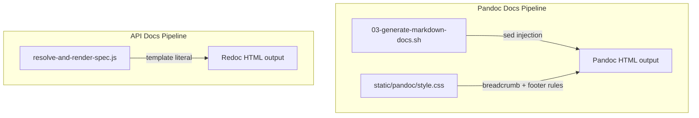

# Design Document: Breadcrumb Navigation & Copyright Footer for Documentation Pages

## Overview

This design adds breadcrumb navigation and a copyright footer to all generated documentation pages — both the Pandoc-generated markdown docs and the Redoc-based API reference page. The implementation modifies two existing post-deploy scripts (`03-generate-markdown-docs.sh` and `resolve-and-render-spec.js`) and the Pandoc stylesheet (`static/pandoc/style.css`). No new files or services are introduced.

The breadcrumbs provide hierarchical navigation (Home → Docs → Section → Page) using WAI-ARIA patterns, and the footer displays a dynamic copyright year matching the landing page's existing pattern.

## Architecture

The feature touches three layers of the post-deploy documentation pipeline:



### Key Design Decisions

1. **sed-based HTML injection for Pandoc pages**: The existing script already uses sed for post-processing (link rewriting). Breadcrumb and footer injection follows the same pattern — inserting HTML after `<body>` (for breadcrumbs) and before `</body>` (for footer). This avoids adding new tools or dependencies.

2. **Template literal modification for API docs**: The `resolve-and-render-spec.js` already constructs the full HTML as a template literal. Breadcrumb, footer, and their inline styles are added directly to this template.

3. **Shared CSS in Pandoc stylesheet, inline CSS in API docs**: Pandoc pages share `style.css`, so breadcrumb/footer styles go there. The API docs page is self-contained (no external stylesheet), so its styles are inlined in the `<style>` block.

4. **Directory name formatting in shell**: The `dir` variable (e.g., `use-cases`) is transformed to display text (e.g., `Use cases`) using sed: capitalize first letter, replace hyphens with spaces. This runs in the existing bash loop.

## Components and Interfaces

### Component 1: Breadcrumb & Footer Injection in `03-generate-markdown-docs.sh`

**Modified file**: `application-infrastructure/postdeploy-scripts/03-generate-markdown-docs.sh`

**New shell function**: `format_directory_name`
- Input: directory name string (e.g., `use-cases`)
- Output: formatted display name (e.g., `Use cases`)
- Logic: capitalize first character, replace `-` with space

**Breadcrumb HTML generation**: Within the existing `find ... | while read` loop, after Pandoc conversion and link rewriting, a new sed pass injects breadcrumb HTML after the opening `<body>` tag. The breadcrumb trail varies:
- **Index pages** (`index.html`): Home → Docs → Directory_Name (plain text)
- **Sub-pages** (e.g., `kiro.html`): Home → Docs → Directory_Name (link) → Page_Title (plain text)

**Footer HTML injection**: A sed pass inserts the copyright footer and year script before the closing `</body>` tag.

**Interface with existing code**: Uses the existing `$title` variable (from `extract_title`) for sub-page breadcrumb text. Uses the existing `$dir` loop variable for directory name. Uses the existing `$output_dir` and `$html_name` variables for file paths.

### Component 2: Breadcrumb & Footer Styling in `style.css`

**Modified file**: `application-infrastructure/src/static/pandoc/style.css`

**New CSS rules added**:
- `.breadcrumb-nav` — container styling (padding, margin)
- `.breadcrumb-nav ol` — horizontal inline list, no default list styling
- `.breadcrumb-nav li` — inline display with `::before` separator (e.g., `/`)
- `.breadcrumb-nav a` — link color `#4a6cf7`, no underline, underline on hover/focus, focus-visible outline
- `footer` — `margin-top: 3rem`, `padding-top: 1.5rem`, `border-top: 1px solid #e0e0e8`, `text-align: center`, `font-size: 0.8rem`, `color: #8888a0` (matching landing page)

### Component 3: Breadcrumb & Footer in `resolve-and-render-spec.js`

**Modified file**: `application-infrastructure/postdeploy-scripts/resolve-and-render-spec.js`

**Changes to the HTML template literal**:
- Add breadcrumb nav HTML before the `<div id="redoc-container">` element
- Add footer HTML and year script after the `<div id="redoc-container">` element
- Add inline CSS rules for `.breadcrumb-nav`, `.breadcrumb-nav ol`, `.breadcrumb-nav li`, `.breadcrumb-nav a`, and `footer` in the existing `<style>` block

**Breadcrumb trail**: Home (/) → Docs (/) → API Reference (plain text, `aria-current="page"`)

## Data Models

No new data models are introduced. The feature operates on:

- **File system paths**: Existing `$dir`, `$output_dir`, `$html_name`, `$title` shell variables
- **HTML string manipulation**: sed substitutions on generated HTML files (Pandoc) and template literal construction (Node.js)
- **CSS rules**: Appended to existing stylesheet

### Breadcrumb HTML Structure (shared across all pages)

```html
<nav aria-label="Breadcrumb" class="breadcrumb-nav">
  <ol>
    <li><a href="/">Home</a></li>
    <li><a href="/">Docs</a></li>
    <!-- For index pages: -->
    <li aria-current="page">Integration</li>
    <!-- For sub-pages, the directory becomes a link and page title is added: -->
    <li><a href="/docs/integration/">Integration</a></li>
    <li aria-current="page">Kiro</li>
  </ol>
</nav>
```

### Footer HTML Structure (shared across all pages)

```html
<footer>
  <p>&copy; <span id="copyright-year"></span> 63Klabs. All rights reserved.</p>
</footer>
<script>document.getElementById('copyright-year').textContent = new Date().getFullYear();</script>
```


## Correctness Properties

*A property is a characteristic or behavior that should hold true across all valid executions of a system — essentially, a formal statement about what the system should do. Properties serve as the bridge between human-readable specifications and machine-verifiable correctness guarantees.*

### Property 1: Index page breadcrumb structure and content

*For any* valid directory name, the breadcrumb HTML generated for an index page should contain a `<nav aria-label="Breadcrumb">` wrapping an `<ol>` with exactly 3 `<li>` items: (1) "Home" as a link to `/`, (2) "Docs" as a link to `/`, and (3) the formatted directory name as plain text with `aria-current="page"`. The breadcrumb should appear before the main document content in the HTML body.

**Validates: Requirements 1.1, 1.3, 1.4, 1.5**

### Property 2: Sub-page breadcrumb structure and content

*For any* valid directory name and page title, the breadcrumb HTML generated for a sub-page should contain a `<nav aria-label="Breadcrumb">` wrapping an `<ol>` with exactly 4 `<li>` items: (1) "Home" as a link to `/`, (2) "Docs" as a link to `/`, (3) the formatted directory name as a link to `/docs/{dir}/`, and (4) the page title as plain text with `aria-current="page"`. The breadcrumb should appear before the main document content in the HTML body.

**Validates: Requirements 1.2, 1.3, 1.4, 1.5**

### Property 3: Directory name formatting

*For any* kebab-case directory name string, the `format_directory_name` function should produce a string where the first character is uppercase, all hyphens are replaced with spaces, and all other characters are unchanged.

**Validates: Requirements 1.6**

### Property 4: Footer uniqueness and position

*For any* generated HTML page (Pandoc output), the copyright footer markup should appear exactly once, and it should appear before the closing `</body>` tag.

**Validates: Requirements 2.1, 2.4**

## Error Handling

### Shell Script (`03-generate-markdown-docs.sh`)

- **Missing directory name**: The `format_directory_name` function receives the `$dir` variable from the existing loop, which is always non-empty (validated by the existing `if [[ ! -d "${source_dir}" ]]` check). No additional validation needed.
- **sed injection failure**: If the sed substitution pattern doesn't match (e.g., `<body>` or `</body>` not found in the HTML), sed silently leaves the file unchanged. The page will render without breadcrumbs/footer but won't break. This is acceptable — Pandoc `--standalone` always produces `<body>` and `</body>` tags.
- **Special characters in title**: The `$title` variable (from `extract_title`) may contain characters that are special in sed (e.g., `/`, `&`, `\`). The sed replacement strings must escape these. The implementation should use a sed-safe escaping approach or use a delimiter other than `/` for the sed substitution.

### Node.js Script (`resolve-and-render-spec.js`)

- **No error handling changes needed**: The breadcrumb and footer are static HTML strings embedded in the template literal. The `title` variable is already extracted and sanitized by the existing code. No new failure modes are introduced.

### CSS (`style.css`)

- **No error handling needed**: CSS rules are additive. If a selector doesn't match any element, the rule is simply ignored. Malformed CSS would be caught during development review.

## Testing Strategy

### Unit Tests (Example-Based)

Unit tests verify specific, concrete outputs for known inputs:

1. **Pandoc breadcrumb injection — index page**: Given a minimal Pandoc HTML output for directory `integration`, verify the injected breadcrumb contains `Home → Docs → Integration` with correct links and `aria-current="page"` on the last item.
2. **Pandoc breadcrumb injection — sub-page**: Given a minimal Pandoc HTML output for directory `integration` and title `Kiro`, verify the breadcrumb contains `Home → Docs → Integration (link to /docs/integration/) → Kiro` with correct structure.
3. **Pandoc footer injection**: Given a minimal Pandoc HTML output, verify the footer markup and year script are injected before `</body>`.
4. **API docs breadcrumb**: Verify the `resolve-and-render-spec.js` output contains the breadcrumb `Home → Docs → API Reference` with correct semantic structure and inline CSS.
5. **API docs footer**: Verify the output contains the footer markup, year script, and inline footer CSS.
6. **CSS rules present**: Verify `style.css` contains rules for `.breadcrumb-nav`, `.breadcrumb-nav ol`, `.breadcrumb-nav li`, `.breadcrumb-nav a`, and `footer` with expected property values matching the landing page.
7. **Directory name formatting edge cases**: Verify `format_directory_name` for `use-cases` → `Use cases`, `tools` → `Tools`, `troubleshooting` → `Troubleshooting`.

### Property-Based Tests

Property-based tests use randomized inputs to verify universal properties. The project uses `fast-check` with Jest.

Each property test must run a minimum of 100 iterations and be tagged with a comment referencing the design property.

1. **Property 1 test**: Generate random kebab-case directory names. For each, build the index-page breadcrumb HTML and parse it to verify: exactly 3 `<li>` items, correct link targets, correct `aria-current` on last item, and breadcrumb appears before content.
   - Tag: `Feature: docs-breadcrumb-footer, Property 1: Index page breadcrumb structure and content`

2. **Property 2 test**: Generate random kebab-case directory names and random page title strings. For each, build the sub-page breadcrumb HTML and parse it to verify: exactly 4 `<li>` items, correct link targets including `/docs/{dir}/`, correct `aria-current` on last item, and breadcrumb appears before content.
   - Tag: `Feature: docs-breadcrumb-footer, Property 2: Sub-page breadcrumb structure and content`

3. **Property 3 test**: Generate random kebab-case strings (lowercase letters and hyphens, not starting/ending with hyphen). For each, apply `format_directory_name` and verify: first character is uppercase version of original first character, all hyphens replaced with spaces, all other characters unchanged.
   - Tag: `Feature: docs-breadcrumb-footer, Property 3: Directory name formatting`

4. **Property 4 test**: Generate random HTML body content strings (no `</body>` in content). Wrap in a minimal Pandoc HTML structure, apply footer injection, and verify: footer markup appears exactly once, footer appears before `</body>`.
   - Tag: `Feature: docs-breadcrumb-footer, Property 4: Footer uniqueness and position`

### Testing Approach for Shell Logic

Since the breadcrumb/footer generation logic lives in a bash script, property tests will extract the core logic into testable JavaScript helper functions that mirror the shell behavior:
- `formatDirectoryName(dirName)` — mirrors the shell `format_directory_name` function
- `buildBreadcrumbHtml(dir, title, isIndex)` — generates the breadcrumb HTML string
- `injectBreadcrumb(html, breadcrumbHtml)` — injects breadcrumb after `<body>`
- `injectFooter(html)` — injects footer before `</body>`

These JavaScript functions serve as the testable specification. The shell script implementation must produce identical output. Integration verification is done by running the actual shell script on sample markdown files and comparing output.

### Property-Based Testing Library

- **Library**: `fast-check` (already a devDependency in `application-infrastructure/src/package.json`)
- **Framework**: Jest (per project convention, new tests use Jest)
- **Minimum iterations**: 100 per property test
- **Test file**: `application-infrastructure/src/lambda/read/tests/property/docs-breadcrumb-footer.property.test.js`
