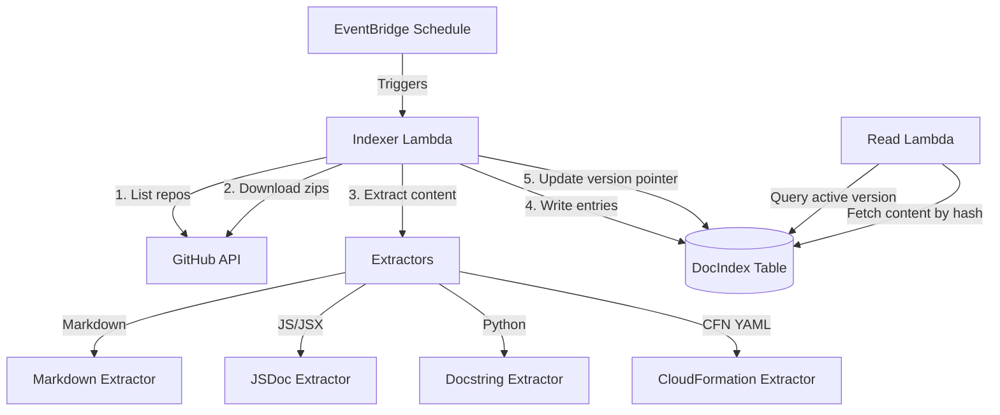
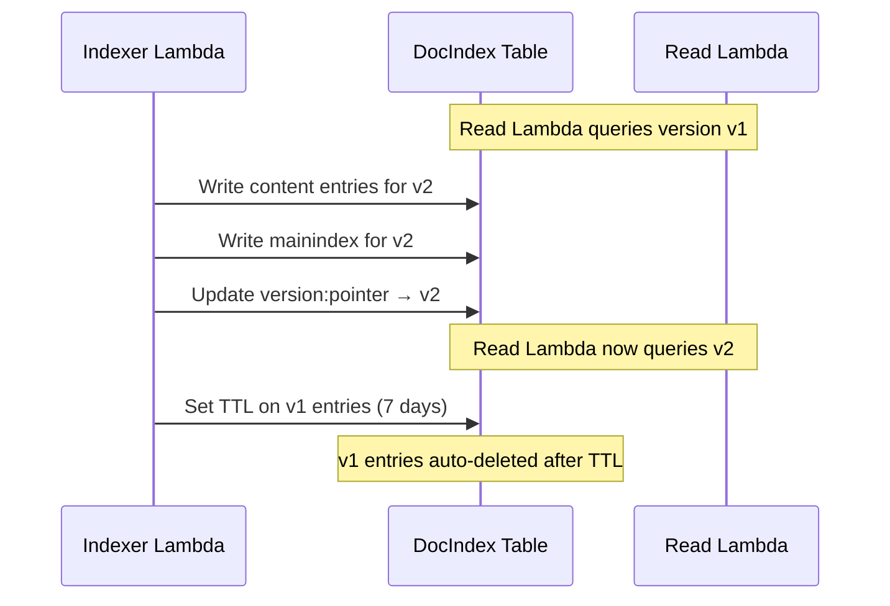

# Design Document: Documentation Indexer

## Overview

The Documentation Indexer replaces the current in-memory documentation index (built at Read Lambda cold start) with a dedicated scheduled Lambda function that builds a persistent DynamoDB-backed index. This decouples indexing from serving, enabling consistent search results across Lambda instances, eliminating cold-start index rebuilds, and supporting blue-green versioned deployments with rollback.

The system consists of three main parts:

1. **Indexer Lambda** — A scheduled Lambda that discovers GitHub repositories, downloads archives, extracts content (Markdown, JSDoc, Python docstrings, CloudFormation parameters), hashes content paths, and writes entries to DynamoDB.
2. **DocIndex DynamoDB Table** — A single-table design storing content entries, the main index, search keywords, and version pointers.
3. **Read Lambda Integration** — The existing Read Lambda is updated to query the DynamoDB index instead of building an in-memory index.



## Architecture

### Indexer Lambda

The Indexer Lambda is a standalone `AWS::Serverless::Function` at `src/lambda/indexer/` with its own `package.json`. It does NOT use the `@63klabs/cache-data` package — it writes directly to DynamoDB via the AWS SDK (available in the Lambda runtime, not packaged).

**Execution flow:**

1. Parse `ATLANTIS_GITHUB_USER_ORGS` env var into org/user list
2. Retrieve GitHub token from SSM via the Parameters and Secrets Lambda Extension (same `PARAM_STORE_PATH` pattern as Read Lambda)
3. For each org/user, list repositories via GitHub API
4. For each repository, check for latest release; download zip of latest release tag or default branch
5. Extract zip in memory, filter to indexable files
6. Run appropriate extractor per file type
7. Hash each Content_Path with SHA-256 (truncated to 16 hex chars for key brevity)
8. Write content entries to DynamoDB under the new version namespace
9. Build and write the main index atomically
10. Update the Version_Pointer to the new version
11. Set TTL on previous version entries (7-day cleanup)

**Rate limiting:** The indexer monitors `X-RateLimit-Remaining` and `X-RateLimit-Reset` headers on every GitHub API call. When remaining hits zero, it waits until reset. On HTTP 403 rate-limit responses, it retries with exponential backoff (max 3 retries). An in-memory cache avoids redundant API calls within a single build run.

### DynamoDB Single-Table Design

All data lives in one table (`${Prefix}-${ProjectId}-${StageId}-DocIndex`) using a composite `pk`/`sk` key:

| pk | sk | Purpose |
|----|-----|---------|
| `version:pointer` | `active` | Points to the currently active index version |
| `mainindex:{version}` | `entries` | Main index for a specific version — array of all indexed items |
| `content:{hash}` | `v:{version}:metadata` | Metadata for a content entry (path, type, title, keywords, etc.) |
| `content:{hash}` | `v:{version}:content` | Full extracted content text |
| `search:{keyword}` | `v:{version}:{hash}` | Keyword-to-content mapping with relevance score |

Version identifiers are timestamp-based (e.g., `20250715T060000`). The `ttl` attribute on versioned entries enables automatic cleanup of old versions after 7 days.

### Read Lambda Integration

The Read Lambda queries the DocIndex table instead of building an in-memory index:

1. Read `version:pointer` / `active` to get the current version
2. Read `mainindex:{version}` / `entries` to get the full index for keyword search
3. For content retrieval, query `content:{hash}` / `v:{version}:metadata` and `v:{version}:content`

The Read Lambda continues to use `CacheableDataAccess` for caching search results — the underlying data source changes from in-memory to DynamoDB. The `DOC_INDEX_TABLE` env var provides the table name.

### Blue-Green Versioning



If the build fails at any point, the version pointer remains on the previous version. The Read Lambda is never interrupted.

## Components and Interfaces

### Indexer Lambda Module Structure

```
src/lambda/indexer/
├── index.js                  # Lambda handler entry point
├── package.json              # Dependencies (js-yaml, adm-zip)
├── lib/
│   ├── github-client.js      # GitHub API client with rate limiting
│   ├── archive-processor.js  # Zip download and extraction
│   ├── file-filter.js        # File type filtering logic
│   ├── extractors/
│   │   ├── markdown.js       # Markdown heading/section extractor
│   │   ├── jsdoc.js          # JSDoc block extractor
│   │   ├── python.js         # Python docstring extractor
│   │   └── cloudformation.js # CloudFormation parameter extractor
│   ├── hasher.js             # SHA-256 content path hashing
│   ├── dynamo-writer.js      # DynamoDB batch write operations
│   └── index-builder.js      # Orchestrates the full index build
```

### Key Interfaces

**`github-client.js`**
```javascript
/**
 * @param {string} org - GitHub org/user
 * @param {string} token - GitHub PAT
 * @returns {Promise<Array<{name, defaultBranch, owner}>>}
 */
async function listRepositories(org, token) { }

/**
 * @param {string} owner
 * @param {string} repo
 * @param {string} token
 * @returns {Promise<{tagName: string, zipUrl: string}|null>}
 */
async function getLatestRelease(owner, repo, token) { }

/**
 * @param {string} url - Zip archive URL
 * @param {string} token
 * @returns {Promise<Buffer>}
 */
async function downloadArchive(url, token) { }
```

**`file-filter.js`**
```javascript
/**
 * @param {string} filePath - Path within the archive
 * @returns {boolean} Whether the file should be indexed
 */
function isIndexable(filePath) { }
```

**`extractors/*.js`** — Each extractor implements:
```javascript
/**
 * @param {string} content - File content
 * @param {string} filePath - File path within repo
 * @param {{org: string, repo: string}} context
 * @returns {Array<{contentPath, title, excerpt, content, type, subType, keywords}>}
 */
function extract(content, filePath, context) { }
```

**`hasher.js`**
```javascript
/**
 * @param {string} contentPath
 * @returns {string} 16-char hex hash
 */
function hashContentPath(contentPath) { }
```

**`dynamo-writer.js`**
```javascript
/**
 * @param {string} tableName
 * @param {string} version
 * @param {Array<Object>} entries - Extracted content entries
 * @returns {Promise<void>}
 */
async function writeContentEntries(tableName, version, entries) { }

/**
 * @param {string} tableName
 * @param {string} version
 * @param {Array<Object>} indexEntries
 * @returns {Promise<void>}
 */
async function writeMainIndex(tableName, version, indexEntries) { }

/**
 * @param {string} tableName
 * @param {string} newVersion
 * @param {string|null} previousVersion
 * @returns {Promise<void>}
 */
async function updateVersionPointer(tableName, newVersion, previousVersion) { }
```

### Read Lambda Changes

**Updated `models/doc-index.js`:**
- Remove in-memory index building (`buildIndex`, `indexTemplateRepository`, etc.)
- Add `queryIndex(query, options)` that reads from DynamoDB
- Add `getActiveVersion(tableName)` to read the version pointer
- Add `getMainIndex(tableName, version)` to read the main index

**Updated `services/documentation.js`:**
- `search()` continues to use `CacheableDataAccess` for caching
- The fetch function calls the new `DocIndex.queryIndex()` instead of `DocIndex.search()`

**Updated `config/settings.js`:**
- Add `docIndexTable: process.env.DOC_INDEX_TABLE || ''`

### Infrastructure (template.yml additions)

1. **DocIndex DynamoDB Table** — `AWS::DynamoDB::Table` with pk/sk, PAY_PER_REQUEST, TTL on `ttl`
2. **Indexer Lambda** — `AWS::Serverless::Function`, nodejs24.x, 900s timeout, 1024MB, `src/lambda/indexer/`
3. **Indexer Execution Role** — DynamoDB read/write on DocIndex, SSM GetParameter, CloudWatch Logs
4. **EventBridge Schedule** — Uses `DocIndexScheduleForPROD` or `DocIndexScheduleForDEVTEST` parameter
5. **CloudWatch Alarm + SNS** — Same pattern as `ReadLambdaErrorsAlarm` / `ReadLambdaErrorAlarmNotification`
6. **Read Lambda Role Update** — Add DynamoDB read on DocIndex table
7. **Read Lambda Env Var** — `DOC_INDEX_TABLE` pointing to the DocIndex table


## Data Models

### DynamoDB Item Schemas

#### Version Pointer

```json
{
  "pk": "version:pointer",
  "sk": "active",
  "version": "20250715T060000",
  "previousVersion": "20250714T060000",
  "updatedAt": "2025-07-15T06:15:00Z"
}
```

#### Main Index Entry

```json
{
  "pk": "mainindex:20250715T060000",
  "sk": "entries",
  "version": "20250715T060000",
  "entries": [
    {
      "hash": "ea6f1a2b3c4d5e6f",
      "path": "63klabs/cache-data/README.md/installation",
      "type": "documentation",
      "subType": "guide",
      "title": "Installation",
      "repository": "cache-data",
      "owner": "63klabs",
      "keywords": ["install", "setup", "npm"],
      "lastIndexed": "2025-07-15T06:10:00Z"
    }
  ],
  "entryCount": 150,
  "ttl": 1753084800
}
```

#### Content Metadata

```json
{
  "pk": "content:ea6f1a2b3c4d5e6f",
  "sk": "v:20250715T060000:metadata",
  "version": "20250715T060000",
  "path": "63klabs/cache-data/README.md/installation",
  "type": "documentation",
  "subType": "guide",
  "title": "Installation",
  "excerpt": "To install cache-data, run npm install @63klabs/cache-data...",
  "repository": "cache-data",
  "repositoryType": "package",
  "owner": "63klabs",
  "keywords": ["install", "setup", "npm", "cache-data"],
  "githubUrl": "https://github.com/63klabs/cache-data#installation",
  "typeWeight": 1.0,
  "lastIndexed": "2025-07-15T06:10:00Z",
  "ttl": 1753084800
}
```

#### Content Body

```json
{
  "pk": "content:ea6f1a2b3c4d5e6f",
  "sk": "v:20250715T060000:content",
  "version": "20250715T060000",
  "content": "## Installation\n\nTo install cache-data, run:\n\n```bash\nnpm install @63klabs/cache-data\n```\n...",
  "ttl": 1753084800
}
```

#### Search Keyword Entry

```json
{
  "pk": "search:install",
  "sk": "v:20250715T060000:ea6f1a2b3c4d5e6f",
  "version": "20250715T060000",
  "hash": "ea6f1a2b3c4d5e6f",
  "relevanceScore": 13,
  "typeWeight": 1.0,
  "ttl": 1753084800
}
```

### Content Extractor Output Schema

Each extractor returns an array of objects conforming to:

```javascript
/**
 * @typedef {Object} ExtractedEntry
 * @property {string} contentPath - Hierarchical path (org/repo/file/section)
 * @property {string} title - Display title for the entry
 * @property {string} excerpt - First 200 chars of content
 * @property {string} content - Full extracted content
 * @property {string} type - One of: documentation, code-example, template-pattern
 * @property {string} subType - Varies by type (guide, tutorial, reference, function, resource, parameter)
 * @property {Array<string>} keywords - Extracted search keywords
 */
```

### Content Type Weights

| Type | Weight | Rationale |
|------|--------|-----------|
| `documentation` | 1.0 | Primary content, highest relevance |
| `template-pattern` | 0.9 | CloudFormation patterns, high value for infrastructure |
| `code-example` | 0.8 | JSDoc/docstring content, supporting material |

### File Filtering Rules

| Extension | Condition | Extractor |
|-----------|-----------|-----------|
| `.md` | Not in excluded list | Markdown |
| `.js`, `.jsx` | Always | JSDoc |
| `.py` | Always | Python Docstring |
| `.yml`, `.yaml` | Filename matches `template*.yml` or `template*.yaml` | CloudFormation |

**Excluded files** (any directory): `LICENSE.md`, `CONTRIBUTING.md`, `CONTRIBUTE.md`, `CHANGELOG.md`, `AGENTS.md`, `SECURITY.md`

### Content Path Format

| Content Type | Path Format | Example |
|-------------|-------------|---------|
| Markdown section | `{org}/{repo}/{filepath}/{heading}` | `63klabs/cache-data/README.md/installation` |
| JSDoc function | `{org}/{repo}/{filepath}/{className}/{methodName}` | `63klabs/starter-app/src/lambda/config/index.js/Config/init` |
| JSDoc top-level | `{org}/{repo}/{filepath}/{functionName}` | `63klabs/cache-data/src/lib/dao-cache.js/getData` |
| Python function | `{org}/{repo}/{filepath}/{className}/{methodName}` | `63klabs/tools/scripts/deploy.py/Deployer/run` |
| Python top-level | `{org}/{repo}/{filepath}/{functionName}` | `63klabs/tools/scripts/utils.py/parse_config` |
| CFN parameter | `{org}/{repo}/{filepath}/Parameters/{paramName}` | `63klabs/starter-app/template.yml/Parameters/Prefix` |

### Hashing

Content paths are hashed using SHA-256, truncated to 16 hex characters:

```javascript
const crypto = require('crypto');

function hashContentPath(contentPath) {
  return crypto.createHash('sha256')
    .update(contentPath)
    .digest('hex')
    .substring(0, 16);
}
```

This produces a 64-bit hash space (2^64 ≈ 1.8×10^19), which is more than sufficient for the expected index size (thousands of entries). Collisions are astronomically unlikely at this scale.

### Relevance Scoring

The indexer pre-computes keyword relevance scores using the existing algorithm from `doc-index.js`:

- Title keyword match: +10
- Excerpt keyword match: +5
- General keyword match: +3
- Exact phrase match bonus: +20

These scores are stored in the `search:{keyword}` entries. The Read Lambda sorts by `relevanceScore` descending and applies the `typeWeight` multiplier at query time.


## Correctness Properties

*A property is a characteristic or behavior that should hold true across all valid executions of a system — essentially, a formal statement about what the system should do. Properties serve as the bridge between human-readable specifications and machine-verifiable correctness guarantees.*

### Property 1: Content path hashing is deterministic

*For any* content path string, hashing it with `hashContentPath` twice should produce the same 16-character hex string both times.

**Validates: Requirements 11.5**

### Property 2: File filtering correctness

*For any* file path, `isIndexable` returns true if and only if: (a) the file extension is `.md`, `.js`, `.jsx`, `.py`, `.yml`, or `.yaml`; (b) if the extension is `.yml` or `.yaml`, the filename matches the pattern `template*.yml` or `template*.yaml`; (c) the filename is not in the excluded list (`LICENSE.md`, `CONTRIBUTING.md`, `CONTRIBUTE.md`, `CHANGELOG.md`, `AGENTS.md`, `SECURITY.md`).

**Validates: Requirements 6.1, 6.2, 6.3, 6.4**

### Property 3: Markdown extraction produces valid entries

*For any* Markdown string containing at least one heading (`# ` through `###### `), the Markdown extractor should produce one entry per heading where: each entry has a content path matching `{org}/{repo}/{filepath}/{heading}`, the excerpt is at most 200 characters, the excerpt is a prefix of the content, and the keywords array is non-empty.

**Validates: Requirements 7.2, 7.3, 7.4, 7.5**

### Property 4: JSDoc extraction produces valid entries

*For any* JavaScript string containing at least one JSDoc comment block (`/** ... */`) followed by a function or method declaration, the JSDoc extractor should produce entries where: each entry includes the function signature, extracted `@param` names match the function parameters, `@returns` is extracted if present, the description text is non-empty, and the content path follows `{org}/{repo}/{filepath}/{functionName}` or `{org}/{repo}/{filepath}/{className}/{methodName}`.

**Validates: Requirements 8.1, 8.2, 8.3, 8.4, 8.5, 8.6**

### Property 5: Python docstring extraction produces valid entries

*For any* Python string containing at least one function or class definition with a docstring, the Docstring extractor should produce entries where: each entry includes the function signature with parameter names, docstring sections (Args, Returns, Raises) are extracted when present, and the content path follows `{org}/{repo}/{filepath}/{functionName}` or `{org}/{repo}/{filepath}/{className}/{methodName}`.

**Validates: Requirements 9.1, 9.2, 9.3, 9.4**

### Property 6: CloudFormation parameter extraction produces valid entries

*For any* YAML string that is a valid CloudFormation template with a `Parameters` section (potentially containing custom tags like `!Ref`, `!Sub`), the CloudFormation extractor should: parse without errors, produce one entry per parameter, extract the parameter name, Type, and Description (when present), and generate a content path matching `{org}/{repo}/{filepath}/Parameters/{parameterName}`.

**Validates: Requirements 10.1, 10.2, 10.3, 10.4**

### Property 7: Content entries use correct DynamoDB key format

*For any* extracted content entry written to DynamoDB, the metadata item should have `pk` matching `content:{hash}` and `sk` matching `v:{version}:metadata`, and the content item should have the same `pk` with `sk` matching `v:{version}:content`, where `{hash}` is the SHA-256 truncated hash of the content path.

**Validates: Requirements 2.7, 11.2, 11.3**

### Property 8: Main index contains all entries with required fields

*For any* set of extracted content entries, the main index written to DynamoDB should: contain exactly one entry per extracted content item, each entry should include `hash`, `path`, `type`, `subType`, `title`, `repository`, `owner`, `keywords`, and `lastIndexed`, and the `pk` should be `mainindex:{version}` with `sk` = `entries`.

**Validates: Requirements 12.1, 12.2, 12.3**

### Property 9: All versioned entries share the same version identifier

*For any* index build, the version identifier should be a valid timestamp string, and every content entry, main index entry, and keyword entry written during that build should reference the same version identifier.

**Validates: Requirements 13.1, 13.2**

### Property 10: TTL is set to approximately 7 days on versioned entries

*For any* versioned DynamoDB entry (content, main index, or keyword), the `ttl` attribute should be set to a Unix timestamp approximately 7 days (604800 seconds ± 86400 seconds) from the entry's `lastIndexed` timestamp.

**Validates: Requirements 13.5**

### Property 11: Failed build leaves version pointer unchanged

*For any* index build that fails (throws an error at any stage), the version pointer in DynamoDB should remain pointing to the previous version (or remain absent if no previous version existed).

**Validates: Requirements 13.6**

### Property 12: Relevance scoring follows defined weights

*For any* content entry and set of query keywords, the computed relevance score should equal: (+10 for each keyword matching a title keyword) + (+5 for each keyword matching an excerpt keyword) + (+3 for each keyword matching a general keyword) + (+20 if the full query phrase appears in the title or excerpt), multiplied by the type weight (1.0 for documentation, 0.9 for template-pattern, 0.8 for code-example).

**Validates: Requirements 14.1, 14.2, 14.3**

### Property 13: Search results sorted by relevance descending

*For any* search query returning multiple results, the results array should be sorted such that each result's relevance score is greater than or equal to the next result's relevance score.

**Validates: Requirements 14.4**

### Property 14: Archive download selects release or default branch correctly

*For any* repository, if the repository has at least one published (non-draft, non-prerelease) release, the indexer should download the zip for the latest release tag. If the repository has no published releases, the indexer should download the zip for the default branch.

**Validates: Requirements 5.2, 5.3**

### Property 15: Brown-out resilience

*For any* list of GitHub organizations/users or repositories where a subset fails (API error, download error), the indexer should still process all non-failing items and produce index entries for them. The total indexed entries should equal the sum of entries from successful items.

**Validates: Requirements 4.4, 5.5**

### Property 16: Org list parsing from comma-delimited string

*For any* comma-delimited string of organization names (potentially with whitespace around commas), parsing should produce an array of trimmed, non-empty strings in the same order.

**Validates: Requirements 4.1**

### Property 17: Rate limiter waits when remaining is zero

*For any* GitHub API response where `X-RateLimit-Remaining` is `0`, the GitHub client should delay subsequent requests until the time indicated by `X-RateLimit-Reset` before making the next call.

**Validates: Requirements 15.2**

### Property 18: Exponential backoff on 403 rate limit

*For any* GitHub API request that returns HTTP 403 with a rate-limit indication, the client should retry up to 3 times with exponentially increasing delays (e.g., 1s, 2s, 4s). After 3 failed retries, it should throw an error.

**Validates: Requirements 15.4**


## Error Handling

### Indexer Lambda Error Handling

| Error Scenario | Handling Strategy | Impact |
|---------------|-------------------|--------|
| GitHub token missing/blank | Log error, terminate build with failure status | No index update; version pointer unchanged |
| GitHub API 403 (rate limit) | Exponential backoff, max 3 retries | Delays build; fails after retries |
| GitHub API 404 (org not found) | Log warning, skip org, continue | Partial index (brown-out) |
| GitHub API network error | Log error, skip org/repo, continue | Partial index (brown-out) |
| Zip download failure | Log error, skip repo, continue | Partial index (brown-out) |
| Zip extraction failure | Log error, skip repo, continue | Partial index (brown-out) |
| Extractor parse error | Log warning, skip file, continue | Missing entries for that file |
| DynamoDB write error | Log error, abort build | Version pointer unchanged; previous index intact |
| DynamoDB throttling | SDK automatic retry with backoff | Delays build |
| Lambda timeout (900s) | Build incomplete; version pointer unchanged | Previous index remains active |

### Read Lambda Error Handling

| Error Scenario | Handling Strategy | Impact |
|---------------|-------------------|--------|
| DocIndex table not accessible | Return error response via MCP protocol | User sees error message |
| No active version pointer | Return empty results with suggestion message | User informed indexer hasn't run |
| Content hash not found | Skip entry in results, log warning | Partial results |
| DynamoDB read throttling | SDK automatic retry | Slight latency increase |

### Structured Logging

The Indexer Lambda emits structured log messages at these checkpoints:

```
INFO  | index_build_start    | { version, orgs: [...] }
INFO  | repos_discovered     | { org, repoCount }
WARN  | org_failed           | { org, error }
WARN  | repo_skipped         | { org, repo, error }
INFO  | repo_indexed         | { org, repo, entryCount }
INFO  | entries_indexed      | { version, totalEntries, duration }
INFO  | version_pointer_updated | { version, previousVersion }
INFO  | index_build_success  | { version, totalEntries, totalRepos, duration }
ERROR | index_build_failure  | { version, error, stage }
```

## Testing Strategy

### Property-Based Testing

Property-based tests use `fast-check` (already available in the project's test ecosystem) and run a minimum of 100 iterations per property. Each test references its design document property.

**Indexer Lambda property tests** (`src/lambda/indexer/tests/property/`):

| Test File | Properties Covered |
|-----------|-------------------|
| `hashing.property.test.js` | Property 1 (deterministic hashing) |
| `file-filter.property.test.js` | Property 2 (file filtering) |
| `markdown-extractor.property.test.js` | Property 3 (markdown extraction) |
| `jsdoc-extractor.property.test.js` | Property 4 (JSDoc extraction) |
| `python-extractor.property.test.js` | Property 5 (Python extraction) |
| `cfn-extractor.property.test.js` | Property 6 (CloudFormation extraction) |
| `dynamo-keys.property.test.js` | Property 7 (DynamoDB key format) |
| `main-index.property.test.js` | Property 8 (main index completeness) |
| `versioning.property.test.js` | Properties 9, 10, 11 (version consistency, TTL, failure safety) |
| `relevance.property.test.js` | Properties 12, 13 (scoring, sort order) |
| `archive-selection.property.test.js` | Property 14 (release vs branch) |
| `resilience.property.test.js` | Property 15 (brown-out) |
| `org-parsing.property.test.js` | Property 16 (comma parsing) |
| `rate-limiter.property.test.js` | Properties 17, 18 (rate limiting, backoff) |

Each property test is tagged with a comment:
```javascript
// Feature: documentation-indexer, Property 1: Content path hashing is deterministic
```

### Unit Tests

Unit tests cover specific examples, edge cases, and error conditions. Written in Jest (`.jest.mjs` files per project convention).

**Indexer Lambda unit tests** (`src/lambda/indexer/tests/unit/`):

- `github-client.test.js` — Token retrieval, API call construction, error responses
- `archive-processor.test.js` — Zip extraction, empty archives, corrupted zips
- `file-filter.test.js` — Each excluded file, each extension, boundary cases
- `extractors/markdown.test.js` — Empty files, no headings, nested headings, special characters
- `extractors/jsdoc.test.js` — No JSDoc, malformed blocks, arrow functions, class methods
- `extractors/python.test.js` — No docstrings, class methods, type annotations, decorators
- `extractors/cloudformation.test.js` — No Parameters section, all intrinsic functions, empty template
- `hasher.test.js` — Known hash values, empty string, unicode paths
- `dynamo-writer.test.js` — Batch write splitting (25-item limit), error handling
- `index-builder.test.js` — Full build orchestration, partial failures, empty org list

**Read Lambda unit tests** (updates to existing test directory):

- `models/doc-index.test.js` — Version pointer query, main index query, missing version handling
- `services/documentation.test.js` — Search with DynamoDB backend, empty results, type filtering

### Integration Tests

- End-to-end index build with mocked GitHub API and real DynamoDB Local
- Read Lambda search against a pre-built DynamoDB index
- Blue-green version switch verification

### Test Dependencies

The Indexer Lambda's `package.json` should include test-only dependencies as `devDependencies`:

```json
{
  "devDependencies": {
    "jest": "^29.0.0",
    "fast-check": "^3.0.0",
    "@aws-sdk/client-dynamodb": "^3.0.0",
    "@aws-sdk/lib-dynamodb": "^3.0.0"
  }
}
```

Note: `@aws-sdk/*` packages are available in the Lambda runtime and should NOT be in `dependencies`. They are in `devDependencies` only for running tests locally.
