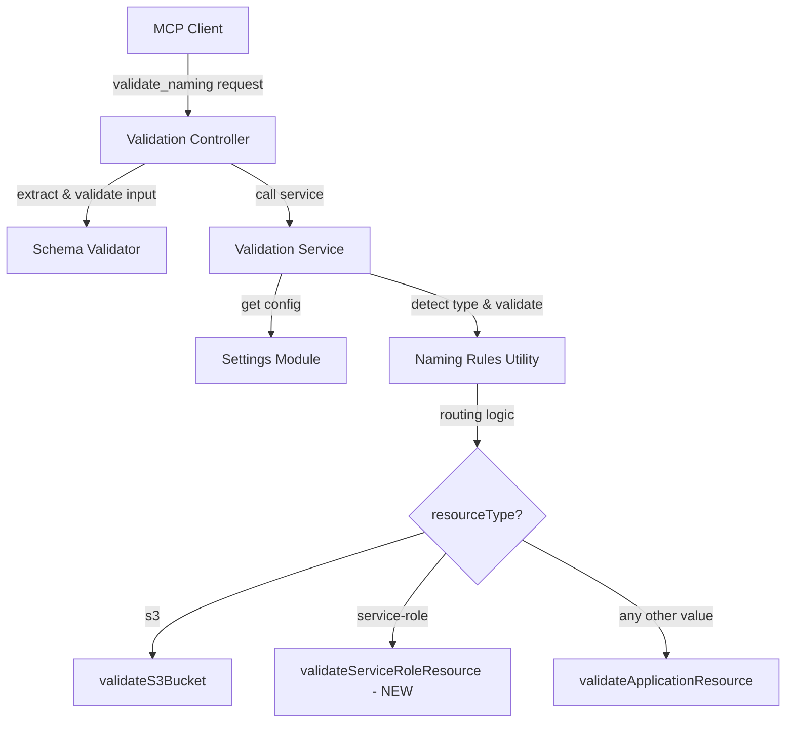
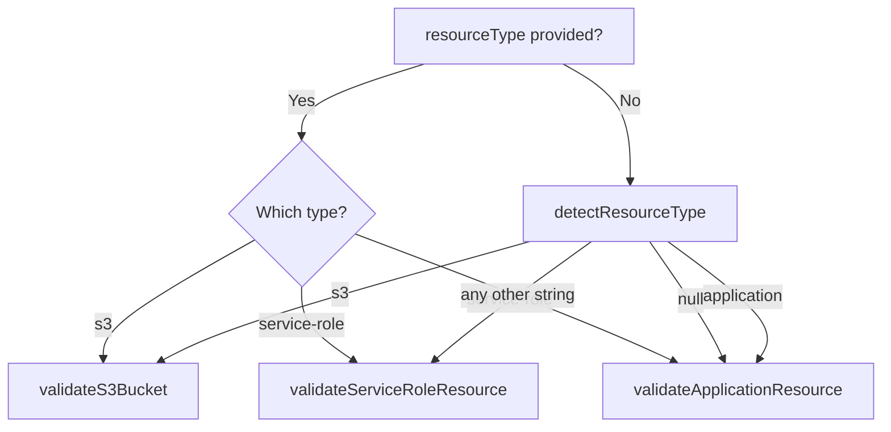

# Design Document: Flexible Resource Type Validation

## Overview

This design removes the restrictive `resourceType` enum from the `validate_naming` MCP tool, adds `service-role` resource type support, and routes any unrecognized resource type to standard application resource validation. Currently, the `resourceType` parameter in both `settings.js` (tool schema) and `schema-validator.js` is constrained to `['application', 's3', 'dynamodb', 'lambda', 'cloudformation']`. This blocks validation of perfectly valid resource names for other AWS services (SQS, Step Functions, API Gateway, etc.) and the `service-role` template category.

The changes are scoped to six source files:
- `naming-rules.js` — add `validateServiceRoleResource()`, update `validateNaming()` routing and `detectResourceType()`
- `schema-validator.js` — remove enum, add disambiguation properties
- `settings.js` — remove enum from tool schema, update description
- `tool-descriptions.js` — update extended description
- `services/validation.js` — pass `resourceType` through without filtering
- `controllers/validation.js` — no structural changes needed (already passes all params)

## Architecture

The validation system's layered architecture remains unchanged:



The key architectural change is in the routing logic within `naming-rules.js`:

**Current approach**: The `validateNaming()` function checks `normalizedType` against a hardcoded list `['dynamodb', 'lambda', 'cloudformation', 'application']` and returns an error for anything else.

**New approach**: Three-way routing:
1. `s3` → `validateS3Bucket()` (unchanged)
2. `service-role` → new `validateServiceRoleResource()` function
3. Everything else → `validateApplicationResource()` with the provided `resourceType` passed through

## Components and Interfaces

### 1. Naming Rules Utility (`naming-rules.js`)

#### New Export: `validateServiceRoleResource(name, options)`

```javascript
/**
 * Validate service-role resource name.
 *
 * Pattern: PREFIX-ProjectId-ResourceSuffix
 * - PREFIX is ALL CAPS (uppercase letters and digits only)
 * - No StageId component
 * - ProjectId is lowercase
 *
 * @param {string} name - Resource name to validate
 * @param {Object} options - Validation options
 * @param {string} [options.prefix] - Known PREFIX value (ALL CAPS)
 * @param {string} [options.projectId] - Known ProjectId value
 * @returns {{valid: boolean, errors: string[], suggestions: string[], components: Object}}
 */
```

Parsing strategy:
1. If `prefix` and `projectId` are provided: strip them from the front, remainder is ResourceSuffix.
2. If only `prefix` is provided: strip prefix, take next segment(s) as projectId (using heuristic or first segment), remainder is ResourceSuffix.
3. If no known values: split by hyphen, first segment is PREFIX (must be ALL CAPS), positional assignment for projectId and ResourceSuffix. Minimum 3 segments required.

Validation rules:
- PREFIX must match `/^[A-Z][A-Z0-9]*$/` (starts with uppercase letter, only uppercase letters and digits)
- No StageId component (always treated as shared)
- ResourceSuffix follows PascalCase advisory (same as application resources)

#### Updated: `validateNaming(name, options)` — Routing Change

```javascript
function validateNaming(name, options = {}) {
  const { resourceType, config = {}, partial = false } = options;
  const normalizedType = resourceType.toLowerCase();

  if (normalizedType === 's3') {
    // ... existing S3 logic
  } else if (normalizedType === 'service-role') {
    const result = validateServiceRoleResource(name, { ...config, partial });
    return { ...result, resourceType: 'service-role' };
  } else {
    // ALL other types route to application resource validation
    const effectiveType = AWS_NAMING_RULES[normalizedType] ? normalizedType : null;
    const result = validateApplicationResource(name, {
      resourceType: effectiveType || 'lambda', // use 'lambda' rules as default if unknown
      ...config,
      isShared: config.isShared,
      partial
    });
    return { ...result, resourceType: normalizedType };
  }
}
```

Key changes:
- Removed the `else` branch that returned `Unknown resource type` error
- `service-role` gets its own branch
- All other types (including `dynamodb`, `lambda`, `cloudformation`, `application`, `sqs`, `stepfunction`, etc.) route to `validateApplicationResource()`
- The provided `resourceType` string is preserved in the result object
- Type-specific length limits from `AWS_NAMING_RULES` are applied when the type is known; skipped for unrecognized types

#### Updated: `detectResourceType(name)` — Service-Role Detection

```javascript
function detectResourceType(name) {
  // 1. S3 Pattern 1: ends with "-an" (existing)
  // 2. S3 Pattern 2: AccountId + Region (existing)
  // 3. NEW: Service-role: first segment is ALL CAPS, 3+ segments
  // 4. Application: 4+ segments with StageId at position 2 (existing)
  // ...
}
```

Service-role detection is inserted after S3 detection but before application detection. A name is detected as `service-role` when:
- The first hyphen-separated segment matches `/^[A-Z][A-Z0-9]*$/` (ALL CAPS)
- The name has 3 or more hyphen-separated segments
- The name is NOT all-lowercase (which would indicate S3)

#### Updated Exports

```javascript
module.exports = {
  validateApplicationResource,
  validateS3Bucket,
  validateServiceRoleResource,  // NEW
  validateNaming,
  detectResourceType,
  isValidStageId,
  checkPascalCase,
  AWS_NAMING_RULES,
  STAGE_ID_PATTERN
};
```

### 2. Schema Validator (`schema-validator.js`)

The `validate_naming` schema is updated:

```javascript
validate_naming: {
  type: 'object',
  properties: {
    resourceName: {
      type: 'string',
      minLength: 1,
      description: 'Resource name to validate'
    },
    resourceType: {
      type: 'string',
      // enum REMOVED — accepts any string
      description: 'Type of AWS resource. "s3" and "service-role" have special handling; all other values use standard application resource validation.'
    },
    isShared: {
      type: 'boolean',
      description: 'When true, validates as a shared resource without a StageId component'
    },
    hasOrgPrefix: {
      type: 'boolean',
      description: 'When true, indicates the S3 bucket name includes an organization prefix segment'
    },
    prefix: {                    // NEW
      type: 'string',
      description: 'Known Prefix value for disambiguation of hyphenated components'
    },
    projectId: {                 // NEW
      type: 'string',
      description: 'Known ProjectId value for disambiguation of hyphenated components'
    },
    stageId: {                   // NEW
      type: 'string',
      description: 'Known StageId value for disambiguation of hyphenated components'
    },
    orgPrefix: {                 // NEW
      type: 'string',
      description: 'Known OrgPrefix value for disambiguation of hyphenated S3 components'
    }
  },
  required: ['resourceName'],
  additionalProperties: false
}
```

### 3. Settings Module (`settings.js`)

The `validate_naming` tool definition in `availableToolsList` is updated:

- `resourceType.enum` is removed
- `resourceType.description` is updated to: `'Type of AWS resource. "s3" and "service-role" have special validation patterns; all other values use standard application resource validation (Prefix-ProjectId-StageId-ResourceSuffix).'`

No other changes to settings.js are needed — the disambiguation parameters (`prefix`, `projectId`, `stageId`, `orgPrefix`) are already defined there.

### 4. Tool Descriptions Module (`tool-descriptions.js`)

The `validate_naming` extended description is updated to mention:
- `service-role` resource type with ALL CAPS Prefix pattern
- Unrecognized resource types are validated using standard application resource pattern
- Disambiguation parameters for accurate parsing

### 5. Validation Service (`services/validation.js`)

The service already passes `resourceType` through to `NamingRules.validateNaming()`. The only change needed is removing any assumption that `resourceType` must be from a known list. The current code already defaults to `'application'` when auto-detection fails, which is correct behavior.

### 6. Validation Controller (`controllers/validation.js`)

No changes needed. The controller already extracts and passes all parameters including `prefix`, `projectId`, `stageId`, and `orgPrefix`.

## Data Models

### Service-Role Parsed Components Object

```javascript
{
  prefix: string,           // e.g., "ACME" (ALL CAPS)
  projectId: string,        // e.g., "myapp" (lowercase)
  resourceSuffix: string    // e.g., "CodePipelineServiceRole"
}
```

### Updated Validation Result Object

```javascript
{
  valid: boolean,
  resourceType: string,     // Now any string: 's3', 'service-role', 'sqs', 'lambda', etc.
  components: Object,       // Parsed components
  errors: string[],
  suggestions: string[],
  pattern?: string          // S3 only: 'pattern1', 'pattern2', or 'pattern3'
}
```

### Service-Role Name Construction

```
PREFIX-projectid-ResourceSuffix
```

Examples:
- `ACME-myapp-CodePipelineServiceRole`
- `ACME-myapp-CloudFormationServiceRole`
- `ACME-person-api-CodeBuildServiceRole` (with hyphenated projectId, requires known values)

### Resource Type Routing Decision Tree




## Correctness Properties

*A property is a characteristic or behavior that should hold true across all valid executions of a system — essentially, a formal statement about what the system should do. Properties serve as the bridge between human-readable specifications and machine-verifiable correctness guarantees.*

### Property 1: Service-role resource name round-trip

*For any* valid service-role resource name constructed from an ALL CAPS Prefix (matching `/^[A-Z][A-Z0-9]*$/`), a lowercase ProjectId, and a ResourceSuffix, when the known `prefix` and `projectId` values are provided, parsing the name with `resourceType: 'service-role'` and reconstructing it from the returned components (`prefix + '-' + projectId + '-' + resourceSuffix`) shall produce the original name.

**Validates: Requirements 2.1, 2.5**

### Property 2: Unknown resource types route to application validation and preserve resourceType

*For any* string `resourceType` that is not `'s3'` and not `'service-role'`, and *for any* valid application resource name (Prefix-ProjectId-StageId-ResourceSuffix), calling `validateNaming` with that resourceType shall: (a) not return an "Unknown resource type" error, (b) return `result.resourceType` equal to the provided resourceType string, and (c) validate the name using the standard application resource pattern.

**Validates: Requirements 3.1, 3.2**

### Property 3: Schema validator accepts any resourceType string and disambiguation parameters

*For any* non-empty string value for `resourceType`, and *for any* combination of the disambiguation parameters (`prefix`, `projectId`, `stageId`, `orgPrefix` as strings), the schema validator shall not return validation errors for these properties when validating a `validate_naming` input that includes a valid `resourceName`.

**Validates: Requirements 1.3, 5.1, 5.2**

### Property 4: Known resource types apply length limits, unknown types skip them

*For any* resource name that exceeds 64 characters and a `resourceType` of `'lambda'`, validation shall return a length error. *For any* resource name of the same length and an unrecognized `resourceType` string (not in `AWS_NAMING_RULES`), validation shall not return a length error.

**Validates: Requirements 3.3**

### Property 5: detectResourceType identifies service-role names

*For any* resource name where the first hyphen-separated segment matches `/^[A-Z][A-Z0-9]*$/` (ALL CAPS), the name has 3 or more hyphen-separated segments, and the name is not all-lowercase, `detectResourceType` shall return `'service-role'`.

**Validates: Requirements 6.1**

## Error Handling

### Service-Role Specific Errors

- Invalid Prefix (not ALL CAPS): `"Service-role Prefix 'acme' must be ALL CAPS (uppercase letters and digits only)"`
- Too few components: `"Service-role resource name must have at least 3 components: PREFIX-ProjectId-ResourceSuffix"`
- Missing ResourceSuffix: `"ResourceSuffix component is required"`

### Removed Error: Unknown Resource Type

The current error `"Unknown resource type: <type>"` is removed. Any unrecognized `resourceType` string now routes to standard application resource validation instead of returning an error.

### Unchanged Error Handling

All existing error handling for S3 buckets, application resources, ambiguous parsing, and invalid inputs remains unchanged. The controller still catches unexpected exceptions and returns `VALIDATION_ERROR` with a sanitized message.

## Testing Strategy

### Test Framework

- **Test runner**: Jest (all new tests in `.test.js` files per project convention)
- **Property-based testing library**: `fast-check` (already used in existing property tests)
- **Minimum iterations**: 100 per property test

### Unit Tests

Unit tests cover specific examples, edge cases, and error conditions:

**Schema changes (example tests)**:
- `settings.js` tool schema: `resourceType` has no `enum` property
- `schema-validator.js`: `resourceType` has no `enum` property
- `schema-validator.js`: `prefix`, `projectId`, `stageId`, `orgPrefix` are accepted without "Unknown property" errors
- `settings.js` tool description mentions `service-role` and flexible types

**Service-role validation**:
- Valid: `ACME-myapp-CodePipelineServiceRole` → valid, components parsed correctly
- Valid with known values: `ACME-person-api-CloudFormationRole` with `prefix='ACME'`, `projectId='person-api'`
- Invalid prefix (lowercase): `acme-myapp-ServiceRole` with `resourceType='service-role'` → error about ALL CAPS
- Invalid prefix (mixed case): `Acme-myapp-ServiceRole` with `resourceType='service-role'` → error about ALL CAPS
- Too few segments: `ACME-myapp` with `resourceType='service-role'` → error about minimum components

**Unknown resource type routing**:
- `resourceType='sqs'` with valid app name → valid, `result.resourceType === 'sqs'`
- `resourceType='stepfunction'` with valid app name → valid, `result.resourceType === 'stepfunction'`
- `resourceType='apigateway'` with valid app name → valid, `result.resourceType === 'apigateway'`
- No "Unknown resource type" error for any of these

**Length limit behavior**:
- `resourceType='lambda'` with name > 64 chars → length error
- `resourceType='dynamodb'` with name > 255 chars → length error
- `resourceType='sqs'` with name > 64 chars → no length error (unknown type, limits skipped)

**detectResourceType**:
- `ACME-myapp-ServiceRole` → `'service-role'`
- `ACME-person-api-CodeBuildRole` → `'service-role'`
- `acme-myapp-prod-GetFunction` → `'application'` (not service-role, lowercase prefix)
- S3 names still detected as `'s3'` (priority over service-role)

### Property-Based Tests

Each property test references its design document property and runs minimum 100 iterations.

**Property 1 test** — Feature: flexible-resource-type-validation, Property 1: Service-role resource name round-trip
- Generator: random ALL CAPS Prefix (`/^[A-Z][A-Z0-9]*$/`, 2-8 chars), random lowercase ProjectId (1-10 chars, `[a-z0-9]`), random PascalCase ResourceSuffix (starts with uppercase, 3-20 chars)
- Construct name as `PREFIX-projectId-ResourceSuffix`
- Parse with `validateNaming(name, { resourceType: 'service-role', config: { prefix: PREFIX, projectId: projectId } })`
- Reconstruct from components: `components.prefix + '-' + components.projectId + '-' + components.resourceSuffix`
- Assert reconstructed === original name

**Property 2 test** — Feature: flexible-resource-type-validation, Property 2: Unknown resource types route to application validation and preserve resourceType
- Generator: random non-empty string for resourceType (filtered to exclude 's3' and 'service-role'), random valid application resource name (prefix-projectId-stageId-ResourceSuffix)
- Call `validateNaming(name, { resourceType, config: { prefix, projectId } })`
- Assert `result.resourceType === resourceType`
- Assert no error contains "Unknown resource type"
- Assert `result.valid === true`

**Property 3 test** — Feature: flexible-resource-type-validation, Property 3: Schema validator accepts any resourceType string and disambiguation parameters
- Generator: random non-empty string for resourceType, random strings for prefix/projectId/stageId/orgPrefix (optional)
- Call `SchemaValidator.validate('validate_naming', { resourceName: 'test-name', resourceType, prefix, projectId, stageId, orgPrefix })`
- Assert `result.valid === true` (no schema validation errors)

**Property 4 test** — Feature: flexible-resource-type-validation, Property 4: Known resource types apply length limits, unknown types skip them
- Generator: random valid application resource name that exceeds 64 characters, random unknown resourceType string (not in AWS_NAMING_RULES keys)
- Call `validateNaming` with `resourceType='lambda'` → assert length error present
- Call `validateNaming` with unknown resourceType → assert no length error

**Property 5 test** — Feature: flexible-resource-type-validation, Property 5: detectResourceType identifies service-role names
- Generator: random ALL CAPS first segment (`/^[A-Z][A-Z0-9]*$/`), 2+ additional lowercase segments
- Construct name, call `detectResourceType(name)`
- Assert result === `'service-role'`

### Test File Locations

- Unit tests: `application-infrastructure/src/lambda/read/tests/unit/utils/naming-rules.test.js` (update existing)
- Property tests: `application-infrastructure/src/lambda/read/tests/unit/utils/naming-validation-property.test.js` (update existing)
- Schema tests: `application-infrastructure/src/lambda/read/tests/unit/utils/schema-validator.test.js` (update existing or create)
