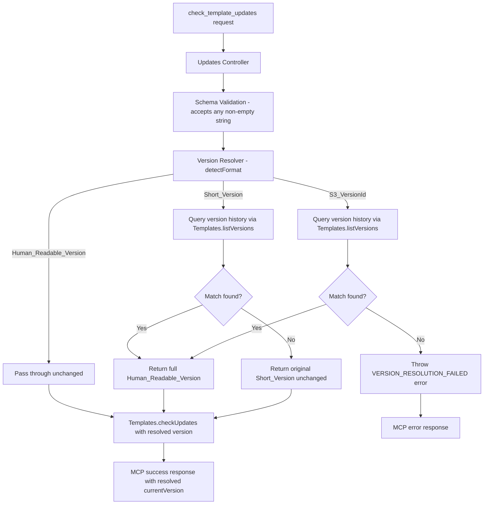

# Design Document: Flexible Version Lookup

## Overview

This document describes the design for the flexible-version-lookup feature, which extends the `check_template_updates` tool to accept three version formats for the `currentVersion` parameter: Human_Readable_Version (`vX.X.X/YYYY-MM-DD`), Short_Version (`vX.X.X`), and S3_VersionId (any other non-empty string). The system automatically detects the format and resolves it to a canonical Human_Readable_Version before performing the update comparison.

## Architecture

### High-Level Flow



### Component Responsibilities

#### 1. Updates Controller (`controllers/updates.js`)

Current behavior:
- Extracts `input` from `props.bodyParameters.input`
- Validates input via `SchemaValidator.validate('check_template_updates', input)`
- Passes `currentVersion` directly to `Services.Templates.checkUpdates()`
- Formats MCP response via `MCPProtocol.successResponse()` / `MCPProtocol.errorResponse()`

New behavior:
- After schema validation, call `VersionResolver.resolve()` with the `currentVersion` and template info (`category`, `templateName`, `s3Buckets`, `namespace`)
- Pass the resolved version to `Services.Templates.checkUpdates()`
- Include the resolved `currentVersion` in the success response
- Catch `VERSION_RESOLUTION_FAILED` errors and return an MCP error response

#### 2. Version Resolver (NEW — `services/version-resolver.js`)

A new service module responsible for:
- Detecting the format of a version string (`detectFormat`)
- Resolving Short_Version and S3_VersionId to Human_Readable_Version via `Services.Templates.listVersions()`
- Returning the resolved version or throwing an error

Key functions:
- `detectFormat(versionString)` — Returns `'HUMAN_READABLE_VERSION'`, `'SHORT_VERSION'`, or `'S3_VERSION_ID'`
- `resolve(versionString, templateInfo)` — Returns resolved Human_Readable_Version string
- `resolveShortVersion(shortVersion, versionHistory)` — Finds matching version in history
- `resolveVersionId(versionId, versionHistory)` — Finds matching versionId in history

This module is placed in `services/` because it orchestrates a call to `Templates.listVersions()` (a service-layer operation) and is consumed by the controller.

#### 3. Schema Validator (`utils/schema-validator.js`)

Current behavior for `check_template_updates.currentVersion`:
- Type: `string`
- Pattern: `^v\d+\.\d+\.\d+(/\d{4}-\d{2}-\d{2})?$`
- Description: `'Current Human_Readable_Version (e.g., v1.2.3 or v1.2.3/2024-01-15)'`

New behavior:
- Remove the `pattern` constraint entirely
- Keep `type: 'string'` and `minLength: 1`
- Update description to document all three accepted formats

The custom `validate()` function in `schema-validator.js` performs its own type checking, pattern matching, required field checks, and `additionalProperties` enforcement. It does not use a JSON Schema library — it's a hand-rolled validator. Removing the `pattern` key from the `currentVersion` property definition is sufficient; the `validate()` function simply won't apply a pattern check for that field.

#### 4. Templates Service (`services/templates.js`)

No changes needed. The `checkUpdates()` method receives a `currentVersion` string and compares it against the latest version using string equality (`currentVersion !== latestVersion`). It already receives the resolved Human_Readable_Version from the controller.

The `listVersions()` method is used by the Version Resolver. It returns:
```javascript
{
  templateName: string,
  category: string,
  namespace: string,
  bucket: string,
  versions: [
    {
      versionId: string,      // S3_VersionId
      version: string | null, // Human_Readable_Version (parsed from template content)
      lastModified: Date,
      size: number,
      isLatest: boolean
    }
  ]
}
```

#### 5. Tool Description (`config/tool-descriptions.js`)

Current `check_template_updates` description ends with:
> Pass the `currentVersion` as a Human_Readable_Version string (e.g., `v1.2.3/2024-01-15`) to compare against the latest available version.

New description will document all three accepted formats with examples.

## Components and Interfaces

### Version Resolver Interface

```javascript
/**
 * Detect the format of a version string.
 *
 * @param {string} versionString - Version string to classify
 * @returns {string} One of 'HUMAN_READABLE_VERSION', 'SHORT_VERSION', or 'S3_VERSION_ID'
 */
function detectFormat(versionString) { }

/**
 * Resolve a version string to canonical Human_Readable_Version.
 *
 * @param {string} versionString - Version string in any supported format
 * @param {Object} templateInfo - Template identification for version history lookup
 * @param {string} templateInfo.category - Template category
 * @param {string} templateInfo.templateName - Template name
 * @param {Array<string>} [templateInfo.s3Buckets] - S3 buckets filter
 * @param {string} [templateInfo.namespace] - Namespace filter
 * @returns {Promise<string>} Resolved Human_Readable_Version
 * @throws {Error} With code 'VERSION_RESOLUTION_FAILED' if S3_VersionId cannot be resolved
 */
async function resolve(versionString, templateInfo) { }
```

### Updated Controller Flow

```javascript
// In controllers/updates.js check() function — after schema validation:

const VersionResolver = require('../services/version-resolver');

// Resolve version before passing to service
let resolvedVersion = currentVersion;
const format = VersionResolver.detectFormat(currentVersion);

if (format !== 'HUMAN_READABLE_VERSION') {
  try {
    resolvedVersion = await VersionResolver.resolve(currentVersion, {
      category, templateName, s3Buckets, namespace
    });
  } catch (resolveError) {
    if (resolveError.code === 'VERSION_RESOLUTION_FAILED') {
      return MCPProtocol.errorResponse('VERSION_RESOLUTION_FAILED', {
        message: resolveError.message,
        versionId: currentVersion,
        templateName,
        category
      }, 'check_template_updates');
    }
    throw resolveError;
  }
}

// Pass resolved version to service
const updateResults = await Services.Templates.checkUpdates({
  templates: [{ category, templateName, currentVersion: resolvedVersion }],
  s3Buckets,
  namespace
});
```

## Data Models

### Version Format Detection Rules

| Pattern | Format | Example |
|---------|--------|---------|
| `^v\d+\.\d+\.\d+/\d{4}-\d{2}-\d{2}$` | HUMAN_READABLE_VERSION | `v1.3.4/2024-01-10` |
| `^v\d+\.\d+\.\d+$` | SHORT_VERSION | `v1.3.4` |
| Any other non-empty string | S3_VERSION_ID | `3sL4kqtJlcpXroDTDmJ.xUZJFfMREQ.m` |

### Version History Entry (from `listVersions`)

```javascript
{
  versionId: '3sL4kqtJlcpXroDTDmJ.xUZJFfMREQ.m',  // S3_VersionId
  version: 'v1.3.4/2024-01-10',                      // Human_Readable_Version (may be null)
  lastModified: '2024-01-10T12:00:00.000Z',
  size: 4096,
  isLatest: false
}
```

### Resolution Logic

**Short_Version resolution**: Find the first entry in `versions` where `entry.version` starts with the Short_Version string (using `startsWith`). This matches `v1.3.4` to `v1.3.4/2024-01-10`. If no match, return the original Short_Version unchanged.

**S3_VersionId resolution**: Find the first entry in `versions` where `entry.versionId === versionId`. If match found, return `entry.version`. If no match, throw error with code `VERSION_RESOLUTION_FAILED`.

### Schema Change

```javascript
// Before (in schema-validator.js schemas.check_template_updates):
currentVersion: {
  type: 'string',
  pattern: '^v\\d+\\.\\d+\\.\\d+(\\/\\d{4}-\\d{2}-\\d{2})?$',
  description: 'Current Human_Readable_Version (e.g., v1.2.3 or v1.2.3/2024-01-15)'
}

// After:
currentVersion: {
  type: 'string',
  minLength: 1,
  description: 'Current version identifier. Accepts Human_Readable_Version (v1.2.3/2024-01-15), Short_Version (v1.2.3), or S3_VersionId'
}
```

## Correctness Properties

*A property is a characteristic or behavior that should hold true across all valid executions of a system — essentially, a formal statement about what the system should do. Properties serve as the bridge between human-readable specifications and machine-verifiable correctness guarantees.*

### Property 1: Format detection is a total partition

*For any* non-empty string, `detectFormat` shall return exactly one of `'HUMAN_READABLE_VERSION'`, `'SHORT_VERSION'`, or `'S3_VERSION_ID'`. Specifically: strings matching `vX.Y.Z/YYYY-MM-DD` return `HUMAN_READABLE_VERSION`, strings matching `vX.Y.Z` (without date) return `SHORT_VERSION`, and all other non-empty strings return `S3_VERSION_ID`.

**Validates: Requirements 1.1, 1.2, 1.3, 1.4**

### Property 2: Short_Version resolution round-trip

*For any* version history containing an entry with `version` starting with a given Short_Version prefix, `resolveShortVersion` shall return the full `Human_Readable_Version` from that entry. *For any* version history that does not contain a matching entry, `resolveShortVersion` shall return the original Short_Version string unchanged.

**Validates: Requirements 2.1, 2.2, 2.3**

### Property 3: S3_VersionId resolution

*For any* version history containing an entry whose `versionId` matches a given S3_VersionId, `resolveVersionId` shall return the associated `Human_Readable_Version`. *For any* version history that does not contain a matching `versionId`, `resolveVersionId` shall throw an error with code `VERSION_RESOLUTION_FAILED`.

**Validates: Requirements 3.1, 3.2, 3.3**

### Property 4: Schema accepts any non-empty string for currentVersion

*For any* non-empty string value, `SchemaValidator.validate('check_template_updates', { templateName: anyValidName, currentVersion: value })` shall not produce a pattern-related validation error for `currentVersion`. *For any* empty string, validation shall reject it.

**Validates: Requirements 4.1, 4.2, 4.3**

### Property 5: Controller resolution integration

*For any* `currentVersion` input in Human_Readable_Version format, the value passed to `Templates.checkUpdates` shall be identical to the input. *For any* `currentVersion` in Short_Version or S3_VersionId format that resolves successfully, the value passed to `Templates.checkUpdates` shall be the resolved Human_Readable_Version. *For any* S3_VersionId that fails resolution, the controller shall return an MCP error response with code `VERSION_RESOLUTION_FAILED`.

**Validates: Requirements 6.1, 6.2, 6.3, 6.4**

## Error Handling

### VERSION_RESOLUTION_FAILED

Returned when an S3_VersionId cannot be found in the template's version history.

```javascript
MCPProtocol.errorResponse('VERSION_RESOLUTION_FAILED', {
  message: 'Could not resolve version identifier to a known version',
  versionId: 'abc123def456',
  templateName: 'template-storage-s3-artifacts',
  category: 'storage'
}, 'check_template_updates');
```

Response structure (follows existing MCP protocol format):
```json
{
  "protocol": "mcp",
  "version": "1.0",
  "tool": "check_template_updates",
  "success": false,
  "error": {
    "code": "VERSION_RESOLUTION_FAILED",
    "details": {
      "message": "Could not resolve version identifier to a known version",
      "versionId": "abc123def456",
      "templateName": "template-storage-s3-artifacts",
      "category": "storage"
    }
  },
  "timestamp": "2024-01-15T10:30:00.000Z"
}
```

### Graceful Degradation for Short_Version

When a Short_Version cannot be resolved (no matching entry in version history), the original Short_Version is passed through to `checkUpdates()`. The downstream comparison (`currentVersion !== latestVersion`) will still correctly detect that an update is available since the unresolved Short_Version won't equal the full Human_Readable_Version of the latest version.

### Existing Error Codes (unchanged)

- `INVALID_INPUT` — Schema validation failure (empty string, missing required fields)
- `UPDATE_CHECK_FAILED` — Service-level error from `Templates.checkUpdates()`
- `INTERNAL_ERROR` — Unexpected exceptions

## Testing Strategy

### Testing Framework

All tests use Jest (per workspace steering rules). Property-based tests use `fast-check` (already a devDependency in `package.json`).

### Unit Tests

Location: `application-infrastructure/src/lambda/read/tests/unit/`

1. **Version Resolver — Format Detection** (`services/version-resolver.test.js`)
   - Human_Readable_Version patterns recognized correctly
   - Short_Version patterns recognized correctly
   - S3_VersionId fallback for non-matching strings
   - Edge cases: empty-ish strings, strings with extra slashes

2. **Version Resolver — Resolution** (`services/version-resolver.test.js`)
   - Short_Version resolves when match exists in version history
   - Short_Version returns original when no match exists
   - S3_VersionId resolves when match exists
   - S3_VersionId throws VERSION_RESOLUTION_FAILED when no match
   - Human_Readable_Version passes through without querying history

3. **Schema Validator** (`utils/schema-validator.test.js` — extend existing)
   - currentVersion accepts Human_Readable_Version strings
   - currentVersion accepts Short_Version strings
   - currentVersion accepts S3_VersionId strings
   - currentVersion rejects empty strings
   - No pattern constraint on currentVersion

4. **Updates Controller** (`controllers/updates-controller.test.js` — extend existing)
   - Human_Readable_Version passed through to service unchanged
   - Short_Version resolved before passing to service
   - S3_VersionId resolved before passing to service
   - VERSION_RESOLUTION_FAILED error returned for unresolvable S3_VersionId
   - Response includes resolved currentVersion

### Property-Based Tests

Location: `application-infrastructure/src/lambda/read/tests/unit/` or `tests/property/`

Each property test runs minimum 100 iterations and references its design property.

1. **Format Detection Partition** (`services/version-resolver-format.property.test.js`)
   - Tag: `Feature: flexible-version-lookup, Property 1: Format detection is a total partition`
   - Generate random strings; verify exactly one format returned
   - Generate valid Human_Readable_Version strings; verify HUMAN_READABLE_VERSION
   - Generate valid Short_Version strings; verify SHORT_VERSION
   - Generate non-matching strings; verify S3_VERSION_ID

2. **Short_Version Resolution Round-Trip** (`services/version-resolver-short.property.test.js`)
   - Tag: `Feature: flexible-version-lookup, Property 2: Short_Version resolution round-trip`
   - Generate random version histories with known Short_Version entries; verify resolution returns full version
   - Generate version histories without matching entries; verify original returned

3. **S3_VersionId Resolution** (`services/version-resolver-s3id.property.test.js`)
   - Tag: `Feature: flexible-version-lookup, Property 3: S3_VersionId resolution`
   - Generate random version histories with known versionId entries; verify resolution returns Human_Readable_Version
   - Generate version histories without matching entries; verify error thrown

4. **Schema Accepts Any Non-Empty String** (`utils/schema-validator-flexible-version.property.test.js`)
   - Tag: `Feature: flexible-version-lookup, Property 4: Schema accepts any non-empty string for currentVersion`
   - Generate random non-empty strings; verify no pattern error for currentVersion
   - Generate empty strings; verify rejection

5. **Controller Resolution Integration** (`controllers/updates-resolution.property.test.js`)
   - Tag: `Feature: flexible-version-lookup, Property 5: Controller resolution integration`
   - Generate random version formats; verify correct resolution behavior via mocked service calls

### File Changes Summary

**New Files:**
- `application-infrastructure/src/lambda/read/services/version-resolver.js`

**Modified Files:**
- `application-infrastructure/src/lambda/read/services/index.js` — Export VersionResolver
- `application-infrastructure/src/lambda/read/controllers/updates.js` — Add resolution step
- `application-infrastructure/src/lambda/read/config/validations.js` — No changes needed (validation is in schema-validator.js)
- `application-infrastructure/src/lambda/read/utils/schema-validator.js` — Remove pattern from currentVersion
- `application-infrastructure/src/lambda/read/config/tool-descriptions.js` — Update check_template_updates description

**Unchanged Files:**
- `services/templates.js` — Receives already-resolved version
- `models/s3-templates.js` — No changes
- `utils/mcp-protocol.js` — No changes
- `utils/error-handler.js` — No changes (VERSION_RESOLUTION_FAILED uses existing MCPProtocol.errorResponse)

### Backward Compatibility

- Existing clients passing Human_Readable_Version continue to work unchanged (pass-through path)
- Schema validation becomes more permissive (any non-empty string accepted)
- Response format unchanged; `currentVersion` field now contains the resolved canonical version
- No breaking changes to the MCP protocol or response structure
