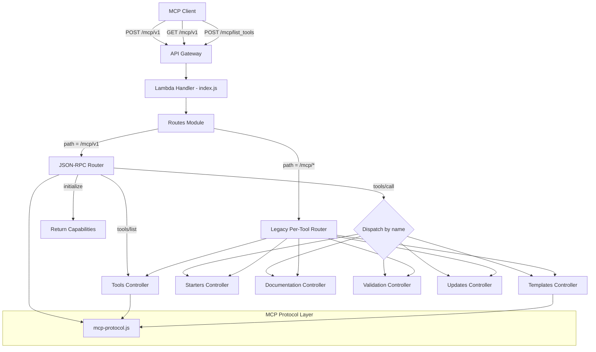

# Design Document: Get Integration Working

## Overview

The Atlantis MCP Server (v0.0.1) currently fails to connect with MCP clients because it uses a custom response format (`protocol`, `version`, `tool`, `success`, `data`, `timestamp`) instead of JSON-RPC 2.0, returns `text/html` Content-Type, and exposes per-tool endpoints instead of a single unified endpoint. This design addresses converting the server to full MCP protocol compliance using JSON-RPC 2.0 over Streamable HTTP transport at a single `/mcp/v1` endpoint, while maintaining backward compatibility with existing per-tool endpoints.

The production URL is `https://mcp.atlantis.63klabs.net/mcp/v1`.

### Key Design Decisions

1. The existing `mcp-protocol.js` utility will be refactored to produce JSON-RPC 2.0 responses instead of the custom format. This is a breaking change for the utility's API surface but is required for MCP compliance.
2. A new JSON-RPC router module will be added to handle method dispatch at the `/mcp/v1` endpoint, sitting alongside the existing per-tool routing in `routes/index.js`.
3. The router will detect JSON-RPC 2.0 vs legacy requests by checking for the `jsonrpc` field in the request body, enabling backward compatibility.
4. The `initialize` method will be handled directly by the router (returning server capabilities) without needing a dedicated controller.

## Architecture



### Request Flow for `/mcp/v1` (JSON-RPC 2.0)

1. API Gateway receives POST to `/mcp/v1`, routes to Lambda
2. Lambda handler delegates to `Routes.process()`
3. Routes detects path `/mcp/v1` and delegates to `JsonRpcRouter`
4. `JsonRpcRouter` validates JSON-RPC 2.0 envelope (`jsonrpc`, `method`, `id`)
5. Router dispatches based on `method`:
   - `initialize` → returns server info, capabilities, protocol version
   - `tools/list` → returns tool definitions
   - `tools/call` → extracts `params.name` and `params.arguments`, dispatches to controller
6. Controller returns data; `mcp-protocol.js` wraps it in JSON-RPC 2.0 response format
7. Response returned with `Content-Type: application/json`

### Request Flow for Legacy Endpoints

1. API Gateway receives POST to `/mcp/{tool_name}`, routes to Lambda
2. Routes detects per-tool path, checks for `jsonrpc` field in body
3. If no `jsonrpc` field: processes using existing `tool`/`input` format (backward compatible)
4. If `jsonrpc` field present: redirects to JSON-RPC router

## Components and Interfaces

### 1. JSON-RPC Router (`utils/json-rpc-router.js`) — NEW

Responsible for parsing JSON-RPC 2.0 requests and dispatching to controllers.

```javascript
/**
 * @param {Object} event - API Gateway event
 * @param {Object} context - Lambda context
 * @returns {Promise<Response>} JSON-RPC 2.0 formatted response
 */
async function handleJsonRpc(event, context)
```

Internal responsibilities:
- Parse and validate JSON body (return `-32700` Parse error on failure)
- Validate required fields `jsonrpc`, `method` (return `-32600` Invalid Request if missing)
- Extract `id` from request (use `null` if missing/invalid type)
- Dispatch `initialize`, `tools/list`, `tools/call`, or return `-32601` Method not found
- For `tools/call`: extract `params.name` and `params.arguments`, dispatch to existing controllers
- Wrap all responses using `mcp-protocol.js` JSON-RPC 2.0 formatters

### 2. MCP Protocol Layer (`utils/mcp-protocol.js`) — MODIFIED

Refactored to produce JSON-RPC 2.0 responses.

New/modified exports:

```javascript
// JSON-RPC 2.0 success response
function jsonRpcSuccess(id, result) → { jsonrpc: "2.0", id, result }

// JSON-RPC 2.0 error response  
function jsonRpcError(id, code, message, data?) → { jsonrpc: "2.0", id, error: { code, message, data? } }

// Standard error codes
const JSON_RPC_ERRORS = {
  PARSE_ERROR: -32700,
  INVALID_REQUEST: -32600,
  METHOD_NOT_FOUND: -32601,
  INVALID_PARAMS: -32602,
  INTERNAL_ERROR: -32603
}

// Initialize response
function initializeResponse(id) → JSON-RPC 2.0 response with serverInfo, capabilities, protocolVersion

// Tools list response
function toolsListResponse(id, tools) → JSON-RPC 2.0 response with tools array in result

// Existing successResponse/errorResponse kept for backward compatibility with legacy endpoints
```

### 3. Routes Module (`routes/index.js`) — MODIFIED

Updated to detect `/mcp/v1` path and delegate to JSON-RPC router:

```javascript
// In process():
if (path ends with '/mcp/v1') {
  return JsonRpcRouter.handleJsonRpc(event, context);
}
// else: existing per-tool routing logic (unchanged)
```

For GET requests to `/mcp/v1`: return a `tools/list` response (200 OK with tool definitions).

### 4. Lambda Handler (`index.js`) — MINIMAL CHANGES

Ensure `Content-Type: application/json` header is set on all responses. The handler already adds headers in the `apiGatewayResponse.headers` merge — verify `Content-Type` is not being overridden to `text/html` by the `Response` framework.

### 5. SAM Template (`template.yml`) — MODIFIED

Add two new API Gateway events to `ReadLambdaFunction`:

```yaml
McpV1Post:
  Type: Api
  Properties:
    Path: /mcp/v1
    Method: post
    RestApiId: !Ref WebApi

McpV1Get:
  Type: Api
  Properties:
    Path: /mcp/v1
    Method: get
    RestApiId: !Ref WebApi
```

Existing per-tool events remain unchanged for backward compatibility.

### 6. OpenAPI Spec (`template-openapi-spec.yml`) — MODIFIED

Add `/mcp/v1` path with POST and GET methods using the existing `MCPRequest`/`MCPResponse`/`MCPError` schemas (which are already JSON-RPC 2.0 compliant in the spec). Existing per-tool paths remain.

### 7. Integration Documentation (`docs/integration/`) — MODIFIED

Update all five client guides (Kiro, Claude Desktop, Cursor, Amazon Q, ChatGPT) to use:
- Production URL: `https://mcp.atlantis.63klabs.net/mcp/v1`
- Correct Streamable HTTP transport configuration (using `url` key, not `command`/`args` for remote servers)
- Self-hosted pattern: `https://{api-gateway-url}/{api_base}/mcp/v1`

## Data Models

### JSON-RPC 2.0 Request

```json
{
  "jsonrpc": "2.0",
  "method": "tools/call",
  "id": "req-1",
  "params": {
    "name": "list_templates",
    "arguments": {
      "category": "storage"
    }
  }
}
```

### JSON-RPC 2.0 Success Response

```json
{
  "jsonrpc": "2.0",
  "id": "req-1",
  "result": {
    "content": [
      {
        "type": "text",
        "text": "{\"templates\": [...]}"
      }
    ]
  }
}
```

### JSON-RPC 2.0 Error Response

```json
{
  "jsonrpc": "2.0",
  "id": "req-1",
  "error": {
    "code": -32601,
    "message": "Method not found",
    "data": {
      "method": "unknown/method"
    }
  }
}
```

### Initialize Response

```json
{
  "jsonrpc": "2.0",
  "id": "req-0",
  "result": {
    "protocolVersion": "2024-11-05",
    "capabilities": {
      "tools": { "listChanged": false }
    },
    "serverInfo": {
      "name": "atlantis-mcp-server",
      "version": "0.0.1"
    }
  }
}
```

### Legacy Request Format (Backward Compatible)

```json
{
  "tool": "list_templates",
  "input": {
    "category": "storage"
  }
}
```

### Legacy Response Format (Backward Compatible)

```json
{
  "protocol": "mcp",
  "version": "1.0",
  "tool": "list_templates",
  "success": true,
  "data": { "templates": [...] },
  "timestamp": "2026-03-22T12:00:00.000Z"
}
```


## Correctness Properties

*A property is a characteristic or behavior that should hold true across all valid executions of a system — essentially, a formal statement about what the system should do. Properties serve as the bridge between human-readable specifications and machine-verifiable correctness guarantees.*

### Property 1: JSON-RPC 2.0 Response Envelope

*For any* JSON-RPC 2.0 request sent to the `/mcp/v1` endpoint (valid or invalid), the response SHALL always contain `jsonrpc: "2.0"` and an `id` field. If the request was valid, `id` matches the request `id` and a `result` object is present. If the request caused an error, `id` matches the request `id` (or is `null` if the request `id` was missing or not a string/number) and an `error` object is present with an integer `code` and a string `message`.

**Validates: Requirements 1.1, 1.2, 1.4**

### Property 2: No Legacy Keys in JSON-RPC Responses

*For any* response produced by the MCP Protocol Layer's JSON-RPC 2.0 formatters (`jsonRpcSuccess` or `jsonRpcError`), the top-level object SHALL NOT contain any of the keys: `protocol`, `version`, `tool`, `success`, `data`, or `timestamp`.

**Validates: Requirements 1.3**

### Property 3: Correct Method Dispatch

*For any* valid JSON-RPC 2.0 request to `/mcp/v1` where the `method` is `tools/call` and `params.name` is a known tool name, the JSON-RPC Router SHALL dispatch to the controller corresponding to that tool name, and the response `result` SHALL contain the output from that controller.

**Validates: Requirements 2.1, 2.4, 3.2, 8.2**

### Property 4: Standard Error Codes for Invalid Requests

*For any* request to `/mcp/v1`:
- If the body is not valid JSON, the response error code SHALL be `-32700` (Parse error)
- If the body is valid JSON but missing `jsonrpc` or `method`, the response error code SHALL be `-32600` (Invalid Request)
- If the `method` is not a recognized method, the response error code SHALL be `-32601` (Method not found)

**Validates: Requirements 2.5, 2.6, 2.7**

### Property 5: Content-Type Header on All Responses

*For any* request to the `/mcp/v1` endpoint (success or error), the response SHALL include the header `Content-Type: application/json`. The response SHALL never return `Content-Type: text/html`.

**Validates: Requirements 4.1, 4.2**

### Property 6: Legacy Format Backward Compatibility

*For any* POST request to a per-tool endpoint (e.g., `/mcp/list_tools`) whose body does NOT contain a `jsonrpc` field, the router SHALL process the request using the legacy format (extracting `tool` and `input` from the body) and return a response in the legacy format.

**Validates: Requirements 8.1, 8.3**

### Property 7: JSON-RPC 2.0 Round-Trip

*For any* valid JSON-RPC 2.0 `tools/list` request, serializing the request as JSON, sending it to the `/mcp/v1` endpoint, and parsing the response body as JSON SHALL produce a valid JSON-RPC 2.0 response object containing `jsonrpc: "2.0"`, a matching `id`, and a `result` object with a `tools` array where each element has `name`, `description`, and `inputSchema` fields.

**Validates: Requirements 9.4**

## Error Handling

### JSON-RPC 2.0 Standard Error Codes

The server uses standard JSON-RPC 2.0 error codes:

| Code | Name | Trigger |
|------|------|---------|
| `-32700` | Parse error | Request body is not valid JSON |
| `-32600` | Invalid Request | Missing `jsonrpc: "2.0"` or `method` field |
| `-32601` | Method not found | Unrecognized `method` value |
| `-32602` | Invalid params | Missing required params for `tools/call` (e.g., no `name`) |
| `-32603` | Internal error | Unhandled server error during processing |

### Error Response Format

All errors from `/mcp/v1` are returned as JSON-RPC 2.0 error responses with `Content-Type: application/json`:

```json
{
  "jsonrpc": "2.0",
  "id": null,
  "error": {
    "code": -32700,
    "message": "Parse error",
    "data": { "details": "Unexpected token at position 5" }
  }
}
```

### Error Handling Strategy

1. The JSON-RPC Router wraps all processing in try/catch. Unhandled exceptions produce `-32603` Internal error.
2. The `id` field is extracted early. If extraction fails (invalid type), `null` is used for the response `id`.
3. Error `data` field may include additional context (tool name, available methods) but never exposes stack traces or internal paths.
4. Legacy endpoints continue to use the existing `ErrorHandler` module and return errors in the legacy format.
5. Rate limit errors (429) are handled by the Lambda handler before reaching the router and include `Retry-After` header.

### Content-Type Guarantee

The `Response` object from `@63klabs/cache-data` defaults to `application/json` for JSON bodies. The JSON-RPC Router explicitly sets `Content-Type: application/json` on all responses to prevent the framework from defaulting to `text/html` (which was the root cause of the Kiro connection failure observed in logs).

## Testing Strategy

### Dual Testing Approach

This feature requires both unit tests and property-based tests:

- **Unit tests**: Verify specific examples (initialize response structure, specific error codes, GET /mcp/v1 behavior) and edge cases (empty body, null id, malformed JSON)
- **Property-based tests**: Verify universal properties across randomly generated inputs (response envelope structure, no legacy keys, correct error codes, Content-Type headers)

Both are complementary and necessary — unit tests catch concrete bugs for specific scenarios, property tests verify general correctness across the input space.

### Property-Based Testing Configuration

- **Library**: `fast-check` (already in devDependencies)
- **Framework**: Jest (all new tests in `.test.js` files per project convention)
- **Minimum iterations**: 100 per property test
- **Tag format**: Each property test includes a comment referencing the design property:
  ```javascript
  // Feature: get-integration-working, Property 1: JSON-RPC 2.0 Response Envelope
  ```

### Test File Organization

```
tests/
├── unit/
│   ├── utils/
│   │   ├── json-rpc-router.test.js          — Unit tests for JSON-RPC router
│   │   └── mcp-protocol-jsonrpc.test.js     — Unit tests for JSON-RPC formatters
│   └── routes/
│       └── routes-mcp-v1.test.js            — Unit tests for /mcp/v1 routing
├── integration/
│   └── mcp-protocol-compliance.test.js      — Updated integration tests (un-skip)
└── property/
    ├── json-rpc-envelope.property.test.js   — Property 1: Response envelope
    ├── no-legacy-keys.property.test.js      — Property 2: No legacy keys
    ├── method-dispatch.property.test.js     — Property 3: Correct dispatch
    ├── error-codes.property.test.js         — Property 4: Standard error codes
    ├── content-type.property.test.js        — Property 5: Content-Type header
    ├── legacy-compat.property.test.js       — Property 6: Backward compatibility
    └── jsonrpc-roundtrip.property.test.js   — Property 7: Round-trip
```

### Property Test Implementation Notes

Each correctness property maps to exactly one property-based test:

- **Property 1** (JSON-RPC Envelope): Generate random `id` values (strings, numbers, null, objects, arrays, booleans), random valid/invalid methods. Assert response always has `jsonrpc:"2.0"`, correct `id` handling, and either `result` or `error`.
- **Property 2** (No Legacy Keys): Generate random inputs to `jsonRpcSuccess` and `jsonRpcError`. Assert output never contains `protocol`, `version`, `tool`, `success`, `data`, `timestamp` at top level.
- **Property 3** (Method Dispatch): Generate random tool names from the known set, random arguments. Mock controllers, verify correct controller called.
- **Property 4** (Error Codes): Generate three categories: non-JSON strings (→ -32700), valid JSON missing fields (→ -32600), valid JSON-RPC with unknown methods (→ -32601).
- **Property 5** (Content-Type): Generate random valid and invalid requests. Assert `Content-Type: application/json` header on all responses.
- **Property 6** (Legacy Compat): Generate random legacy-format requests (with `tool` and `input`, without `jsonrpc`). Assert they are processed using legacy routing.
- **Property 7** (Round-Trip): Generate random valid `id` values, construct `tools/list` requests, send through handler, parse response, verify valid JSON-RPC 2.0 with tools array.

### Unit Test Coverage

Unit tests focus on specific examples and edge cases not covered by property tests:

- `initialize` method returns correct `serverInfo`, `capabilities`, `protocolVersion`
- `tools/list` returns all 10 defined tools
- GET `/mcp/v1` returns 200 with tool list
- Empty request body returns Parse error
- Request with `jsonrpc: "1.0"` returns Invalid Request
- `tools/call` with missing `params.name` returns Invalid params (-32602)
- Verify CORS headers present on responses
- Verify `X-MCP-Version` header present
