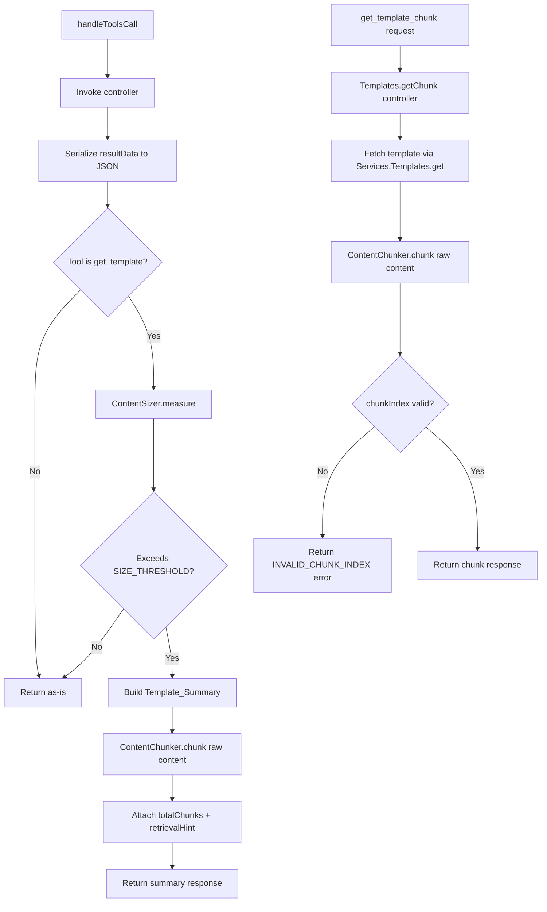

# Design Document: MCP Large Content Response

## Overview

Large CloudFormation templates returned by the `get_template` tool can exceed the context window or token limits of consuming AI agents. This design introduces a content-aware response strategy that:

1. Measures serialized response payload size before returning it
2. Returns a structured summary with resource metadata when the payload exceeds a configurable threshold
3. Provides a new `get_template_chunk` tool for incremental retrieval of the full content in manageable segments

The approach is minimally invasive: it intercepts the response in `handleToolsCall()` after serialization, applies chunking logic only to `get_template` responses, and leaves all other tool responses untouched.

## Architecture

The feature adds two new utility modules and modifies the existing response flow in the JSON-RPC router.



The chunking logic lives entirely in the router and the new controller function. No changes are needed to the service or model layers since `get_template_chunk` reuses the existing `Services.Templates.get()` to fetch the full template, then extracts the requested chunk.

## Components and Interfaces

### 1. `utils/content-sizer.js` (New)

Measures the byte length of a serialized JSON string and compares it against the configured threshold.

```javascript
/**
 * @module utils/content-sizer
 */

const DEFAULT_SIZE_THRESHOLD = 50000;

/**
 * Measure the byte length of a JSON-serialized string and check against threshold.
 *
 * @param {string} serializedJson - The JSON string to measure
 * @param {number} [threshold] - Byte threshold (defaults to env or 50000)
 * @returns {{ byteLength: number, exceedsThreshold: boolean }}
 */
function measure(serializedJson, threshold) {
  const limit = threshold
    ?? parseInt(process.env.MCP_CONTENT_SIZE_THRESHOLD, 10)
    || DEFAULT_SIZE_THRESHOLD;
  const byteLength = Buffer.byteLength(serializedJson, 'utf8');
  return {
    byteLength,
    exceedsThreshold: byteLength > limit
  };
}

module.exports = { measure, DEFAULT_SIZE_THRESHOLD };
```

### 2. `utils/content-chunker.js` (New)

Splits a raw content string into sequential segments at line boundaries, falling back to byte-boundary splits when a single line exceeds the max chunk size.

```javascript
/**
 * @module utils/content-chunker
 */

const DEFAULT_CHUNK_SIZE = 40000;

/**
 * Split content into chunks, preferring line boundaries.
 *
 * @param {string} content - Raw template content string
 * @param {number} [maxChunkSize] - Max bytes per chunk (defaults to env or 40000)
 * @returns {string[]} Array of content chunks in order
 */
function chunk(content, maxChunkSize) {
  const limit = maxChunkSize
    ?? parseInt(process.env.MCP_CHUNK_SIZE, 10)
    || DEFAULT_CHUNK_SIZE;

  if (Buffer.byteLength(content, 'utf8') <= limit) {
    return [content];
  }

  const chunks = [];
  const lines = content.split('\n');
  let currentChunk = '';

  for (let i = 0; i < lines.length; i++) {
    const line = lines[i];
    const separator = (currentChunk.length > 0) ? '\n' : '';
    const candidate = currentChunk + separator + line;

    if (Buffer.byteLength(candidate, 'utf8') <= limit) {
      currentChunk = candidate;
    } else {
      // Flush current chunk if non-empty
      if (currentChunk.length > 0) {
        chunks.push(currentChunk);
        currentChunk = '';
      }

      // If a single line exceeds the limit, split at byte boundary
      if (Buffer.byteLength(line, 'utf8') > limit) {
        let remaining = line;
        while (Buffer.byteLength(remaining, 'utf8') > limit) {
          // Find the max substring that fits within limit
          let end = remaining.length;
          while (Buffer.byteLength(remaining.substring(0, end), 'utf8') > limit) {
            end--;
          }
          chunks.push(remaining.substring(0, end));
          remaining = remaining.substring(end);
        }
        currentChunk = remaining;
      } else {
        currentChunk = line;
      }
    }
  }

  if (currentChunk.length > 0) {
    chunks.push(currentChunk);
  }

  return chunks;
}

module.exports = { chunk, DEFAULT_CHUNK_SIZE };
```

### 3. Modifications to `utils/json-rpc-router.js`

In `handleToolsCall()`, after the successful result is built, add a size check for `get_template` responses:

```javascript
// After building resultData and before returning:
if (toolName === 'get_template') {
  const serialized = JSON.stringify(resultData);
  const sizeResult = ContentSizer.measure(serialized);

  if (sizeResult.exceedsThreshold) {
    const summary = buildTemplateSummary(resultData);
    const result = {
      content: [{ type: 'text', text: JSON.stringify(summary) }]
    };
    return buildResponse(200, MCPProtocol.jsonRpcSuccess(id, result));
  }
}
```

The `buildTemplateSummary()` helper extracts metadata from the template data object and uses `ContentChunker.chunk()` to calculate `totalChunks`.

### 4. `controllers/templates.js` — New `getChunk()` function

```javascript
/**
 * Retrieve a specific chunk of a large template's content.
 *
 * @param {Object} props - Request properties
 * @returns {Promise<Object>} MCP-formatted chunk response or error
 */
async function getChunk(props) {
  // Validate input via SchemaValidator
  // Fetch full template via Services.Templates.get()
  // Chunk the content via ContentChunker.chunk()
  // Validate chunkIndex range
  // Return chunk data: { chunkIndex, totalChunks, templateName, category, content }
}
```

### 5. Registration Points

| Location | Change |
|---|---|
| `config/settings.js` `availableToolsList` | Add `get_template_chunk` tool definition with inputSchema |
| `config/tool-descriptions.js` `extendedDescriptions` | Add extended description for `get_template_chunk`; update `get_template` description |
| `utils/json-rpc-router.js` `TOOL_DISPATCH` | Add `get_template_chunk: Controllers.Templates.getChunk` |
| `utils/schema-validator.js` `schemas` | Add `get_template_chunk` schema with required `templateName`, `category`, `chunkIndex` and optional `version`, `versionId`, `s3Buckets`, `namespace` |


## Data Models

### Template_Summary

Returned when a `get_template` response exceeds the SIZE_THRESHOLD:

```javascript
{
  name: string,              // Template name
  version: string|null,      // Human_Readable_Version
  versionId: string|null,    // S3 VersionId
  description: string,       // Template description
  category: string,          // Template category
  namespace: string,         // S3 namespace
  bucket: string,            // S3 bucket name
  s3Path: string,            // Full S3 path
  parameters: {              // Template parameters (type, default, description per key)
    [paramName]: { Type, Default, Description, ... }
  },
  outputs: {                 // Template outputs (description, export name per key)
    [outputName]: { Description, Export, Value, ... }
  },
  resources: [               // Top-level resource summary
    { logicalId: string, type: string }
  ],
  contentTruncated: true,    // Always true in summary
  totalChunks: number,       // Number of chunks the full content was split into
  retrievalHint: string      // Human-readable instruction for using get_template_chunk
}
```

### Chunk Response

Returned by `get_template_chunk`:

```javascript
{
  chunkIndex: number,        // Zero-based index of this chunk
  totalChunks: number,       // Total number of chunks
  templateName: string,      // Template name
  category: string,          // Template category
  content: string            // The chunk content as a text string
}
```

### Chunk Error Response

Returned when `chunkIndex` is out of range:

```javascript
{
  code: 'INVALID_CHUNK_INDEX',
  details: {
    message: string,         // e.g., "chunkIndex 5 is out of range. Valid range: 0-3"
    validRange: { min: 0, max: number }
  }
}
```

### Configuration Constants

| Constant | Default | Environment Variable | Description |
|---|---|---|---|
| SIZE_THRESHOLD | 50000 bytes | `MCP_CONTENT_SIZE_THRESHOLD` | Byte limit above which get_template returns a summary |
| CHUNK_SIZE | 40000 bytes | `MCP_CHUNK_SIZE` | Maximum bytes per chunk |

The CHUNK_SIZE is intentionally smaller than SIZE_THRESHOLD to ensure that individual chunks fit comfortably within the threshold that triggered chunking.


## Correctness Properties

*A property is a characteristic or behavior that should hold true across all valid executions of a system — essentially, a formal statement about what the system should do. Properties serve as the bridge between human-readable specifications and machine-verifiable correctness guarantees.*

### Property 1: Content sizer measures byte length and threshold correctly

*For any* UTF-8 string and any positive integer threshold, `ContentSizer.measure(string, threshold)` shall return a `byteLength` equal to `Buffer.byteLength(string, 'utf8')` and an `exceedsThreshold` boolean that is `true` if and only if `byteLength > threshold`.

**Validates: Requirements 1.1, 1.2, 1.3**

### Property 2: Chunking round-trip preserves content

*For any* non-empty string and any positive chunk size ≥ 1, concatenating all chunks returned by `ContentChunker.chunk(string, chunkSize)` (joined with `'\n'` between chunks that were split at line boundaries, or directly concatenated for byte-boundary splits) shall produce a string identical to the original input. More precisely: `chunks.join('\n')` equals the original when all splits are at line boundaries, and the implementation must guarantee that joining all chunks in order reconstructs the original content exactly.

**Validates: Requirements 4.5, 3.4**

### Property 3: Every chunk respects the size bound

*For any* non-empty string and any positive chunk size, every chunk returned by `ContentChunker.chunk(string, chunkSize)` shall have a byte length (measured by `Buffer.byteLength(chunk, 'utf8')`) less than or equal to the specified chunk size.

**Validates: Requirements 4.1**

### Property 4: Line-boundary splitting when lines fit

*For any* content string where every individual line has a byte length ≤ the max chunk size, every chunk produced by `ContentChunker.chunk()` shall consist of zero or more complete lines — i.e., no line shall be split across two chunks.

**Validates: Requirements 4.3**

### Property 5: Template summary contains all required fields

*For any* template data object (with name, version, description, category, namespace, bucket, s3Path, parameters, outputs, and a content string that exceeds the SIZE_THRESHOLD), the generated Template_Summary shall contain: `name`, `version`, `versionId`, `description`, `category`, `namespace`, `bucket`, `s3Path`, `parameters`, `outputs`, `resources` (array of `{ logicalId, type }`), `contentTruncated` (set to `true`), `totalChunks` (matching the actual chunk count from ContentChunker), and `retrievalHint` (a non-empty string containing `get_template_chunk`).

**Validates: Requirements 2.2, 2.3, 2.4, 2.5, 2.6, 2.7**

### Property 6: Invalid chunk index returns error

*For any* template content that produces N chunks, and *for any* integer `chunkIndex` where `chunkIndex < 0` or `chunkIndex >= N`, the `getChunk` controller shall return an error response with code `INVALID_CHUNK_INDEX` and a message indicating the valid range `[0, N-1]`.

**Validates: Requirements 3.6**

### Property 7: Backward compatibility for non-oversized and non-get_template responses

*For any* tool call where either (a) the tool name is not `get_template`, or (b) the serialized response payload does not exceed the SIZE_THRESHOLD, the response format shall be identical to the existing `{ content: [{ type: 'text', text: JSON.stringify(resultData) }] }` format — no summary, no chunking, no additional fields.

**Validates: Requirements 5.1, 5.2**

## Error Handling

### Content Sizer Errors

- If `serializedJson` is not a string, `measure()` should handle gracefully (return byteLength 0 and exceedsThreshold false) rather than throwing.
- If `MCP_CONTENT_SIZE_THRESHOLD` env var is set to a non-numeric value, fall back to the default (50000).

### Content Chunker Errors

- If `content` is an empty string, `chunk()` returns `['']` (single empty chunk).
- If `MCP_CHUNK_SIZE` env var is set to a non-numeric or zero/negative value, fall back to the default (40000).

### getChunk Controller Errors

| Condition | Error Code | HTTP Status | Details |
|---|---|---|---|
| Missing `templateName` or `category` | `INVALID_INPUT` | 200 (JSON-RPC) | Schema validation errors |
| Missing `chunkIndex` | `INVALID_INPUT` | 200 (JSON-RPC) | Schema validation errors |
| `chunkIndex` out of range | `INVALID_CHUNK_INDEX` | 200 (JSON-RPC) | Message with valid range |
| Template not found | `TEMPLATE_NOT_FOUND` | 200 (JSON-RPC) | Same as existing get_template error |
| Internal error | `INTERNAL_ERROR` | 200 (JSON-RPC) | Generic error message |

All errors follow the existing JSON-RPC 2.0 error response pattern via `MCPProtocol.jsonRpcError()`.

### Router-Level Error Handling

The size check and summary generation in `handleToolsCall()` are wrapped in a try-catch. If summary generation fails for any reason, the original full response is returned as a fallback — ensuring the feature degrades gracefully rather than breaking existing functionality.

## Testing Strategy

### Property-Based Testing

Use `fast-check` (already a devDependency) with minimum 100 iterations per property test. Each test references its design document property.

| Property | Test File | Key Generators |
|---|---|---|
| Property 1: Content sizer correctness | `tests/property/content-sizer.property.test.js` | `fc.string()`, `fc.integer({ min: 1, max: 200000 })` |
| Property 2: Chunking round-trip | `tests/property/content-chunker.property.test.js` | `fc.string({ minLength: 1 })`, `fc.integer({ min: 1, max: 100000 })` |
| Property 3: Chunk size bound | `tests/property/content-chunker.property.test.js` | Same as Property 2 |
| Property 4: Line-boundary splitting | `tests/property/content-chunker.property.test.js` | Content with lines all under chunk size |
| Property 5: Summary required fields | `tests/property/template-summary.property.test.js` | Random template data objects |
| Property 6: Invalid chunk index error | `tests/property/content-chunker.property.test.js` | `fc.integer()` outside `[0, totalChunks)` |
| Property 7: Backward compatibility | `tests/property/large-content-backward-compat.property.test.js` | Random tool names, random payloads under threshold |

Tag format for each test: `Feature: mcp-large-content-response, Property {N}: {title}`

### Unit Testing

Unit tests cover specific examples, edge cases, and integration points:

| Test File | Coverage |
|---|---|
| `tests/unit/utils/content-sizer.test.js` | Default threshold, env var override, empty string, multi-byte characters |
| `tests/unit/utils/content-chunker.test.js` | Single chunk (small content), multi-chunk, single oversized line, empty content, exact boundary |
| `tests/unit/controllers/templates-get-chunk.test.js` | Valid chunk retrieval, invalid chunkIndex, template not found, schema validation |
| `tests/unit/utils/json-rpc-router-chunking.test.js` | get_template oversized → summary, get_template under threshold → unchanged, non-get_template → unchanged |

### Configuration

- Each property-based test runs with `{ numRuns: 100 }` minimum
- Each property test includes a comment tag: `Feature: mcp-large-content-response, Property {N}: {title}`
- Property-based testing library: `fast-check` (already installed)
- Test framework: Jest (per project conventions)
