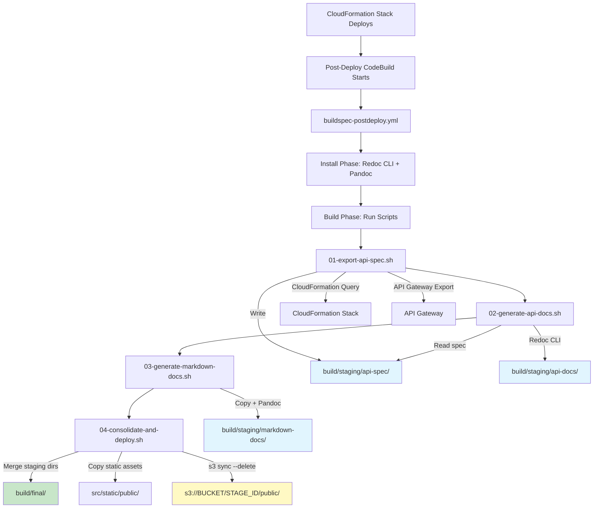

# Design Document: Post-Deployment Static Generation

## Overview

This design describes the post-deployment static site generation pipeline for the Atlantis MCP Server. After the application CloudFormation stack deploys, a CodeBuild project runs `buildspec-postdeploy.yml` which orchestrates a series of shell scripts to:

1. Export the live OpenAPI specification from API Gateway
2. Generate static HTML API documentation using Redoc CLI
3. Convert markdown documentation to HTML using Pandoc
4. Assemble a landing page and consolidate all output
5. Sync the final build directory to S3 for static hosting

The system uses isolated staging directories per generator to prevent output collisions, then consolidates into a single `build/final/` directory for an atomic `s3 sync --delete` deployment.

## Architecture



### Key Design Decisions

1. **Separate staging directories per generator**: Each script writes to its own staging directory under `build/staging/`. This prevents any generator from accidentally clearing another's output (e.g., Redoc CLI's `--output` overwriting Pandoc output).

2. **CloudFormation stack query for API discovery**: Rather than adding new environment variables or CloudFormation outputs, the scripts derive the stack name from existing `PREFIX`, `PROJECT_ID`, and `STAGE_ID` variables and query CloudFormation for the REST API ID and stage name. This keeps the pipeline template unchanged.

3. **Redoc CLI for API docs**: Generates a single self-contained HTML file with no runtime dependencies. Installed via npm in the CodeBuild install phase.

4. **Pandoc for markdown docs**: Available via package manager in the CodeBuild Amazon Linux environment. Converts markdown to HTML with a custom CSS stylesheet for consistent styling.

5. **Static landing page**: A plain HTML file maintained in `application-infrastructure/src/static/public/index.html`. No JavaScript framework or build tool required.

## Components and Interfaces

### File and Directory Structure

```
application-infrastructure/
├── buildspec-postdeploy.yml              # CodeBuild orchestrator
├── postdeploy-scripts/
│   ├── 01-export-api-spec.sh             # Export OpenAPI spec from API Gateway
│   ├── 02-generate-api-docs.sh           # Generate HTML from OpenAPI spec
│   ├── 03-generate-markdown-docs.sh      # Convert markdown docs to HTML
│   └── 04-consolidate-and-deploy.sh      # Merge staging dirs + S3 sync
├── src/
│   └── static/
│       ├── pandoc/
│       │   └── style.css                 # CSS stylesheet for Pandoc HTML output
│       └── public/
│           └── index.html                # Landing page
```

### Build Directory Layout (at runtime)

```
build/
├── staging/
│   ├── api-spec/
│   │   └── openapi.json                  # Exported OpenAPI 3.0 spec
│   ├── api-docs/
│   │   └── docs/
│   │       └── api/
│   │           └── index.html            # Redoc-generated API docs
│   └── markdown-docs/
│       └── docs/
│           └── tools/
│               ├── index.html            # Converted from README.md
│               └── ...                   # Other converted .md files
└── final/
    ├── index.html                        # Landing page (from src/static/public/)
    └── docs/
        ├── api/
        │   └── index.html                # API documentation
        └── tools/
            ├── index.html                # Tools documentation
            └── ...
```

### Component: buildspec-postdeploy.yml

The orchestrator buildspec that CodeBuild executes after deployment.

**Install phase:**
- Install Redoc CLI globally via npm (`@redocly/cli` or `redoc-cli`)
- Install Pandoc via the system package manager (`yum` or `dnf`)
- Print tool versions for build log debugging

**Build phase:**
- Define `PUBLIC_DOC_DIRS` variable (default: `"tools"`)
- Create the base `build/staging/` directory structure
- Execute each post-deploy script in sequence, passing required variables
- Scripts are invoked with `bash -e` to halt on any non-zero exit

**Environment variables consumed:**
- `PREFIX`, `PROJECT_ID`, `STAGE_ID` — for CloudFormation stack name derivation
- `S3_STATIC_HOST_BUCKET` — target S3 bucket
- `PARAM_STORE_HIERARCHY` — available but not directly used by these scripts

### Component: 01-export-api-spec.sh

Discovers the REST API ID and stage name from CloudFormation, then exports the OpenAPI spec.

**Inputs:** `PREFIX`, `PROJECT_ID`, `STAGE_ID`
**Output:** `build/staging/api-spec/openapi.json`

**Algorithm:**
1. Derive stack name: `STACK_NAME="${PREFIX}-${PROJECT_ID}-${STAGE_ID}-application"`
2. Query CloudFormation for the physical resource ID of `WebApi`:
   ```bash
   REST_API_ID=$(aws cloudformation describe-stack-resource \
     --stack-name "${STACK_NAME}" \
     --logical-resource-id "WebApi" \
     --query "StackResourceDetail.PhysicalResourceId" \
     --output text)
   ```
3. Query CloudFormation for the `ApiPathBase` parameter value to get the stage name:
   ```bash
   API_STAGE_NAME=$(aws cloudformation describe-stacks \
     --stack-name "${STACK_NAME}" \
     --query "Stacks[0].Parameters[?ParameterKey=='ApiPathBase'].ParameterValue" \
     --output text)
   ```
4. Export the OpenAPI 3.0 spec:
   ```bash
   aws apigateway get-export \
     --rest-api-id "${REST_API_ID}" \
     --stage-name "${API_STAGE_NAME}" \
     --export-type oas30 \
     --accepts "application/json" \
     "${STAGING_DIR}/openapi.json"
   ```
5. Validate the exported file exists and is non-empty.

### Component: 02-generate-api-docs.sh

Generates self-contained HTML API documentation from the exported OpenAPI spec using Redoc CLI.

**Inputs:** `build/staging/api-spec/openapi.json`
**Output:** `build/staging/api-docs/docs/api/index.html`

**Algorithm:**
1. Verify the OpenAPI spec file exists at the expected staging path.
2. Create the output directory `build/staging/api-docs/docs/api/`.
3. Run Redoc CLI to bundle the spec into a single HTML file:
   ```bash
   npx @redocly/cli build-docs \
     "${SPEC_FILE}" \
     --output "${OUTPUT_DIR}/index.html"
   ```
4. Validate the output HTML file exists and is non-empty.

### Component: 03-generate-markdown-docs.sh

Converts markdown files from each directory listed in `PUBLIC_DOC_DIRS` to HTML using Pandoc.

**Inputs:** `PUBLIC_DOC_DIRS` (space-separated list), `docs/` directory in repo root
**Output:** `build/staging/markdown-docs/docs/<dir>/` for each directory

**Algorithm:**
1. For each directory name in `PUBLIC_DOC_DIRS`:
   a. Check if `docs/<dir>/` exists. If not, log a warning and continue.
   b. Create a temporary working directory: `build/tmp/markdown/<dir>/`
   c. Copy `docs/<dir>/` contents to the temporary directory (preserves repo `docs/`).
   d. Create the output directory: `build/staging/markdown-docs/docs/<dir>/`
   e. For each `.md` file in the temporary directory:
      - Convert to HTML using Pandoc with the custom CSS stylesheet:
        ```bash
        pandoc "${md_file}" \
          --standalone \
          --css="/docs/css/style.css" \
          --metadata title="$(extract_title "${md_file}")" \
          --to html5 \
          --output "${output_dir}/$(basename "${md_file}" .md).html"
        ```
      - Rename `README.html` to `index.html` if present.
   f. If Pandoc fails on any file, exit with non-zero status and log the filename.
2. Copy the CSS stylesheet to `build/staging/markdown-docs/docs/css/style.css` so it's available at the expected path.
3. Clean up temporary working directories.

**Title extraction:** The script extracts the first `# Heading` from each markdown file to use as the HTML `<title>`. Falls back to the filename if no heading is found.

### Component: 04-consolidate-and-deploy.sh

Merges all staging directories into the final build directory and syncs to S3.

**Inputs:** `build/staging/`, `application-infrastructure/src/static/public/`, `S3_STATIC_HOST_BUCKET`, `STAGE_ID`
**Output:** S3 deployment at `s3://${S3_STATIC_HOST_BUCKET}/${STAGE_ID}/public/`

**Algorithm:**
1. Validate `S3_STATIC_HOST_BUCKET` and `STAGE_ID` environment variables are set.
2. Remove `build/final/` if it exists from a previous run.
3. Create `build/final/`.
4. Copy contents from each staging directory into `build/final/`, preserving subdirectory structure:
   - `build/staging/api-docs/` → `build/final/` (contains `docs/api/`)
   - `build/staging/markdown-docs/` → `build/final/` (contains `docs/<dir>/` and `docs/css/`)
5. Copy `application-infrastructure/src/static/public/` contents to `build/final/` root (landing page).
6. Sync to S3:
   ```bash
   aws s3 sync build/final/ "s3://${S3_STATIC_HOST_BUCKET}/${STAGE_ID}/public/" --delete
   ```
7. Log the S3 destination and file count for the build log.

### Component: Landing Page (index.html)

A simple static HTML page stored at `application-infrastructure/src/static/public/index.html`.

**Structure:**
- Plain HTML5 document with inline CSS (no external dependencies)
- Navigation links to `docs/api/` and `docs/tools/` (and any future `PUBLIC_DOC_DIRS` entries)
- Project title and brief description
- Responsive layout using basic CSS

The landing page is maintained manually. When new directories are added to `PUBLIC_DOC_DIRS`, the landing page should be updated to include links to the new section.

### Component: Pandoc CSS Stylesheet

Stored at `application-infrastructure/src/static/pandoc/style.css`.

Provides consistent styling for all Pandoc-generated HTML pages:
- Clean typography with readable font sizes
- Responsive layout with max-width container
- Styled code blocks with syntax highlighting background
- Navigation-friendly heading styles
- Print-friendly styles

## Data Models

This feature does not introduce persistent data models. The data flow is file-based:

| Artifact | Format | Source | Destination |
|----------|--------|--------|-------------|
| OpenAPI Spec | JSON | API Gateway export | `build/staging/api-spec/openapi.json` |
| API Docs HTML | HTML | Redoc CLI generation | `build/staging/api-docs/docs/api/index.html` |
| Markdown Docs HTML | HTML | Pandoc conversion | `build/staging/markdown-docs/docs/<dir>/*.html` |
| CSS Stylesheet | CSS | Static file | `build/staging/markdown-docs/docs/css/style.css` |
| Landing Page | HTML | Static file | `build/final/index.html` |

### Environment Variables

| Variable | Source | Usage |
|----------|--------|-------|
| `PREFIX` | Pipeline/CodeBuild | Stack name derivation |
| `PROJECT_ID` | Pipeline/CodeBuild | Stack name derivation |
| `STAGE_ID` | Pipeline/CodeBuild | Stack name derivation + S3 path |
| `S3_STATIC_HOST_BUCKET` | Pipeline/CodeBuild | S3 deployment target |
| `PUBLIC_DOC_DIRS` | Defined in buildspec | Controls which doc dirs are published |


## Correctness Properties

*A property is a characteristic or behavior that should hold true across all valid executions of a system — essentially, a formal statement about what the system should do. Properties serve as the bridge between human-readable specifications and machine-verifiable correctness guarantees.*

### Property 1: Stack name derivation is deterministic

*For any* valid combination of `PREFIX`, `PROJECT_ID`, and `STAGE_ID` values (lowercase alphanumeric with dashes), the derived CloudFormation stack name shall always equal `"${PREFIX}-${PROJECT_ID}-${STAGE_ID}-application"`.

**Validates: Requirements 2.1**

### Property 2: Generator output isolation

*For any* execution of the API doc generator or markdown doc generator scripts, no files outside the script's designated staging directory shall be created, modified, or deleted. In particular, the original repository `docs/` directory shall remain byte-for-byte identical before and after script execution.

**Validates: Requirements 3.3, 4.2, 4.4, 8.4**

### Property 3: Markdown-to-HTML conversion produces correctly placed output

*For any* markdown file located in a `docs/<dir>/` directory where `<dir>` is listed in `PUBLIC_DOC_DIRS`, the markdown doc generator shall produce a corresponding `.html` file in `build/staging/markdown-docs/docs/<dir>/` with the same base name (and `README.md` renamed to `index.html`).

**Validates: Requirements 4.3**

### Property 4: Only permitted directories are processed

*For any* value of `PUBLIC_DOC_DIRS` and any set of directories under `docs/`, the markdown doc generator shall produce HTML output only for directories whose names appear in `PUBLIC_DOC_DIRS`. No HTML output shall be generated for directories not in the list.

**Validates: Requirements 4.1, 9.2**

### Property 5: Consolidation preserves directory structure without collisions

*For any* set of staging directories containing generated content, the consolidation step shall produce a `build/final/` directory where every file from every staging directory is present at its correct relative path, and no file from one staging directory overwrites a file from another.

**Validates: Requirements 6.2, 6.4**

## Error Handling

Error handling follows a fail-fast approach across all scripts. Each script uses `set -euo pipefail` at the top to ensure:

- **`-e`**: Exit immediately if any command returns non-zero
- **`-u`**: Treat unset variables as errors
- **`-o pipefail`**: Return the exit code of the first failed command in a pipeline

### Error Handling by Component

| Component | Error Condition | Behavior |
|-----------|----------------|----------|
| `01-export-api-spec.sh` | CloudFormation stack not found | Exit 1, log stack name attempted |
| `01-export-api-spec.sh` | `WebApi` resource not found in stack | Exit 1, log logical resource ID |
| `01-export-api-spec.sh` | API Gateway export fails | Exit 1, log REST API ID and stage |
| `02-generate-api-docs.sh` | OpenAPI spec file missing | Exit 1, log expected file path |
| `02-generate-api-docs.sh` | Redoc CLI fails | Exit 1, log Redoc error output |
| `03-generate-markdown-docs.sh` | Directory in `PUBLIC_DOC_DIRS` not found | Log warning, continue to next directory |
| `03-generate-markdown-docs.sh` | Pandoc conversion fails on a file | Exit 1, log the specific filename |
| `04-consolidate-and-deploy.sh` | `S3_STATIC_HOST_BUCKET` not set | Exit 1, log descriptive message |
| `04-consolidate-and-deploy.sh` | `STAGE_ID` not set | Exit 1, log descriptive message |
| `04-consolidate-and-deploy.sh` | `aws s3 sync` fails | Exit 1, log S3 destination path |
| `buildspec-postdeploy.yml` | Any script exits non-zero | CodeBuild halts, build marked failed |

### Logging Convention

All scripts log to stdout/stderr with a consistent prefix format:

```
[script-name] INFO: message
[script-name] ERROR: message
[script-name] WARN: message
```

This makes it easy to identify which script produced each log line in the CodeBuild build log.

## Testing Strategy

### Dual Testing Approach

This feature uses both unit tests and property-based tests for comprehensive coverage.

**Unit tests** verify specific examples, edge cases, and error conditions:
- Buildspec structure validation (correct phases, script order)
- Landing page HTML structure (contains expected links)
- Error handling paths (missing env vars, missing files)
- File organization (scripts in correct directories)
- Default `PUBLIC_DOC_DIRS` value

**Property-based tests** verify universal properties across generated inputs:
- Stack name derivation for arbitrary valid PREFIX/PROJECT_ID/STAGE_ID values
- Generator output isolation across varied file structures
- Markdown-to-HTML path mapping for arbitrary directory/file names
- PUBLIC_DOC_DIRS filtering across arbitrary directory sets
- Consolidation correctness across varied staging directory contents

### Property-Based Testing Configuration

- **Library**: fast-check (npm package, already in the Node.js ecosystem)
- **Minimum iterations**: 100 per property test
- **Tag format**: Each test is tagged with a comment referencing the design property

```javascript
// Feature: post-deployment-static-generation, Property 1: Stack name derivation is deterministic
```

### Test Implementation Notes

Since the scripts are bash, property-based tests will focus on the logic that can be extracted and tested:

1. **Stack name derivation** (Property 1): Test the string concatenation formula with generated inputs. Can be tested purely in JavaScript by reimplementing the derivation logic and verifying it matches the bash script's pattern.

2. **Output isolation** (Property 2): Use a test harness that creates a temporary directory structure, runs the script (or a mock of it), and verifies no files outside the staging directory were touched. Use fast-check to generate varied initial directory structures.

3. **Path mapping** (Property 3): Generate random markdown filenames and directory names, apply the naming transformation (`.md` → `.html`, `README.md` → `index.html`), and verify the output paths are correct.

4. **Directory filtering** (Property 4): Generate random sets of directory names and random `PUBLIC_DOC_DIRS` values, then verify only the intersection is processed.

5. **Consolidation** (Property 5): Generate random staging directory contents and verify the merge produces the correct union of files at the correct paths.

### Test Organization

```
application-infrastructure/tests/postdeploy/
├── unit/
│   ├── buildspec-structure.test.js
│   ├── landing-page.test.js
│   └── error-handling.test.js
└── property/
    ├── stack-name-derivation.property.test.js
    ├── output-isolation.property.test.js
    ├── path-mapping.property.test.js
    ├── directory-filtering.property.test.js
    └── consolidation.property.test.js
```

Each property-based test file must:
- Reference the design property number in a comment tag
- Run a minimum of 100 iterations
- Use fast-check for input generation
- Be executable via `jest --run`
