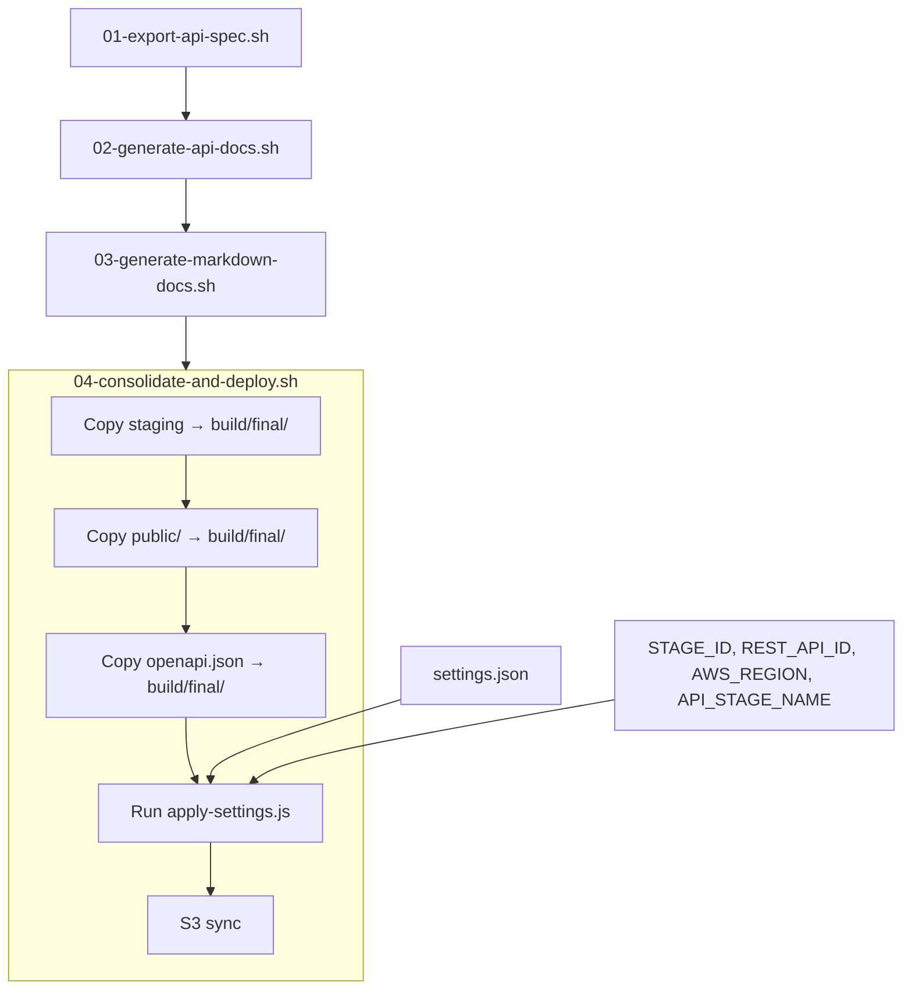

# Design Document: Production Domain Settings

## Overview

This feature introduces a centralized `settings.json` configuration file and a token replacement pipeline step that together allow stage-specific values (footer HTML, custom domain) to be injected into all generated static content. The current hardcoded footer HTML across three generation paths (landing pages, API docs, markdown docs) is replaced with a `{{{settings.footer}}}` token, and API Gateway URLs are rewritten to custom production domains when configured.

The implementation adds two new components to the postdeploy pipeline:

1. A **Settings Loader** — a Node.js module that reads `settings.json`, merges `default` values with stage-specific overrides, and returns a resolved key-value map.
2. A **Token Replacer** — a Node.js script invoked from `04-consolidate-and-deploy.sh` after consolidation but before S3 sync. It walks all HTML and JSON files in `build/final/`, replaces `{{{settings.<key>}}}` tokens with resolved values, and rewrites API Gateway URLs to the custom domain when the `domain` key is present.

No new AWS resources are required. The change is entirely within the postdeploy build scripts and static source files.

## Architecture

The feature modifies the existing 4-script postdeploy pipeline by inserting a token replacement step into script 04 and updating scripts 02 and 03 plus static HTML files to emit tokens instead of hardcoded content.



### Key Design Decisions

1. **Node.js for token replacement** — Consistent with the existing `resolve-and-render-spec.js` pattern. Shell-based `sed` replacement is fragile for multi-line HTML values and JSON manipulation.

2. **Token replacement after consolidation** — All content sources (API docs, markdown docs, landing pages, OpenAPI spec) are already merged into `build/final/` at this point, so a single pass handles everything.

3. **Generic token pattern `{{{settings.<key>}}}` with triple braces** — Triple braces avoid collisions with Mustache/Handlebars double-brace syntax and are visually distinct. The pattern is extensible to future settings keys without code changes.

4. **API Gateway URL discovery from environment** — `REST_API_ID`, `API_STAGE_NAME`, and `AWS_REGION` are already available in the pipeline (script 01 queries the first two from CloudFormation, region comes from the AWS environment). These are passed to the token replacer to construct the API Gateway URL pattern for find-and-replace.

5. **Separate settings-loader module** — The loading/merging logic is extracted into its own module (`settings-loader.js`) so it can be unit-tested and property-tested independently of file I/O.

## Components and Interfaces

### 1. `settings.json` (New File)

**Path:** `application-infrastructure/src/static/settings.json`

Static configuration file read at build time. Not copied to `build/final/` (it is a build input, not a deployable artifact).

```json
{
  "default": {
    "footer": "<p>&copy; <span id=\"copyright-year\"></span> 63Klabs. All rights reserved.</p>"
  },
  "beta": {
    "domain": "mcp-beta.atlantis.63klabs.net"
  },
  "prod": {
    "domain": "mcp.atlantis.63klabs.net"
  }
}
```

### 2. `settings-loader.js` (New Module)

**Path:** `application-infrastructure/postdeploy-scripts/settings-loader.js`

Pure-logic module with no file I/O. Exports a single function:

```javascript
/**
 * Merge default settings with stage-specific overrides.
 *
 * @param {Object} settingsData - Parsed settings.json content
 * @param {string} stageId - Deployment stage identifier (e.g., 'beta', 'prod')
 * @returns {Object} Resolved key-value map
 */
function loadSettings(settingsData, stageId) { ... }
```

**Merging rules:**
- Start with a shallow copy of `settingsData.default` (or `{}` if absent).
- If `settingsData[stageId]` exists, overlay its keys onto the copy (stage values win).
- Return the merged object.

### 3. `apply-settings.js` (New Script)

**Path:** `application-infrastructure/postdeploy-scripts/apply-settings.js`

CLI script invoked from `04-consolidate-and-deploy.sh`. Accepts arguments:

```
node apply-settings.js <settingsFile> <targetDir> <stageId> [--rest-api-id ID] [--region REGION] [--api-stage-name NAME]
```

**Responsibilities:**
1. Read and parse `settingsFile`.
2. Call `loadSettings()` to get resolved settings.
3. Recursively find all `.html` and `.json` files in `targetDir`.
4. For each file:
   - Replace all `{{{settings.<key>}}}` tokens with resolved values. Leave unresolved tokens unchanged.
   - If `domain` is present in resolved settings and `--rest-api-id`, `--region`, `--api-stage-name` are provided: replace the API Gateway URL pattern `https://<restApiId>.execute-api.<region>.amazonaws.com/<stageName>` with `https://<domain>`.
5. Log replacement counts per key and per file.
6. Exit 0 on success, non-zero on error.

### 4. Modified: `resolve-and-render-spec.js`

The `footer` value in `settings.json` is the inner HTML content (the `<p>` tag with copyright text). The `<footer>` wrapper element and the adjacent `<script>` for the copyright year remain in the template. The token replaces only the `<p>...</p>` inside `<footer>`:

```html
<!-- Before -->
<footer>
  <p>&copy; <span id="copyright-year"></span> 63Klabs. All rights reserved.</p>
</footer>

<!-- After (in template) -->
<footer>
  {{{settings.footer}}}
</footer>
```

The `<script>` for copyright year remains adjacent to the footer since the footer value itself contains the `<span id="copyright-year">` placeholder that the script populates.

### 5. Modified: `03-generate-markdown-docs.sh`

Replace the hardcoded footer `sed` injection with the token:

```bash
# Before:
sed -i 's|</body>|<footer><p>\&copy; <span id="copyright-year"></span> 63Klabs. All rights reserved.</p></footer>\n<script>...</script>\n</body>|'

# After:
sed -i 's|</body>|<footer>{{{settings.footer}}}</footer>\n<script>document.getElementById('"'"'copyright-year'"'"').textContent = new Date().getFullYear();</script>\n</body>|'
```

### 6. Modified: Static Landing Pages

**Files:**
- `application-infrastructure/src/static/public/index.html`
- `application-infrastructure/src/static/public/docs/index.html`

Replace the hardcoded `<p>` inside `<footer>` with the token:

```html
<footer>
  {{{settings.footer}}}
</footer>
```

### 7. Modified: `docs-nav-helpers.js`

Update `injectFooter()` to use the token instead of hardcoded HTML:

```javascript
function injectFooter(html) {
  const footer = '<footer>{{{settings.footer}}}</footer>';
  const script = "document.getElementById('copyright-year').textContent = new Date().getFullYear();";
  return html.replace('</body>', `${footer}\n<script>${script}</script>\n</body>`);
}
```

### 8. Modified: `04-consolidate-and-deploy.sh`

After consolidation and before S3 sync, add:

1. Copy `build/staging/api-spec/openapi.json` → `build/final/docs/api/openapi.json` (for download).
2. Invoke `apply-settings.js`:

```bash
node application-infrastructure/postdeploy-scripts/apply-settings.js \
  "application-infrastructure/src/static/settings.json" \
  "${FINAL_DIR}" \
  "${STAGE_ID}" \
  --rest-api-id "${REST_API_ID}" \
  --region "${AWS_REGION}" \
  --api-stage-name "${API_STAGE_NAME}"
```

The `REST_API_ID` and `API_STAGE_NAME` values need to be available in script 04. Currently they are derived in script 01. They can be passed via environment variables exported in the buildspec or written to a shared file. The simplest approach: script 01 already writes `openapi.json` to staging. The `REST_API_ID` and `API_STAGE_NAME` can be exported as environment variables in the buildspec by having script 01 write them to a file that script 04 sources, or by exporting them in the buildspec commands between script invocations.

**Chosen approach:** Script 01 writes a `build/staging/api-spec/env.sh` file containing `export REST_API_ID=...` and `export API_STAGE_NAME=...`. Script 04 sources this file before invoking `apply-settings.js`.

## Data Models

### Settings File Schema

```json
{
  "type": "object",
  "properties": {
    "default": {
      "type": "object",
      "additionalProperties": { "type": "string" }
    }
  },
  "required": ["default"],
  "additionalProperties": {
    "type": "object",
    "additionalProperties": { "type": "string" }
  }
}
```

All values are strings. The top-level keys are `default` plus zero or more stage identifiers. Each stage object contains string key-value pairs.

### Resolved Settings (Runtime)

After merging, the resolved settings is a flat `Object.<string, string>`:

```javascript
// Example for stageId = "prod"
{
  "footer": "<p>&copy; <span id=\"copyright-year\"></span> 63Klabs. All rights reserved.</p>",
  "domain": "mcp.atlantis.63klabs.net"
}
```

### Token Pattern

```
{{{settings.<key>}}}
```

Where `<key>` matches `/[a-zA-Z0-9_-]+/`. The triple-brace delimiters are literal characters in the source files.

### API Gateway URL Pattern

```
https://<restApiId>.execute-api.<region>.amazonaws.com/<apiStageName>
```

This is a concrete string (not a regex pattern in the source files). The token replacer constructs it from the CLI arguments and performs a literal string replacement.


## Correctness Properties

*A property is a characteristic or behavior that should hold true across all valid executions of a system — essentially, a formal statement about what the system should do. Properties serve as the bridge between human-readable specifications and machine-verifiable correctness guarantees.*

### Property 1: Settings merge produces correct union with stage override

*For any* valid settings object containing a `default` key and zero or more stage keys, and *for any* stageId string, the resolved settings returned by `loadSettings()` should satisfy all of the following:
- Every key present in `default` but not in the stage object appears in the result with its default value.
- Every key present in the stage object appears in the result with the stage-specific value (overriding any default).
- Every key present in both `default` and the stage object appears in the result with the stage-specific value.
- No keys appear in the result that are not in either `default` or the stage object.
- When the stageId does not match any top-level key, the result equals the `default` object.

**Validates: Requirements 2.2, 2.3, 2.4, 2.6**

### Property 2: Generic token replacement

*For any* set of resolved settings (a map of string keys to string values) and *for any* file content string, after applying token replacement, every occurrence of `{{{settings.<key>}}}` where `<key>` exists in the resolved settings should be replaced with the corresponding value, and the result should contain no remaining `{{{settings.<key>}}}` tokens for keys that were in the resolved settings.

**Validates: Requirements 3.3, 4.1, 5.1**

### Property 3: Unresolved tokens are preserved

*For any* file content string containing tokens of the form `{{{settings.<key>}}}` and *for any* set of resolved settings that does not contain `<key>`, the token should remain unchanged in the output after replacement.

**Validates: Requirements 5.2**

### Property 4: API Gateway URL replacement when domain is present

*For any* file content string containing the API Gateway URL pattern `https://<restApiId>.execute-api.<region>.amazonaws.com/<stageName>` and *for any* non-empty domain string in the resolved settings, after applying the token replacer, all occurrences of the API Gateway URL pattern should be replaced with `https://<domain>`, and no occurrences of the original pattern should remain.

**Validates: Requirements 4.2, 4.3, 4.4, 7.2**

### Property 5: API Gateway URL preserved when domain is absent

*For any* file content string containing the API Gateway URL pattern and *for any* set of resolved settings that does not contain a `domain` key, the file content should remain unchanged with respect to the API Gateway URL pattern after applying the token replacer.

**Validates: Requirements 4.5**

## Error Handling

### Settings File Errors

| Error Condition | Behavior |
|---|---|
| `settings.json` does not exist | `apply-settings.js` logs error with file path and exits with code 1 |
| `settings.json` is not valid JSON | `apply-settings.js` logs parse error and exits with code 1 |
| `settings.json` missing `default` key | `loadSettings()` treats missing default as empty object `{}`, proceeds with stage-only values |

### Token Replacement Errors

| Error Condition | Behavior |
|---|---|
| File read/write error during replacement | Log the file path and error, exit with code 1 |
| Token references non-existent key | Leave token unchanged (not an error) |
| `domain` key absent in settings | Skip API Gateway URL replacement entirely (not an error) |
| `--rest-api-id` or `--region` or `--api-stage-name` not provided | Skip API Gateway URL replacement (cannot construct pattern), log warning |

### Pipeline Integration Errors

| Error Condition | Behavior |
|---|---|
| `STAGE_ID` not set | Script 04 already validates this; exits with code 1 |
| `build/staging/api-spec/env.sh` missing | Log warning, skip API Gateway URL replacement (REST_API_ID/API_STAGE_NAME unavailable) |
| `apply-settings.js` exits non-zero | Script 04 exits non-zero (due to `set -euo pipefail`), blocking S3 sync |

## Testing Strategy

### Dual Testing Approach

This feature uses both unit tests and property-based tests:

- **Property-based tests** verify the universal correctness properties (Properties 1–5) across many randomly generated inputs using `fast-check`.
- **Unit tests** verify specific examples, edge cases, error conditions, and integration points.

### Property-Based Testing

**Library:** `fast-check` (already a devDependency in `application-infrastructure/src/package.json`)

**Configuration:** Each property test runs a minimum of 100 iterations.

**Test files** go in `application-infrastructure/tests/postdeploy/property/` following the existing convention (CommonJS, `.property.test.js` suffix).

Each test file includes a comment referencing the design property:

```javascript
// Feature: production-domain, Property N: <property title>
// Validates: Requirements X.Y, X.Z
```

**Property tests to implement:**

1. **`settings-merge.property.test.js`** — Tests Property 1 by generating random settings objects with random default and stage keys/values, random stageIds, and verifying the merge output.

2. **`token-replacement.property.test.js`** — Tests Property 2 by generating random settings maps and random file content strings containing `{{{settings.<key>}}}` tokens, then verifying all matching tokens are replaced.

3. **`unresolved-tokens.property.test.js`** — Tests Property 3 by generating random file content with tokens whose keys are not in the generated settings, verifying tokens are preserved.

4. **`apigw-url-replacement.property.test.js`** — Tests Property 4 by generating random file content containing the API Gateway URL pattern (with random restApiId, region, stageName) and a random domain string, verifying the URL is replaced.

5. **`apigw-url-preserved.property.test.js`** — Tests Property 5 by generating random file content containing the API Gateway URL pattern and settings without a `domain` key, verifying the URL is unchanged.

### Unit Tests

**Test files** go in `application-infrastructure/tests/postdeploy/unit/` following the existing convention.

**Unit tests to implement:**

1. **`settings-loader.test.js`**
   - Loads the example `settings.json` structure and verifies correct merge for `beta`, `prod`, and unknown stage.
   - Verifies empty default object behavior.
   - Verifies missing stage key falls back to defaults.

2. **`apply-settings.test.js`**
   - Verifies token replacement on a sample HTML file with known tokens and settings.
   - Verifies API Gateway URL replacement in a sample OpenAPI JSON.
   - Verifies logging output includes replacement counts.
   - Verifies error exit on invalid settings file.
   - Verifies unresolved tokens are left intact.

### Test Execution

Tests are run via the existing postdeploy test infrastructure:

```bash
cd application-infrastructure/tests/postdeploy
npm test
```

This uses the Jest config at `application-infrastructure/tests/postdeploy/jest.config.js` which matches `**/*.property.test.js` and `**/*.test.js`.
