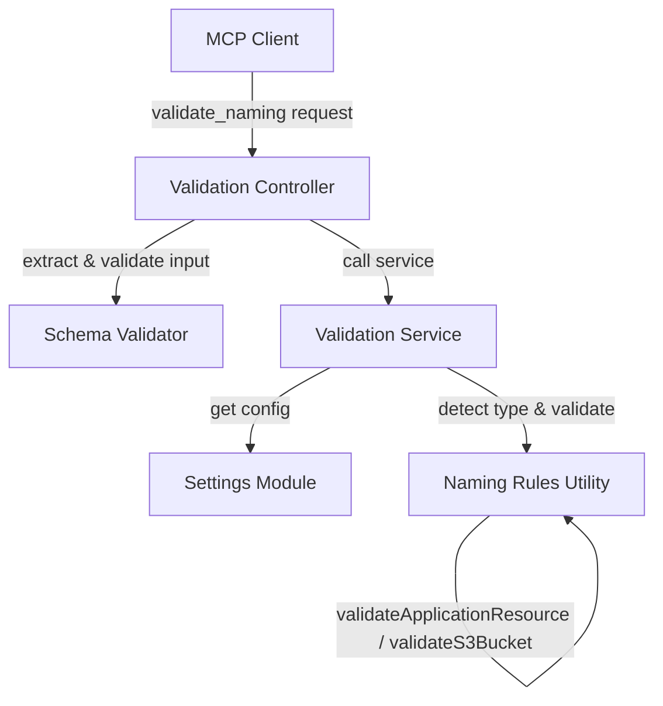
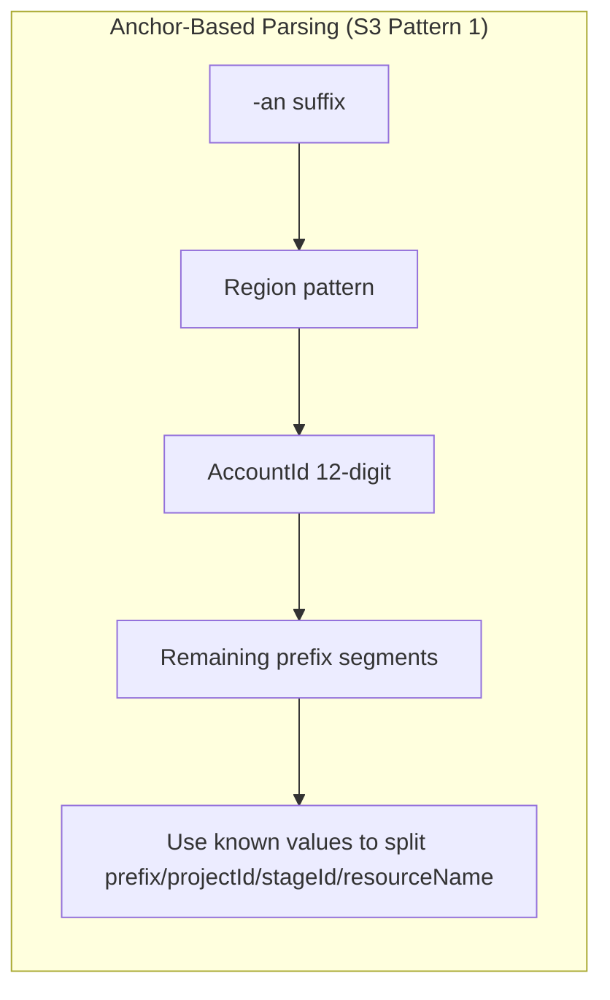
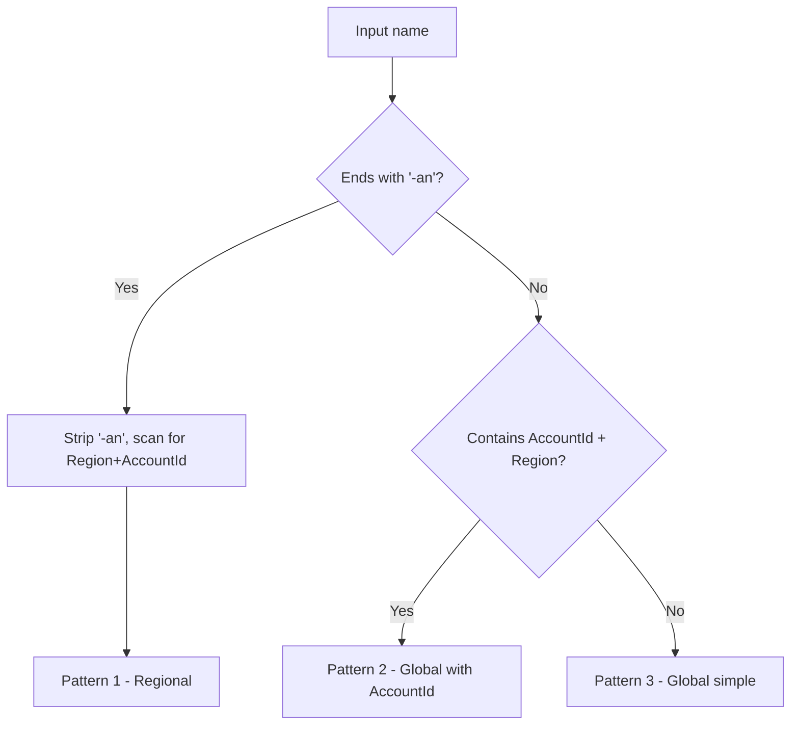

# Design Document: Resource Naming

## Overview

This design addresses two interrelated problems in the Atlantis MCP Server's resource naming validation system:

1. **Broken hyphen-based parsing**: The current `naming-rules.js` uses `name.split('-')` to decompose resource names into components. This fails when components (OrgPrefix, Prefix, ProjectId, StageId, ResourceName/ResourceSuffix) themselves contain hyphens. The fix replaces naive splitting with anchor-based parsing that uses known values and fixed-format patterns to identify component boundaries.

2. **Outdated S3 bucket patterns**: The current S3 patterns use Region-AccountId order. The new AWS guidelines require AccountId-Region order, a new `-an` suffix for regional buckets, and support for an optional ResourceName component. The old patterns are fully replaced (pre-beta, no backward compatibility needed).

The scope is limited to four source files (`naming-rules.js`, `settings.js`, `validation.js` service, `validation.js` controller), their corresponding test files, and documentation updates.

## Architecture

The validation system follows a layered architecture that remains unchanged:



The key architectural change is in the parsing strategy within `naming-rules.js`:

**Current approach**: Split by hyphen, assign components by positional index.

**New approach**: Anchor-based parsing that works from known fixed-format elements inward:



For application resources, the anchors are:
- Known `prefix` and `projectId` values (when provided) to strip from the front
- StageId pattern (`/^[tbsp][a-z0-9]*$/`) to identify the stage boundary
- Everything after StageId is ResourceSuffix

For S3 buckets, the anchors are:
- `-an` suffix (Pattern 1 indicator)
- Region pattern (`/[a-z]{2}-[a-z]+-\d+/`) scanned from the right
- AccountId (`/\d{12}/`) immediately before Region
- Known values (`orgPrefix`, `prefix`, `projectId`) to strip from the front of the remaining segments

## Components and Interfaces

### 1. Naming Rules Utility (`naming-rules.js`)

This is the core module that changes most significantly.

#### Updated Exports

```javascript
module.exports = {
  validateApplicationResource,  // Updated: anchor-based parsing
  validateS3Bucket,             // Updated: new patterns, anchor-based parsing
  validateNaming,               // Updated: pass new params through
  detectResourceType,           // Updated: detect new S3 patterns
  isValidStageId,               // Unchanged
  checkPascalCase,              // Unchanged
  AWS_NAMING_RULES,             // Unchanged
  STAGE_ID_PATTERN              // Newly exported for test use
};
```

#### `validateApplicationResource(name, options)` — Updated Signature

```javascript
/**
 * @param {string} name - Resource name to validate
 * @param {Object} options
 * @param {string} [options.resourceType='lambda'] - AWS resource type
 * @param {string} [options.prefix] - Known prefix value (enables anchor parsing)
 * @param {string} [options.projectId] - Known projectId value (enables anchor parsing)
 * @param {string} [options.stageId] - Known stageId value
 * @param {boolean} [options.isShared=false] - Shared resource (no StageId)
 * @param {boolean} [options.partial=false] - Allow partial validation
 * @returns {{valid: boolean, errors: string[], suggestions: string[], components: Object}}
 */
```

**Parsing strategy**:
1. If `prefix` and `projectId` are provided: strip them from the front of the name, then identify StageId (if not shared) and ResourceSuffix from the remainder.
2. If only `prefix` is provided: strip prefix, then use StageId pattern to find the boundary between projectId and stageId.
3. If no known values: fall back to StageId pattern detection on each segment. If ambiguous, return an error suggesting the caller provide known values.

#### `validateS3Bucket(name, options)` — Updated Signature

```javascript
/**
 * @param {string} name - S3 bucket name to validate
 * @param {Object} options
 * @param {string} [options.orgPrefix] - Known org prefix
 * @param {string} [options.prefix] - Known prefix value
 * @param {string} [options.projectId] - Known projectId value
 * @param {string} [options.stageId] - Known stageId value
 * @param {string} [options.region] - Expected AWS region
 * @param {string} [options.accountId] - Expected AWS account ID
 * @param {boolean} [options.isShared=false] - Shared resource (no StageId)
 * @param {boolean} [options.hasOrgPrefix] - Disambiguate OrgPrefix presence
 * @param {boolean} [options.partial=false] - Allow partial validation
 * @returns {{valid: boolean, errors: string[], suggestions: string[], components: Object, pattern: string}}
 */
```

**New S3 pattern detection logic**:

```
1. Check if name ends with "-an":
   → Strip "-an", scan right-to-left for Region pattern, then AccountId
   → Pattern 1 (Regional)

2. Else scan right-to-left for AccountId (12 digits) followed by Region:
   → Pattern 2 (Global with AccountId)

3. Else no AccountId/Region found:
   → Pattern 3 (Global simple)
```

**Parsing the prefix segments** (everything before AccountId-Region or the whole name for Pattern 3):

When known values are provided, strip them from the left. When not provided, use segment count and `hasOrgPrefix` to disambiguate. If still ambiguous, return an error.

#### `detectResourceType(name)` — Updated Logic

```javascript
/**
 * Auto-detect resource type from name pattern.
 *
 * S3 detection (in order):
 *   1. Ends with "-an" and contains Region pattern → s3
 *   2. All-lowercase, contains AccountId (12 digits) followed by Region → s3
 *   3. All-lowercase, no region/accountId but valid S3 format → could be s3 pattern3
 *
 * Application detection:
 *   4+ hyphen-separated segments where a segment matches StageId pattern
 *
 * @param {string} name
 * @returns {string|null} 's3', 'application', or null
 */
```

### 2. Settings Module (`settings.js`)

#### Updated Naming Patterns

```javascript
naming: {
  applicationResourcePattern: '<Prefix>-<ProjectId>-<StageId>-<ResourceSuffix>',
  s3BucketPatterns: {
    pattern1: '[<orgPrefix>-]<Prefix>-<ProjectId>[-<StageId>][-<ResourceName>]-<AccountId>-<Region>-an',
    pattern2: '[<orgPrefix>-]<Prefix>-<ProjectId>[-<StageId>][-<ResourceName>]-<AccountId>-<Region>',
    pattern3: '[<orgPrefix>-]<Prefix>-<ProjectId>[-<StageId>][-<ResourceName>]'
  },
  parameters: {
    prefix: process.env.PREFIX || '',
    projectId: process.env.PROJECT_ID || '',
    stageId: process.env.STAGE_ID || ''
  }
}
```

The old `s3BucketPattern` and `s3BucketPatternAlt` fields are removed entirely.

#### Updated `validate_naming` Tool Schema

New input properties added for disambiguation:

```javascript
{
  name: 'validate_naming',
  description: 'Validate resource names against Atlantis naming conventions. Supports S3 regional buckets (-an suffix), global buckets, and application resources. Provide known component values (prefix, projectId) for accurate parsing of hyphenated components.',
  inputSchema: {
    type: 'object',
    properties: {
      resourceName: { type: 'string', description: 'Resource name to validate' },
      resourceType: { type: 'string', enum: ['application', 's3', 'dynamodb', 'lambda', 'cloudformation'] },
      isShared: { type: 'boolean', description: 'Shared resource without StageId' },
      hasOrgPrefix: { type: 'boolean', description: 'S3 bucket includes org prefix segment' },
      prefix: { type: 'string', description: 'Known Prefix value for disambiguation' },
      projectId: { type: 'string', description: 'Known ProjectId value for disambiguation' },
      stageId: { type: 'string', description: 'Known StageId value for disambiguation' },
      orgPrefix: { type: 'string', description: 'Known OrgPrefix value for disambiguation' }
    },
    required: ['resourceName']
  }
}
```

### 3. Validation Service (`services/validation.js`)

Updated to pass the new disambiguation parameters through to `NamingRules`:

```javascript
const config = {
  prefix: options.prefix || settings.naming.parameters.prefix,
  projectId: options.projectId || settings.naming.parameters.projectId,
  stageId: options.stageId || settings.naming.parameters.stageId,
  orgPrefix: options.orgPrefix,
  isShared,
  hasOrgPrefix
};
```

The service prefers caller-provided values over environment config, allowing the MCP tool to override defaults.

### 4. Validation Controller (`controllers/validation.js`)

Updated to extract and pass the new parameters:

```javascript
const { resourceName, resourceType, isShared, hasOrgPrefix, prefix, projectId, stageId, orgPrefix } = input;
```

All new parameters are passed through to the service layer.

## Data Models

### Parsed Components Object

The components object returned by validators:

```javascript
// Application resource components
{
  prefix: string,           // e.g., "acme" or "my-org"
  projectId: string,        // e.g., "myapp" or "person-api"
  stageId?: string,         // e.g., "test", "prod", "tjoe" (absent if isShared)
  resourceSuffix: string    // e.g., "GetPersonFunction"
}

// S3 bucket components
{
  orgPrefix?: string,       // e.g., "63k" or "acorp" (optional)
  prefix: string,           // e.g., "acme"
  projectId: string,        // e.g., "myapp"
  stageId?: string,         // e.g., "prod" (optional)
  resourceName?: string,    // e.g., "assets" (optional, new)
  accountId?: string,       // e.g., "123456789012" (Pattern 1 & 2)
  region?: string           // e.g., "us-east-1" (Pattern 1 & 2)
}
```

### Validation Result Object

```javascript
{
  valid: boolean,
  resourceType: string,     // 's3', 'application', 'lambda', 'dynamodb', 'cloudformation'
  components: Object,       // Parsed components (see above)
  errors: string[],         // Validation error messages
  suggestions: string[],    // Helpful suggestions for fixing issues
  pattern?: string          // S3 only: 'pattern1', 'pattern2', or 'pattern3'
}
```

### S3 Pattern Detection Decision Tree



### Anchor-Based Parsing for Prefix Segments

When known values are provided, the parser strips them from the left side of the prefix segment string. The algorithm:

```
prefixSegments = "acorp-my-org-person-api-prod-assets"

1. If orgPrefix="acorp" provided → strip "acorp-" → "my-org-person-api-prod-assets"
2. If prefix="my-org" provided → strip "my-org-" → "person-api-prod-assets"
3. If projectId="person-api" provided → strip "person-api-" → "prod-assets"
4. Find StageId boundary: "prod" matches StageId pattern → stageId="prod"
5. Remainder: "assets" → resourceName="assets"
```

When known values are NOT provided, the parser uses heuristics:
- Scan segments right-to-left for StageId pattern
- Use `hasOrgPrefix` boolean to determine if first segment is orgPrefix
- If ambiguous, return error with suggestion to provide known values


## Correctness Properties

*A property is a characteristic or behavior that should hold true across all valid executions of a system — essentially, a formal statement about what the system should do. Properties serve as the bridge between human-readable specifications and machine-verifiable correctness guarantees.*

The following properties were derived from the acceptance criteria through prework analysis. Redundant criteria were consolidated: for example, requirements 1.1, 1.2, and 1.5 all test application parsing correctness and are captured by a single round-trip property. Similarly, requirements 2.1–2.5 and 4.1–4.3 are all captured by the S3 round-trip property.

### Property 1: Application resource round-trip with hyphenated components

*For any* valid application resource name constructed from a Prefix (may contain hyphens), ProjectId (may contain hyphens), StageId, and ResourceSuffix, when known `prefix` and `projectId` values are provided to the parser, parsing the name and reconstructing it from the returned components shall produce the original name.

**Validates: Requirements 1.1, 1.2, 1.5**

### Property 2: Application resource heuristic parsing without known values

*For any* valid application resource name where Prefix, ProjectId, and ResourceSuffix contain no hyphens (single-segment each), parsing without providing known values shall correctly identify all components, and reconstructing from components shall produce the original name.

**Validates: Requirements 1.3**

### Property 3: S3 bucket round-trip with hyphenated components (all patterns)

*For any* valid S3 bucket name constructed according to Pattern 1 (regional, `-an` suffix), Pattern 2 (global with AccountId-Region), or Pattern 3 (global simple), where OrgPrefix, Prefix, ProjectId, StageId, and ResourceName may contain hyphens, when known component values are provided to the parser, parsing the name and reconstructing it from the returned components shall produce the original name.

**Validates: Requirements 2.1, 2.2, 2.3, 2.5, 4.1, 4.2, 4.3**

### Property 4: S3 pattern detection correctness

*For any* valid S3 bucket name, the `pattern` field returned by `validateS3Bucket` shall match the pattern used to construct the name: Pattern 1 for names ending with `-an`, Pattern 2 for names with AccountId-Region but no `-an` suffix, and Pattern 3 for names without AccountId or Region.

**Validates: Requirements 3.5, 3.6, 3.7**

### Property 5: detectResourceType identifies S3 bucket names

*For any* valid S3 bucket name (across all three patterns) that is all-lowercase and contains either a `-an` suffix with Region, or an AccountId followed by a Region pattern, `detectResourceType` shall return `'s3'`.

**Validates: Requirements 6.1, 6.2**

### Property 6: detectResourceType identifies application resource names

*For any* valid application resource name with 4 or more hyphen-separated segments where the third segment (0-indexed position 2) matches the StageId pattern (starts with t, b, s, or p followed by lowercase alphanumeric), `detectResourceType` shall return `'application'`.

**Validates: Requirements 6.3**

## Error Handling

### Ambiguous Parsing Errors

When a name cannot be unambiguously parsed (hyphenated components without known values), the validator returns:

```javascript
{
  valid: false,
  errors: ['Cannot unambiguously parse resource name. Components may contain hyphens. Provide known values (prefix, projectId) for accurate parsing.'],
  suggestions: ['Use the prefix, projectId, and optionally orgPrefix parameters to disambiguate hyphenated components.']
}
```

### Invalid Input Errors

- Missing `resourceName`: Schema validation rejects at controller level with `INVALID_INPUT` error code
- Non-string input: Returns `{ valid: false, errors: ['Resource name is required and must be a string'] }`
- Unknown `resourceType`: Returns `{ valid: false, errors: ['Unknown resource type: <type>'] }`

### S3-Specific Errors

- Name too short/long: AWS S3 length constraints (3–63 characters)
- Invalid characters: S3 naming rules (lowercase alphanumeric, hyphens, dots)
- Invalid AccountId format: Must be exactly 12 digits
- Invalid Region format: Must match `xx-xxxxx-N` pattern
- Component mismatch: When provided known values don't match parsed values

### Application-Specific Errors

- Too few components: Minimum 4 (or 3 if `isShared`)
- Invalid StageId: Must match `^[tbsp][a-z0-9]*$`
- Invalid Prefix/ProjectId characters: Must be alphanumeric (when parsed via naive split; with anchor parsing, validation is against known values)
- Resource name too long for service type: Lambda (64), DynamoDB (255), CloudFormation (128)

### Error Propagation

Errors flow up through the layers without transformation:
1. `naming-rules.js` returns `{ valid, errors, suggestions, components }`
2. `services/validation.js` passes through unchanged
3. `controllers/validation.js` wraps in MCP protocol response

Service-level exceptions (unexpected errors) are caught by the controller and returned as `VALIDATION_ERROR` with a sanitized message.

## Testing Strategy

### Test Framework

- **Test runner**: Jest (all new tests in `.test.js` files per project convention)
- **Property-based testing library**: `fast-check` (already used in existing property tests)
- **Minimum iterations**: 100 per property test

### Unit Tests

Unit tests cover specific examples, edge cases, and error conditions. They complement property tests by testing concrete scenarios:

**Application resource parsing**:
- Names with hyphenated Prefix (e.g., `my-org-person-api-prod-GetFunction` with prefix=`my-org`)
- Names with hyphenated ProjectId (e.g., `acme-person-api-prod-GetFunction` with projectId=`person-api`)
- Names with hyphenated ResourceSuffix (e.g., `acme-myapp-prod-Get-Person-Function`)
- Shared resources with hyphenated components
- Ambiguous names without known values → error

**S3 bucket parsing (new patterns)**:
- Pattern 1 regional: `acme-myapp-prod-123456789012-us-east-1-an`
- Pattern 1 with ResourceName: `acme-myapp-prod-assets-123456789012-us-east-1-an`
- Pattern 1 with OrgPrefix: `63k-acme-myapp-prod-123456789012-us-east-1-an`
- Pattern 2 global: `acme-myapp-prod-123456789012-us-east-1`
- Pattern 2 with ResourceName: `acme-myapp-prod-assets-123456789012-us-east-1`
- Pattern 3 simple: `acme-myapp-prod-assets`
- Pattern 3 without StageId: `acme-myapp-assets`
- Hyphenated components with known values
- Ambiguous names without known values → error

**detectResourceType**:
- Names ending with `-an` → `s3`
- Names with AccountId-Region → `s3`
- Names with valid StageId in position 2 → `application`
- Ambiguous names → `null`

**Settings module**:
- New pattern definitions exist
- Old patterns removed
- Tool schema has new disambiguation properties

**Controller/Service passthrough**:
- New parameters (prefix, projectId, stageId, orgPrefix) reach naming-rules

### Property-Based Tests

Each property test references its design document property and runs minimum 100 iterations.

**Property 1 test** — Feature: resource-naming, Property 1: Application resource round-trip with hyphenated components
- Generator: random Prefix (with hyphens), ProjectId (with hyphens), StageId, ResourceSuffix
- Construct name, parse with known values, reconstruct, assert equality

**Property 2 test** — Feature: resource-naming, Property 2: Application resource heuristic parsing without known values
- Generator: random single-segment Prefix, ProjectId, StageId, ResourceSuffix
- Construct name, parse without known values, reconstruct, assert equality

**Property 3 test** — Feature: resource-naming, Property 3: S3 bucket round-trip with hyphenated components
- Generator: for each pattern, random components (with hyphens), AccountId, Region
- Construct name per pattern, parse with known values, reconstruct, assert equality

**Property 4 test** — Feature: resource-naming, Property 4: S3 pattern detection correctness
- Generator: construct names for each pattern
- Assert `result.pattern` matches expected pattern string

**Property 5 test** — Feature: resource-naming, Property 5: detectResourceType identifies S3 bucket names
- Generator: valid S3 names (Pattern 1 and 2)
- Assert `detectResourceType(name) === 's3'`

**Property 6 test** — Feature: resource-naming, Property 6: detectResourceType identifies application resource names
- Generator: valid application names with StageId in position 2
- Assert `detectResourceType(name) === 'application'`

### Test File Locations

- Unit tests: `application-infrastructure/src/lambda/read/tests/unit/utils/naming-rules.test.js` (update existing)
- Property tests: `application-infrastructure/src/lambda/read/tests/unit/utils/naming-validation-property.test.js` (update existing)
- Controller tests: `application-infrastructure/src/lambda/read/tests/unit/controllers/validation-controller.test.js` (update existing)
- Service tests: `application-infrastructure/src/lambda/read/tests/unit/services/validation-service.test.js` (update existing)
