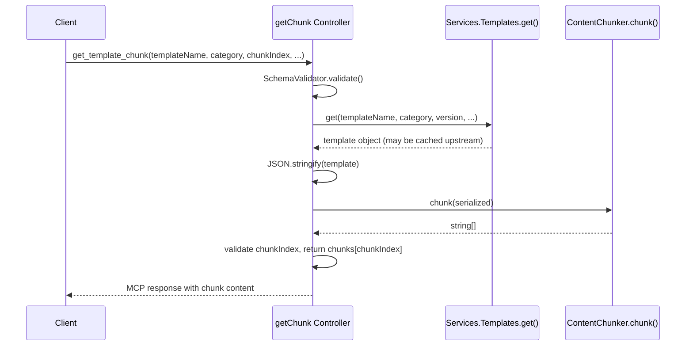
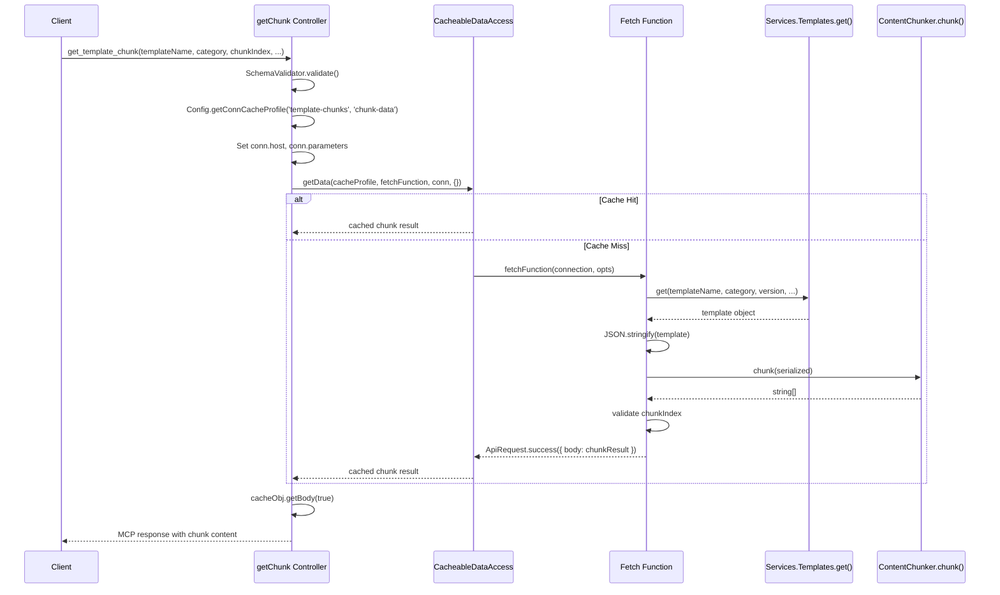

# Design Document: Template Chunk Internal Cache

## Overview

The `getChunk` controller currently serializes and chunks template content on every request, even when the upstream template data is already cached. This design introduces an internal caching layer around the chunking operation using the established `CacheableDataAccess` pattern from `@63klabs/cache-data`. Each individual chunk is cached by its index, so repeated requests for the same chunk of the same template version return instantly from cache without re-serializing or re-chunking.

The approach mirrors the existing `documentation-index` connection pattern which uses `host: 'internal'` for non-external data sources. A new `template-chunks` connection with a `chunk-data` cache profile will be added to `config/connections.js`, and the `getChunk` controller will be refactored to delegate to `CacheableDataAccess.getData()` instead of directly calling `Services.Templates.get()` and `ContentChunker.chunk()`.

## Architecture

### Current Flow



### Proposed Flow



### Key Design Decisions

1. **Cache per chunk, not per template**: Each `chunkIndex` gets its own cache entry. This avoids caching the entire chunk array (which could be large) and allows individual chunks to be served independently.

2. **Fetch function reads parameters from `connection.parameters`**: The fetch function does not close over controller variables. It reads `templateName`, `category`, `chunkIndex`, `version`, `versionId`, `s3Buckets`, and `namespace` from `connection.parameters`. This follows the established pattern in `services/templates.js`.

3. **TTL alignment**: The chunk cache TTL is set equal to or shorter than the `template-detail` TTL to prevent serving stale chunks after the underlying template has been refreshed.

4. **Error propagation inside fetch function**: `TEMPLATE_NOT_FOUND` errors are re-thrown so `CacheableDataAccess` does not cache error states. `INVALID_CHUNK_INDEX` is returned as `ApiRequest.error()` so the controller can format the appropriate MCP error response.


## Components and Interfaces

### 1. Connection Configuration (`config/connections.js`)

A new connection entry `template-chunks` is added to the `connections` array:

```javascript
// Template Chunk Internal Cache Connection
{
  name: 'template-chunks',
  host: 'internal',
  path: '/chunks',
  cache: [
    {
      profile: 'chunk-data',
      overrideOriginHeaderExpiration: true,
      defaultExpirationInSeconds: IS_PRODUCTION ? (24 * 60 * 60) : TTL_NON_PROD,
      expirationIsOnInterval: false,
      headersToRetain: '',
      hostId: 'template-chunks',
      pathId: 'data',
      encrypt: false
    }
  ]
}
```

- `host: 'internal'` follows the `documentation-index` precedent for non-external data sources.
- `defaultExpirationInSeconds` matches the `template-detail` profile (24 hours prod / 60s non-prod), satisfying Requirement 5 (chunk TTL ≤ template-detail TTL).
- `expirationIsOnInterval: false` ensures on-demand expiration per Requirement 1.4.

### 2. Refactored `getChunk` Controller (`controllers/templates.js`)

The controller is refactored to:

1. Validate input via `SchemaValidator.validate()` (unchanged).
2. Retrieve `{ conn, cacheProfile }` from `Config.getConnCacheProfile('template-chunks', 'chunk-data')`.
3. Resolve S3 buckets (default from settings if not provided).
4. Set `conn.host` to the resolved bucket list.
5. Set `conn.parameters` to `{ templateName, category, chunkIndex, version, versionId, s3Buckets, namespace }`.
6. Define the fetch function (see below).
7. Call `CacheableDataAccess.getData(cacheProfile, fetchFunction, conn, {})`.
8. Extract result via `cacheObj.getBody(true)`.
9. Return `MCPProtocol.successResponse(...)` with the chunk data.

### 3. Fetch Function

The fetch function is defined inside `getChunk` but reads all parameters from `connection.parameters`:

```javascript
const fetchFunction = async (connection, opts) => {
  const {
    templateName, category, chunkIndex,
    version, versionId, s3Buckets, namespace
  } = connection.parameters;

  // 1. Fetch full template
  const template = await Services.Templates.get({
    templateName, category, version, versionId, s3Buckets, namespace
  });

  if (!template) {
    const error = new Error(`Template not found: ${category}/${templateName}`);
    error.code = 'TEMPLATE_NOT_FOUND';
    error.availableTemplates = [];
    throw error;
  }

  // 2. Serialize and chunk
  const serialized = JSON.stringify(template);
  const chunks = ContentChunker.chunk(serialized);

  // 3. Validate chunkIndex
  if (chunkIndex < 0 || chunkIndex >= chunks.length) {
    return ApiRequest.error({
      body: {
        code: 'INVALID_CHUNK_INDEX',
        message: `chunkIndex ${chunkIndex} is out of range. Valid range: 0-${chunks.length - 1}`,
        validRange: { min: 0, max: chunks.length - 1 }
      }
    });
  }

  // 4. Return the specific chunk
  return ApiRequest.success({
    body: {
      chunkIndex,
      totalChunks: chunks.length,
      templateName,
      category,
      content: chunks[chunkIndex]
    }
  });
};
```

Key behaviors:
- `TEMPLATE_NOT_FOUND` is thrown (not returned as `ApiRequest.error()`), so `CacheableDataAccess` propagates it to the controller's catch block without caching the error.
- `INVALID_CHUNK_INDEX` is returned as `ApiRequest.error()` so the controller can detect it and format the MCP error response.
- All template identity and chunk parameters come from `connection.parameters`, not closure variables.

### 4. Required Imports

The controller needs two additional imports:

```javascript
const { cache: { CacheableDataAccess }, tools: { ApiRequest } } = require('@63klabs/cache-data');
const { Config } = require('../config');
```

### Interface Summary

| Component | Interface | Direction |
|-----------|-----------|-----------|
| `getChunk` controller | `Config.getConnCacheProfile('template-chunks', 'chunk-data')` | Controller → Config |
| `getChunk` controller | `CacheableDataAccess.getData(cacheProfile, fetchFn, conn, {})` | Controller → Cache |
| Fetch function | `Services.Templates.get(options)` | Fetch → Service |
| Fetch function | `ContentChunker.chunk(serialized)` | Fetch → Utility |
| Fetch function | `ApiRequest.success/error({body})` | Fetch → Cache framework |
| `getChunk` controller | `cacheObj.getBody(true)` | Cache → Controller |


## Data Models

### Cache Key Composition

`CacheableDataAccess` generates cache keys from the connection object. The key components are:

| Field | Value | Purpose |
|-------|-------|---------|
| `cacheProfile.hostId` | `'template-chunks'` | Identifies the connection type |
| `cacheProfile.pathId` | `'data'` | Identifies the cache profile |
| `conn.host` | `['bucket1', 'bucket2']` or `['63klabs']` | S3 bucket scope |
| `conn.parameters` | `{ templateName, category, chunkIndex, version, versionId, s3Buckets, namespace }` | Unique chunk identity |

The combination of `hostId`, `pathId`, `conn.host`, and `conn.parameters` produces a unique hash for each chunk of each template version.

### Cached Object Shape

The body stored in cache (and returned by `cacheObj.getBody(true)`) has this shape:

```javascript
{
  chunkIndex: 0,           // number - the requested chunk index
  totalChunks: 3,          // number - total chunks for this template
  templateName: 'template-storage-s3-artifacts', // string
  category: 'storage',     // string
  content: '...'           // string - the chunk content
}
```

### Error Object Shape (INVALID_CHUNK_INDEX)

When the fetch function returns `ApiRequest.error()`:

```javascript
{
  code: 'INVALID_CHUNK_INDEX',
  message: 'chunkIndex 5 is out of range. Valid range: 0-2',
  validRange: { min: 0, max: 2 }
}
```

### Connection Configuration Shape

```javascript
{
  name: 'template-chunks',
  host: 'internal',        // overridden at runtime to bucket list
  path: '/chunks',
  cache: [{
    profile: 'chunk-data',
    overrideOriginHeaderExpiration: true,
    defaultExpirationInSeconds: 86400, // production
    expirationIsOnInterval: false,
    headersToRetain: '',
    hostId: 'template-chunks',
    pathId: 'data',
    encrypt: false
  }]
}
```


## Correctness Properties

*A property is a characteristic or behavior that should hold true across all valid executions of a system — essentially, a formal statement about what the system should do. Properties serve as the bridge between human-readable specifications and machine-verifiable correctness guarantees.*

### Property 1: Fetch function produces correct chunk content

*For any* valid template object and *for any* valid chunkIndex (0 ≤ chunkIndex < totalChunks), the fetch function should return an `ApiRequest.success()` response whose body contains `content` equal to `ContentChunker.chunk(JSON.stringify(template))[chunkIndex]`, `totalChunks` equal to the length of the chunks array, and `chunkIndex` equal to the requested index.

**Validates: Requirements 2.1, 2.2**

### Property 2: Out-of-range chunkIndex produces error with valid range

*For any* valid template object and *for any* chunkIndex that is negative or ≥ the number of chunks produced by `ContentChunker.chunk(JSON.stringify(template))`, the fetch function should return an `ApiRequest.error()` response whose body includes the valid range `{ min: 0, max: totalChunks - 1 }`.

**Validates: Requirements 2.4**

### Property 3: Controller sets conn.parameters and conn.host correctly

*For any* valid input containing `templateName`, `category`, `chunkIndex`, and optional `version`, `versionId`, `s3Buckets`, and `namespace`, the controller should set `conn.parameters` to include all of these fields and set `conn.host` to the provided `s3Buckets` array (or the default buckets from settings when `s3Buckets` is not provided).

**Validates: Requirements 3.1, 3.2**

### Property 4: Controller output preserves chunk data in MCP format

*For any* cached chunk body containing `chunkIndex`, `totalChunks`, `templateName`, `category`, and `content`, the controller should return an MCP success response where `data.chunkIndex`, `data.totalChunks`, `data.templateName`, `data.category`, and `data.content` match the cached body values exactly.

**Validates: Requirements 4.2**

### Property 5: Chunk cache TTL does not exceed template-detail TTL

*For any* environment (production or non-production), the `chunk-data` cache profile's `defaultExpirationInSeconds` should be less than or equal to the `template-detail` cache profile's `defaultExpirationInSeconds`.

**Validates: Requirements 5.1**


## Error Handling

### Error Flow Summary

| Error Condition | Source | Handling | Cached? |
|----------------|--------|----------|---------|
| Invalid input (schema validation) | Controller | Return `MCPProtocol.errorResponse('INVALID_INPUT', ...)` before cache lookup | No |
| Missing conn/cacheProfile | Controller | Throw Error, caught by controller catch block → `INTERNAL_ERROR` | No |
| Template not found | Fetch function | Throw error with `code: 'TEMPLATE_NOT_FOUND'` — propagates through `CacheableDataAccess` to controller catch block | No (thrown, not returned) |
| Invalid chunkIndex | Fetch function | Return `ApiRequest.error({body: ...})` — controller detects error response and formats MCP error | Yes (cached as error by CacheableDataAccess) |
| Service/chunker failure | Fetch function | Unhandled exception propagates through `CacheableDataAccess` to controller catch block → `INTERNAL_ERROR` | No (thrown, not returned) |

### TEMPLATE_NOT_FOUND Handling

The fetch function throws `TEMPLATE_NOT_FOUND` errors rather than returning them via `ApiRequest.error()`. This is intentional:

1. `CacheableDataAccess` does not cache thrown exceptions — it only caches returned responses.
2. The error propagates to the controller's existing catch block which already handles `TEMPLATE_NOT_FOUND` with the correct MCP error format.
3. The `availableTemplates` property on the error object is preserved through the throw chain.

### INVALID_CHUNK_INDEX Handling

Invalid chunk indices are returned as `ApiRequest.error()` from the fetch function. The controller must check the response body for the `INVALID_CHUNK_INDEX` code after extracting via `cacheObj.getBody(true)` and return the appropriate MCP error response.

Note: Since `ApiRequest.error()` responses are cached by `CacheableDataAccess`, an invalid chunkIndex for a given template will be cached. This is acceptable because:
- The chunkIndex is part of `conn.parameters` and thus part of the cache key.
- A valid chunkIndex for the same template will have a different cache key and will not be affected.
- The cached error will expire with the same TTL as valid chunks.

### Input Validation Order

1. `SchemaValidator.validate('get_template_chunk', input)` — rejects malformed requests immediately.
2. `Config.getConnCacheProfile(...)` — fails if connection config is missing (should not happen in production).
3. `CacheableDataAccess.getData(...)` → fetch function — handles template-not-found and invalid-chunk-index.

## Testing Strategy

### Unit Tests (Jest)

Unit tests verify specific scenarios with mocked dependencies:

1. **Connection configuration tests**: Verify `template-chunks` connection exists with correct fields, `chunk-data` profile has correct `hostId`, `pathId`, TTL values, and `expirationIsOnInterval: false`.
2. **Controller integration tests**: Mock `CacheableDataAccess.getData()` and verify the controller calls it with correct arguments, extracts the body, and formats the MCP response.
3. **Error handling tests**: Verify `TEMPLATE_NOT_FOUND` propagation, `INVALID_CHUNK_INDEX` formatting, and schema validation rejection.
4. **Fetch function tests**: Mock `Services.Templates.get()` and verify the fetch function serializes, chunks, and returns the correct chunk.

### Property-Based Tests (fast-check + Jest)

Property-based tests validate universal properties across generated inputs. Each test references a design property and runs a minimum of 100 iterations.

- **Feature: template-chunk-internal-cache, Property 1: Fetch function produces correct chunk content** — Generate random template-like objects and valid chunk indices. Verify the fetch function output matches direct `JSON.stringify` + `ContentChunker.chunk` computation.

- **Feature: template-chunk-internal-cache, Property 2: Out-of-range chunkIndex produces error with valid range** — Generate random template objects and out-of-range indices (negative or ≥ totalChunks). Verify the fetch function returns an error with the correct valid range.

- **Feature: template-chunk-internal-cache, Property 3: Controller sets conn.parameters and conn.host correctly** — Generate random input parameter combinations. Verify `conn.parameters` contains all fields and `conn.host` resolves correctly.

- **Feature: template-chunk-internal-cache, Property 4: Controller output preserves chunk data in MCP format** — Generate random chunk body objects. Verify the MCP response data matches the input body.

- **Feature: template-chunk-internal-cache, Property 5: Chunk cache TTL does not exceed template-detail TTL** — Read both cache profiles from the connections config and verify the TTL constraint holds.

### Test Configuration

- Framework: Jest (`*.jest.mjs` files per workspace convention)
- Property testing library: `fast-check` (already in devDependencies)
- Minimum iterations per property test: 100
- Test location: `application-infrastructure/src/lambda/read/tests/`
- Each property test tagged with: `Feature: template-chunk-internal-cache, Property {N}: {title}`

