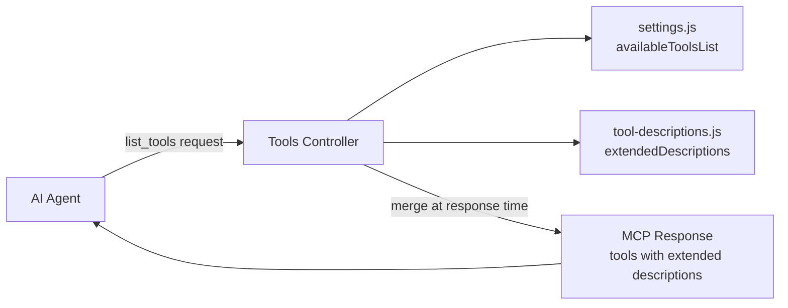

# Design Document: Tool Descriptions

## Overview

This design adds extended, AI-optimized tool descriptions to the Atlantis MCP Server without modifying the existing `settings.js` file. A new `config/tool-descriptions.js` module stores longer Markdown-rich descriptions keyed by tool name. The `controllers/tools.js` `list()` function merges these extended descriptions into the response at runtime, replacing the short `description` field on each tool object while preserving `name` and `inputSchema` unchanged.

The approach keeps `settings.js` as the single source of truth for tool names and input schemas, while giving AI agents the richer context they need to select the right tool.

## Architecture



The merge happens entirely within the `list()` function of the Tools Controller. No other controllers or modules are affected.

### Key Design Decisions

1. **Separate module, not inline**: Extended descriptions contain multi-line Markdown with examples and failure modes. Keeping them in a dedicated file avoids bloating `settings.js` and makes descriptions easier to review in PRs.

2. **Runtime merge, not mutation**: The controller creates shallow copies of tool objects with the `description` field replaced. The original `availableToolsList` array in settings is never modified.

3. **Graceful fallback**: If a tool has no extended description entry, the short description from `settings.js` is used. This prevents breakage if a new tool is added to settings before its extended description is written.

4. **Warning on stale keys**: If `tool-descriptions.js` contains a key that doesn't match any tool in `availableToolsList`, a warning is logged at module load time. This catches typos and leftover entries after tool renames.

## Components and Interfaces

### New Module: `config/tool-descriptions.js`

```javascript
/**
 * Extended tool descriptions for AI agent consumption.
 *
 * Maps tool name strings to Markdown-formatted extended descriptions.
 * These replace the short descriptions from settings.js in the list_tools response.
 *
 * @module config/tool-descriptions
 */

/**
 * @type {Object.<string, string>}
 */
const extendedDescriptions = {
  list_tools: `Retrieve the complete catalog of MCP tools ...`,
  list_templates: `List all CloudFormation templates ...`,
  // ... one entry per tool
};

module.exports = { extendedDescriptions };
```

**Exports:**
- `extendedDescriptions` — a plain object mapping tool name strings to extended description strings.

### Modified Module: `controllers/tools.js`

The `list()` function gains a merge step between reading `availableToolsList` and returning the response:

```javascript
const { extendedDescriptions } = require('../config/tool-descriptions');

async function list(props) {
  // ... existing validation ...

  const tools = settings.tools.availableToolsList;

  // Merge extended descriptions at response time
  const mergedTools = tools.map(tool => {
    const extended = extendedDescriptions[tool.name];
    if (extended) {
      return { ...tool, description: extended };
    }
    return tool;
  });

  return MCPProtocol.successResponse('list_tools', { tools: mergedTools });
}
```

### Validation at Module Load: `config/tool-descriptions.js`

At the bottom of the module, a self-check runs when the module is first `require()`d:

```javascript
const settings = require('./settings');

function validateDescriptions() {
  const toolNames = settings.tools.availableToolsList.map(t => t.name);
  const descriptionKeys = Object.keys(extendedDescriptions);

  for (const key of descriptionKeys) {
    if (!toolNames.includes(key)) {
      DebugAndLog.warn(`tool-descriptions: unmatched key "${key}" not found in availableToolsList`);
    }
  }
}

validateDescriptions();
```

## Data Models

### Extended Description Map

```
extendedDescriptions: Object.<string, string>
```

| Field | Type | Description |
|-------|------|-------------|
| key | `string` | Tool name matching `availableToolsList[].name` |
| value | `string` | Markdown-formatted extended description |

### Merged Tool Object (response-time only)

The merged tool object is a shallow copy of the original tool definition with the `description` field replaced:

| Field | Type | Source | Modified? |
|-------|------|--------|-----------|
| `name` | `string` | `settings.js` | No |
| `description` | `string` | `tool-descriptions.js` (or fallback to `settings.js`) | Yes — replaced |
| `inputSchema` | `object` | `settings.js` | No |

No new database tables, DynamoDB items, or S3 objects are introduced.

