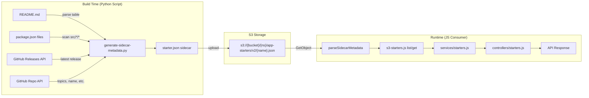

# Design Document: Update Generate Sidecar Metadata Script

## Overview

This design covers two coordinated changes:

1. **Python script** (`scripts/generate-sidecar-metadata.py`): Update to parse a README markdown table for categorized languages/frameworks/features, output a new JSON structure with `buildDeploy`/`applicationStack`/`postDeploy` sub-keys, switch all property names to camelCase, extract `displayName` from the README heading, fetch version from GitHub Releases, and scan for `package.json` at multiple directory depths under `src/`.

2. **JS consumer** (`application-infrastructure/src/lambda/read/models/s3-starters.js`): Update `parseSidecarMetadata()` to parse the new categorized structure, accept both snake_case and camelCase input but always output camelCase, add `displayName` support, and update all hardcoded fallback objects in `list()` and `get()`.

3. **Tests** (`application-infrastructure/src/lambda/read/tests/unit/models/s3-starters-dao.test.js`): Replace existing tests entirely with new tests validating the categorized format, camelCase output, and `displayName`.

The data flow is: Python script → S3 JSON sidecar file → JS consumer `parseSidecarMetadata()` → service/controller layers → API response.

## Architecture



### Key Design Decisions

1. **Single table per README**: The parser expects exactly one table. If multiple tables exist, only the first is parsed. This simplifies the parser and matches the README-example.md format.

2. **No backward compatibility**: Since the project is pre-release, the consumer does not need to handle the old flat array format. The `parseSidecarMetadata()` function is rewritten for the new structure only.

3. **Dual input casing, single output casing**: The consumer accepts both `deployment_platform` and `deploymentPlatform` as input (for flexibility), but always outputs camelCase. This is a one-way normalization.

4. **Table + file detection fallback for features**: If the README table has no Features row, `features.applicationStack` is populated from file detection heuristics. `features.buildDeploy` and `features.postDeploy` default to `[]`.

5. **Dash cell means empty array**: If a table cell contains only a dash (`-`), it is treated as an empty array `[]`.

6. **Version from GitHub Releases with package.json fallback**: The script first tries the GitHub Releases API for `vX.X.X (YYYY-MM-DD)` format. If no releases exist, it falls back to `package.json` version without a date.

7. **Multi-path package.json scanning**: The script scans `./package.json`, `application-infrastructure/src/package.json`, and `application-infrastructure/src/*/*/package.json` (up to 3 levels deep from `src/`).

## Components and Interfaces

### Component 1: README Table Parser (Python)

New function `parse_readme_table(repo_path: Path) -> Dict` that:

- Reads README.md and finds the first markdown table
- Identifies columns: the first column is the row label, then Build/Deploy, Application Stack, and optionally Post-Deploy
- Extracts rows: Languages, Frameworks, Features (case-insensitive bold match like `**Languages**`)
- Parses comma-separated values from each cell
- Returns a dict with categorized structure for each row type
- Treats a cell containing only `-` as an empty array

```python
def parse_readme_table(repo_path: Path) -> Dict:
    """Parse the README table into categorized structures.

    Returns:
        dict: {
            'languages': {'buildDeploy': [], 'applicationStack': [], 'postDeploy': []},
            'frameworks': {'buildDeploy': [], 'applicationStack': [], 'postDeploy': []},
            'features': {'buildDeploy': [], 'applicationStack': [], 'postDeploy': []},
            'hasTable': bool,
            'hasFeaturesRow': bool
        }
    """
```

### Component 2: Display Name Extractor (Python)

New function `extract_display_name(repo_path: Path) -> str` that:

- Reads README.md and finds the first `# heading`
- Returns the heading text stripped of the `#` prefix
- Returns empty string if no heading found

### Component 3: GitHub Releases Version Fetcher (Python)

New function `fetch_github_release_version(repo_full_name: str, github_token: Optional[str]) -> str` that:

- Calls `GET /repos/{owner}/{repo}/releases/latest`
- Returns `"{tag_name} ({published_at_date})"` e.g. `"v1.2.3 (2024-06-15)"`
- Returns empty string if no releases or API error

### Component 4: Multi-Path Package.json Scanner (Python)

Updated `extract_from_package_json` logic to scan:

1. `{repo_path}/package.json`
2. `{repo_path}/application-infrastructure/src/package.json`
3. `{repo_path}/application-infrastructure/src/*/*/package.json` (glob, up to 3 levels from `src/`)

Dependencies from all found `package.json` files are merged (deduplicated).

### Component 5: Updated `generate_metadata()` (Python)

The main orchestrator function is updated to:

- Call `parse_readme_table()` for categorized languages/frameworks/features
- Call `extract_display_name()` for `displayName`
- Call `fetch_github_release_version()` for version (with `package.json` fallback)
- Use multi-path scanning for dependencies
- Apply features fallback (file detection → `applicationStack`) when table has no Features row
- Output all properties in camelCase

### Component 6: Updated `parseSidecarMetadata()` (JS)

The consumer function is rewritten to:

- Parse `languages`, `frameworks`, `features` as categorized objects `{buildDeploy, applicationStack, postDeploy}`
- Accept both snake_case and camelCase input property names
- Always output camelCase property names
- Include `displayName` field
- Return a consistent default structure on parse error

```javascript
function parseSidecarMetadata(metadataContent) {
  // Returns:
  // {
  //   name, displayName, description,
  //   languages: { buildDeploy: [], applicationStack: [], postDeploy: [] },
  //   frameworks: { buildDeploy: [], applicationStack: [], postDeploy: [] },
  //   features: { buildDeploy: [], applicationStack: [], postDeploy: [] },
  //   topics: [],
  //   dependencies: [], devDependencies: [],
  //   hasCacheData: false,
  //   deploymentPlatform: 'atlantis',
  //   prerequisites: [],
  //   author: '', license: '', repository: '',
  //   repositoryType: 'app-starter',
  //   version: '', lastUpdated: ''
  // }
}
```

### Component 7: Updated Fallback Objects in `list()` and `get()` (JS)

The hardcoded fallback objects for starters without sidecar metadata (in both `list()` and `get()`) are updated to use the new categorized structure and camelCase property names.

## Data Models

### Sidecar JSON Output (Python Script)

```json
{
  "name": "atlantis-starter-02",
  "displayName": "Basic API Gateway with Lambda Function Written in Node.js",
  "description": "A very simple example...",
  "languages": {
    "buildDeploy": ["Python", "Shell"],
    "applicationStack": ["Node.js"],
    "postDeploy": []
  },
  "frameworks": {
    "buildDeploy": ["Atlantis"],
    "applicationStack": ["Atlantis"],
    "postDeploy": []
  },
  "features": {
    "buildDeploy": ["SSM Parameters"],
    "applicationStack": ["API Gateway", "Lambda", "CloudWatch Logs", "CloudWatch Alarms"],
    "postDeploy": []
  },
  "topics": ["serverless", "aws", "lambda"],
  "dependencies": ["@63klabs/cache-data", "express"],
  "devDependencies": ["jest"],
  "hasCacheData": true,
  "deploymentPlatform": "atlantis",
  "prerequisites": ["Node.js 18.x or later", "npm or yarn"],
  "repository": "github.com/63Klabs/atlantis-starter-02",
  "author": "63Klabs",
  "license": "MIT",
  "repositoryType": "app-starter",
  "version": "v1.2.3 (2024-06-15)",
  "lastUpdated": "2024-06-15T10:30:00Z"
}
```

### Categorized Structure Schema

```typescript
interface CategorizedStructure {
  buildDeploy: string[];
  applicationStack: string[];
  postDeploy: string[];
}
```

Used for `languages`, `frameworks`, and `features`. The `postDeploy` key is always present, even when empty.

### Consumer Output (JS `parseSidecarMetadata`)

Same shape as the sidecar JSON above. All property names are camelCase. The consumer accepts both `deployment_platform` / `deploymentPlatform` as input but outputs `deploymentPlatform`.

### Fallback Object (No Sidecar Metadata)

When a starter has no sidecar JSON file, the fallback object uses the same schema with empty/default values:

```javascript
{
  name: starterName,
  displayName: '',
  description: '',
  languages: { buildDeploy: [], applicationStack: [], postDeploy: [] },
  frameworks: { buildDeploy: [], applicationStack: [], postDeploy: [] },
  features: { buildDeploy: [], applicationStack: [], postDeploy: [] },
  topics: [],
  dependencies: [],
  devDependencies: [],
  hasCacheData: false,
  deploymentPlatform: '',
  prerequisites: [],
  author: '',
  license: '',
  repository: '',
  repositoryType: 'app-starter',
  version: '',
  lastUpdated: '',
  hasSidecarMetadata: false,
  // ... s3 path fields
}
```


## Correctness Properties

*A property is a characteristic or behavior that should hold true across all valid executions of a system — essentially, a formal statement about what the system should do. Properties serve as the bridge between human-readable specifications and machine-verifiable correctness guarantees.*

### Property 1: Table parsing round-trip

*For any* valid markdown table with columns Build/Deploy, Application Stack, and optionally Post-Deploy, and rows Languages, Frameworks, and/or Features containing comma-separated values, parsing the table should produce categorized structure arrays whose elements match exactly the comma-separated values from each cell (trimmed, in order). If a cell contains only a dash `-`, the corresponding array should be empty.

**Validates: Requirements 1.1, 1.2, 7.1**

### Property 2: Only first table parsed

*For any* README containing two or more markdown tables, the parser should return data only from the first table. The values from subsequent tables should not appear in the output.

**Validates: Requirements 1.4**

### Property 3: Output structure invariant

*For any* input to the metadata generator, the output JSON must have `languages`, `frameworks`, and `features` as objects each containing exactly the keys `buildDeploy`, `applicationStack`, and `postDeploy` (each an array of strings), and `topics` as a flat array of strings.

**Validates: Requirements 2.1, 2.2, 2.3**

### Property 4: All output keys are camelCase

*For any* output JSON produced by the metadata generator, every top-level property name must match the pattern `^[a-z][a-zA-Z0-9]*$` (camelCase with no underscores).

**Validates: Requirements 3.1, 3.2, 3.3, 3.4**

### Property 5: displayName extraction round-trip

*For any* README containing a first-level heading (`# Some Title`), the `displayName` field in the output should equal the heading text (stripped of the `# ` prefix and trimmed). For READMEs without a first-level heading, `displayName` should be an empty string.

**Validates: Requirements 4.1, 4.3**

### Property 6: Version format from GitHub Releases

*For any* GitHub release with a tag name and published date, the `version` field in the output should match the format `{tag_name} (YYYY-MM-DD)` where the date is the release's `published_at` date. When no releases exist, the version should equal the `package.json` version (no date suffix).

**Validates: Requirements 5.1, 5.2**

### Property 7: Dependency merge from multiple package.json files

*For any* set of `package.json` files found at the scanned paths, the output `dependencies` array should contain the union of all dependency names from all files, with no duplicates.

**Validates: Requirements 6.4**

### Property 8: Consumer parsing preserves categorized structure

*For any* valid sidecar JSON containing `languages`, `frameworks`, and `features` as categorized structure objects, `parseSidecarMetadata` should return those same categorized structures with identical `buildDeploy`, `applicationStack`, and `postDeploy` arrays.

**Validates: Requirements 8.1**

### Property 9: Consumer normalizes input casing to camelCase output

*For any* sidecar JSON where property names are randomly chosen between snake_case and camelCase variants (e.g., `deployment_platform` vs `deploymentPlatform`), `parseSidecarMetadata` should always output the camelCase variant with the correct value.

**Validates: Requirements 8.2, 8.3**

## Error Handling

### Python Script

| Error Condition | Handling |
|---|---|
| README.md not found | `displayName` = `""`, table results = empty categorized structures, description from other sources |
| README table malformed (missing columns, wrong format) | Treat as no table found — empty categorized structures |
| Table cell contains only `-` | Treat as empty array `[]` |
| `package.json` parse error at any path | Log warning, skip that file, continue scanning other paths |
| GitHub Releases API error or no releases | Fall back to `package.json` version; if that also missing, `version` = `""` |
| GitHub Repo API error | Log warning, continue with local-only metadata |
| No `--repo-path` and no `--github-repo` | Print error, exit with code 1 (existing behavior) |
| `--repo-path` does not exist | Print error, exit with code 1 (existing behavior) |

### JS Consumer

| Error Condition | Handling |
|---|---|
| Invalid JSON in sidecar content | Log error via `DebugAndLog.error`, return default object with empty categorized structures and camelCase keys |
| Missing fields in sidecar JSON | Default to empty values (empty string, empty array, empty categorized structure, `false`, `'atlantis'`, `'app-starter'`) |
| Both snake_case and camelCase present for same field | camelCase takes priority (e.g., `deploymentPlatform` over `deployment_platform`) |

## Testing Strategy

### Overview

Tests use a dual approach: unit tests for specific examples/edge cases and property-based tests for universal properties across generated inputs. All new tests are written in Jest. Existing tests in `s3-starters-dao.test.js` are replaced entirely.

### Python Script Tests

Python tests are not in scope for this spec since the existing test infrastructure is Jest-based for the JS consumer. The Python script is validated through manual testing and CI/CD pipeline execution. However, the correctness properties (1–7) describe what the script must satisfy and can guide future Python test development.

### JS Consumer Tests

**Test file**: `application-infrastructure/src/lambda/read/tests/unit/models/s3-starters-dao.test.js`

**Property-based testing library**: [fast-check](https://github.com/dubzzz/fast-check) (for Jest)

**Configuration**: Each property test runs a minimum of 100 iterations.

**Tag format**: Each property test includes a comment referencing the design property:
```
// Feature: update-generate-sidecar-metadata-script.py, Property N: {property_text}
```

#### Unit Tests (Examples and Edge Cases)

1. `parseSidecarMetadata` with valid categorized JSON — verify all fields parsed correctly
2. `parseSidecarMetadata` with invalid JSON — verify default object returned
3. `parseSidecarMetadata` with minimal JSON (only `name`) — verify defaults for missing fields
4. `parseSidecarMetadata` with `displayName` field — verify it is preserved
5. `parseSidecarMetadata` with snake_case input (`deployment_platform`, `repository_type`, `last_updated`) — verify camelCase output
6. `parseSidecarMetadata` with camelCase input (`deploymentPlatform`, `repositoryType`, `lastUpdated`) — verify camelCase output
7. `parseSidecarMetadata` with mixed snake_case and camelCase input — verify camelCase output
8. `list()` with no sidecar metadata — verify fallback object uses categorized structure and camelCase
9. `get()` with no sidecar metadata — verify fallback object uses categorized structure and camelCase
10. `list()` with sidecar metadata — verify categorized structure flows through
11. `get()` with sidecar metadata — verify categorized structure flows through
12. Helper functions (`buildStarterZipKey`, `buildStarterMetadataKey`, `extractAppNameFromKey`, `deduplicateStarters`) — existing behavior preserved

#### Property Tests

1. **Property 8: Consumer parsing preserves categorized structure**
   - Generator: random categorized structure objects with random string arrays for `buildDeploy`, `applicationStack`, `postDeploy`
   - Assertion: `parseSidecarMetadata(JSON.stringify(input))` returns matching categorized structures
   - Tag: `// Feature: update-generate-sidecar-metadata-script.py, Property 8: Consumer parsing preserves categorized structure`

2. **Property 9: Consumer normalizes input casing to camelCase output**
   - Generator: random sidecar JSON where each dual-name field randomly uses snake_case or camelCase key
   - Assertion: output always has camelCase keys with correct values
   - Tag: `// Feature: update-generate-sidecar-metadata-script.py, Property 9: Consumer normalizes input casing to camelCase output`

3. **Property 3 (consumer side): Output structure invariant**
   - Generator: random valid or partial sidecar JSON
   - Assertion: output always has `languages`, `frameworks`, `features` as objects with `buildDeploy`, `applicationStack`, `postDeploy` arrays, and `topics` as flat array
   - Tag: `// Feature: update-generate-sidecar-metadata-script.py, Property 3: Output structure invariant`

4. **Property 4 (consumer side): All output keys are camelCase**
   - Generator: random sidecar JSON with mixed casing
   - Assertion: every key in the output matches `^[a-z][a-zA-Z0-9]*$`
   - Tag: `// Feature: update-generate-sidecar-metadata-script.py, Property 4: All output keys are camelCase`
