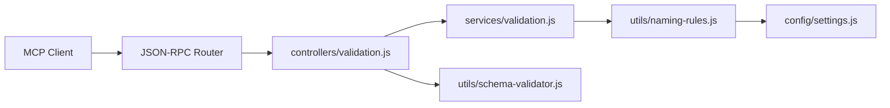
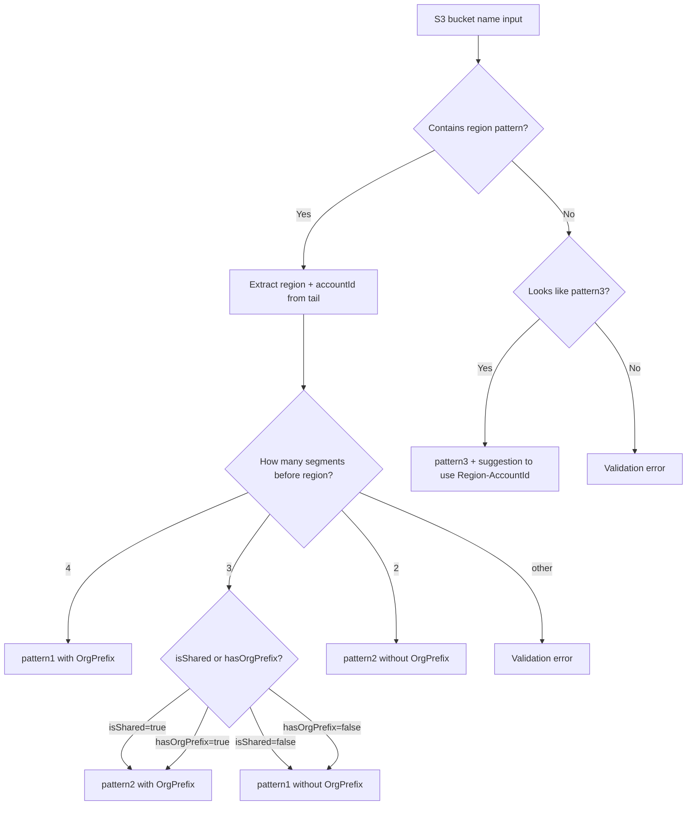

# Design Document: Update Validate Naming Tool

## Overview

This design updates the `validate_naming` MCP tool to align with the actual Atlantis platform naming conventions. The key changes are:

1. Replace hardcoded `allowedStageIds` with regex-based pattern validation (`^[tbsp][a-z0-9]*$`)
2. Add `isShared` parameter to support resources without a StageId
3. Rewrite S3 bucket parsing to handle region hyphens correctly and support patterns with/without OrgPrefix
4. Add a third "not preferred" S3 pattern (`Prefix-ProjectId-StageId-ResourceSuffix`)
5. Add PascalCase warnings (not errors) for ResourceSuffix components
6. Update auto-detection to use flexible StageId patterns
7. Update schema and tool definitions for new parameters
8. Ensure round-trip consistency of parsed components

The changes span six files: `naming-rules.js`, `services/validation.js`, `controllers/validation.js`, `config/settings.js`, `schema-validator.js`, and their corresponding tests.

## Architecture

The existing layered architecture is preserved. The request flows through:



New parameters (`isShared`, `hasOrgPrefix`) are added at the schema level and threaded through each layer:

- `schema-validator.js` — validates input types
- `settings.js` — tool definition with `inputSchema`
- `controllers/validation.js` — extracts params from request, passes to service
- `services/validation.js` — orchestrates detection and validation, passes to naming-rules
- `naming-rules.js` — core validation logic

No new modules are introduced. The changes are additive modifications to existing functions.

## Components and Interfaces

### 1. `naming-rules.js` — Core Validation

#### `validateApplicationResource(name, options)`

Updated signature for `options`:

```javascript
/**
 * @param {string} name
 * @param {Object} options
 * @param {string} [options.resourceType='lambda']
 * @param {string} [options.prefix]
 * @param {string} [options.projectId]
 * @param {string} [options.stageId]
 * @param {boolean} [options.isShared=false] — NEW: if true, accept 3-component names without StageId
 * @param {boolean} [options.partial=false]
 * @returns {{valid: boolean, errors: string[], suggestions: string[], components: Object}}
 */
```

Changes:
- Remove `allowedStageIds` parameter and hardcoded list
- Add `isShared` parameter (default `false`)
- When `isShared` is `true`, accept `Prefix-ProjectId-ResourceSuffix` (3 parts)
- When `isShared` is `false`, require 4+ parts and validate StageId with `^[tbsp][a-z0-9]*$`
- Add PascalCase check on ResourceSuffix: if it doesn't start with uppercase or contains consecutive uppercase letters, add a suggestion (not an error)
- Rename `components.resourceName` to `components.resourceSuffix` for consistency with glossary

#### `validateS3Bucket(name, options)`

Updated signature for `options`:

```javascript
/**
 * @param {string} name
 * @param {Object} options
 * @param {string} [options.orgPrefix]
 * @param {string} [options.prefix]
 * @param {string} [options.projectId]
 * @param {string} [options.stageId]
 * @param {string} [options.region]
 * @param {string} [options.accountId]
 * @param {boolean} [options.isShared=false] — NEW
 * @param {boolean} [options.hasOrgPrefix] — NEW: disambiguate OrgPrefix presence
 * @param {boolean} [options.partial=false]
 * @returns {{valid: boolean, errors: string[], suggestions: string[], components: Object, pattern: string}}
 */
```

**Critical change — Region parsing strategy:**

The current implementation splits on hyphens naively, which breaks for regions like `us-east-1` (3 hyphen-separated tokens). The new approach:

1. Use a regex to find the region pattern within the full name: `/([a-z]{2})-([a-z]+)-(\d+)/`
2. Locate the region's position in the string to split the name into segments before-region, region, and after-region (AccountId)
3. The segments before the region are split by hyphen to extract OrgPrefix (optional), Prefix, ProjectId, and StageId (optional)

Pattern detection logic (after extracting region and accountId from the tail):

| Before-region segments | hasOrgPrefix | isShared | Pattern |
|---|---|---|---|
| 4 (org, prefix, project, stage) | true/auto | false | pattern1 with OrgPrefix |
| 3 (prefix, project, stage) | false/auto | false | pattern1 without OrgPrefix |
| 3 (org, prefix, project) | true/auto | true | pattern2 with OrgPrefix (shared) |
| 2 (prefix, project) | false/auto | true | pattern2 without OrgPrefix (shared) |

If no region is found in the name, fall back to pattern3 detection:
- Split by hyphen, treat as `[OrgPrefix-]Prefix-ProjectId-StageId-ResourceSuffix`
- Mark as `pattern3` and add suggestion recommending Region-AccountId patterns

When `hasOrgPrefix` is explicitly provided, use it to disambiguate. When not provided, use heuristics based on segment count and `isShared`.

**Ambiguity resolution for 3 before-region segments:**
- If `isShared` is `true` → interpret as `OrgPrefix-Prefix-ProjectId` (pattern2 with OrgPrefix)
- If `isShared` is `false` → interpret as `Prefix-ProjectId-StageId` (pattern1 without OrgPrefix)
- If `hasOrgPrefix` is explicitly set, use that to override

#### `detectResourceType(name)`

Changes:
- Replace `['test', 'beta', 'stage', 'prod'].includes(...)` with `/^[tbsp][a-z0-9]*$/.test(...)`
- Keep S3 detection via region pattern matching (already works on the full string)

#### New helper: `isValidStageId(stageId)`

```javascript
/**
 * @param {string} stageId
 * @returns {boolean}
 */
function isValidStageId(stageId) {
  return /^[tbsp][a-z0-9]*$/.test(stageId);
}
```

#### New helper: `checkPascalCase(resourceSuffix)`

```javascript
/**
 * @param {string} resourceSuffix
 * @returns {string[]} Array of warning messages (empty if PascalCase is correct)
 */
function checkPascalCase(resourceSuffix) {
  const warnings = [];
  if (resourceSuffix && !/^[A-Z]/.test(resourceSuffix)) {
    warnings.push(`ResourceSuffix '${resourceSuffix}' should start with an uppercase letter (PascalCase)`);
  }
  if (resourceSuffix && /[A-Z]{2,}/.test(resourceSuffix)) {
    warnings.push(`ResourceSuffix '${resourceSuffix}' contains consecutive uppercase letters. Only the first letter of acronyms should be capitalized (e.g., 'Api' not 'API', 'Mcp' not 'MCP')`);
  }
  return warnings;
}
```

### 2. `services/validation.js`

Changes:
- Accept `isShared` and `hasOrgPrefix` from options
- Remove hardcoded `allowedStageIds` from config
- Pass `isShared` and `hasOrgPrefix` through to `NamingRules.validateNaming()`

### 3. `controllers/validation.js`

Changes:
- Extract `isShared` and `hasOrgPrefix` from `input` alongside `resourceName` and `resourceType`
- Pass them to `Services.Validation.validateNaming()`

### 4. `config/settings.js`

Changes to `validate_naming` tool definition in `availableToolsList`:
- Add `isShared` boolean property to `inputSchema.properties`
- Add `hasOrgPrefix` boolean property to `inputSchema.properties`
- Update description to mention shared resources and OrgPrefix support

### 5. `schema-validator.js`

Changes to `validate_naming` schema:
- Add `isShared: { type: 'boolean', description: '...' }`
- Add `hasOrgPrefix: { type: 'boolean', description: '...' }`


## Data Models

### Validation Result Object

The result object returned by all validation functions:

```javascript
{
  valid: boolean,           // true if no errors (warnings in suggestions don't affect this)
  errors: string[],         // validation errors
  suggestions: string[],    // warnings and recommendations (PascalCase, pattern3 advisory, etc.)
  components: {
    orgPrefix?: string,     // S3 only, when present
    prefix: string,
    projectId: string,
    stageId?: string,       // absent for shared resources
    resourceSuffix?: string,// application resources and pattern3 S3
    region?: string,        // S3 pattern1/pattern2
    accountId?: string      // S3 pattern1/pattern2
  },
  resourceType: string,     // 'application', 's3', 'lambda', 'dynamodb', 'cloudformation'
  pattern?: string          // S3 only: 'pattern1', 'pattern2', 'pattern3'
}
```

### Input Parameters

```javascript
{
  resourceName: string,       // required
  resourceType?: string,      // optional, auto-detected if omitted
  isShared?: boolean,         // optional, default false
  hasOrgPrefix?: boolean      // optional, used for S3 disambiguation
}
```

### StageId Validation

Old model (removed):
```javascript
allowedStageIds: ['test', 'beta', 'stage', 'prod']
```

New model:
```javascript
const STAGE_ID_PATTERN = /^[tbsp][a-z0-9]*$/;
```

### S3 Pattern Detection Decision Tree



