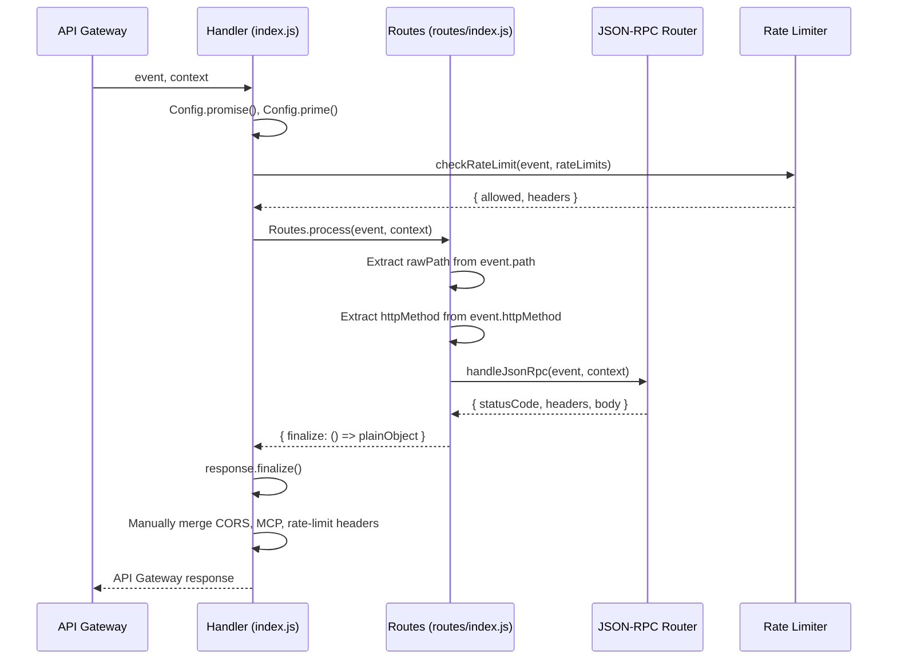
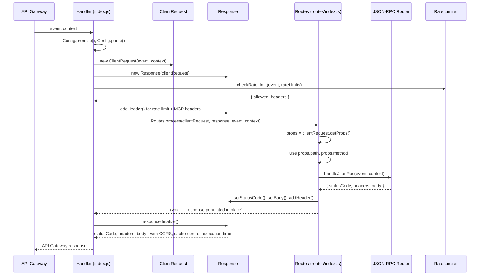

# Design Document: Use ClientRequest and Response Classes

## Overview

This design refactors the Read Lambda handler (`index.js`) and routes module (`routes/index.js`) to use the `ClientRequest` and `Response` classes from `@63klabs/cache-data` instead of manual request parsing and response construction.

Currently, the handler imports `Response` but only uses it in the catch block (as a standalone error response). The routes module manually extracts `rawPath` from `event.path || event.requestContext?.resourcePath` and `httpMethod` from `event.httpMethod`. Both modules manually add CORS, MCP, and rate-limit headers to plain response objects. The `{ finalize: () => plainObject }` wrapper pattern in routes is an ad-hoc substitute for the framework's `Response` class.

After refactoring, the handler will create a `ClientRequest` from the event/context, create a `Response` linked to that `ClientRequest`, pass both to routes, and call `response.finalize()` once at the end. Routes will use `clientRequest.getProps()` for path/method extraction and populate the shared `Response` instance instead of returning wrapper objects. CORS headers, cache-control, execution-time tracking, and request/response logging will be handled automatically by `Response.finalize()`.

### Key Benefits

- Eliminates manual request property extraction (path, method, requestId)
- Eliminates manual CORS header management (handled by `Response.finalize()`)
- Enables automatic request/response logging via the `ClientRequest`↔`Response` link
- Enables automatic execution-time header via `Response.finalize()`
- Removes the ad-hoc `{ finalize: () => obj }` wrapper pattern
- Removes commented-out metric/logging code that `Response` now handles
- Centralizes response finalization in the handler (single `response.finalize()` call)

## Architecture

### Current Flow



### Refactored Flow



### Design Decisions

1. **Pass `event` and `context` alongside `clientRequest` and `response` to Routes**: The JSON-RPC Router (`handleJsonRpc`) parses `event.body` directly and needs the raw event. Rather than extracting the raw event back out of `clientRequest`, we pass it explicitly. This keeps the JSON-RPC Router unchanged.

2. **Rate limiter still receives raw `event`**: The rate limiter extracts `event.requestContext.identity.sourceIp` and `event.headers['X-Forwarded-For']`. Since `checkRateLimit` is called before routing and its interface is stable, we keep passing the raw event to it.

3. **Handler owns `response.finalize()`**: Only the handler calls `finalize()`. Routes populate the response but never finalize it. This ensures a single finalization point and consistent header management.

4. **`response` declared in outer scope**: The `response` variable is declared before the try block so the catch block can reuse the existing `Response` instance (linked to `ClientRequest`) if it was created before the error occurred. If not, the catch block falls back to a standalone `Response({statusCode: 500})`.

5. **MCP and rate-limit headers added via `response.addHeader()` before `finalize()`**: These custom headers are not managed by the framework, so they must be added explicitly. CORS headers are removed from manual addition since `Response.finalize()` handles them based on referrer validation configured in `validations.js`.

6. **Routes no longer returns a value**: Instead of returning `{ finalize: () => obj }`, the `process` function is now effectively void — it populates the shared `response` instance. The handler calls `response.finalize()` after `process` completes.

## Components and Interfaces

### Handler (`index.js`) — Modified

```javascript
// New imports
const { tools: { DebugAndLog, ClientRequest, Response, Timer } } = require("@63klabs/cache-data");

exports.handler = async (event, context) => {
  let response = null;
  let clientRequest = null;

  try {
    await Config.promise();
    await Config.prime();
    if (coldStartInitTimer.isRunning()) { DebugAndLog.log(coldStartInitTimer.stop(), "COLDSTART"); }

    // Create ClientRequest and Response
    clientRequest = new ClientRequest(event, context);
    response = new Response(clientRequest);

    // Rate limiting (still uses raw event for IP extraction)
    const rateLimitCheck = await RateLimiter.checkRateLimit(event, Config.settings().rateLimits);

    if (!rateLimitCheck.allowed) {
      if (rateLimitCheck.dynamoPromise) { await rateLimitCheck.dynamoPromise; }
      return RateLimiter.createRateLimitResponse(rateLimitCheck.headers, rateLimitCheck.retryAfter);
    }

    // Add rate-limit and MCP headers before routing
    for (const [name, value] of Object.entries(rateLimitCheck.headers)) {
      response.addHeader(name, value);
    }
    response.addHeader('X-MCP-Version', '1.0');

    // Route request
    await Routes.process(clientRequest, response, event, context);

    // Await DynamoDB update
    if (rateLimitCheck.dynamoPromise) { await rateLimitCheck.dynamoPromise; }

    return response.finalize();

  } catch (error) {
    const requestId = event.requestContext?.requestId || context?.awsRequestId || 'unknown';
    DebugAndLog.error(`Unhandled Execution Error in Handler  Error: ${error.message}`, error.stack);

    // Reuse existing response if available, otherwise create standalone
    if (!response) {
      response = new Response({ statusCode: 500 });
    } else {
      response.setStatusCode(500);
    }
    response.addHeader('X-Request-Id', requestId);
    response.addHeader('X-MCP-Version', '1.0');
    response.setBody({
      message: 'Error initializing request - 1701-D',
      requestId: requestId
    });
    return response.finalize();
  }
};
```

**Key changes:**
- Import `ClientRequest` from `@63klabs/cache-data`
- Create `clientRequest` and `response` after cold-start init, before rate limiting
- Declare both in outer scope for catch block access
- Remove manual CORS header addition (handled by `Response.finalize()`)
- Remove manual `Content-Type` header in catch block (handled by `Response.finalize()`)
- Remove commented-out `ErrorHandler.logRequest()`, `ErrorHandler.emitLatencyMetric()`, `ErrorHandler.emitErrorMetric()` blocks and TODO comment
- Remove `console.log("SETTINGS", Config.settings())` debug line
- Call `response.finalize()` once at the end instead of on the routes return value

### Routes (`routes/index.js`) — Modified

```javascript
const { tools: { DebugAndLog } } = require('@63klabs/cache-data');

/**
 * Process incoming request and route to JSON-RPC Router.
 *
 * @param {ClientRequest} clientRequest - Parsed request instance
 * @param {Response} response - Response instance to populate
 * @param {Object} event - Raw API Gateway event (for JSON-RPC Router)
 * @param {Object} context - Raw Lambda context (for JSON-RPC Router)
 * @returns {Promise<void>}
 */
const process = async (clientRequest, response, event, context) => {
  const props = clientRequest.getProps();
  const path = props.path || '';
  const method = (props.method || '').toUpperCase();

  const JsonRpcRouter = require('../utils/json-rpc-router');
  const MCPProtocol = require('../utils/mcp-protocol');

  if (path.endsWith('/mcp/v1') && method === 'POST') {
    DebugAndLog.info('Routing /mcp/v1 POST to JSON-RPC Router');
    const jsonRpcResponse = await JsonRpcRouter.handleJsonRpc(event, context);

    response.setStatusCode(jsonRpcResponse.statusCode);
    response.setBody(JSON.parse(jsonRpcResponse.body));
    if (jsonRpcResponse.headers) {
      for (const [name, value] of Object.entries(jsonRpcResponse.headers)) {
        // Skip headers that Response.finalize() manages
        if (!['content-type', 'access-control-allow-origin', 'access-control-allow-methods', 'access-control-allow-headers'].includes(name.toLowerCase())) {
          response.addHeader(name, value);
        }
      }
    }
    return;
  }

  DebugAndLog.warn('Invalid request path or method', { path, method });
  const errorBody = MCPProtocol.jsonRpcError(
    null,
    MCPProtocol.JSON_RPC_ERRORS.METHOD_NOT_FOUND,
    'Not found',
    { details: `Only POST /mcp/v1 is supported. Received ${method} ${path}` }
  );
  response.setStatusCode(400);
  response.setBody(errorBody);
};

module.exports = { process };
```

**Key changes:**
- Signature: `process(clientRequest, response, event, context)` instead of `process(event, context)`
- Use `clientRequest.getProps()` for path and method instead of manual extraction
- Populate `response` via `setStatusCode()`, `setBody()`, `addHeader()` instead of returning wrapper
- No return value (void) — response is populated in place
- Skip CORS/Content-Type headers from JSON-RPC Router since `Response.finalize()` handles them

### Unchanged Modules

- **JSON-RPC Router** (`utils/json-rpc-router.js`): No changes. Still receives raw `event` and `context`. Still returns `{ statusCode, headers, body }` plain objects.
- **Rate Limiter** (`utils/rate-limiter.js`): No changes. Still receives raw `event` for IP extraction.
- **Config** (`config/index.js`): No changes. Already calls `AppConfig.init({ settings, validations, connections, responses })` which initializes both `ClientRequest` and `Response`.
- **Controllers**: No changes. Called by JSON-RPC Router, not by Routes directly.

## Data Models

### ClientRequest Props (from `clientRequest.getProps()`)

```javascript
{
  method: string,      // HTTP method (GET, POST, etc.)
  path: string,        // Request path (e.g., '/mcp/v1')
  pathArray: string[],  // Path segments (e.g., ['mcp', 'v1'])
  // ... additional parsed properties from the framework
}
```

### Response State (internal to Response class)

The `Response` instance accumulates state through method calls:

- `setStatusCode(code)` — sets HTTP status code
- `setBody(data)` — sets response body (object, will be JSON-stringified by `finalize()`)
- `addHeader(name, value)` — adds a custom header

On `finalize()`, the `Response` class:
1. JSON-stringifies the body
2. Adds CORS headers based on referrer validation (from `validations.js` referrers config)
3. Adds cache-control headers
4. Adds execution-time header (time since `ClientRequest` creation)
5. Logs the request/response to CloudWatch
6. Returns `{ statusCode, headers, body }` for API Gateway

### Rate Limit Check Result (unchanged)

```javascript
{
  allowed: boolean,
  headers: {
    'X-RateLimit-Limit': string,
    'X-RateLimit-Remaining': string,
    'X-RateLimit-Reset': string,
    'Retry-After'?: string       // only when !allowed
  },
  retryAfter: number | null,
  dynamoPromise: Promise | null
}
```


## Correctness Properties

*A property is a characteristic or behavior that should hold true across all valid executions of a system — essentially, a formal statement about what the system should do. Properties serve as the bridge between human-readable specifications and machine-verifiable correctness guarantees.*

### Property 1: JSON-RPC Router result transfer preserves statusCode, body, and headers

*For any* plain response object `{ statusCode, headers, body }` returned by the JSON-RPC Router, the Routes module SHALL set the same `statusCode` on the Response via `setStatusCode()`, set the parsed `body` via `setBody()`, and add all non-CORS/non-Content-Type headers via `addHeader()`.

**Validates: Requirements 5.1, 5.2, 5.3**

### Property 2: Error responses always have statusCode 500 with message and requestId

*For any* error thrown during request processing (whether before or after ClientRequest creation), the handler SHALL produce a finalized response with statusCode 500 and a body containing both a `message` field and a `requestId` field.

**Validates: Requirements 6.1, 6.2, 6.3**

### Property 3: Final response includes all custom headers (rate-limit and MCP)

*For any* successful request where the rate limiter returns `allowed: true` with a set of rate-limit headers, the finalized API Gateway response SHALL contain all rate-limit headers (`X-RateLimit-Limit`, `X-RateLimit-Remaining`, `X-RateLimit-Reset`) and the `X-MCP-Version` header with value `'1.0'`.

**Validates: Requirements 3.1, 3.2, 9.1**

## Error Handling

### Happy Path Errors (within Routes)

When the JSON-RPC Router returns an error response (e.g., invalid JSON-RPC envelope, unknown method), it returns a `{ statusCode: 200, body: '{"jsonrpc":"2.0","error":...}' }` object. Routes transfers this to the Response instance normally — the JSON-RPC protocol uses HTTP 200 for all responses, with errors encoded in the JSON-RPC body. No special error handling is needed in Routes for these cases.

### Route-Level Errors (invalid path/method)

When the request path is not `/mcp/v1` or the method is not `POST`, Routes sets statusCode 400 and a JSON-RPC error body on the Response. This replaces the current `{ finalize: () => errorResponse }` wrapper.

### Handler-Level Errors (catch block)

The catch block handles two scenarios:

1. **Error after ClientRequest/Response creation**: Reuses the existing `response` instance. Calls `response.setStatusCode(500)`, adds `X-Request-Id` and `X-MCP-Version` headers, sets error body, and calls `response.finalize()`. The linked `ClientRequest` ensures the error response is logged with full request context.

2. **Error before ClientRequest creation** (e.g., Config.promise() failure): Creates a standalone `Response({statusCode: 500})` without a `ClientRequest`. Adds the same headers and body, calls `finalize()`. Logging will be limited since there's no linked `ClientRequest`.

### Rate Limit Exceeded

When `rateLimitCheck.allowed` is `false`, the handler returns `RateLimiter.createRateLimitResponse()` directly — a plain `{ statusCode: 429, headers, body }` object. This bypasses the `Response` instance entirely, preserving the current behavior. The `Response` instance exists but is not finalized in this path.

## Testing Strategy

### Test Framework

- **Jest** for all new and updated tests (per project migration guidelines)
- **fast-check** for property-based tests
- Test files: `*.test.js` for unit tests in `tests/unit/`

### Unit Tests (Example-Based)

Unit tests cover the wiring and integration points that don't vary meaningfully with input:

**Handler tests (`read-handler.test.js`) — updates needed:**
- Update `Routes.process` mock to match new signature `(clientRequest, response, event, context)`
- Add `ClientRequest` mock to `@63klabs/cache-data` mock
- Verify `ClientRequest` is constructed with `(event, context)`
- Verify `Response` is constructed with the `ClientRequest` instance
- Verify `response.addHeader()` is called for rate-limit headers and `X-MCP-Version`
- Verify `response.finalize()` is called and its return value is the handler's return value
- Verify catch block reuses existing `response` when available
- Verify catch block creates standalone `Response({statusCode: 500})` when `response` is null
- Verify no manual CORS headers are added in happy path or catch block
- Verify commented-out metric/logging code is removed

**Routes tests (`routes-mcp-v1.test.js`) — updates needed:**
- Update `Routes.process` calls to pass `(clientRequest, response, event, context)`
- Mock `clientRequest.getProps()` to return `{ path, method }`
- Mock `response.setStatusCode()`, `response.setBody()`, `response.addHeader()`
- Verify `handleJsonRpc` still receives raw `(event, context)`
- Verify `response.setStatusCode()` and `response.setBody()` are called with JSON-RPC Router results
- Verify `Routes.process` returns `undefined` (no return value)
- Verify error path sets statusCode 400 and error body on response

### Property-Based Tests

Property-based tests use `fast-check` with minimum 100 iterations per property.

**Property 1: JSON-RPC Router result transfer**
- Generate random `{ statusCode, headers, body }` objects
- Call `Routes.process` with mocked `clientRequest` and `response`
- Verify `response.setStatusCode()` called with generated statusCode
- Verify `response.setBody()` called with parsed body
- Verify non-CORS headers forwarded via `response.addHeader()`
- Tag: `Feature: use-client-request-and-response-classes, Property 1: JSON-RPC Router result transfer preserves statusCode, body, and headers`

**Property 2: Error responses always have statusCode 500 with message and requestId**
- Generate random error messages and request IDs
- Trigger errors at various points in the handler
- Verify finalized response has statusCode 500
- Verify body contains `message` and `requestId` fields
- Tag: `Feature: use-client-request-and-response-classes, Property 2: Error responses always have statusCode 500 with message and requestId`

**Property 3: Final response includes all custom headers**
- Generate random rate-limit header values (valid numeric strings)
- Run handler with mocked dependencies
- Verify finalized response contains all rate-limit headers and X-MCP-Version
- Tag: `Feature: use-client-request-and-response-classes, Property 3: Final response includes all custom headers (rate-limit and MCP)`
