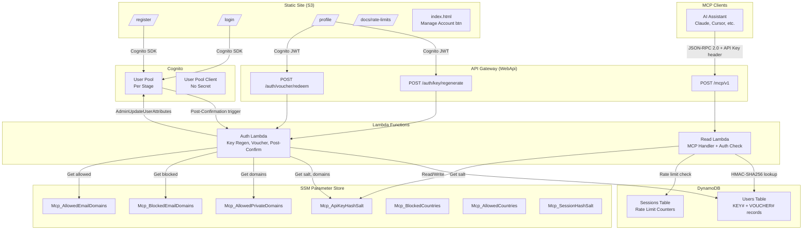
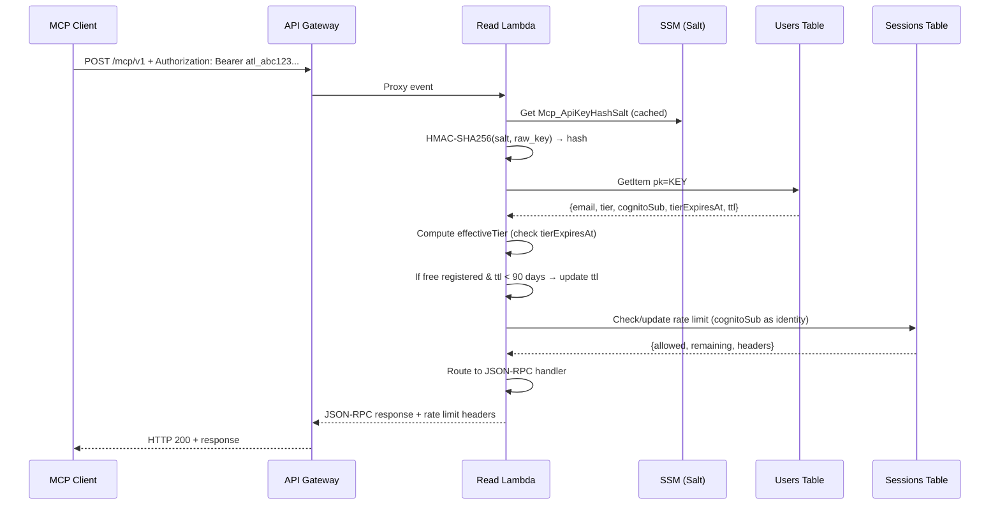
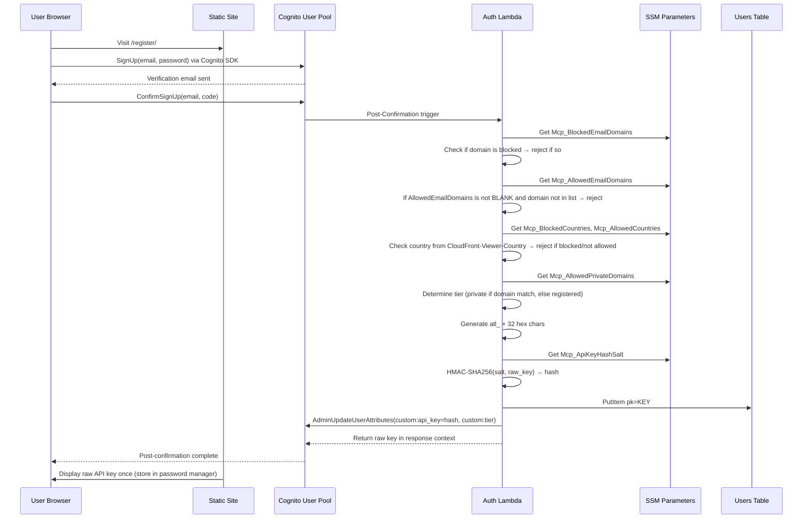

# Design Document: Add Authentication

## Overview

This design adds tiered authentication to the Atlantis MCP Server. The system currently supports only public (unauthenticated, IP-based rate limiting) access via `POST /mcp/v1`. This feature introduces four access tiers — public, registered, paid, and private — using Amazon Cognito for user management, static API keys (`atl_` + 32 hex) for MCP client authentication, and a new DynamoDB Users table for key-to-user lookups.

The core design principle is backward compatibility: the existing `POST /mcp/v1` endpoint remains unchanged. Authentication is opt-in via an `Authorization: Bearer <key>` or `X-API-Key: <key>` header. No key = public tier. Invalid key = 401 rejection.

Phase 1 covers: Cognito User Pool, Users table, API key lifecycle, tier-aware rate limiting, Auth Lambda (Post-Confirmation trigger + two endpoints), voucher redemption, static site pages (register, login, profile, rate-limits), admin CLI commands, and SSM parameter creation.

Phase 2 covers: DynamoDB TTL-based record cleanup (no scheduled Lambda), payment webhook integration, self-service payment UI, aggregate CloudWatch metrics, and admin CLI scripts in `/scripts/admin/`.

### Key Design Decisions

| Decision | Choice | Rationale |
|----------|--------|-----------|
| Auth mechanism | Static API key in header | MCP clients run unattended; JWT refresh adds complexity |
| Key format | `atl_` + 32 hex chars | Prefix enables secret scanning; 128-bit entropy |
| Key hashing | HMAC-SHA256 with SSM salt | High-entropy key doesn't need bcrypt; fast per-request validation |
| Key storage | Hash only in DynamoDB | Raw key shown once at generation; never persisted |
| Endpoint strategy | Single `POST /mcp/v1` | Backward compatible; tier resolved from header |
| User lookup | New DynamoDB Users table | Avoids Cognito API rate limits; sub-ms lookups |
| Tier expiration | Lazy check at request time | Read Lambda already looks up user; near-zero cost |
| Record cleanup | DynamoDB TTL (120 days) | No scheduled Lambda needed; built-in DynamoDB feature |
| Admin operations | CLI commands + scripts | Admin UI is a separate future stack |
| Blocked domains | Hard block from registration | `Mcp_BlockedEmailDomains` prevents all access, not just auto-promotion |
| Allowed email domains | Allowlist for self-registration | `Mcp_AllowedEmailDomains` limits which domains can self-register; BLANK = all allowed |
| Country-based access | Restrict self-registration by country | `Mcp_BlockedCountries` and `Mcp_AllowedCountries` checked at registration only; hard blocking via CloudFront |

---

## Architecture

### High-Level Architecture Diagram



### Request Flow: Authenticated MCP Request



### Request Flow: Registration and Key Generation



---

## Components and Interfaces

### 1. CloudFormation Resources (Phase 1)

#### 1.1 Cognito User Pool

```yaml
CognitoUserPool:
  Type: AWS::Cognito::UserPool
  Properties:
    UserPoolName: !Sub '${Prefix}-${ProjectId}-${StageId}-UserPool'
    UsernameAttributes: [email]
    AutoVerifiedAttributes: [email]
    Schema:
      - Name: email
        Required: true
        Mutable: true
      - Name: tier
        AttributeDataType: String
        Mutable: true
      - Name: api_key
        AttributeDataType: String
        Mutable: true
    Policies:
      PasswordPolicy:
        MinimumLength: 8
        RequireUppercase: true
        RequireLowercase: true
        RequireNumbers: true
        RequireSymbols: true
```

> **Note:** The `PostConfirmation` trigger is NOT configured via `LambdaConfig` on the User Pool to avoid a circular dependency. Instead, a SAM `Cognito` event is defined on the `AuthLambdaFunction`, which wires up the trigger and Lambda permission automatically. The Auth Lambda retrieves the Cognito User Pool ID from the event payload (`event.userPoolId`) for post-confirmation triggers, and from an SSM parameter (`Mcp_CognitoUserPoolId`) for API Gateway endpoints.

#### 1.2 Cognito User Pool Client

```yaml
CognitoUserPoolClient:
  Type: AWS::Cognito::UserPoolClient
  Properties:
    ClientName: !Sub '${Prefix}-${ProjectId}-${StageId}-WebClient'
    UserPoolId: !Ref CognitoUserPool
    GenerateSecret: false
    ExplicitAuthFlows:
      - ALLOW_USER_SRP_AUTH
      - ALLOW_REFRESH_TOKEN_AUTH
    PreventUserExistenceErrors: ENABLED
```

#### 1.3 DynamoDB Users Table

```yaml
UsersTable:
  Type: AWS::DynamoDB::Table
  DeletionPolicy: !If [IsProduction, Retain, Delete]
  UpdateReplacePolicy: Retain
  Properties:
    TableName: !Sub '${Prefix}-${ProjectId}-${StageId}-Users'
    BillingMode: PAY_PER_REQUEST
    AttributeDefinitions:
      - AttributeName: pk
        AttributeType: S
      - AttributeName: email
        AttributeType: S
    KeySchema:
      - AttributeName: pk
        KeyType: HASH
    GlobalSecondaryIndexes:
      - IndexName: email-index
        KeySchema:
          - AttributeName: email
            KeyType: HASH
        Projection:
          ProjectionType: ALL
    TimeToLiveSpecification:
      AttributeName: ttl
      Enabled: true
```

#### 1.4 Auth Lambda Function

```yaml
AuthLambdaFunction:
  Type: AWS::Serverless::Function
  Properties:
    FunctionName: !Sub '${Prefix}-${ProjectId}-${StageId}-AuthFunction'
    Description: "Auth operations - Key regeneration, voucher redemption, Cognito Post-Confirmation"
    CodeUri: src/lambda/auth/
    Handler: index.handler
    Runtime: nodejs24.x
    Architectures: [!Ref FunctionArchitecture]
    Timeout: 10
    MemorySize: 512
    Role: !GetAtt AuthLambdaExecutionRole.Arn
    Environment:
      Variables:
        USERS_TABLE: !Ref UsersTable
        PARAM_STORE_PATH: !Ref ParameterStoreHierarchy
        COGNITO_USER_POOL_ID: !Ref CognitoUserPool
        DEPLOY_ENVIRONMENT: !Ref DeployEnvironment
    Events:
      KeyRegenerate:
        Type: Api
        Properties:
          Path: /auth/key/regenerate
          Method: post
          RestApiId: !Ref WebApi
      VoucherRedeem:
        Type: Api
        Properties:
          Path: /auth/voucher/redeem
          Method: post
          RestApiId: !Ref WebApi
```

#### 1.5 Auth Lambda Execution Role

Least-privilege permissions:
- `dynamodb:GetItem`, `dynamodb:PutItem`, `dynamodb:UpdateItem`, `dynamodb:DeleteItem`, `dynamodb:Query` on Users Table + GSI
- `ssm:GetParameter` for `Mcp_ApiKeyHashSalt`, `Mcp_AllowedPrivateDomains`, `Mcp_BlockedEmailDomains`, `Mcp_AllowedEmailDomains`, `Mcp_BlockedCountries`, `Mcp_AllowedCountries`
- `cognito-idp:AdminUpdateUserAttributes` on the User Pool
- `logs:CreateLogGroup`, `logs:CreateLogStream`, `logs:PutLogEvents` on Auth Lambda log group

#### 1.6 Read Lambda IAM Updates

Add to existing `ReadLambdaExecutionRole`:
- `dynamodb:GetItem` on Users Table ARN
- `dynamodb:UpdateItem` on Users Table ARN (for TTL refresh of free registered users)
- `ssm:GetParameter` already covered by existing wildcard on `${ParameterStoreHierarchy}*`

#### 1.7 Read Lambda Environment Variable Additions

```yaml
# Add to ReadLambdaFunction Environment Variables
MCP_DYNAMODB_USERS_TABLE: !Ref UsersTable
COGNITO_USER_POOL_ID: !Ref CognitoUserPool
```

### 2. Auth Lambda Function Design

The Auth Lambda is a lightweight Node.js function with three responsibilities:

#### 2.1 Module Structure

```
src/lambda/auth/
├── index.js              # Handler: routes Post-Confirmation vs API Gateway events
├── routes/
│   └── index.js          # Routes POST /auth/key/regenerate and /auth/voucher/redeem
├── handlers/
│   ├── post-confirmation.js  # Cognito Post-Confirmation trigger logic
│   ├── key-regenerate.js     # API key regeneration (requires JWT)
│   └── voucher-redeem.js     # Voucher code redemption (requires JWT)
├── utils/
│   ├── api-key.js            # Key generation + HMAC-SHA256 hashing
│   ├── jwt-validator.js      # Cognito JWT validation
│   └── dynamo-client.js      # DynamoDB operations for Users table
└── package.json
```

#### 2.2 Handler Routing

The `index.js` handler distinguishes between Cognito trigger events and API Gateway proxy events:

```javascript
// Cognito trigger: event.triggerSource === 'PostConfirmation_ConfirmSignUp'
// API Gateway: event.httpMethod && event.path
```

#### 2.3 API Key Module (`utils/api-key.js`)

```javascript
// generateApiKey(): returns 'atl_' + crypto.randomBytes(16).toString('hex')
// hashApiKey(rawKey, salt): returns crypto.createHmac('sha256', salt).update(rawKey).digest('hex')
```

Uses Node.js built-in `crypto` — no external dependencies.

#### 2.4 JWT Validation (`utils/jwt-validator.js`)

For the `/auth/key/regenerate` and `/auth/voucher/redeem` endpoints, the Auth Lambda validates the Cognito JWT from the `Authorization: Bearer <jwt>` header. Validation uses the Cognito JWKS endpoint (`https://cognito-idp.{region}.amazonaws.com/{userPoolId}/.well-known/jwks.json`) with cached keys.

### 3. Rate Limiter Modifications

The existing `rate-limiter.js` in the Read Lambda needs these changes:

#### 3.1 Auth Resolution (New Module: `utils/auth-resolver.js`)

A new module that extracts and validates the API key from request headers:

```javascript
/**
 * Resolve authentication from request headers.
 * @param {Object} event - API Gateway event
 * @returns {Promise<{tier: string, identity: string, isAuthenticated: boolean, userId: string|null, degraded: boolean}>}
 */
async function resolveAuth(event) {
  // 1. Check for Authorization: Bearer <key> or X-API-Key: <key>
  // 2. If no key → return { tier: 'public', identity: sourceIp, isAuthenticated: false, degraded: false }
  // 3. If key present → HMAC-SHA256 hash → DynamoDB lookup
  // 4. If hash salt or Users table unavailable → fall back to public tier with degraded: true
  //    (log error, add X-MCP-Auth-Status: degraded header)
  // 5. If key not found in Users table → throw 401 error (invalid key, NOT degradation)
  // 6. Compute effectiveTier from tierExpiresAt
  // 7. If free registered user and ttl < 90 days → background update ttl to now+120d
  // 8. Return { tier: effectiveTier, identity: cognitoSub, isAuthenticated: true, degraded: false }
}
```

#### 3.2 Rate Limiter Changes

The `checkRateLimit` function signature changes to accept resolved auth info:

```javascript
// Before: checkRateLimit(event, limits) — hardcoded public tier
// After:  checkRateLimit(event, limits, authInfo) — tier from authInfo
```

- `authInfo.tier` determines which rate limit config to use
- `authInfo.identity` replaces the hardcoded IP extraction for authenticated users
- `authInfo.isAuthenticated` controls whether to use IP or cognitoSub as the rate limit key

#### 3.3 Read Lambda Handler Changes (`index.js`)

```javascript
// Before rate limit check, add:
const authInfo = await AuthResolver.resolveAuth(event);

// If auth resolution returns 401, return immediately
if (authInfo.error) {
  return authInfo.errorResponse;
}

// Pass authInfo to rate limiter
const rateLimitCheck = await RateLimiter.checkRateLimit(event, Config.settings().rateLimits, authInfo);
```

### 4. Static Site Pages

All pages are generated during the post-deploy phase and hosted on S3. They use the Cognito JavaScript SDK (`amazon-cognito-identity-js`) for client-side auth operations.

#### 4.1 `/register/` Page
- Email + password form
- Calls Cognito `signUp()` from browser
- After email verification, displays the raw API key once
- Instructions to store key in password manager
- Error handling for existing email, blocked domain

#### 4.2 `/login/` Page
- Email + password form
- Calls Cognito `authenticateUser()` from browser
- On success, redirects to `/profile/`
- Error handling for incorrect credentials, unverified email

#### 4.3 `/profile/` Page
- Requires authentication (redirects to `/login/` if not)
- Displays: current tier, rate limits for tier, tier expiration date
- "Regenerate API Key" button → calls `POST /auth/key/regenerate` with JWT → displays new key once
- "Enter Promotion Code" input → calls `POST /auth/voucher/redeem` with JWT → displays new tier/expiration
- External payment link placeholder (future phase)
- Does NOT display current API key (not stored retrievably)
- Does NOT include a downgrade button

#### 4.4 `/docs/rate-limits/` Page
- Table listing all four tiers with their rate limits
- Values injected via token replacement from `settings.json` during post-deploy
- Single source of truth — other docs link here

#### 4.5 `index.html` Modification
- "Manage Account" link/button in footer area, linking to `/profile/`

### 5. SSM Parameter Configuration

| Parameter | Type | Default | Purpose |
|-----------|------|---------|---------|
| `Mcp_ApiKeyHashSalt` | SecureString | Auto-generated 256-bit hex | HMAC key for API key hashing |
| `Mcp_AllowedPrivateDomains` | String | `BLANK` | Comma-separated domains for private auto-promotion |
| `Mcp_BlockedEmailDomains` | String | `BLANK` | Comma-separated domains hard-blocked from registration |
| `Mcp_AllowedEmailDomains` | String | `BLANK` | Comma-separated domains allowed for self-registration. BLANK = all domains (except blocked) allowed |
| `Mcp_BlockedCountries` | String | `BLANK` | Comma-separated ISO 3166-1 alpha-2 country codes blocked from self-registration |
| `Mcp_AllowedCountries` | String | `BLANK` | Comma-separated ISO 3166-1 alpha-2 country codes allowed for self-registration. BLANK = all countries (except blocked) allowed |

Created in `buildspec.yml` pre_build phase using `generate-put-ssm.py` (will not overwrite existing values):

```bash
python3 ./build-scripts/generate-put-ssm.py ${PARAM_STORE_HIERARCHY}Mcp_ApiKeyHashSalt --generate 256
python3 ./build-scripts/generate-put-ssm.py ${PARAM_STORE_HIERARCHY}Mcp_AllowedPrivateDomains --value "BLANK"
python3 ./build-scripts/generate-put-ssm.py ${PARAM_STORE_HIERARCHY}Mcp_BlockedEmailDomains --value "BLANK"
python3 ./build-scripts/generate-put-ssm.py ${PARAM_STORE_HIERARCHY}Mcp_AllowedEmailDomains --value "BLANK"
python3 ./build-scripts/generate-put-ssm.py ${PARAM_STORE_HIERARCHY}Mcp_BlockedCountries --value "BLANK"
python3 ./build-scripts/generate-put-ssm.py ${PARAM_STORE_HIERARCHY}Mcp_AllowedCountries --value "BLANK"
```

### 6. Admin CLI Operations (Phase 1)

Documented in `docs/admin-ops/` with AWS CLI examples:

#### 6.1 Change User Tier
```bash
# Look up user by email via GSI
aws dynamodb query --table-name <Users-Table> \
  --index-name email-index \
  --key-condition-expression "email = :email" \
  --expression-attribute-values '{":email":{"S":"user@example.com"}}'

# Update tier and optionally set tierExpiresAt
aws dynamodb update-item --table-name <Users-Table> \
  --key '{"pk":{"S":"KEY#<hash>"}}' \
  --update-expression "SET tier = :tier, tierExpiresAt = :exp" \
  --expression-attribute-values '{":tier":{"S":"paid"},":exp":{"S":"2025-12-31T00:00:00Z"}}'

# Also update Cognito custom:tier
aws cognito-idp admin-update-user-attributes --user-pool-id <pool-id> \
  --username <email> \
  --user-attributes Name=custom:tier,Value=paid
```

#### 6.2 Create Voucher Code
```bash
aws dynamodb put-item --table-name <Users-Table> \
  --item '{
    "pk":{"S":"VOUCHER#SUMMER2025"},
    "targetTier":{"S":"paid"},
    "durationDays":{"N":"30"},
    "maxUses":{"N":"100"},
    "currentUses":{"N":"0"},
    "expiresAt":{"S":"2025-09-01T00:00:00Z"},
    "createdBy":{"S":"admin@63klabs.net"}
  }'
```

---

## Data Models

### Users Table Schema

| Field | Type | Description | Present On |
|-------|------|-------------|------------|
| `pk` | String (PK) | `KEY#<hmac_sha256_hash>` or `VOUCHER#<code>` | All records |
| `email` | String (GSI PK) | User email address | User records |
| `tier` | String | `registered`, `paid`, or `private` | User records |
| `cognitoSub` | String | Cognito user sub ID | User records |
| `createdAt` | String (ISO 8601) | Record creation timestamp | User records |
| `tierExpiresAt` | String (ISO 8601) or null | When the current tier expires; null = no expiration | User records |
| `ttl` | Number | DynamoDB TTL (Unix epoch seconds), 120 days from last activity | User records |
| `targetTier` | String | Tier granted on redemption | Voucher records |
| `durationDays` | Number | Days the tier lasts after redemption | Voucher records |
| `maxUses` | Number | Max redemptions (0 = unlimited) | Voucher records |
| `currentUses` | Number | Current redemption count | Voucher records |
| `expiresAt` | String (ISO 8601) | When the voucher itself expires | Voucher records |
| `createdBy` | String | Admin identifier who created the voucher | Voucher records |

### TTL Strategy (Phase 2 UPDATE — R19)

Instead of a scheduled cleanup Lambda, the system uses DynamoDB's built-in TTL feature:

1. When a user record is created (Post-Confirmation), set `ttl` to `now + 120 days` (Unix epoch seconds).
2. When a subscription hook updates `tierExpiresAt`, also update `ttl` to `now + 120 days`.
3. For free registered users: on each authenticated request, if `ttl < now + 90 days`, update `ttl` to `now + 120 days` (background DynamoDB update, non-blocking).
4. The Read Lambda computes `effectiveTier` at request time: if `tierExpiresAt` is set and has passed, treat as `registered`. Do NOT update `tierExpiresAt` in DynamoDB.
5. DynamoDB automatically deletes records where `ttl` has passed — inactive accounts are cleaned up without a Lambda.

### Sessions Table Schema (Existing — No Changes)

| Field | Type | Description |
|-------|------|-------------|
| `pk` | String (PK) | SHA-256 hash of `clientId + windowStart + salt` |
| `remaining` | Number | Requests remaining in current window |
| `limit` | Number | Max requests for reference |
| `ttl` | Number | DynamoDB TTL (window end + 5 min buffer) |

### Cognito User Attributes

| Attribute | Type | Description |
|-----------|------|-------------|
| `email` | Standard | Username attribute, required |
| `custom:tier` | Custom String | `registered`, `paid`, or `private` |
| `custom:api_key` | Custom String | HMAC-SHA256 hash of the API key (not the raw key) |

---

## Phase 2 Design Notes

### R19 UPDATE: TTL-Based Record Cleanup (No Scheduled Lambda)

The original R19 specified a scheduled EventBridge + Lambda for tier cleanup. Per the user's update, this is replaced with DynamoDB TTL:

- The Read Lambda performs a lazy `effectiveTier` check: if `tierExpiresAt` has passed, the user is treated as `registered` for rate limiting. The stored `tierExpiresAt` is NOT updated.
- The `ttl` field controls DynamoDB record expiration (120 days out). Records for inactive accounts are automatically deleted.
- For free registered users, the Read Lambda refreshes `ttl` to `now + 120 days` if the current `ttl` is less than 90 days from now. This keeps active free accounts alive.
- When records are created or a subscription hook updates `tierExpiresAt`, the `ttl` is also set to `now + 120 days`.

### R22 UPDATE: Admin Dashboard Removed

The admin dashboard requirement is removed entirely. Admin operations use:
- CLI commands documented in `docs/admin-ops/` (tier changes, voucher creation, expiration management)
- Complex scripts in `/scripts/admin/` at the project root
- Private members are NOT admins — admin is completely separate
- An admin interface will be a separate stack in the future

### R23 UPDATE: Usage Analytics — Aggregate Only

Per-user usage analytics are removed. Instead:
- The existing CloudWatch dashboard is extended with aggregate metrics (total requests by tier, error rates by tier, etc.)
- CLI commands or scripts in `/scripts/admin/` can query aggregate data
- Metrics must be aggregate, not at the user level
- No new DynamoDB tables for analytics

### R24 UPDATE: API Key Scoping Removed

The `allowedTools` field and per-key tool restrictions are removed from scope entirely.

---

## Correctness Properties

*A property is a characteristic or behavior that should hold true across all valid executions of a system — essentially, a formal statement about what the system should do. Properties serve as the bridge between human-readable specifications and machine-verifiable correctness guarantees.*

### Property 1: API key generation format

*For any* invocation of the key generation function (initial registration or regeneration), the returned key SHALL match the pattern `atl_` followed by exactly 32 lowercase hexadecimal characters (`/^atl_[0-9a-f]{32}$/`).

**Validates: Requirements 4.1, 8.1**

### Property 2: HMAC-SHA256 hash determinism

*For any* valid API key and any salt string, computing HMAC-SHA256(salt, key) twice SHALL produce the same 64-character hexadecimal hash. Additionally, two different API keys hashed with the same salt SHALL produce different hashes.

**Validates: Requirements 4.2, 4.8**

### Property 3: Raw API key is never persisted

*For any* key generation or regeneration operation, the value stored in the DynamoDB Users table `pk` field (after the `KEY#` prefix) and the Cognito `custom:api_key` attribute SHALL equal the HMAC-SHA256 hash of the raw key, and SHALL NOT equal the raw key itself.

**Validates: Requirements 4.7**

### Property 4: Header extraction consistency

*For any* valid API key, placing it in the `Authorization: Bearer <key>` header or the `X-API-Key: <key>` header SHALL cause the auth resolver to extract and hash the same raw key value, producing the same HMAC-SHA256 hash.

**Validates: Requirements 5.1**

### Property 5: Effective tier computation

*For any* user record with a stored `tier` and `tierExpiresAt` value: if `tierExpiresAt` is null, the effective tier SHALL equal the stored tier; if `tierExpiresAt` is in the future, the effective tier SHALL equal the stored tier; if `tierExpiresAt` is in the past, the effective tier SHALL be `registered` regardless of the stored tier.

**Validates: Requirements 5.3**

### Property 6: Invalid key rejection

*For any* API key whose HMAC-SHA256 hash does not match any `KEY#<hash>` record in the Users table, the Read Lambda SHALL return HTTP 401 with a JSON-RPC error response.

**Validates: Requirements 5.4**

### Property 7: Authenticated identity uses cognitoSub

*For any* authenticated request (valid API key present), the rate limiter SHALL use the user's `cognitoSub` as the rate limit identity. *For any* unauthenticated request (no API key), the rate limiter SHALL use the client IP address as the rate limit identity.

**Validates: Requirements 5.6, 6.2, 6.3**

### Property 8: Tier-to-rate-limit configuration mapping

*For any* of the four tiers (public, registered, paid, private), the rate limiter SHALL select the `limitPerWindow` and `windowInMinutes` values from the corresponding `settings.rateLimits[tier]` configuration.

**Validates: Requirements 6.1, 6.4**

### Property 9: Rate limit headers presence

*For any* request processed by the rate limiter, the response SHALL include `X-RateLimit-Limit`, `X-RateLimit-Remaining`, and `X-RateLimit-Reset` headers with valid numeric string values. When the rate limit is exceeded, the response SHALL additionally include a `Retry-After` header and return HTTP 429.

**Validates: Requirements 6.5, 6.6**

### Property 10: Key regeneration preserves user fields

*For any* key regeneration operation, the new Users table record SHALL preserve the original user's `email`, `tier`, `cognitoSub`, and `tierExpiresAt` values. Only the `pk` (key hash) and `createdAt` SHALL differ.

**Validates: Requirements 8.3**

### Property 11: Invalid voucher rejection

*For any* voucher where `expiresAt` is in the past, or where `currentUses >= maxUses` (when `maxUses > 0`), the redemption endpoint SHALL return HTTP 400. *For any* voucher code that does not exist in the Users table, the redemption endpoint SHALL return HTTP 400.

**Validates: Requirements 9.2, 9.3, 9.4**

### Property 12: Valid voucher tier update

*For any* valid voucher (exists, not expired, uses remaining), redeeming it SHALL update the user's tier to the voucher's `targetTier` and set `tierExpiresAt` to `now + durationDays`.

**Validates: Requirements 9.5**

### Property 13: Domain-based tier assignment and registration gating

*For any* email address at registration: if the domain appears in `Mcp_BlockedEmailDomains`, registration SHALL be rejected; if `Mcp_AllowedEmailDomains` is not `BLANK` and the domain does NOT appear in the allowed list, registration SHALL be rejected; if the domain appears in `Mcp_AllowedPrivateDomains` (and not in blocked), the tier SHALL be `private` with `tierExpiresAt = null`; otherwise the tier SHALL be `registered`.

**Validates: Requirements 10.2, 10.4, 10.5**

### Property 14: User record format invariant

*For any* user record created in the Users table, the `pk` SHALL start with `KEY#` followed by a 64-character hex string, and the record SHALL contain non-null values for `email`, `tier`, `cognitoSub`, `createdAt`, and `ttl`.

**Validates: Requirements 2.3**

### Property 15: TTL refresh for free registered users

*For any* authenticated request from a free registered user (effective tier = `registered`, no `tierExpiresAt` or `tierExpiresAt` is null): if the record's `ttl` is less than 90 days from now, the system SHALL update `ttl` to `now + 120 days`. If `ttl` is 90 or more days from now, the system SHALL NOT update the `ttl`.

**Validates: Requirements 19 (UPDATE)**

### Property 16: Country-based registration restrictions

*For any* self-registration attempt where the `CloudFront-Viewer-Country` header is present: if the country code appears in `Mcp_BlockedCountries` (and it is not `BLANK`), registration SHALL be rejected; if `Mcp_AllowedCountries` is not `BLANK` and the country code does NOT appear in the allowed list, registration SHALL be rejected; if the header is absent, registration SHALL NOT be blocked by country filtering. Country checks SHALL apply only to self-registration and SHALL NOT affect public tier access, authenticated MCP requests, or admin-managed accounts.

**Validates: Requirements 19 (Phase 1)**

---

## Error Handling

### Read Lambda Error Scenarios

| Scenario | HTTP Status | Response | Action |
|----------|-------------|----------|--------|
| No API key header | 200 (normal flow) | Standard JSON-RPC response | Treat as public tier |
| Invalid API key (no matching record) | 401 | JSON-RPC error: "Invalid API key" | Reject immediately, do not fall back to public |
| API key hash salt unavailable (SSM error) | 200 (degraded) | Standard JSON-RPC response + `X-MCP-Auth-Status: degraded` header | Fall back to public tier; include degradation notice in response metadata |
| Users table unavailable (DynamoDB error) | 200 (degraded) | Standard JSON-RPC response + `X-MCP-Auth-Status: degraded` header | Fall back to public tier for authenticated requests; include degradation notice |
| Rate limit exceeded | 429 | Rate limit error with Retry-After | Return rate limit headers |
| Malformed Authorization header | 401 | JSON-RPC error: "Invalid Authorization header" | Reject |

### Auth Lambda Error Scenarios

| Scenario | HTTP Status | Response |
|----------|-------------|----------|
| Missing or invalid JWT | 401 | `{"error": "Unauthorized"}` |
| Expired JWT | 401 | `{"error": "Token expired"}` |
| Voucher not found | 400 | `{"error": "Invalid voucher code"}` |
| Voucher expired | 400 | `{"error": "Voucher has expired"}` |
| Voucher fully redeemed | 400 | `{"error": "Voucher has been fully redeemed"}` |
| Blocked email domain (Post-Confirmation) | Error thrown | Cognito rejects the confirmation |
| Email domain not in allowed list (Post-Confirmation) | Error thrown | Cognito rejects the confirmation |
| Blocked country at registration (Post-Confirmation) | Error thrown | Cognito rejects the confirmation |
| Country not in allowed list at registration (Post-Confirmation) | Error thrown | Cognito rejects the confirmation |
| DynamoDB write failure | 500 | `{"error": "Internal server error"}` |
| SSM parameter unavailable | 500 | `{"error": "Internal server error"}` |

### Security Error Handling Principles

1. Never expose internal details (table names, parameter paths, stack traces) in error responses
2. Log full error details to CloudWatch for debugging
3. Graceful degradation: if the hash salt or Users table is unavailable, fall back to public tier access with IP-based rate limiting. Add an `X-MCP-Auth-Status: degraded` response header so the issue is observable without breaking MCP client functionality. This is distinct from an invalid API key (which returns 401) — degradation means the system cannot verify the key, not that the key is wrong
4. Rate limit the auth endpoints themselves to prevent brute force (API Gateway throttling)

---

## Testing Strategy

### Property-Based Testing

This feature is well-suited for property-based testing. The core logic — key generation, hashing, tier computation, domain matching, voucher validation, rate limit configuration selection — consists of pure functions with clear input/output behavior and large input spaces.

**Library:** `fast-check` (already used in the project for indexer property tests)

**Configuration:**
- Minimum 100 iterations per property test
- Each test tagged with: `Feature: 0-0-3-add-authentication, Property {number}: {title}`
- Tests written in Jest (`.jest.mjs` files per project convention)

**Property test files:**
- `application-infrastructure/src/lambda/auth/tests/property/api-key.property.test.js` — Properties 1, 2, 3
- `application-infrastructure/src/lambda/auth/tests/property/voucher-validation.property.test.js` — Properties 11, 12
- `application-infrastructure/src/lambda/auth/tests/property/domain-assignment.property.test.js` — Property 13
- `application-infrastructure/src/lambda/read/tests/property/auth-resolver.property.test.js` — Properties 4, 5, 6, 7
- `application-infrastructure/src/lambda/read/tests/property/tier-rate-limiting.property.test.js` — Properties 8, 9
- `application-infrastructure/src/lambda/read/tests/property/key-regeneration.property.test.js` — Property 10
- `application-infrastructure/src/lambda/read/tests/property/ttl-refresh.property.test.js` — Properties 14, 15

### Unit Testing (Example-Based)

Unit tests cover specific examples, integration points, and edge cases not suited for PBT:

- Post-Confirmation trigger happy path (mock Cognito + DynamoDB + SSM)
- Key regeneration happy path (mock all services)
- Voucher redemption happy path
- JWT validation (valid, expired, malformed)
- Rate limiter backward compatibility (public tier unchanged)
- Static site page rendering (token replacement)

### Integration Testing

- End-to-end registration flow (Cognito → Post-Confirmation → DynamoDB)
- End-to-end authenticated MCP request (API key → tier resolution → rate limiting → tool response)
- CloudFormation template validation (`aws cloudformation validate-template`)

### Test Organization

```
application-infrastructure/src/
├── lambda/
│   ├── auth/
│   │   ├── tests/
│   │   │   ├── property/
│   │   │   │   ├── api-key.property.test.js
│   │   │   │   ├── voucher-validation.property.test.js
│   │   │   │   └── domain-assignment.property.test.js
│   │   │   └── unit/
│   │   │       ├── post-confirmation.test.js
│   │   │       ├── key-regenerate.test.js
│   │   │       └── voucher-redeem.test.js
│   │   └── ...
│   └── read/
│       ├── tests/
│       │   ├── property/
│       │   │   ├── auth-resolver.property.test.js
│       │   │   ├── tier-rate-limiting.property.test.js
│       │   │   ├── key-regeneration.property.test.js
│       │   │   └── ttl-refresh.property.test.js
│       │   └── unit/
│       │       └── auth-resolver.test.js
│       └── ...
```
