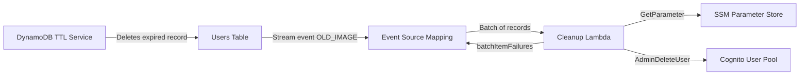

# Design Document: Cognito Orphan Cleanup

## Overview

This feature adds automated cleanup of orphaned Cognito user accounts when DynamoDB TTL removes inactive user records from the Users table. The solution uses DynamoDB Streams to detect TTL-triggered deletions and a dedicated Lambda function to call `AdminDeleteUser` on the corresponding Cognito account.

The design follows the existing event-driven, serverless architecture. A new Cleanup Lambda is triggered by DynamoDB Streams on the Users table, filters for TTL-initiated REMOVE events on user records (pk starting with `KEY#`), retrieves the Cognito User Pool ID from SSM, and permanently deletes the orphaned Cognito user. Partial batch failure reporting ensures that a single failed deletion does not block processing of other records.

### Key Design Decisions

1. **Separate Lambda function** rather than adding to the existing Auth Lambda — isolates cleanup concerns, simplifies IAM permissions, and avoids coupling stream processing with API request handling.
2. **OLD_IMAGE stream view type** — provides access to the deleted record's `cognitoSub` and `pk` fields without requiring an additional DynamoDB lookup.
3. **TTL principal filtering** — DynamoDB Streams includes `userIdentity.principalId` of `dynamodb.amazonaws.com` for TTL deletions, distinguishing them from application-level deletions (key regeneration).
4. **Partial batch failure reporting** — returns `batchItemFailures` with failed record sequence numbers so Lambda retries only failed records, not the entire batch.
5. **SSM for User Pool ID** — follows the existing pattern where runtime configuration is retrieved from SSM Parameter Store and cached at module level.

## Architecture



### Flow

1. DynamoDB TTL service deletes an expired user record from the Users table.
2. The deletion generates a stream record with `eventName: REMOVE`, `userIdentity.principalId: dynamodb.amazonaws.com`, and the full item in `OldImage`.
3. The event source mapping batches up to 10 records (with a 30-second batching window) and invokes the Cleanup Lambda.
4. The Cleanup Lambda iterates over each record:
   - Skips non-REMOVE events
   - Skips records where `userIdentity.principalId` is not `dynamodb.amazonaws.com`
   - Skips records where `OldImage.pk` does not start with `KEY#`
   - Skips records missing `cognitoSub` in OldImage
   - For qualifying records: retrieves User Pool ID from SSM (cached), calls `AdminDeleteUser`
5. Returns `batchItemFailures` containing sequence numbers of any records that failed with non-recoverable errors.

## Components and Interfaces

### 1. CloudFormation Resources (template.yml additions)

| Resource | Type | Purpose |
|----------|------|---------|
| `UsersTable` (modified) | `AWS::DynamoDB::Table` | Add `StreamSpecification: StreamViewType: OLD_IMAGE` |
| `CleanupFunction` | `AWS::Serverless::Function` | New Lambda triggered by DynamoDB Streams |
| `CleanupLambdaLogGroup` | `AWS::Logs::LogGroup` | CloudWatch log group with environment-based retention |
| `CleanupExecutionRole` | `AWS::IAM::Role` | Least-privilege IAM role for the Cleanup Lambda |

### 2. Cleanup Lambda (src/lambda/cleanup/)

| File | Purpose |
|------|---------|
| `index.js` | Entry point — exports `handler` function |
| `package.json` | Dependencies (devDependencies only — AWS SDK available in Lambda runtime) |

### 3. Handler Interface

```javascript
/**
 * @param {Object} event - DynamoDB Streams event
 * @param {Array<Object>} event.Records - Array of stream records
 * @returns {Promise<{batchItemFailures: Array<{itemIdentifier: string}>}>}
 */
async function handler(event) { ... }
```

### 4. Internal Functions

| Function | Responsibility |
|----------|---------------|
| `isTtlDeletion(record)` | Returns true if record is a TTL-triggered REMOVE event |
| `isUserRecord(record)` | Returns true if OldImage pk starts with `KEY#` and has `cognitoSub` |
| `getCachedUserPoolId()` | Retrieves and caches User Pool ID from SSM |
| `deleteOrphanedUser(cognitoSub, userPoolId)` | Calls AdminDeleteUser, handles UserNotFoundException |

## Data Models

### DynamoDB Stream Record (relevant fields)

```json
{
  "eventID": "unique-event-id",
  "eventName": "REMOVE",
  "eventSource": "aws:dynamodb",
  "dynamodb": {
    "Keys": {
      "pk": { "S": "KEY#a1b2c3d4..." }
    },
    "OldImage": {
      "pk": { "S": "KEY#a1b2c3d4..." },
      "email": { "S": "user@example.com" },
      "cognitoSub": { "S": "abc-123-def-456" },
      "tier": { "S": "registered" },
      "ttl": { "N": "1700000000" },
      "createdAt": { "S": "2024-01-15T10:30:00.000Z" }
    },
    "SequenceNumber": "111222333444555"
  },
  "userIdentity": {
    "principalId": "dynamodb.amazonaws.com",
    "type": "Service"
  }
}
```

### Handler Response (Partial Batch Failure)

```json
{
  "batchItemFailures": [
    { "itemIdentifier": "111222333444555" }
  ]
}
```

### SSM Parameter

| Parameter Path | Value |
|---------------|-------|
| `{ParameterStoreHierarchy}app-stack/Mcp_CognitoUserPoolId` | Cognito User Pool ID (e.g., `us-east-1_AbCdEfGhI`) |


## Correctness Properties

*A property is a characteristic or behavior that should hold true across all valid executions of a system — essentially, a formal statement about what the system should do. Properties serve as the bridge between human-readable specifications and machine-verifiable correctness guarantees.*

### Property 1: Filtering correctness — only qualifying records trigger Cognito deletion

*For any* DynamoDB Streams record, the Cleanup Lambda SHALL trigger Cognito deletion if and only if ALL of the following conditions are true: (1) `eventName` equals `REMOVE`, (2) `userIdentity.principalId` equals `dynamodb.amazonaws.com`, (3) `OldImage.pk` starts with `KEY#`, and (4) `OldImage` contains a non-empty `cognitoSub` field. Records failing any condition SHALL be skipped without calling Cognito.

**Validates: Requirements 4.1, 4.2, 4.3, 4.5, 5.4, 5.5, 8.1, 8.2, 8.4**

### Property 2: AdminDeleteUser invocation correctness

*For any* stream record that passes all filtering conditions, the Cleanup Lambda SHALL call `AdminDeleteUser` exactly once, using the `cognitoSub` from the record's `OldImage` as the `Username` parameter and the cached User Pool ID as the `UserPoolId` parameter.

**Validates: Requirements 5.3, 5.7**

### Property 3: Partial batch failure reporting accuracy

*For any* batch of stream records where a subset of qualifying records fail `AdminDeleteUser` with a non-recoverable error (excluding `UserNotFoundException`), the handler response `batchItemFailures` array SHALL contain exactly the `SequenceNumber` values of the failed records and no others.

**Validates: Requirements 6.1, 6.3**

### Property 4: Handler robustness — never throws

*For any* input event (including malformed records, missing fields, unexpected types, and empty batches), the Cleanup Lambda handler SHALL never throw an unhandled exception. It SHALL always return a valid response object with a `batchItemFailures` array.

**Validates: Requirements 6.4**

## Error Handling

### Error Categories and Responses

| Error Scenario | Handling Strategy | Batch Impact |
|---------------|-------------------|--------------|
| SSM `GetParameter` fails | Log error, report ALL records as failed | Entire batch retried |
| `AdminDeleteUser` → `UserNotFoundException` | Log warning, treat as success | Record NOT in failures |
| `AdminDeleteUser` → other error | Log error with cognitoSub and error code | Record added to `batchItemFailures` |
| Missing `cognitoSub` in OldImage | Log warning, skip record | Record NOT in failures (not a failure — just not applicable) |
| Missing `pk` or non-`KEY#` prefix | Log debug, skip record | Record NOT in failures |
| Malformed stream record | Log error, skip record | Record NOT in failures |

### Error Handling Patterns

Following the existing project pattern (see `key-regenerate.js` and `auth-resolver.js`):

1. **Log full error internally** — `console.error` with complete error object for CloudWatch debugging
2. **Never expose internals** — sanitized responses only
3. **Graceful degradation** — individual record failures don't block the batch
4. **SSM failure is catastrophic** — if we can't get the User Pool ID, no records can be processed; report all as failed so they're retried after the Lambda environment is recycled

### Retry Behavior

- Event source mapping configured with `MaximumRetryAttempts: 3`
- Partial batch failures are retried individually (only failed sequence numbers)
- After 3 retries, failed records are discarded (no DLQ configured — orphaned Cognito accounts are low-severity)

## Testing Strategy

### Unit Tests (Jest)

Unit tests verify specific behaviors with mocked AWS SDK calls:

| Test | What it verifies |
|------|-----------------|
| TTL deletion filtering | Correct classification of TTL vs application deletions |
| Record type filtering | KEY# prefix and cognitoSub presence checks |
| SSM caching | Parameter retrieved once, cached for subsequent calls |
| UserNotFoundException handling | Treated as success, not added to failures |
| Other Cognito errors | Added to batchItemFailures |
| SSM failure | All records reported as failed |
| Logging | Correct log levels and content for each scenario |
| Empty batch | Returns empty batchItemFailures |

### Property-Based Tests (fast-check + Jest)

Property-based tests validate universal correctness properties across many generated inputs:

- **Library**: `fast-check` (already used in this project)
- **Minimum iterations**: 100 per property
- **Tag format**: `Feature: 0-0-4-cognito-orphan-cleanup, Property {number}: {title}`

| Property Test | Generators |
|--------------|------------|
| Filtering correctness | Random eventName (REMOVE/INSERT/MODIFY), random principalId, random pk prefixes (KEY#/VOUCHER#/other), optional cognitoSub |
| AdminDeleteUser invocation | Random valid cognitoSub strings, random User Pool IDs |
| Partial batch failure reporting | Random batches with configurable success/failure patterns per record |
| Handler robustness | Arbitrary objects as event input, including missing/null/undefined fields |

### Integration Tests

Not included in this feature's automated test suite. The DynamoDB Streams → Lambda integration is managed by AWS and validated through deployment testing.

### Test File Structure

```
application-infrastructure/src/lambda/cleanup/
├── index.js
├── package.json
└── tests/
    ├── unit/
    │   └── cleanup-handler.test.js
    └── property/
        └── cleanup-filtering.property.test.js
```

### Test Configuration

The `jest.config.js` at `application-infrastructure/src/` will need its `testMatch` updated to include:
```javascript
'**/lambda/cleanup/tests/**/*.test.js'
```
