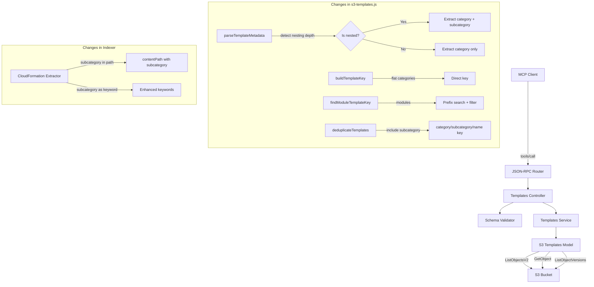

# Design Document: Modules Nested Directory Support

## Overview

The Atlantis MCP Server discovers CloudFormation templates from S3 buckets at the path `{namespace}/templates/v2/{category}/{templateName}.yml`. This flat structure works for categories like storage, network, pipeline, and service-role. However, the "modules" category organizes templates into subdirectories: `{namespace}/templates/v2/modules/{subcategory}/{templateName}.yml`.

The current `parseTemplateMetadata()` function extracts the category from the second-to-last path segment, which means a template at `modules/vpc/module-vpc-endpoints.yml` is incorrectly parsed with category "vpc" instead of "modules". Similarly, `buildTemplateKey()` constructs flat S3 keys that cannot locate templates in subdirectories, and `deduplicateTemplates()` uses `category/name` as a dedup key which doesn't account for subcategories.

This design adds subcategory-aware parsing, key construction, and search logic to the existing template discovery pipeline while preserving backward compatibility for all flat categories.

### Design Rationale

The key design decision is to keep changes localized to the model layer (`s3-templates.js`) and the indexer extractor, with minimal changes to the service and controller layers. This is possible because:

1. `ListObjectsV2Command` without a Delimiter already returns all nested objects — so `list()` already fetches nested files; only the parser needs fixing.
2. `get()` and `listVersions()` can use a prefix-based search (listing then filtering) for modules instead of constructing exact keys, falling back to the existing `buildTemplateKey()` for flat categories.
3. The `subcategory` field is additive metadata — it flows through the existing service and controller layers without breaking them.

## Architecture



### Data Flow for Module Templates

1. **list()**: `ListObjectsV2` returns all objects under `{namespace}/templates/v2/` (already works). `parseTemplateMetadata()` is updated to detect nested paths and extract both category and subcategory.

2. **get()**: For category "modules", instead of constructing a single exact key with `buildTemplateKey()`, the model uses a new `findModuleTemplateKey()` function that lists objects under `{namespace}/templates/v2/modules/` with a suffix filter for the template name, then fetches the matched key.

3. **listVersions()**: Same approach as `get()` — uses `findModuleTemplateKey()` to locate the template, then calls `ListObjectVersionsCommand` on the discovered key.

4. **listCategories()**: The service layer extracts unique subcategory values from the modules template list and includes them in the category response.

## Components and Interfaces

### Modified: `parseTemplateMetadata(s3Object, bucketName, namespace)`

**Current behavior**: Extracts category from `keyParts[keyParts.length - 2]` (second-to-last segment).

**New behavior**: Determines nesting depth by comparing the key structure against the known base path. For keys with an extra path segment between the category and the filename, extracts the category from the segment after `templates/v2/` and the subcategory from the next segment.

```javascript
/**
 * @param {Object} s3Object - S3 object metadata with Key property
 * @param {string} bucketName - S3 bucket name
 * @param {string} namespace - Namespace prefix
 * @returns {Object} Template metadata including:
 *   - name {string} - Template name without extension
 *   - category {string} - Template category (e.g., "modules")
 *   - subcategory {string|null} - Subcategory for nested templates, null for flat
 *   - namespace {string}
 *   - bucket {string}
 *   - s3Path {string}
 *   - key {string}
 *   - lastModified {Date}
 *   - size {number}
 */
```

**Detection logic**: Given a key like `{namespace}/templates/v2/{category}/[{subcategory}/]{templateName}.yml`:
- Split the key on `/`
- Find the index of `templates` and `v2` to establish the base path offset
- Count segments after the base path: 2 segments = flat (`category/file`), 3 segments = nested (`category/subcategory/file`)
- For nested: `category = keyParts[baseOffset + 2]`, `subcategory = keyParts[baseOffset + 3]`
- For flat: `category = keyParts[keyParts.length - 2]`, `subcategory = null`

### New: `findModuleTemplateKey(bucket, namespace, basePath, templateName)`

Searches for a module template across subdirectories by listing objects with a prefix and filtering by template name.

```javascript
/**
 * Find the S3 key for a module template in any subdirectory.
 *
 * @param {string} bucket - S3 bucket name
 * @param {string} namespace - Namespace prefix
 * @param {string} basePath - Base path (e.g., 'templates/v2')
 * @param {string} templateName - Template name without extension
 * @returns {Promise<{key: string, subcategory: string, extension: string}|null>}
 *   The discovered key info, or null if not found
 */
```

**Implementation**: Issues a `ListObjectsV2Command` with prefix `{namespace}/{basePath}/modules/` and filters results for objects whose filename (last segment) matches `{templateName}.yml` or `{templateName}.yaml`. Returns the first match with the extracted subcategory.

### Modified: `get(connection, options)`

**Current behavior**: Constructs exact keys with `buildTemplateKey()` for all categories.

**New behavior**: When `category === 'modules'`, calls `findModuleTemplateKey()` to discover the full key (including subdirectory), then fetches the object using that key. For flat categories, behavior is unchanged.

### Modified: `listVersions(connection, options)`

Same pattern as `get()` — uses `findModuleTemplateKey()` for modules, `buildTemplateKey()` for flat categories.

### Modified: `deduplicateTemplates(templates)`

**Current behavior**: Uses `category/name` as the dedup key.

**New behavior**: Uses `category/subcategory/name` (where subcategory defaults to empty string for flat templates) to prevent deduplication of templates with the same name in different subcategories.

### Modified: `listCategories()` in services/templates.js

**Current behavior**: Returns category name, description, and template count.

**New behavior**: For the "modules" category, also returns a `subcategories` array containing the unique subcategory names discovered from the template list.

### Modified: Schema Validator

**New validation**: Adds a `pattern` constraint to `templateName` in all tool schemas that rejects path separator characters (`/`, `\`) to prevent path traversal attacks.

```javascript
templateName: {
  type: 'string',
  minLength: 1,
  pattern: '^[^/\\\\]+$',  // >! Reject path separators to prevent traversal
  description: 'Name of the template to retrieve'
}
```

### Modified: CloudFormation Extractor

**New behavior**: When the `filePath` contains a path structure matching `templates/v2/modules/{subcategory}/{templateName}.yml`, the extractor:
1. Includes the subcategory segment in the `contentPath`
2. Adds the subcategory name (split on hyphens) to the extracted keywords

### Modified: Tool Descriptions

Updates `list_templates` description in `settings.js` and `tool-descriptions.js` to mention modules and subcategories.

## Data Models

### Template Metadata (extended)

```javascript
{
  name: 'module-vpc-endpoints',        // Template name without extension
  category: 'modules',                  // Always "modules" for nested templates
  subcategory: 'vpc',                   // NEW: Subdirectory name, null for flat categories
  namespace: '63klabs',
  bucket: 'my-bucket',
  s3Path: 's3://my-bucket/63klabs/templates/v2/modules/vpc/module-vpc-endpoints.yml',
  key: '63klabs/templates/v2/modules/vpc/module-vpc-endpoints.yml',
  lastModified: '2024-01-15T00:00:00Z',
  size: 4096
}
```

### Category Response (extended for modules)

```javascript
{
  name: 'modules',
  description: 'Reusable CloudFormation definitions and nested stacks',
  templateCount: 12,
  subcategories: ['vpc', 'iam', 'logging']  // NEW: Only present for modules
}
```

### Deduplication Key Change

| Before | After |
|--------|-------|
| `modules/module-vpc-endpoints` | `modules/vpc/module-vpc-endpoints` |
| `storage/template-storage-s3` | `storage//template-storage-s3` (or `storage/template-storage-s3` with null handling) |

The dedup key uses `${category}/${subcategory || ''}/${name}` to ensure templates with the same name in different subcategories are treated as distinct.

### Cache Key Impact

Cache keys are derived from `connection.parameters` which includes `category` and `templateName`. For modules, the subcategory is discovered at runtime (not passed as a parameter), so cache keys remain based on `category + templateName`. Since template names are unique across subcategories within modules (enforced by convention), this is safe. If two templates with the same name existed in different subcategories, the first match would be cached — but this scenario is prevented by naming conventions (module templates are prefixed with their subcategory, e.g., `module-vpc-endpoints`).

## Correctness Properties

*A property is a characteristic or behavior that should hold true across all valid executions of a system — essentially, a formal statement about what the system should do. Properties serve as the bridge between human-readable specifications and machine-verifiable correctness guarantees.*

### Property 1: Nested metadata parsing preserves category and extracts subcategory

*For any* valid namespace, subcategory name, and template name, when an S3 object key follows the pattern `{namespace}/templates/v2/modules/{subcategory}/{templateName}.yml`, `parseTemplateMetadata()` SHALL return `category === "modules"` and `subcategory === {subcategory}` and `name === {templateName}`.

**Validates: Requirements 1.3, 1.4**

### Property 2: Flat metadata parsing backward compatibility

*For any* valid namespace, flat category name (from storage, network, pipeline, service-role), and template name, when an S3 object key follows the pattern `{namespace}/templates/v2/{category}/{templateName}.yml`, `parseTemplateMetadata()` SHALL return the correct category, `subcategory === null`, and the correct template name.

**Validates: Requirements 1.5, 7.1, 7.2, 7.4**

### Property 3: Flat key building backward compatibility

*For any* valid namespace, flat category, template name, and extension, `buildTemplateKey()` SHALL produce the key `{namespace}/templates/v2/{category}/{templateName}{extension}` — identical to the current behavior.

**Validates: Requirements 2.4, 3.3, 7.3**

### Property 4: Deduplication distinguishes subcategories

*For any* two template metadata objects with the same `name` and `category` but different `subcategory` values, `deduplicateTemplates()` SHALL retain both templates in the output.

**Validates: Requirements 1.1, 1.2**

### Property 5: Subcategory discovery completeness

*For any* set of template metadata objects with category "modules" and various subcategory values, the set of unique subcategory values extracted from the templates SHALL equal the `subcategories` array returned by `listCategories()` for the modules category.

**Validates: Requirements 5.2**

### Property 6: Indexer subcategory extraction

*For any* valid CloudFormation template content and a file path containing a subcategory segment (e.g., `templates/v2/modules/{subcategory}/{templateName}.yml`), the CloudFormation extractor SHALL include the subcategory in the `contentPath` and include subcategory-derived tokens in the `keywords` array.

**Validates: Requirements 6.1, 6.2**

### Property 7: Path traversal rejection

*For any* string containing a forward slash (`/`) or backslash (`\`), the Schema Validator SHALL reject it as an invalid `templateName` with a validation error.

**Validates: Requirements 8.2**

## Error Handling

### Template Not Found in Subdirectories

When `get()` is called with `category: "modules"` and `findModuleTemplateKey()` returns null (template not found in any subdirectory), the existing `TEMPLATE_NOT_FOUND` error flow is used. The error message includes available module templates discovered via `list({ category: 'modules' })`.

### Path Traversal Attempts

Template names containing `/` or `\` are rejected at the schema validation layer before reaching the model. This prevents attackers from using template names like `../../etc/passwd` to access files outside the template directory.

### Malformed S3 Keys

If `parseTemplateMetadata()` encounters an S3 key with an unexpected structure (e.g., more than 3 segments after the base path), it falls back to the existing behavior (second-to-last segment as category) and sets `subcategory` to null. This ensures robustness against unexpected S3 key formats.

### S3 Listing Failures

The existing brown-out support in `list()` and `get()` handles S3 failures gracefully. The new `findModuleTemplateKey()` function follows the same pattern — on failure, it returns null and the caller continues to the next namespace/bucket.

## Testing Strategy

### Property-Based Tests (fast-check, Jest)

Property-based testing is appropriate for this feature because the core changes involve pure functions (`parseTemplateMetadata`, `buildTemplateKey`, `deduplicateTemplates`, schema validation) with clear input/output behavior and large input spaces (arbitrary strings for namespaces, categories, subcategories, template names).

**Library**: fast-check (already used in the project)
**Framework**: Jest (`.jest.mjs` files per project convention)
**Minimum iterations**: 100 per property

Each property test must reference its design document property with a tag comment:
`Feature: modules-nested-directory-support, Property {number}: {property_text}`

| Property | Test File | What Varies |
|----------|-----------|-------------|
| 1: Nested metadata parsing | `s3-templates-nested-metadata.property.test.js` | namespace, subcategory, templateName |
| 2: Flat metadata backward compat | `s3-templates-nested-metadata.property.test.js` | namespace, flatCategory, templateName |
| 3: Flat key building | `s3-templates-nested-metadata.property.test.js` | namespace, flatCategory, templateName, extension |
| 4: Dedup with subcategories | `s3-templates-nested-metadata.property.test.js` | template name, subcategory pairs |
| 5: Subcategory discovery | `s3-templates-nested-metadata.property.test.js` | sets of subcategory values |
| 6: Indexer subcategory extraction | `cfn-extractor-subcategory.property.test.js` | subcategory names, template content |
| 7: Path traversal rejection | `schema-validator-path-traversal.property.test.js` | strings containing path separators |

### Unit Tests (Jest)

- `parseTemplateMetadata` with specific nested and flat keys
- `findModuleTemplateKey` with mocked S3 responses
- `buildTemplateKey` unchanged behavior for flat categories
- `deduplicateTemplates` with mixed flat and nested templates
- `listCategories` returning subcategories for modules
- Schema validation accepting valid template names and rejecting path separators
- CloudFormation extractor with subcategory file paths

### Integration Tests (Jest)

- End-to-end `list_templates` with mocked S3 containing nested module templates
- End-to-end `get_template` for a module template in a subdirectory
- End-to-end `list_template_versions` for a module template
- End-to-end `check_template_updates` for a module template
- End-to-end `list_categories` showing subcategories for modules
- Backward compatibility: all existing flat category operations unchanged
