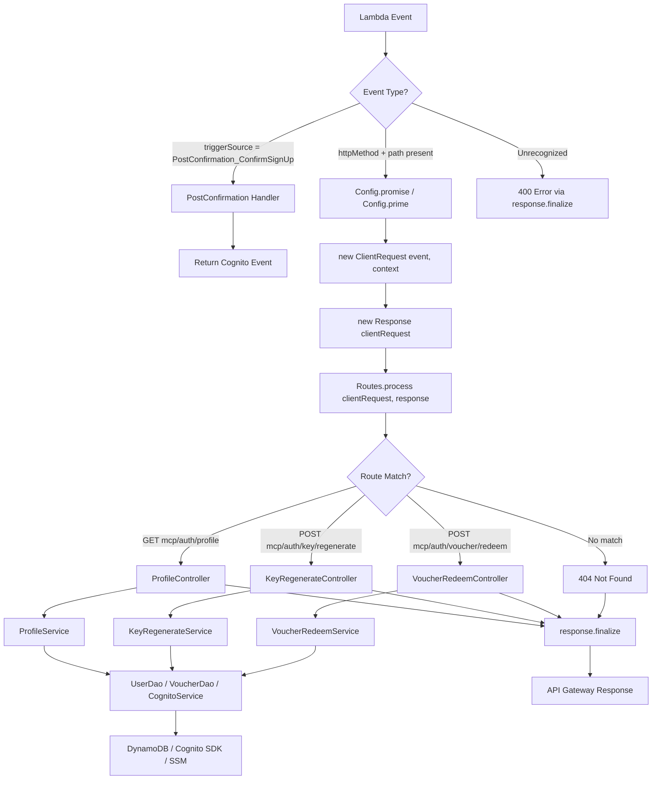
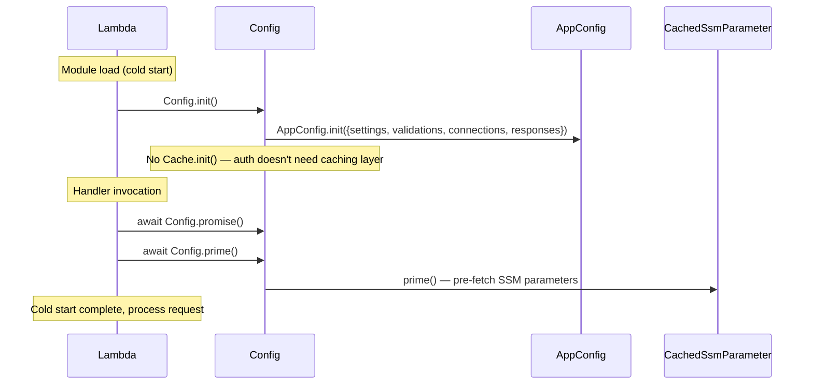
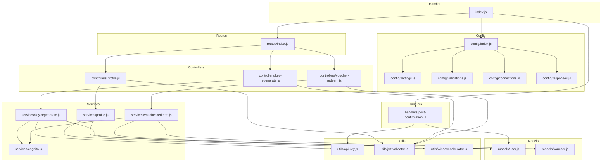

# Design Document: Update Auth Function to Use Cache-Data

## Overview

This design describes the refactoring of the auth Lambda function (`application-infrastructure/src/lambda/auth/`) from its current ad-hoc routing and response handling to the `@63klabs/cache-data` MVC architecture. The auth Lambda is unique because it handles two distinct event types in a single function:

1. **Cognito PostConfirmation triggers** — domain validation, tier assignment, API key generation, user record creation. This path stays as-is.
2. **API Gateway proxy events** — profile retrieval, key regeneration, voucher redemption. This path migrates to the cache-data MVC pattern.

The refactoring preserves all existing endpoint behavior (response bodies, status codes, error formats) while gaining the benefits of the cache-data framework: normalized path handling via `ClientRequest`, automatic CORS via `Response.finalize()`, structured logging via `DebugAndLog`, cold start optimization via `Config.init()/promise()/prime()`, and consolidated SSM caching via `CachedSsmParameter`.

The endpoint paths gain the `/mcp` prefix (e.g., `/auth/profile` → `/mcp/auth/profile`), consistent with the read Lambda's `/mcp/v1` path structure. `ClientRequest` from cache-data normalizes paths regardless of whether requests arrive through CloudFront or direct API Gateway, resolving the path inconsistency issue described in the SPEC.

### Design Decisions

| Decision | Choice | Rationale |
|----------|--------|-----------|
| Cache.init() | Skip — only use AppConfig.init() | Auth Lambda doesn't cache external API responses. DynamoDB operations are direct reads/writes that don't benefit from the cache-data caching layer. Avoids requiring `CacheData_SecureDataKey` SSM parameter. |
| PostConfirmation handler location | Keep in `handlers/` | The name clearly communicates "Lambda event handlers that aren't HTTP controllers." Minimal churn. |
| PostConfirmation DAO sharing | Share `models/` layer | PostConfirmation already imports from `utils/dynamo-client.js`. Moving those functions to `models/` and importing from there is minimal change. The DAO layer has no dependency on cache-data request/response classes. |
| JWT validator SSM migration | Migrate to CachedSsmParameter | Consolidates all SSM access into one pattern. The validator accepts User Pool ID as a parameter rather than fetching it internally, improving testability. |
| Rate limit config | Move to `config/settings.js` | Consistent with the read Lambda where `settings.rateLimits` contains all rate limit configuration. Eliminates the separate utility. |
| SSM path prefix | Keep `app-stack/` as-is | Reflects the CloudFormation stack that created the parameter. Changing SSM paths is outside scope. |
| Error response format | Keep current auth format for endpoint errors, read Lambda format for 500s | Preserves backward compatibility for 401/400/404 responses. Adds `requestId` for 500 errors to improve debuggability. |
| Test framework | Jest | Existing tests already use Jest. Follow existing naming convention (`tests/unit/*.test.js` and `tests/property/*.property.test.js`). |

## Architecture

### Request Lifecycle



### Cold Start Initialization



### Directory Structure (Target)

```
src/lambda/auth/
├── index.js                    # Thin handler: dual event detection, Config init
├── package.json                # Adds @63klabs/cache-data dependency
├── config/
│   ├── index.js                # Config extends AppConfig (no Cache.init)
│   ├── settings.js             # Env vars, SSM params, rate limits, table names
│   ├── validations.js          # ClientRequest parameter validation rules
│   ├── connections.js          # DynamoDB table connection definitions
│   └── responses.js            # Response format settings
├── routes/
│   └── index.js                # Route dispatcher using clientRequest.getProps()
├── controllers/
│   ├── profile.js              # GET mcp/auth/profile
│   ├── key-regenerate.js       # POST mcp/auth/key/regenerate
│   └── voucher-redeem.js       # POST mcp/auth/voucher/redeem
├── services/
│   ├── profile.js              # Profile business logic
│   ├── key-regenerate.js       # Key regeneration business logic
│   ├── voucher-redeem.js       # Voucher redemption business logic
│   └── cognito.js              # Cognito SDK operations (shared)
├── models/
│   ├── user.js                 # User DAO (DynamoDB operations)
│   └── voucher.js              # Voucher DAO (DynamoDB operations)
├── handlers/
│   └── post-confirmation.js    # Cognito trigger (unchanged, shares models/)
├── utils/
│   ├── api-key.js              # Key generation/hashing (unchanged)
│   ├── jwt-validator.js        # JWT validation (SSM migrated to CachedSsmParameter)
│   └── window-calculator.js    # Window boundaries/session key (unchanged)
├── tests/
│   ├── unit/
│   │   ├── config.test.js
│   │   ├── route-dispatcher.test.js
│   │   ├── profile-controller.test.js
│   │   ├── key-regenerate-controller.test.js
│   │   ├── voucher-redeem-controller.test.js
│   │   ├── profile-service.test.js
│   │   ├── key-regenerate-service.test.js
│   │   ├── voucher-redeem-service.test.js
│   │   ├── user-dao.test.js
│   │   ├── voucher-dao.test.js
│   │   ├── cognito-service.test.js
│   │   ├── jwt-validator.test.js
│   │   ├── post-confirmation.test.js
│   │   └── window-calculator.test.js
│   └── property/
│       ├── api-key.property.test.js
│       ├── effective-tier.property.test.js
│       ├── profile-response.property.test.js
│       ├── session-key-consistency.property.test.js
│       ├── voucher-validation.property.test.js
│       ├── window-reset.property.test.js
│       ├── domain-assignment.property.test.js
│       └── cognito-env-var.property.test.js
```

### Files Removed After Migration

- `handlers/profile.js` — replaced by `controllers/profile.js` + `services/profile.js`
- `handlers/key-regenerate.js` — replaced by `controllers/key-regenerate.js` + `services/key-regenerate.js`
- `handlers/voucher-redeem.js` — replaced by `controllers/voucher-redeem.js` + `services/voucher-redeem.js`
- `utils/dynamo-client.js` — replaced by `models/user.js` + `models/voucher.js`
- `utils/rate-limit-config.js` — replaced by `config/settings.js` rateLimits section

## Components and Interfaces

### 1. Handler Entry Point (`index.js`)

The handler detects the event type and branches:

- **Cognito PostConfirmation**: Delegates directly to `handlers/post-confirmation.js` without cache-data classes. Returns the Cognito event object.
- **API Gateway proxy**: Creates `ClientRequest`/`Response`, delegates to `Routes.process()`, calls `response.finalize()`.

```javascript
// Pseudocode for index.js
const { tools: { DebugAndLog, ClientRequest, Response, Timer } } = require('@63klabs/cache-data');
const { Config } = require('./config');
const Routes = require('./routes');
const postConfirmationHandler = require('./handlers/post-confirmation');

const coldStartInitTimer = new Timer('coldStartTimer', true);
Config.init();

exports.handler = async (event, context) => {
  // Cognito trigger path — no cache-data classes
  if (event.triggerSource === 'PostConfirmation_ConfirmSignUp') {
    try {
      return await postConfirmationHandler.handler(event);
    } catch (error) {
      console.error('Post-Confirmation trigger error:', error);
      throw error; // Re-throw to reject Cognito confirmation
    }
  }

  // API Gateway path — full MVC pattern
  let clientRequest = null;
  let response = null;

  try {
    await Config.promise();
    await Config.prime();
    if (coldStartInitTimer.isRunning()) {
      DebugAndLog.log(coldStartInitTimer.stop(), 'COLDSTART');
    }

    clientRequest = new ClientRequest(event, context);
    response = new Response(clientRequest);

    await Routes.process(clientRequest, response);
    return response.finalize();
  } catch (error) {
    DebugAndLog.error(`Unhandled error: ${error.message}`, error.stack);
    if (!response) {
      response = new Response({ statusCode: 500 });
    } else {
      response.setStatusCode(500);
    }
    response.setBody({
      error: 'Internal server error',
      requestId: event.requestContext?.requestId || context?.awsRequestId || 'unknown'
    });
    return response.finalize();
  }
};
```

### 2. Config Module (`config/index.js`)

Extends `AppConfig` without `Cache.init()`. Only initializes the request/response/logging framework.

```javascript
class Config extends AppConfig {
  static init() {
    const timerConfigInit = new Timer('timerConfigInit', true);
    try {
      AppConfig.init({ settings, validations, connections, responses, debug: true });
      // No Cache.init() — auth Lambda doesn't use CacheableDataAccess
    } catch (error) {
      DebugAndLog.error(`Could not initialize Config ${error.message}`, error.stack);
    } finally {
      timerConfigInit.stop();
    }
    return AppConfig.promise();
  }

  static async prime() {
    // Prime CachedSsmParameter instances defined in settings
    return CachedParameterSecrets.prime();
  }
}
```

### 3. Settings (`config/settings.js`)

Centralizes all environment variable parsing and SSM parameter definitions:

```javascript
const { tools: { CachedSsmParameter } } = require('@63klabs/cache-data');

const settings = {
  // DynamoDB table names
  usersTable: process.env.USERS_TABLE || '',
  sessionsTable: process.env.SESSIONS_TABLE || '',

  // SSM Parameters (CachedSsmParameter instances)
  cognito: {
    userPoolId: new CachedSsmParameter(
      process.env.PARAM_STORE_PATH + 'app-stack/Mcp_CognitoUserPoolId',
      { refreshAfter: 300 } // 5 minutes
    ),
  },

  ssm: {
    apiKeyHashSalt: new CachedSsmParameter(
      process.env.PARAM_STORE_PATH + 'Mcp_ApiKeyHashSalt',
      { refreshAfter: 300 }
    ),
    sessionHashSalt: new CachedSsmParameter(
      process.env.PARAM_STORE_PATH + 'Mcp_SessionHashSalt',
      { refreshAfter: 300 }
    ),
  },

  // Rate limit configuration (moved from utils/rate-limit-config.js)
  rateLimits: {
    public: {
      limitPerWindow: parseInt(process.env.MCP_PUBLIC_RATE_LIMIT || '50', 10),
      windowInMinutes: parseInt(process.env.MCP_PUBLIC_RATE_TIME_RANGE_MINUTES || '60', 10),
    },
    registered: {
      limitPerWindow: parseInt(process.env.MCP_REGISTERED_RATE_LIMIT || '100', 10),
      windowInMinutes: parseInt(process.env.MCP_REGISTERED_RATE_TIME_RANGE_MINUTES || '60', 10),
    },
    paid: {
      limitPerWindow: parseInt(process.env.MCP_PAID_RATE_LIMIT || '3000', 10),
      windowInMinutes: parseInt(process.env.MCP_PAID_RATE_TIME_RANGE_MINUTES || '1440', 10),
    },
    private: {
      limitPerWindow: parseInt(process.env.MCP_PRIVATE_RATE_LIMIT || '6000', 10),
      windowInMinutes: parseInt(process.env.MCP_PRIVATE_RATE_TIME_RANGE_MINUTES || '1440', 10),
    },
  },
};

module.exports = settings;
```

### 4. Validations (`config/validations.js`)

Defines ClientRequest parameter validation rules for auth endpoints:

```javascript
const ALLOWED_REFERRERS = ['*'];
const EXCLUDE_PARAMS_WITH_NO_VALIDATION_MATCH = false;

module.exports = {
  referrers: ALLOWED_REFERRERS,
  parameters: {
    excludeParamsWithNoValidationMatch: EXCLUDE_PARAMS_WITH_NO_VALIDATION_MATCH,
    pathParameters: {},
    queryStringParameters: {},
    bodyParameters: {
      // Voucher redeem endpoint body validation
      // BY_ROUTE: [{ route: 'POST:mcp/auth/voucher/redeem', validate: ... }]
    },
  },
};
```

### 5. Connections (`config/connections.js`)

Defines DynamoDB table connections as centralized resource references. Since the auth Lambda doesn't use `CacheableDataAccess`, these serve as configuration rather than cache profiles:

```javascript
const connections = [
  {
    name: 'dynamodb-users',
    host: 'dynamodb',
    path: process.env.USERS_TABLE || '',
    cache: [],
  },
  {
    name: 'dynamodb-sessions',
    host: 'dynamodb',
    path: process.env.SESSIONS_TABLE || '',
    cache: [],
  },
];

module.exports = connections;
```

### 6. Responses (`config/responses.js`)

```javascript
const responses = {
  settings: {
    errorExpirationInSeconds: 0,    // Auth responses should not be cached
    routeExpirationInSeconds: 0,    // Auth responses should not be cached
    externalRequestHeadroomInMs: 8000,
  },
  jsonResponses: {},
  htmlResponses: {},
  xmlResponses: {},
  rssResponses: {},
  textResponses: {},
};

module.exports = responses;
```

### 7. Route Dispatcher (`routes/index.js`)

Reads `clientRequest.getProps()` and dispatches to controllers. Uses lazy-loading for controller imports.

```javascript
const { tools: { DebugAndLog } } = require('@63klabs/cache-data');

const process = async (clientRequest, response) => {
  const props = clientRequest.getProps();
  const method = (props.method || '').toUpperCase();
  const path = props.path || '';

  // Route: GET mcp/auth/profile
  if (path.endsWith('mcp/auth/profile') && method === 'GET') {
    const ProfileController = require('../controllers/profile');
    await ProfileController.get(props, response);
    return;
  }

  // Route: POST mcp/auth/key/regenerate
  if (path.endsWith('mcp/auth/key/regenerate') && method === 'POST') {
    const KeyRegenerateController = require('../controllers/key-regenerate');
    await KeyRegenerateController.post(props, response);
    return;
  }

  // Route: POST mcp/auth/voucher/redeem
  if (path.endsWith('mcp/auth/voucher/redeem') && method === 'POST') {
    const VoucherRedeemController = require('../controllers/voucher-redeem');
    await VoucherRedeemController.post(props, response);
    return;
  }

  // No matching route
  DebugAndLog.warn('No matching route', { method, path });
  response.setStatusCode(404);
  response.setBody({ error: 'Not found' });
};

module.exports = { process };
```

The route dispatcher uses `path.endsWith()` rather than exact matching, following the read Lambda's pattern. This handles both CloudFront-proxied paths (which may have a leading prefix) and direct API Gateway paths.

### 8. Controllers

Controllers receive `props` (from `clientRequest.getProps()`) and a `response` object. They validate the JWT, call the service layer, and populate the response. Each controller uses `Timer` for performance measurement and `DebugAndLog` for logging.

**ProfileController** (`controllers/profile.js`):
```javascript
class ProfileController {
  static async get(props, response) {
    const timer = new Timer('ProfileController.get', true);
    try {
      // Extract raw event from props for JWT validation
      const jwtPayload = await validateJwt(props);
      const profileData = await ProfileService.getProfile(
        jwtPayload.email, jwtPayload.sub
      );
      response.setStatusCode(200);
      response.setBody(profileData);
    } catch (error) {
      // Handle known error types (401, 404) and unknown (500)
    } finally {
      timer.stop();
    }
  }
}
```

**KeyRegenerateController** (`controllers/key-regenerate.js`):
```javascript
class KeyRegenerateController {
  static async post(props, response) {
    // Validate JWT, call KeyRegenerateService, return { apiKey, message }
  }
}
```

**VoucherRedeemController** (`controllers/voucher-redeem.js`):
```javascript
class VoucherRedeemController {
  static async post(props, response) {
    // Validate JWT, parse body for voucher code, call VoucherRedeemService
    // Return { tier, tierExpiresAt, message }
  }
}
```

### 9. Services

Services contain business logic. They call DAOs and the Cognito service. They do not know about HTTP requests or responses.

**ProfileService** (`services/profile.js`):
- Looks up user by email via `UserDao.queryByEmail()`
- Computes effective tier (handles `tierExpiresAt` expiration)
- Gets rate limit config from `Config.settings().rateLimits`
- Retrieves session hash salt from `Config.settings().ssm.sessionHashSalt`
- Computes window boundaries and session key
- Queries Sessions Table for current window record
- Returns consolidated profile data object

**KeyRegenerateService** (`services/key-regenerate.js`):
- Looks up user by email via `UserDao.queryByEmail()`
- Generates new API key via `generateApiKey()`
- Computes HMAC-SHA256 hash via `hashApiKey()`
- Deletes old key record via `UserDao.deleteUserRecord()`
- Creates new key record via `UserDao.putUserRecord()`
- Updates Cognito `custom:api_key` via `CognitoService.updateUserAttributes()`
- Returns `{ apiKey: rawKey, message: '...' }`

**VoucherRedeemService** (`services/voucher-redeem.js`):
- Looks up voucher via `VoucherDao.getVoucher()`
- Validates voucher (exists, not expired, uses remaining)
- Looks up user by email via `UserDao.queryByEmail()`
- Updates user tier via `UserDao.updateUserTier()`
- Increments voucher uses via `VoucherDao.incrementVoucherUses()`
- Updates Cognito `custom:tier` via `CognitoService.updateUserAttributes()`
- Returns `{ tier, tierExpiresAt, message: '...' }`

**CognitoService** (`services/cognito.js`):
- Encapsulates `CognitoIdentityProviderClient` operations
- Retrieves User Pool ID from `Config.settings().cognito.userPoolId` (CachedSsmParameter)
- Provides `updateUserAttributes(cognitoSub, attributes)` method
- Uses `DebugAndLog` for error logging

### 10. Models / DAOs

**UserDao** (`models/user.js`):
- `getUserByKeyHash(hash)` — GetCommand on Users table
- `putUserRecord(record)` — PutCommand on Users table
- `deleteUserRecord(pk)` — DeleteCommand on Users table
- `queryByEmail(email)` — QueryCommand on email-index GSI
- `updateUserTier(pk, tier, tierExpiresAt, ttl)` — UpdateCommand on Users table
- `getSessionRecord(pk)` — GetCommand on Sessions table

Table names come from `Config.settings()` rather than direct `process.env` access. Uses `DebugAndLog` for error logging. Includes `TestHarness` class.

**VoucherDao** (`models/voucher.js`):
- `getVoucher(code)` — GetCommand for `VOUCHER#<code>` on Users table
- `incrementVoucherUses(code)` — UpdateCommand with atomic increment

### 11. JWT Validator (`utils/jwt-validator.js`)

The JWT validator retains its current logic (JWKS fetching, signature verification, expiration/issuer/token_use checks) but migrates its User Pool ID retrieval:

- **Before**: Custom `getCachedSsmParam()` with module-level `cachedUserPoolId` and `userPoolIdCacheTime`
- **After**: Accepts User Pool ID as a parameter. Controllers pass the value from `Config.settings().cognito.userPoolId.getValue()`. The `process.env.COGNITO_USER_POOL_ID` fallback is preserved for the read Lambda's usage.

The JWKS cache remains separate from CachedSsmParameter since JWKS is fetched from a Cognito HTTP endpoint, not SSM.

### 12. PostConfirmation Handler (`handlers/post-confirmation.js`)

Preserved as-is with minimal changes:
- Retains its own `getCachedSsmParam()` and SSM caching mechanism
- Updates import paths from `utils/dynamo-client.js` to `models/user.js` for `putUserRecord`
- Continues importing from `utils/api-key.js` for `generateApiKey` and `hashApiKey`
- Does NOT use cache-data `ClientRequest`, `Response`, or `DebugAndLog`
- MAY continue using `console.error` and `console.log`

### Component Dependency Diagram



## Data Models

### DynamoDB: Users Table

| Attribute | Type | Description |
|-----------|------|-------------|
| `pk` | String | Partition key. Format: `KEY#<hash>` for user records, `VOUCHER#<code>` for voucher records |
| `email` | String | User email address. GSI partition key (`email-index`) |
| `tier` | String | User tier: `registered`, `paid`, `private` |
| `cognitoSub` | String | Cognito user sub ID |
| `createdAt` | String | ISO 8601 creation timestamp |
| `ttl` | Number | DynamoDB TTL in Unix epoch seconds (120 days from creation) |
| `tierExpiresAt` | String/null | ISO 8601 tier expiration timestamp or null |

### DynamoDB: Sessions Table

| Attribute | Type | Description |
|-----------|------|-------------|
| `pk` | String | SHA-256 hash of `cognitoSub + windowStartMinutes + sessionSalt` |
| `remaining` | Number | Remaining requests in current window |
| `limit` | Number | Total limit for the window |
| `ttl` | Number | DynamoDB TTL in Unix epoch seconds |

### DynamoDB: Voucher Records (in Users Table)

| Attribute | Type | Description |
|-----------|------|-------------|
| `pk` | String | `VOUCHER#<code>` |
| `targetTier` | String | Tier to assign on redemption (e.g., `paid`) |
| `durationDays` | Number | Duration of tier upgrade in days |
| `expiresAt` | String | ISO 8601 voucher expiration timestamp |
| `maxUses` | Number | Maximum redemptions (0 = unlimited) |
| `currentUses` | Number | Current redemption count |

### SSM Parameters

| Parameter Path | Type | Used By |
|---------------|------|---------|
| `{PARAM_STORE_PATH}app-stack/Mcp_CognitoUserPoolId` | SecureString | JWT validator, Cognito service |
| `{PARAM_STORE_PATH}Mcp_ApiKeyHashSalt` | SecureString | Key regenerate service |
| `{PARAM_STORE_PATH}Mcp_SessionHashSalt` | SecureString | Profile service |
| `{PARAM_STORE_PATH}Mcp_BlockedEmailDomains` | String | PostConfirmation handler |
| `{PARAM_STORE_PATH}Mcp_AllowedEmailDomains` | String | PostConfirmation handler |
| `{PARAM_STORE_PATH}Mcp_BlockedCountries` | String | PostConfirmation handler |
| `{PARAM_STORE_PATH}Mcp_AllowedCountries` | String | PostConfirmation handler |
| `{PARAM_STORE_PATH}Mcp_AllowedPrivateDomains` | String | PostConfirmation handler |

### API Endpoint Contracts

**GET /mcp/auth/profile** (200 OK):
```json
{
  "email": "user@example.com",
  "tier": "registered",
  "tierExpiresAt": null,
  "createdAt": "2025-01-15T10:30:00.000Z",
  "rateLimits": {
    "limit": 100,
    "remaining": 85,
    "windowResetAt": 1737000000,
    "windowMinutes": 60
  }
}
```

**POST /mcp/auth/key/regenerate** (200 OK):
```json
{
  "apiKey": "atl_a1b2c3d4e5f6a7b8c9d0e1f2a3b4c5d6",
  "message": "API key regenerated successfully"
}
```

**POST /mcp/auth/voucher/redeem** (200 OK):
```json
{
  "tier": "paid",
  "tierExpiresAt": "2025-07-15T10:30:00.000Z",
  "message": "Voucher redeemed successfully"
}
```

**Error Responses** (endpoint-specific):
```json
{ "error": "Unauthorized" }           // 401
{ "error": "User not found" }         // 404
{ "error": "Voucher code is required" } // 400
{ "error": "Invalid voucher code" }   // 400
{ "error": "Voucher has expired" }    // 400
{ "error": "Voucher has been fully redeemed" } // 400
{ "error": "Not found" }              // 404 (route not found)
```

**Error Response** (unhandled 500 — handler catch block):
```json
{
  "error": "Internal server error",
  "requestId": "abc-123-def"
}
```


## Correctness Properties

*A property is a characteristic or behavior that should hold true across all valid executions of a system — essentially, a formal statement about what the system should do. Properties serve as the bridge between human-readable specifications and machine-verifiable correctness guarantees.*

### Property 1: Settings environment variable round-trip

*For any* set of valid rate limit values (positive integers for limitPerWindow and windowInMinutes), DynamoDB table names (non-empty strings), and PARAM_STORE_PATH values, when those values are set as environment variables and `config/settings.js` is loaded, the resulting settings object SHALL contain the exact same values in the corresponding fields (`rateLimits.{tier}.limitPerWindow`, `rateLimits.{tier}.windowInMinutes`, `usersTable`, `sessionsTable`).

**Validates: Requirements 2.4**

### Property 2: Route dispatcher correctness

*For any* request path and HTTP method combination, the route dispatcher SHALL:
- Delegate to the Profile Controller if and only if the path ends with `mcp/auth/profile` and the method is `GET`
- Delegate to the Key Regenerate Controller if and only if the path ends with `mcp/auth/key/regenerate` and the method is `POST`
- Delegate to the Voucher Redeem Controller if and only if the path ends with `mcp/auth/voucher/redeem` and the method is `POST`
- Set the response status to 404 with `{ "error": "Not found" }` for all other path/method combinations

This holds regardless of any prefix prepended to the path (e.g., CloudFront path prefixes, leading slashes).

**Validates: Requirements 4.2, 4.3, 4.4, 4.5**

### Property 3: User DAO put/get round-trip

*For any* valid user record (with a `pk` matching `KEY#<hash>` format, a valid email, a tier from `{registered, paid, private}`, a cognitoSub string, an ISO 8601 createdAt, a numeric ttl, and a nullable tierExpiresAt), storing the record via `UserDao.putUserRecord()` and then retrieving it via `UserDao.getUserByKeyHash()` SHALL return a record with all fields equal to the original.

**Validates: Requirements 8.2**

### Property 4: Profile response structure completeness

*For any* valid user record (with varying tiers, tierExpiresAt values including null and past/future dates, and createdAt timestamps) and any session record state (present with varying remaining counts, or absent), the profile response SHALL always contain exactly the fields `{ email, tier, tierExpiresAt, createdAt, rateLimits: { limit, remaining, windowResetAt, windowMinutes } }` where:
- `tier` equals the effective tier (falls back to `registered` if `tierExpiresAt` is in the past)
- `remaining` equals the session record's remaining value when present, or the tier's `limitPerWindow` when absent
- `limit` equals the effective tier's `limitPerWindow`
- `windowMinutes` equals the effective tier's `windowInMinutes`

**Validates: Requirements 5.2, 17.1**

### Property 5: Key regenerate response structure

*For any* valid user record, the key regeneration response SHALL always contain exactly the fields `{ apiKey, message }` where `apiKey` matches the format `/^atl_[0-9a-f]{32}$/` and `message` is a non-empty string.

**Validates: Requirements 17.2**

### Property 6: Voucher redeem response structure

*For any* valid voucher (not expired, uses remaining, with a targetTier and durationDays) and valid user record, the voucher redemption response SHALL always contain exactly the fields `{ tier, tierExpiresAt, message }` where `tier` equals the voucher's `targetTier` and `tierExpiresAt` is a valid ISO 8601 timestamp in the future.

**Validates: Requirements 17.3**

## Error Handling

### Handler-Level Error Handling

The handler (`index.js`) has two error handling paths:

1. **Cognito PostConfirmation path**: Errors are caught, logged with `console.error`, and re-thrown. Re-throwing causes Cognito to reject the confirmation, which is the correct behavior — a failed post-confirmation should not silently succeed.

2. **API Gateway path**: Errors are caught in a try/catch block. The handler:
   - Logs the full error (message + stack) via `DebugAndLog.error()`
   - Reuses the existing `Response` object if available (preserving the ClientRequest link for logging), or creates a standalone `Response({ statusCode: 500 })` if the error occurred before Response creation
   - Sets the body to `{ error: 'Internal server error', requestId: '...' }` — the requestId aids debugging without exposing internal details
   - Calls `response.finalize()` to ensure proper CORS headers and logging

### Controller-Level Error Handling

Each controller wraps its logic in try/catch with a finally block for Timer cleanup:

| Error Condition | Status Code | Response Body | Source |
|----------------|-------------|---------------|--------|
| JWT missing or invalid | 401 | `{ "error": "Unauthorized" }` | All controllers |
| User not found (empty queryByEmail) | 404 | `{ "error": "User not found" }` | All controllers |
| Voucher code missing from body | 400 | `{ "error": "Voucher code is required" }` | VoucherRedeemController |
| Invalid voucher code | 400 | `{ "error": "Invalid voucher code" }` | VoucherRedeemController |
| Voucher expired | 400 | `{ "error": "Voucher has expired" }` | VoucherRedeemController |
| Voucher fully redeemed | 400 | `{ "error": "Voucher has been fully redeemed" }` | VoucherRedeemController |
| Unhandled error | 500 | `{ "error": "Internal server error" }` | All controllers |

### Service-Level Error Handling

Services throw errors that controllers catch. Services do not set HTTP status codes — they throw descriptive errors that controllers translate to appropriate HTTP responses. This maintains the separation between business logic and HTTP concerns.

### DAO-Level Error Handling

DAOs let DynamoDB SDK errors propagate to the service/controller layer. They log errors via `DebugAndLog.error()` before re-throwing. This ensures errors are logged at the point of origin while allowing higher layers to decide the HTTP response.

### JWT Validator Error Handling

The JWT validator throws structured error objects `{ statusCode: 401, message: '...' }` for all validation failures. Controllers catch these and translate them to 401 responses. The validator's error messages are descriptive for debugging but the controller returns the generic `"Unauthorized"` message to clients.

## Testing Strategy

### Test Framework

All tests use **Jest** (existing framework in the auth Lambda). Test files follow the existing naming convention:
- Unit tests: `tests/unit/*.test.js`
- Property tests: `tests/property/*.property.test.js`

### Dual Testing Approach

**Unit tests** verify specific examples, edge cases, and error conditions:
- Controller tests: mock JWT validator, services, and verify response population
- Service tests: mock DAOs, Cognito service, and verify business logic orchestration
- DAO tests: mock DynamoDB DocumentClient and verify command construction
- Config tests: verify initialization flow and settings parsing
- Route dispatcher tests: verify routing logic with specific path/method combinations
- PostConfirmation tests: verify existing behavior is preserved (import path updates only)

**Property tests** verify universal properties across all inputs:
- Each property test references its design document property number
- Minimum 100 iterations per property test
- Tag format: **Feature: update-auth-function-to-use-cache-data, Property {number}: {property_text}**
- Uses `fast-check` (already in devDependencies)

### Property Test Configuration

```javascript
// Example property test structure
const fc = require('fast-check');

describe('Feature: update-auth-function-to-use-cache-data', () => {
  it('Property 1: Settings environment variable round-trip', () => {
    fc.assert(
      fc.property(
        fc.integer({ min: 1, max: 100000 }),
        fc.integer({ min: 1, max: 10080 }),
        (limit, window) => {
          // Set env vars, load settings, verify values match
        }
      ),
      { numRuns: 100 }
    );
  });
});
```

### Property Tests to Implement

| Property | Test File | What Varies | What's Verified |
|----------|-----------|-------------|-----------------|
| 1: Settings env var round-trip | `settings-parsing.property.test.js` | Rate limit values, table names, param paths | Settings object matches env vars |
| 2: Route dispatcher correctness | `route-dispatcher.property.test.js` | Path prefixes, methods, route suffixes | Correct controller called or 404 |
| 3: User DAO put/get round-trip | `user-dao-roundtrip.property.test.js` | User record fields (email, tier, dates) | Retrieved record matches stored record |
| 4: Profile response completeness | `profile-response.property.test.js` | User tiers, tierExpiresAt, session records | Response contains all required fields with correct values |
| 5: Key regenerate response | `key-regenerate-response.property.test.js` | User records | Response contains apiKey (correct format) and message |
| 6: Voucher redeem response | `voucher-redeem-response.property.test.js` | Voucher targetTier, durationDays, user records | Response contains correct tier, future tierExpiresAt, message |

### Existing Property Tests (Updated Imports)

The following existing property tests are preserved with updated import paths:
- `api-key.property.test.js` — API key format and hash determinism
- `cognito-env-var.property.test.js` — Cognito environment variable handling
- `domain-assignment.property.test.js` — Domain-based tier assignment
- `effective-tier.property.test.js` — Effective tier computation with expiration
- `session-key-consistency.property.test.js` — Session key hash consistency
- `voucher-validation.property.test.js` — Voucher validation logic
- `window-reset.property.test.js` — Window boundary computation

### Unit Tests to Implement

| Module | Test File | Key Scenarios |
|--------|-----------|---------------|
| Config | `config.test.js` | init() calls AppConfig.init(), prime() calls CachedParameterSecrets.prime(), no Cache.init() |
| Route Dispatcher | `route-dispatcher.test.js` | Each route match, 404 for unknown paths, lazy loading |
| ProfileController | `profile-controller.test.js` | Success flow, 401 (bad JWT), 404 (no user), 500 (error) |
| KeyRegenerateController | `key-regenerate-controller.test.js` | Success flow, 401, 404, 500 |
| VoucherRedeemController | `voucher-redeem-controller.test.js` | Success flow, 401, 400 (missing code, invalid voucher), 404, 500 |
| ProfileService | `profile-service.test.js` | Effective tier computation, session record present/absent |
| KeyRegenerateService | `key-regenerate-service.test.js` | Delete old + create new record, Cognito update |
| VoucherRedeemService | `voucher-redeem-service.test.js` | Voucher validation, tier update, Cognito update |
| UserDao | `user-dao.test.js` | Each DynamoDB operation, table name from settings |
| VoucherDao | `voucher-dao.test.js` | getVoucher, incrementVoucherUses |
| CognitoService | `cognito-service.test.js` | updateUserAttributes, User Pool ID from CachedSsmParameter |
| JWT Validator | `jwt-validator.test.js` | Existing tests updated for CachedSsmParameter migration |
| PostConfirmation | `post-confirmation.test.js` | Existing tests updated for import path changes |

### Test Execution

```bash
# Run all tests
npx jest --run

# Run unit tests only
npx jest tests/unit/

# Run property tests only
npx jest tests/property/
```
