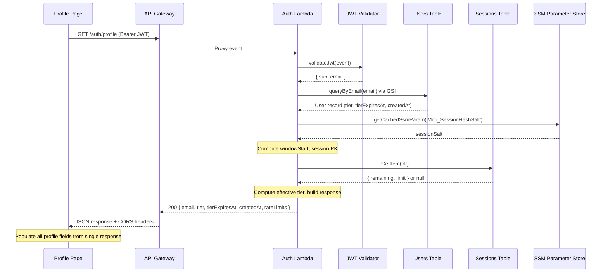

# Design Document: User Profile Enhancement

## Overview

This feature adds a `GET /auth/profile` endpoint to the Auth Lambda that returns consolidated profile data in a single API call. The endpoint authenticates via Cognito JWT, looks up the user record from the Users Table, queries the Sessions Table for real-time rate limit statistics, and returns a unified JSON response. The profile page is updated to call this endpoint instead of relying solely on client-side Cognito attributes.

### Design Rationale

The current profile page reads tier information from Cognito custom attributes (`custom:tier`) but cannot display:
- Server-confirmed email (from the Users Table, not just the JWT claim)
- Remaining requests in the current rate limit window (stored in the Sessions Table)
- Window reset time (computed from the rate limiter's interval-aligned window logic)
- Tier expiration date (stored in the Users Table but not in Cognito attributes)

A single server-side endpoint consolidates all of this data, avoiding multiple client-side lookups and ensuring the profile page displays authoritative, real-time information.

### Key Design Decisions

1. **Reuse existing utilities**: The profile handler reuses `validateJwt`, `queryByEmail`, and the SSM caching pattern already established in `key-regenerate.js` and `voucher-redeem.js`.
2. **Effective tier computation on the server**: The profile endpoint computes the effective tier (accounting for `tierExpiresAt`) rather than trusting the stored `tier` value, matching the Read Lambda's behavior.
3. **Rate limit config via environment variables**: Rather than importing `settings.json` or the Read Lambda's `config/settings.js`, the Auth Lambda receives rate limit configuration through environment variables (same values, different delivery mechanism). This avoids coupling the Auth Lambda to the Read Lambda's module structure.
4. **Read-only Sessions Table access**: The Auth Lambda only needs `dynamodb:GetItem` on the Sessions Table — no write permissions — enforcing least privilege.
5. **Shared window computation logic**: The session partition key and window boundary computation must use the same algorithm as the Read Lambda's rate limiter (`SHA-256(cognitoSub + windowStartMinutes + salt)` with interval-aligned windows). A shared utility module (`utils/window-calculator.js`) is extracted or the computation is replicated exactly.

---

## Architecture



### Integration Points

The profile endpoint integrates with existing infrastructure at these points:

| Component | Integration | Direction |
|-----------|------------|-----------|
| JWT Validator (`utils/jwt-validator.js`) | Validates Cognito JWT, extracts `sub` and `email` | Read |
| Users Table (via `utils/dynamo-client.js`) | Queries user record by email GSI | Read |
| Sessions Table (DynamoDB) | Gets current rate limit window record | Read |
| SSM Parameter Store | Retrieves `Mcp_SessionHashSalt` (cached) | Read |
| Route Dispatcher (`routes/index.js`) | Routes `GET /auth/profile` to handler | Dispatch |
| Index Handler (`index.js`) | Applies CORS headers via `withCorsHeaders` | Wrap |

---

## Components and Interfaces

### 1. Profile Handler (`handlers/profile.js`)

New handler module following the same pattern as `key-regenerate.js` and `voucher-redeem.js`.

```javascript
/**
 * @module handlers/profile
 * @async
 * @param {Object} event - API Gateway proxy event
 * @returns {Promise<{statusCode: number, headers: Object, body: string}>}
 */
```

**Responsibilities:**
- Validate JWT and extract `sub`, `email`
- Query Users Table by email (GSI)
- Compute effective tier (handle `tierExpiresAt` expiration)
- Compute session partition key using the same algorithm as the Read Lambda
- Query Sessions Table for current window record
- Assemble and return the consolidated profile response

**Internal functions:**
- `computeEffectiveTier(tier, tierExpiresAt)` — Returns `'registered'` if `tierExpiresAt` is set and in the past; otherwise returns the stored `tier`.
- `getRateLimitConfig()` — Returns the rate limit configuration object from environment variables.
- `computeWindowBoundaries(windowInMinutes)` — Computes `windowStartMinutes` and `resetTimeMinutes` using the same interval-aligned logic as the Read Lambda.
- `computeSessionKey(cognitoSub, windowStartMinutes, salt)` — SHA-256 hash of `cognitoSub + windowStartMinutes + salt`.

### 2. Route Dispatcher Update (`routes/index.js`)

Add a `GET_ROUTES` map alongside the existing `POST_ROUTES`:

```javascript
const GET_ROUTES = {
  '/auth/profile': { handler: profileHandler.handler }
};
```

Update the `route()` function to check `GET_ROUTES` when `method === 'GET'`.

### 3. Index Handler Update (`index.js`)

Update `CORS_HEADERS` to include `GET` in `Access-Control-Allow-Methods`:

```javascript
const CORS_HEADERS = {
  'Access-Control-Allow-Origin': '*',
  'Access-Control-Allow-Methods': 'GET, POST, OPTIONS',
  'Access-Control-Allow-Headers': 'Content-Type, Authorization, X-Requested-With'
};
```

No other changes needed — `withCorsHeaders` already wraps all API Gateway responses.

### 4. DynamoDB Client Extension (`utils/dynamo-client.js`)

Add a `getSessionRecord(tableName, pk)` function for reading from the Sessions Table:

```javascript
/**
 * @param {string} tableName - Sessions table name
 * @param {string} pk - Session partition key (SHA-256 hash)
 * @returns {Promise<Object|null>} Session record or null
 */
async function getSessionRecord(tableName, pk) { ... }
```

This uses a separate table name (from `SESSIONS_TABLE` env var) rather than the `USERS_TABLE` used by existing functions.

### 5. Profile Page Update (`profile/index.html`)

Replace the current Cognito-attribute-based data loading with a single `GET /auth/profile` API call. Add UI elements for:
- Email display (read-only text)
- Remaining requests count with total (e.g., "42 of 100 remaining")
- Window reset time (formatted as local date/time)

### 6. CloudFormation Updates (`template.yml`)

- Add `GET /auth/profile` API Gateway event on `AuthLambdaFunction`
- Add `SESSIONS_TABLE` environment variable to `AuthLambdaFunction`
- Add rate limit environment variables (`MCP_PUBLIC_RATE_LIMIT`, etc.)
- Add `dynamodb:GetItem` permission on `DynamoDbSessions.Arn` to `AuthLambdaExecutionRole`
- Update `template-openapi-spec.yml` with the new GET endpoint

---

## Data Models

### Profile Response Schema

```json
{
  "email": "user@example.com",
  "tier": "registered",
  "tierExpiresAt": "2025-12-31T00:00:00.000Z",
  "createdAt": "2025-01-15T10:30:00.000Z",
  "rateLimits": {
    "limit": 100,
    "remaining": 42,
    "windowResetAt": 1735689600,
    "windowMinutes": 60
  }
}
```

| Field | Type | Description |
|-------|------|-------------|
| `email` | string | Server-confirmed email from Users Table |
| `tier` | string | Effective tier (accounts for expiration) |
| `tierExpiresAt` | string \| null | ISO 8601 expiration or null if permanent |
| `createdAt` | string | ISO 8601 account creation date |
| `rateLimits.limit` | number | Max requests per window for the effective tier |
| `rateLimits.remaining` | number | Requests remaining in current window |
| `rateLimits.windowResetAt` | number | Unix epoch seconds when window resets |
| `rateLimits.windowMinutes` | number | Window duration in minutes |

### Error Response Schema

All error responses follow the existing pattern:

```json
{
  "error": "Error message string"
}
```

| Status Code | Condition |
|-------------|-----------|
| 401 | Missing, invalid, or expired JWT |
| 404 | No user record found for email |
| 500 | Internal error (DynamoDB, SSM, config) |

### Users Table Record (existing)

```
pk: "KEY#<hmac_sha256_hash>"
email: "user@example.com"
tier: "registered" | "paid" | "private"
cognitoSub: "abc-123-def"
createdAt: "2025-01-15T10:30:00.000Z"
tierExpiresAt: "2025-12-31T00:00:00.000Z" | null
ttl: 1735689600
```

### Sessions Table Record (existing)

```
pk: "<sha256_hash>"  (hash of cognitoSub + windowStartMinutes + sessionSalt)
remaining: 42
limit: 100
ttl: 1735689900
```

### Rate Limit Configuration

Delivered via environment variables on the Auth Lambda:

| Env Var | Default | Description |
|---------|---------|-------------|
| `MCP_PUBLIC_RATE_LIMIT` | 50 | Public tier limit per window |
| `MCP_PUBLIC_RATE_TIME_RANGE_MINUTES` | 60 | Public tier window (minutes) |
| `MCP_REGISTERED_RATE_LIMIT` | 100 | Registered tier limit per window |
| `MCP_REGISTERED_RATE_TIME_RANGE_MINUTES` | 60 | Registered tier window (minutes) |
| `MCP_PAID_RATE_LIMIT` | 3000 | Paid tier limit per window |
| `MCP_PAID_RATE_TIME_RANGE_MINUTES` | 1440 | Paid tier window (minutes) |
| `MCP_PRIVATE_RATE_LIMIT` | 6000 | Private tier limit per window |
| `MCP_PRIVATE_RATE_TIME_RANGE_MINUTES` | 1440 | Private tier window (minutes) |

### Effective Tier Computation

```
if tierExpiresAt is not null AND new Date(tierExpiresAt) < now:
    effectiveTier = "registered"
else:
    effectiveTier = storedTier
```

### Session Partition Key Computation

Must match the Read Lambda's `rate-limiter.js` exactly:

```
windowInMinutes = rateLimits[effectiveTier].windowInMinutes
resetTimeMinutes = nextIntervalInMinutes(windowInMinutes)
windowStartMinutes = resetTimeMinutes - windowInMinutes
pk = SHA-256(cognitoSub + windowStartMinutes + sessionSalt)
```

Where `nextIntervalInMinutes` computes the next interval-aligned boundary from midnight UTC.

---

## Correctness Properties

*A property is a characteristic or behavior that should hold true across all valid executions of a system — essentially, a formal statement about what the system should do. Properties serve as the bridge between human-readable specifications and machine-verifiable correctness guarantees.*

### Property 1: Effective tier expiration

*For any* user record with a `tier` value in `{registered, paid, private}` and a `tierExpiresAt` timestamp, if `tierExpiresAt` is in the past then `computeEffectiveTier` SHALL return `'registered'`; if `tierExpiresAt` is in the future or null then `computeEffectiveTier` SHALL return the stored `tier` value unchanged.

**Validates: Requirements 3.2**

### Property 2: Session key hash consistency

*For any* `cognitoSub` string, `windowStartMinutes` integer, and `salt` string, the profile handler's `computeSessionKey(cognitoSub, windowStartMinutes, salt)` SHALL produce the same SHA-256 hex digest as the Read Lambda's `hashClientIdentifier(cognitoSub, windowStartMinutes, salt)`.

**Validates: Requirements 4.2**

### Property 3: Window reset time computation

*For any* `windowInMinutes` value in `{60, 1440}` and any `windowStartMinutes` integer, the computed `windowResetAt` SHALL equal `(windowStartMinutes + windowInMinutes) * 60` (converting from minutes to Unix epoch seconds).

**Validates: Requirements 4.3**

### Property 4: Profile response completeness

*For any* valid user record (with email, tier, tierExpiresAt, createdAt) and any rate limit session state (existing record or no record), the profile response SHALL contain all required fields: `email` (string), `tier` (string), `tierExpiresAt` (string or null), `createdAt` (string), `rateLimits.limit` (number), `rateLimits.remaining` (number), `rateLimits.windowResetAt` (number), and `rateLimits.windowMinutes` (number).

**Validates: Requirements 5.1**

---

## Error Handling

### Error Hierarchy

The profile handler follows the same error handling pattern as existing Auth Lambda handlers:

| Error Source | Handler Behavior | HTTP Response |
|-------------|-----------------|---------------|
| JWT validation failure | Catch error from `validateJwt` | 401 `{"error": "Unauthorized"}` |
| User not found (empty GSI result) | Check `existingRecords.length === 0` | 404 `{"error": "User not found"}` |
| SSM parameter unavailable | Caught by top-level try/catch | 500 `{"error": "Internal server error"}` |
| Sessions Table read failure | Caught by top-level try/catch | 500 `{"error": "Internal server error"}` |
| Rate limit config missing/invalid | Validate config at handler start | 500 `{"error": "Internal server error"}` |
| Any unexpected error | Top-level try/catch | 500 `{"error": "Internal server error"}` |

### Error Logging

All errors are logged with `console.error` for CloudWatch debugging, following the existing pattern:

```javascript
console.error('Profile retrieval error:', error);
```

The client never receives internal error details — only the sanitized `"Internal server error"` message.

### Sessions Table Graceful Degradation

If the Sessions Table read fails (DynamoDB timeout, permission error), the handler returns HTTP 500 rather than returning partial data. This is a deliberate choice: the requirements specify that the profile endpoint returns rate limit statistics, and returning a response without them would be misleading.

### Rate Limit Config Validation

The handler validates that rate limit configuration is available for the user's effective tier before proceeding. If the configuration is missing (e.g., environment variables not set), it returns HTTP 500 per Requirement 7.3.

---

## Testing Strategy

### Property-Based Tests

Property-based tests use `fast-check` (already a devDependency in the auth lambda's `package.json`) with a minimum of 100 iterations per property.

| Property | Test File | What Varies |
|----------|-----------|-------------|
| 1: Effective tier expiration | `tests/property/effective-tier.property.test.js` | tier values, tierExpiresAt (past/future/null) |
| 2: Session key hash consistency | `tests/property/session-key-consistency.property.test.js` | cognitoSub strings, windowStart integers, salt strings |
| 3: Window reset time computation | `tests/property/window-reset.property.test.js` | windowInMinutes values, windowStart integers |
| 4: Profile response completeness | `tests/property/profile-response.property.test.js` | user records (email, tier, tierExpiresAt, createdAt), session states (present/absent) |

Each test is tagged with: `Feature: user-profile-enhancement, Property {N}: {description}`

### Unit Tests

Unit tests cover specific examples, edge cases, and integration points:

| Test Area | Test File | Coverage |
|-----------|-----------|----------|
| Profile handler happy path | `tests/unit/profile.test.js` | JWT → user lookup → session lookup → 200 response |
| Profile handler 401 | `tests/unit/profile.test.js` | Missing/invalid JWT returns 401 |
| Profile handler 404 | `tests/unit/profile.test.js` | No user record returns 404 |
| Profile handler 500 | `tests/unit/profile.test.js` | DynamoDB/SSM errors return 500 |
| No session record fallback | `tests/unit/profile.test.js` | Missing session returns full tier limit |
| Route dispatcher GET | `tests/unit/route-dispatcher.test.js` | GET /auth/profile routes to profile handler |
| CORS headers include GET | `tests/unit/cors-headers.test.js` | Access-Control-Allow-Methods includes GET |
| Rate limit config validation | `tests/unit/profile.test.js` | Missing config returns 500 |

### Test Approach Balance

- **Property tests** handle the pure logic: tier computation, hash consistency, window math, response shape
- **Unit tests** handle the integration wiring: JWT validation calls, DynamoDB calls, error paths, routing
- All tests mock external dependencies (DynamoDB, SSM, Cognito) — no real AWS calls
- Tests follow the existing Jest + `fast-check` pattern used in `tests/property/` and `tests/unit/`
