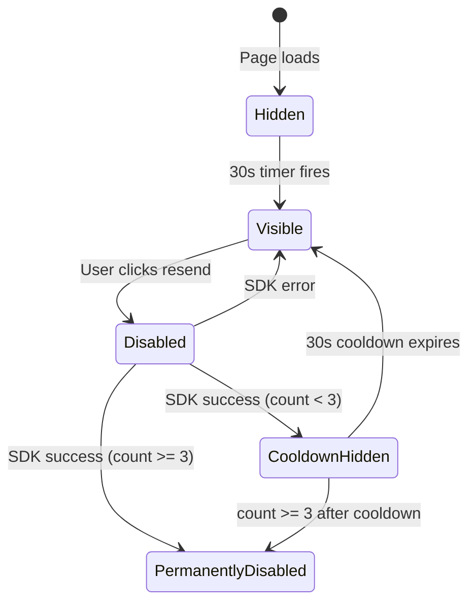

# Design Document: Add Account Validation Retry

## Overview

This feature enhances the account registration and email verification flow on two static HTML pages (`/register/index.html` and `/login/index.html`) by adding retry capabilities for email verification codes. The changes are entirely client-side JavaScript modifications that interact with the existing `amazon-cognito-identity-js` SDK already loaded via CDN.

The design addresses five key scenarios:
1. Displaying a spam folder advisory on the verification step
2. Providing a resend verification code button with cooldown and rate limiting
3. Handling re-registration attempts for unverified accounts
4. Handling login attempts with unverified accounts (redirect to verification)
5. Ensuring accessibility compliance for all new UI elements

No backend (Lambda) changes are required. The Cognito SDK methods `resendConfirmationCode()`, `confirmRegistration()`, and `authenticateUser()` already support the needed operations.

## Architecture

```mermaid
flowchart TD
    subgraph Login Page
        A[User submits login] --> B{authenticateUser}
        B -->|Success| C[Redirect to /profile/]
        B -->|UserNotConfirmedException| D[Disable form + resendConfirmationCode]
        D -->|Success| E[Show info message 2s then redirect]
        E --> F[Redirect to /register/?verify=email]
        D -->|Error| G[Re-enable form + show error]
    end

    subgraph Registration Page
        H[Page loads] --> I{Has ?verify param?}
        I -->|Yes| J[Show Verification Step with email from param]
        I -->|No| K[Show Registration Form]
        K --> L[User submits registration]
        L --> M{signUp}
        M -->|Success| N[Show Verification Step]
        M -->|UsernameExistsException| O[Disable form + resendConfirmationCode]
        O -->|Success| N
        O -->|Already verified error| P[Show 'account exists, please log in']
        O -->|Other error| Q[Show error + re-enable form]
        N --> R[Show spam advisory + start 30s timer]
        R -->|30s elapsed| S[Show Resend Button]
        S --> T[User clicks Resend]
        T --> U{resendConfirmationCode}
        U -->|Success| V[Show confirmation + hide button 30s + increment counter]
        V -->|counter >= 3| W[Disable button permanently + show max message]
        U -->|Error| X[Show error + re-enable button]
    end
```

The feature follows the existing architecture pattern: vanilla JavaScript in inline `<script>` blocks within static HTML pages, using the Cognito Identity SDK loaded from CDN. Template tokens (`{{{settings.*}}}`) are replaced during post-deploy by the `apply-settings.js` script.



## Components and Interfaces

### Registration Page Components

#### 1. Spam Folder Advisory

A static informational element rendered within the `#verify-step` container.

```html
<div id="spam-advisory" class="alert alert-info visible" role="note" aria-live="polite">
  If you don't see the verification email in your inbox, please check your spam or junk folder.
</div>
```

- Rendered in the same DOM structure as the verification step (no lazy loading)
- Uses `role="note"` for assistive technology identification
- Uses existing `.alert.alert-info` CSS classes

#### 2. Resend Button and Status Messages

```html
<div id="resend-container" class="hidden">
  <button type="button" id="resend-btn" class="btn btn-secondary"
          aria-label="Resend verification code to your email">
    Resend Code
  </button>
  <div id="resend-status" class="alert" role="status" aria-live="polite"></div>
</div>
```

**State Machine:**



#### 3. Resend State Manager

A closure-based state manager within the IIFE:

```javascript
var resendState = {
  count: 0,
  maxResends: 3,
  cooldownMs: 30000,
  initialDelayMs: 30000,
  timerId: null
};
```

#### 4. Query Parameter Handler

On page load, checks for `?verify=<email>` query parameter:

```javascript
var params = new URLSearchParams(window.location.search);
var verifyEmail = params.get('verify');
if (verifyEmail) {
  registeredEmail = verifyEmail;
  registerStep.classList.add('hidden');
  verifyStep.classList.remove('hidden');
  // Focus management with timeout fallback
}
```

### Login Page Components

#### 5. Unverified Account Handler

Extends the existing `onFailure` callback in `authenticateUser`:

```javascript
if (err.code === 'UserNotConfirmedException') {
  // Disable form controls
  // Call resendConfirmationCode
  // On success: show info message, wait 2s, redirect
  // On error: re-enable form, show error
}
```

### Interface: Cognito SDK Methods Used

| Method | Page | Trigger |
|--------|------|---------|
| `cognitoUser.resendConfirmationCode(callback)` | Register | Resend button click, UsernameExistsException handling |
| `cognitoUser.resendConfirmationCode(callback)` | Login | UserNotConfirmedException handling |
| `cognitoUser.confirmRegistration(code, forceAlias, callback)` | Register | Verify form submit (existing) |
| `userPool.signUp(email, password, attrs, null, callback)` | Register | Register form submit (existing) |
| `cognitoUser.authenticateUser(authDetails, callbacks)` | Login | Login form submit (existing) |

### Interface: Query Parameter Contract

| Parameter | Value | Direction | Purpose |
|-----------|-------|-----------|---------|
| `verify` | email address | Login → Register | Indicates user needs verification, pre-populates email |

## Data Models

No persistent data models are introduced. All state is ephemeral and lives in JavaScript closures within the page session:

### Registration Page State

```javascript
// Existing
var registeredEmail = '';  // Email for verification step

// New
var resendState = {
  count: 0,           // Number of successful resends in this session
  maxResends: 3,      // Maximum allowed resends
  cooldownMs: 30000,  // Cooldown between resends (30 seconds)
  initialDelayMs: 30000, // Delay before showing resend button (30 seconds)
  timerId: null       // Reference to active setTimeout for cleanup
};
```

### Login Page State

No new persistent state. The email is passed via query parameter to the registration page.

## Error Handling

### Registration Page Error Scenarios

| Scenario | SDK Error | User-Facing Behavior |
|----------|-----------|---------------------|
| Resend button clicked, SDK fails | Any error from `resendConfirmationCode` | Display error message in `#resend-status`, re-enable resend button |
| Re-registration, account unverified | `UsernameExistsException` from `signUp` | Call `resendConfirmationCode`, transition to verify step on success |
| Re-registration, account already verified | Error from `resendConfirmationCode` after `UsernameExistsException` (e.g., `InvalidParameterException` or similar indicating user is confirmed) | Display "Account already exists. Please log in." with link |
| Re-registration, rate limited | `LimitExceededException` from `resendConfirmationCode` | Display "Too many attempts. Please try again later." Re-enable submit button |
| Re-registration, network failure | Network error | Display "Could not send verification code. Please check your connection and try again." Re-enable submit button |
| Query param load, invalid email | N/A (client-side only) | If `verify` param is empty or missing, show normal registration form |

### Login Page Error Scenarios

| Scenario | SDK Error | User-Facing Behavior |
|----------|-----------|---------------------|
| Login with unverified account, resend succeeds | `UserNotConfirmedException` then successful resend | Show info message for 2s, redirect to `/register/?verify=<email>` |
| Login with unverified account, resend fails | `UserNotConfirmedException` then error from resend | Re-enable form, show "Could not send verification code. Please try again or contact support." |

### Error Detection for "Already Verified" Accounts

When `resendConfirmationCode` is called after a `UsernameExistsException`, the SDK may return different errors depending on the account state. The code will check for indicators that the account is already confirmed:

```javascript
// Heuristic: if resend fails and the error suggests the user is already confirmed
var isAlreadyVerified = (
  err.code === 'InvalidParameterException' ||
  (err.message && err.message.toLowerCase().includes('confirmed')) ||
  (err.message && err.message.toLowerCase().includes('verified'))
);
```

## Testing Strategy

### Why Property-Based Testing Does Not Apply

This feature consists entirely of:
- DOM manipulation (showing/hiding elements, updating text content)
- Event handler wiring (click handlers, form submissions)
- Timer-based UI state transitions (setTimeout for cooldowns)
- SDK method calls with callback handling
- URL query parameter parsing

There are no pure functions with meaningful input variation, no data transformations, no serialization, and no algorithms where generating random inputs would reveal edge cases beyond what example-based tests cover. All behaviors are deterministic responses to specific UI events or SDK responses.

### Testing Approach: Example-Based Unit Tests

All tests should be written in **Jest** with **jsdom** environment for DOM testing.

#### Test Organization

```
test/
├── static/
│   ├── register-resend-tests.jest.mjs
│   ├── register-reregistration-tests.jest.mjs
│   ├── register-query-param-tests.jest.mjs
│   ├── login-unverified-tests.jest.mjs
│   └── accessibility-tests.jest.mjs
```

#### Test Categories

**1. Spam Advisory Tests** (Requirement 1)
- Advisory is visible when verify step is shown
- Advisory has `role="note"` attribute
- Advisory has `aria-live="polite"` attribute
- Advisory remains visible during verification interactions

**2. Resend Button Tests** (Requirement 2)
- Button is hidden initially
- Button appears after 30-second delay
- Button calls `resendConfirmationCode` when clicked
- Button is disabled during pending request
- Success message appears and persists for 10 seconds
- Button is hidden for 30 seconds after successful resend
- Error message appears and button re-enables on failure
- Button is permanently disabled after 3 successful resends
- Max attempts message is displayed after 3 resends
- Button has proper aria-label and keyboard accessibility

**3. Re-Registration Flow Tests** (Requirement 3)
- `UsernameExistsException` triggers resend flow
- Submit button is disabled and loading indicator shown during resend
- Successful resend transitions to verify step with focus on code input
- Already-verified error shows "account exists" message with login link
- Other errors show error message and re-enable submit button
- Email is preserved for verification step

**4. Login Unverified Account Tests** (Requirement 4)
- `UserNotConfirmedException` triggers resend flow
- Form controls are disabled during resend
- Successful resend shows info message for 2 seconds then redirects
- Redirect URL includes `?verify=<email>` parameter
- Failed resend re-enables form and shows error message

**5. Query Parameter Handling Tests** (Requirement 4.3)
- Page with `?verify=email@example.com` shows verify step
- Email is pre-populated for code confirmation
- Focus moves to verification code input within 500ms
- Missing or empty verify param shows normal registration form

**6. Accessibility Tests** (Requirement 5)
- All dynamic messages have `aria-live="polite"`
- Resend button has descriptive `aria-label`
- Focus management on redirect (within 500ms)
- Tab order follows visual layout
- Error messages associated via `aria-describedby`
- Fallback focus behavior when input not rendered within 2s

#### Mocking Strategy

- Mock `AmazonCognitoIdentity.CognitoUser` and its methods
- Mock `AmazonCognitoIdentity.CognitoUserPool`
- Use Jest fake timers for setTimeout/setInterval testing
- Mock `window.location` for redirect testing
- Mock `URLSearchParams` for query parameter testing
- Use `document.activeElement` assertions for focus management

#### Test Execution

```bash
node --experimental-vm-modules ./node_modules/jest/bin/jest.js test/static/
```

Tests should use the jsdom environment and load the HTML files for DOM testing, or extract testable logic into separate functions where practical.
