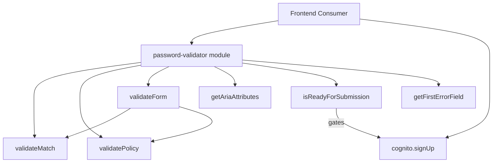

# Design Document: Password Re-entry Confirmation Module

## Overview

This design describes a standalone, framework-agnostic JavaScript validation module for password re-entry confirmation. The module provides pure functions for:

- Password match validation (case-sensitive, exact comparison)
- Cognito password policy validation (8+ chars, uppercase, lowercase, number, symbol)
- Real-time validation feedback with structured result objects
- WCAG 2.1 AA accessibility attribute generation (ARIA)
- Form submission gating
- Focus management guidance for error recovery

The module is consumed by frontend applications that integrate with the Cognito User Pool defined in this repository's CloudFormation template. It has zero runtime dependencies and no framework coupling.

## Architecture



### Design Decisions

1. **Standalone module in `utils/` directory**: The module lives at `application-infrastructure/src/lambda/auth/utils/password-validator.js` alongside existing utilities (`api-key.js`, `jwt-validator.js`). This keeps auth-related validation logic co-located while remaining importable by any frontend consumer via copy or package reference.

2. **Pure functions only**: Every exported function is a pure function — no side effects, no mutable state, no closures over shared variables. This guarantees deterministic behavior and makes property-based testing straightforward.

3. **No dependencies**: The module uses only built-in JavaScript string/regex operations. No external libraries required at runtime.

4. **CommonJS exports**: Matches the existing module pattern in this project (`module.exports`). Frontend consumers using ESM can import via bundler interop.

## Components and Interfaces

### Exported Functions

```javascript
module.exports = {
    validateMatch,
    validatePolicy,
    validateForm,
    getAriaAttributes,
    isReadyForSubmission,
    getFirstErrorField,
    FIELD_IDS,
    POLICY_RULES,
    TestHarness
};
```

### Function Signatures

#### `validateMatch(password, confirmPassword)`

Performs exact, case-sensitive comparison of two password values.

| Parameter | Type | Description |
|-----------|------|-------------|
| password | `string\|null\|undefined` | Primary password value |
| confirmPassword | `string\|null\|undefined` | Confirmation password value |

**Returns:** `{isValid: boolean, error: string|null}`

- `isValid: true, error: null` when both are identical non-empty strings
- `isValid: false, error: 'MISSING_PASSWORD'` when password is empty/null/undefined
- `isValid: false, error: 'MISSING_CONFIRM_PASSWORD'` when confirmPassword is empty/null/undefined
- `isValid: false, error: 'PASSWORDS_DO_NOT_MATCH'` when values differ

#### `validatePolicy(password)`

Validates a password against the Cognito User Pool password policy.

| Parameter | Type | Description |
|-----------|------|-------------|
| password | `string\|null\|undefined` | Password value to validate |

**Returns:** `string[]` — Array of violation identifiers (empty if valid)

Violation identifiers:
- `'REQUIRED'` — password is null, undefined, or empty string
- `'MIN_LENGTH'` — fewer than 8 characters
- `'MAX_LENGTH'` — more than 256 characters
- `'UPPERCASE_REQUIRED'` — no uppercase letter A-Z
- `'LOWERCASE_REQUIRED'` — no lowercase letter a-z
- `'NUMBER_REQUIRED'` — no digit 0-9
- `'SYMBOL_REQUIRED'` — no symbol from the allowed set

#### `validateForm(password, confirmPassword)`

Performs combined real-time validation for both fields. Designed to be called on every input event.

| Parameter | Type | Description |
|-----------|------|-------------|
| password | `string` | Current password field value |
| confirmPassword | `string` | Current confirm-password field value |

**Returns:** `{isValid: boolean, errors: string[], fieldErrors: {password?: string[], 'confirm-password'?: string[]}}`

- `isValid` is `true` only when `errors` is empty
- `errors` contains up to 10 error message strings
- `fieldErrors` maps field names to their specific error arrays
- When both fields are empty strings, returns `{isValid: true, errors: [], fieldErrors: {}}`
- When confirmPassword is empty string, no mismatch error is reported (user hasn't started typing)

#### `getAriaAttributes(validationResult, fieldName)`

Generates ARIA attributes for a specific field based on validation state.

| Parameter | Type | Description |
|-----------|------|-------------|
| validationResult | `object\|null\|undefined` | Result from `validateForm()` |
| fieldName | `string` | Either `'password'` or `'confirm-password'` |

**Returns:** `{ariaDescribedby: string, ariaRequired: string, ariaInvalid: string}`

- `ariaDescribedby`: references the appropriate description element ID
- `ariaRequired`: always `"true"`
- `ariaInvalid`: `"true"` if field has errors, `"false"` otherwise

#### `getAriaLiveRegion(validationResult)`

Generates content for the ARIA live region announcement.

| Parameter | Type | Description |
|-----------|------|-------------|
| validationResult | `object\|null\|undefined` | Result from `validateForm()` |

**Returns:** `{ariaLive: string, content: string}`

- `ariaLive`: always `"polite"`
- `content`: concatenated text of all current error messages, or empty string

#### `isReadyForSubmission(password, confirmPassword)`

Single boolean gate for form submission / `cognito.signUp()` call.

| Parameter | Type | Description |
|-----------|------|-------------|
| password | `string\|null\|undefined` | Password value |
| confirmPassword | `string\|null\|undefined` | Confirm-password value |

**Returns:** `boolean` — `true` only when password passes all policy rules AND both values match exactly.

#### `getFirstErrorField(validationResult)`

Returns the DOM element ID of the first field with a validation error.

| Parameter | Type | Description |
|-----------|------|-------------|
| validationResult | `object\|null\|undefined` | Result from `validateForm()` |

**Returns:** `string|null` — Field ID or `null` if no errors.

Priority: password field errors take precedence over confirm-password field errors.

### Constants

```javascript
const FIELD_IDS = {
    password: 'password-input',
    confirmPassword: 'confirm-password-input',
    passwordDescription: 'password-requirements',
    matchStatus: 'password-match-status'
};

const POLICY_RULES = {
    MIN_LENGTH: 8,
    MAX_LENGTH: 256,
    UPPERCASE_PATTERN: /[A-Z]/,
    LOWERCASE_PATTERN: /[a-z]/,
    NUMBER_PATTERN: /[0-9]/,
    SYMBOL_PATTERN: /[\^$*.\[\]{}()?"!@#%&/\\,><':;|_~`=+\-]/
};
```

## Data Models

### ValidationResult

```javascript
/**
 * @typedef {Object} ValidationResult
 * @property {boolean} isValid - true only when errors array is empty
 * @property {string[]} errors - Array of error message strings (max 10)
 * @property {Object.<string, string[]>} fieldErrors - Map of field names to error arrays
 */
```

### MatchResult

```javascript
/**
 * @typedef {Object} MatchResult
 * @property {boolean} isValid - true when passwords match
 * @property {string|null} error - Error identifier or null
 */
```

### AriaAttributes

```javascript
/**
 * @typedef {Object} AriaAttributes
 * @property {string} ariaDescribedby - ID of the description element
 * @property {string} ariaRequired - Always "true"
 * @property {string} ariaInvalid - "true" or "false"
 */
```

### AriaLiveRegion

```javascript
/**
 * @typedef {Object} AriaLiveRegion
 * @property {string} ariaLive - Always "polite"
 * @property {string} content - Current error text or empty string
 */
```

## Correctness Properties

*A property is a characteristic or behavior that should hold true across all valid executions of a system — essentially, a formal statement about what the system should do. Properties serve as the bridge between human-readable specifications and machine-verifiable correctness guarantees.*

### Property 1: Exact match comparison

*For any* two strings `a` and `b`, `validateMatch(a, b).isValid` is `true` if and only if `a === b` (strict equality with no trimming or normalization), and when `a !== b`, the error is `'PASSWORDS_DO_NOT_MATCH'`.

**Validates: Requirements 1.1, 1.2, 1.3**

### Property 2: Policy violation correspondence

*For any* non-null, non-empty password string, the set of violation identifiers returned by `validatePolicy(password)` contains exactly one entry per policy rule that the password fails, and is empty when all rules pass. Specifically: `'MIN_LENGTH'` ∈ violations ⟺ `password.length < 8`; `'UPPERCASE_REQUIRED'` ∈ violations ⟺ no character matches `/[A-Z]/`; and so on for each rule.

**Validates: Requirements 2.1, 2.2, 2.3, 2.4, 2.5, 2.6, 2.9**

### Property 3: Real-time mismatch suppression for empty confirm

*For any* password string value, when `validateForm(password, '')` is called, the returned `fieldErrors` object does not contain a mismatch error for the `'confirm-password'` key.

**Validates: Requirements 3.2**

### Property 4: Real-time mismatch detection for non-empty confirm

*For any* two non-empty strings `password` and `confirmPassword` where `password !== confirmPassword`, `validateForm(password, confirmPassword).fieldErrors['confirm-password']` contains a mismatch error.

**Validates: Requirements 3.3**

### Property 5: Result structure invariant

*For any* inputs to `validateForm(password, confirmPassword)`, the returned object always has: `isValid` as a boolean equal to `errors.length === 0`, `errors` as an array with at most 10 entries, and `fieldErrors` as a plain object mapping strings to string arrays.

**Validates: Requirements 3.4**

### Property 6: ARIA attributes completeness and correctness

*For any* validation result and field name, `getAriaAttributes(result, fieldName)` always returns an object with `ariaRequired` set to `"true"`, `ariaDescribedby` set to a non-empty string, and `ariaInvalid` set to `"true"` if and only if the field has errors in the validation result.

**Validates: Requirements 4.1, 4.2, 4.3, 4.4**

### Property 7: Live region content accuracy

*For any* validation result, `getAriaLiveRegion(result).content` contains the text of all currently failing validation rules concatenated, and is an empty string when no rules are failing.

**Validates: Requirements 4.5**

### Property 8: Submission gate correctness

*For any* password and confirmPassword values, `isReadyForSubmission(password, confirmPassword)` returns `true` if and only if `validatePolicy(password)` returns an empty array AND `password === confirmPassword` AND neither value is null, undefined, or empty.

**Validates: Requirements 5.2, 5.3, 5.4**

### Property 9: Focus management priority

*For any* validation result, `getFirstErrorField(result)` returns the password field ID if `fieldErrors['password']` is non-empty, else returns the confirm-password field ID if `fieldErrors['confirm-password']` is non-empty, else returns `null`.

**Validates: Requirements 6.1, 6.2, 6.3, 6.4, 6.5**

### Property 10: Determinism and statelessness

*For any* sequence of inputs, calling any validation function with the same arguments always produces the same result regardless of prior calls, call count, or call timing. Formally: for any inputs `(a, b)`, `validateForm(a, b)` called at time T₁ after N prior calls produces the same result as `validateForm(a, b)` called at time T₂ after M prior calls.

**Validates: Requirements 8.1, 8.2, 8.3, 8.4**

## Error Handling

### Input Coercion Strategy

The module does **not** coerce inputs. Invalid types produce predictable error states:

| Input | Behavior |
|-------|----------|
| `null` | Treated as missing — returns appropriate "required" or "missing" error |
| `undefined` | Same as `null` |
| Empty string `''` | Context-dependent: "required" for policy validation, suppresses mismatch for confirm field |
| Non-string types | Treated as missing (same as `null`) — the module checks `typeof value === 'string'` |

### Error Message Format

Error identifiers are constant strings (not user-facing messages). Frontend consumers map these to localized display strings:

```javascript
const ERROR_MESSAGES = {
    REQUIRED: 'Password is required',
    MIN_LENGTH: 'Password must be at least 8 characters',
    MAX_LENGTH: 'Password must be at most 256 characters',
    UPPERCASE_REQUIRED: 'Password must contain at least one uppercase letter',
    LOWERCASE_REQUIRED: 'Password must contain at least one lowercase letter',
    NUMBER_REQUIRED: 'Password must contain at least one number',
    SYMBOL_REQUIRED: 'Password must contain at least one symbol',
    PASSWORDS_DO_NOT_MATCH: 'Passwords do not match',
    MISSING_PASSWORD: 'Password is required',
    MISSING_CONFIRM_PASSWORD: 'Please confirm your password'
};
```

### Defensive Behavior for ARIA Functions

When `getAriaAttributes` or `getAriaLiveRegion` receive invalid input (null, undefined, non-object), they return safe defaults:
- `ariaInvalid: "false"`
- `content: ""`
- All other attributes at their default values

This prevents runtime errors in the DOM when validation state is not yet available.

## Testing Strategy

### Dual Testing Approach

**Unit tests** (Jest): Verify specific examples, edge cases, and error conditions.
- File: `tests/unit/password-validator.test.js`
- Covers: null/undefined inputs, boundary lengths, specific character combinations, API shape verification

**Property tests** (Jest + fast-check): Verify universal properties across randomized inputs.
- File: `tests/property/password-validator.property.test.js`
- Covers: All 10 correctness properties defined above
- Configuration: minimum 100 iterations per property

### Property-Based Testing Configuration

- Library: `fast-check` (already in devDependencies)
- Framework: Jest (per project standards)
- File naming: `*.property.test.js` (matches existing pattern)
- Minimum iterations: 100 per property
- Tag format: `// Feature: 0-0-5-password-reentry-confirmation, Property N: description`

### Test File Organization

```
tests/
├── unit/
│   └── password-validator.test.js
└── property/
    └── password-validator.property.test.js
```

### Key Generators for Property Tests

```javascript
// Valid password generator (satisfies all policy rules)
const validPassword = fc.string({ minLength: 8, maxLength: 256 })
    .map(s => 'Aa1!' + s.slice(0, 252));

// Invalid password generators (missing specific character classes)
const noUppercase = fc.stringOf(fc.char().filter(c => c === c.toLowerCase()), { minLength: 8 });
const noLowercase = fc.stringOf(fc.char().filter(c => c === c.toUpperCase()), { minLength: 8 });

// Arbitrary non-empty string
const nonEmptyString = fc.string({ minLength: 1, maxLength: 256 });
```

### Integration Testing Guidance

The README will include integration examples showing how to:
1. Call `isReadyForSubmission()` before `Auth.signUp()` (Amplify)
2. Call `isReadyForSubmission()` before `CognitoIdentityProviderClient.signUp()` (SDK v3)
3. Wire `validateForm()` to input event handlers
4. Apply `getAriaAttributes()` output to DOM elements
