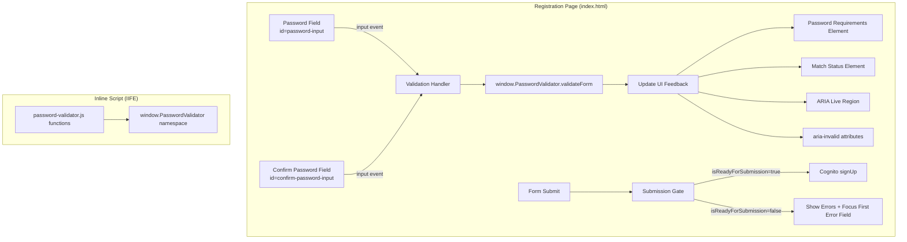

# Design Document

## Overview

This feature adds a confirm-password field to the static registration page and integrates the existing `password-validator.js` module for real-time client-side validation. The registration page is a plain HTML file served from S3 with no build step, so the validator must be inlined as a browser-compatible IIFE. The design preserves the existing Cognito signUp/verify/API-key flow while adding submission gating, real-time feedback, and WCAG 2.1 AA accessibility.

### Key Design Decisions

1. **Inline IIFE over separate script file** — The validator is inlined as a `<script>` block wrapping the module's pure functions in an IIFE that attaches to `window.PasswordValidator`. This avoids an extra HTTP request and keeps the page self-contained (matching the existing pattern of inline `<script>` blocks).

2. **ID reconciliation** — The current password field uses `id="password"` but the validator's `FIELD_IDS` and `getFirstErrorField()` expect `id="password-input"`. The HTML will be updated to use `password-input`, and all JavaScript references to the old ID will be updated accordingly.

3. **Mismatch suppression when confirm field is empty** — The validator's `validateForm()` already suppresses mismatch errors when `confirmPassword === ''`. The UI layer leverages this behavior directly rather than reimplementing suppression logic.

4. **CSS additions in existing stylesheet** — New styles (`.visually-hidden`, validation feedback) are appended to the existing `css/index.css` rather than creating a new stylesheet.

## Architecture



### Script Loading Order

1. `index.css` — stylesheet (includes new `.visually-hidden` and validation styles)
2. `amazon-cognito-identity-js` CDN script
3. **Inline IIFE script** — exposes `window.PasswordValidator` (placed before the main app script)
4. **Main app script** — existing Cognito flow + new validation event handlers

## Components and Interfaces

### Component 1: Browser-Compatible Validator (Inline IIFE)

**Purpose:** Expose the password-validator module's public functions to the browser without CommonJS/ESM syntax.

**Transformation approach:**
- Strip `'use strict';` (the IIFE provides its own strict mode)
- Strip `module.exports = { ... }` block
- Strip `const { ... } = require(...)` (none exist in this module)
- Remove `TestHarness` class (not needed in browser)
- Wrap everything in `(function() { 'use strict'; ... window.PasswordValidator = { ... }; })();`
- Expose exactly five functions: `validateForm`, `isReadyForSubmission`, `getFirstErrorField`, `getAriaAttributes`, `getAriaLiveRegion`

**Interface (window.PasswordValidator):**

```javascript
window.PasswordValidator = {
  validateForm(password, confirmPassword) → {isValid, errors, fieldErrors},
  isReadyForSubmission(password, confirmPassword) → boolean,
  getFirstErrorField(validationResult) → string|null,
  getAriaAttributes(validationResult, fieldName) → {ariaDescribedby, ariaRequired, ariaInvalid},
  getAriaLiveRegion(validationResult) → {ariaLive, content}
};
```

No other properties are added to `window`. Internal constants (`FIELD_IDS`, `POLICY_RULES`, `ERROR_MESSAGES`) and helper functions (`validateMatch`, `validatePolicy`) remain private within the IIFE closure.

### Component 2: HTML Structure Changes

**New elements added to the registration form (in DOM order):**

| Element | ID | Type | Purpose |
|---------|-----|------|---------|
| Password input | `password-input` | `<input type="password">` | Renamed from `password` |
| Password requirements | `password-requirements` | `<div>` | Policy violation messages |
| Confirm password label | — | `<label for="confirm-password-input">` | Visible label |
| Confirm password input | `confirm-password-input` | `<input type="password">` | New field |
| Match status | `password-match-status` | `<div>` | Match/mismatch feedback |
| ARIA live region | `validation-announcements` | `<div>` | Screen reader announcements |

**Removed elements:**
- `<small id="password-hint">` — replaced by `password-requirements` element

**Tab order (source order, no positive tabindex):**
`email` → `password-input` → `confirm-password-input` → `register-btn`

### Component 3: Validation Event Handlers

**Responsibilities:**
- Attach `input` event listeners to both password fields
- On each input event, call `validateForm(password, confirmPassword)`
- Update `password-requirements` with policy violation messages
- Update `password-match-status` with match status (suppressed when confirm is empty)
- Update `aria-invalid` on both fields via `getAriaAttributes()`
- Update `validation-announcements` content via `getAriaLiveRegion()`

### Component 4: Submission Gate

**Responsibilities:**
- Intercept form submit before calling `userPool.signUp()`
- Call `isReadyForSubmission(password, confirmPassword)`
- If `false`: call `validateForm()`, display errors, call `getFirstErrorField()` and focus that element
- If `true`: proceed with existing Cognito signUp flow using `password-input` value

### Component 5: CSS Additions

**New classes:**
- `.visually-hidden` — hides ARIA live region visually while keeping it accessible
- `.field-error` — styling for validation error messages
- `.field-success` — styling for "Passwords match" message

## Data Models

### validateForm() Return Structure

```typescript
interface ValidationResult {
  isValid: boolean;
  errors: string[];           // max 10 entries
  fieldErrors: {
    password?: string[];      // policy violation messages
    'confirm-password'?: string[];  // mismatch message
  };
}
```

### DOM State Model

At any point in time, the form's validation state is fully determined by two values:
- `passwordValue: string` — current value of `#password-input`
- `confirmPasswordValue: string` — current value of `#confirm-password-input`

All UI updates are derived from `validateForm(passwordValue, confirmPasswordValue)` — there is no separate UI state to manage.

### Field-to-Element Mapping

| Validator field key | DOM element ID | ARIA describedby target |
|---------------------|----------------|------------------------|
| `'password'` | `password-input` | `password-requirements` |
| `'confirm-password'` | `confirm-password-input` | `password-match-status` |

## Correctness Properties

*A property is a characteristic or behavior that should hold true across all valid executions of a system — essentially, a formal statement about what the system should do. Properties serve as the bridge between human-readable specifications and machine-verifiable correctness guarantees.*

### Property 1: IIFE–CommonJS Equivalence

*For any* pair of strings `(password, confirmPassword)`, calling each of the five exposed functions (`validateForm`, `isReadyForSubmission`, `getFirstErrorField`, `getAriaAttributes`, `getAriaLiveRegion`) on the browser IIFE version (`window.PasswordValidator`) SHALL produce identical return values to calling the same functions on the CommonJS module with the same arguments.

**Validates: Requirements 3.3**

### Property 2: Password Input Updates Requirements and Live Region

*For any* string typed into the password field, after the `input` event fires, the `password-requirements` element's text content SHALL equal the joined policy violation messages from `validateForm(password, '').fieldErrors.password` (or be empty when no violations exist), AND the `validation-announcements` element's text content SHALL equal `getAriaLiveRegion(validateForm(password, confirmPassword)).content`.

**Validates: Requirements 4.1, 4.5**

### Property 3: Confirm Input Updates Match Status and Live Region

*For any* pair of strings `(password, confirmPassword)` where `confirmPassword` is non-empty, after the `input` event fires on the confirm field, the `password-match-status` element's text content SHALL equal the match-status message from `validateForm(password, confirmPassword)`, AND the `validation-announcements` element's text content SHALL equal `getAriaLiveRegion(validateForm(password, confirmPassword)).content`.

**Validates: Requirements 4.2, 4.6**

### Property 4: Password Field aria-invalid Reflects Policy Validation

*For any* string typed into the password field, the `aria-invalid` attribute on `#password-input` SHALL be `"true"` when `validateForm(password, confirmPassword).fieldErrors.password` is non-empty, and `"false"` otherwise.

**Validates: Requirements 4.3, 4.4**

### Property 5: Confirm Field State Reflects Match Validation

*For any* pair of strings `(password, confirmPassword)`:
- When `confirmPassword` is empty: `aria-invalid` on `#confirm-password-input` SHALL be `"false"` and `#password-match-status` text content SHALL be empty.
- When `confirmPassword` is non-empty and passwords differ: `aria-invalid` SHALL be `"true"` and `#password-match-status` SHALL display "Passwords do not match".
- When `confirmPassword` is non-empty, passwords match, and password passes policy: `aria-invalid` SHALL be `"false"` and `#password-match-status` SHALL display "Passwords match".

**Validates: Requirements 5.1, 5.3, 5.4**

### Property 6: Password Change Re-evaluates Confirm Status

*For any* pair of strings `(password, confirmPassword)` where `confirmPassword` is non-empty, when the password field value changes via an `input` event, the `#password-match-status` element and `aria-invalid` attribute on `#confirm-password-input` SHALL be updated to reflect the new match state between the changed password and the existing confirm value.

**Validates: Requirements 5.5**

### Property 7: Invalid Submission Is Blocked With Focus Management

*For any* pair of strings `(password, confirmPassword)` where `isReadyForSubmission(password, confirmPassword)` returns `false`, submitting the form SHALL NOT invoke `userPool.signUp()`, SHALL display the errors from `validateForm(password, confirmPassword)`, and SHALL set focus to the DOM element whose ID matches `getFirstErrorField(validateForm(password, confirmPassword))`.

**Validates: Requirements 6.1, 6.2, 6.3**

### Property 8: Valid Submission Proceeds With Password Value

*For any* valid password string that satisfies all policy rules, when `confirmPassword` equals `password` and the form is submitted, `userPool.signUp()` SHALL be called with the value from `#password-input` (not `#confirm-password-input`).

**Validates: Requirements 6.5, 8.2**

## Error Handling

### Validation Errors (Client-Side)

| Condition | Behavior |
|-----------|----------|
| Password empty | `password-requirements` shows "Password is required" |
| Password too short | `password-requirements` shows "Password must be at least 8 characters" |
| Missing uppercase/lowercase/number/symbol | Respective messages shown in `password-requirements` |
| Passwords don't match (confirm non-empty) | `password-match-status` shows "Passwords do not match" |
| Form submitted while invalid | Errors displayed in `register-error` alert, focus moved to first error field |

### Cognito Errors (Preserved Behavior)

The existing error handling for Cognito responses is unchanged:
- `UsernameExistsException` → attempt authentication to determine confirmation status
- `InvalidParameterException` with password message → show password policy hint
- Domain-blocked messages → show original error message
- Network/unknown errors → show generic "Registration failed" message

### Defensive Handling

- `getFirstErrorField()` returning `null` → no focus change (defensive; shouldn't occur when `isReadyForSubmission` is `false`)
- `getAriaAttributes()` receiving `null` validationResult → returns safe defaults (`ariaInvalid: "false"`)
- `getAriaLiveRegion()` receiving `null` → returns `{ariaLive: "polite", content: ""}`

## Testing Strategy

### Test Framework and Location

- **Framework:** Jest with jsdom environment (matches existing `static` project in `jest.config.js`)
- **Test location:** `application-infrastructure/src/test/static/register/`
- **Property-based testing library:** fast-check
- **Minimum iterations:** 100 per property test

### Unit Tests (Example-Based)

Located in `application-infrastructure/src/test/static/register/registration-form.jest.mjs`:

1. **HTML structure tests** — verify element IDs, attributes, DOM order, tab order (Requirements 1.x, 2.x, 7.x)
2. **IIFE namespace tests** — verify exactly 5 functions exposed, no global pollution (Requirements 3.1, 3.2, 3.4)
3. **Existing behavior preservation** — verify step transitions, resend logic (Requirements 8.x)

### Property-Based Tests

Located in `application-infrastructure/src/test/static/register/registration-validation.property.jest.mjs`:

Each property test references its design document property:

| Test | Property | Iterations |
|------|----------|------------|
| IIFE–CommonJS equivalence | Property 1 | 100 |
| Password input updates UI | Property 2 | 100 |
| Confirm input updates UI | Property 3 | 100 |
| Password aria-invalid state | Property 4 | 100 |
| Confirm field state | Property 5 | 100 |
| Password change re-evaluates | Property 6 | 100 |
| Invalid submission blocked | Property 7 | 100 |
| Valid submission proceeds | Property 8 | 100 |

**Tag format:** `Feature: 0-0-5-registration-confirm-password-ui, Property {N}: {title}`

### Test Generators (fast-check)

```javascript
// Valid password generator (satisfies all Cognito policy rules)
const validPassword = fc.tuple(
  fc.stringOf(fc.constantFrom(...'ABCDEFGHIJKLMNOPQRSTUVWXYZ'), {minLength: 1, maxLength: 1}),
  fc.stringOf(fc.constantFrom(...'abcdefghijklmnopqrstuvwxyz'), {minLength: 1, maxLength: 1}),
  fc.stringOf(fc.constantFrom(...'0123456789'), {minLength: 1, maxLength: 1}),
  fc.stringOf(fc.constantFrom(...'^$*.[]{}()?"!@#%&/\\,><\':;|_~`=+-'), {minLength: 1, maxLength: 1}),
  fc.string({minLength: 4, maxLength: 248})
).map(([upper, lower, num, sym, rest]) => upper + lower + num + sym + rest);

// Invalid password generator (violates at least one rule)
const invalidPassword = fc.oneof(
  fc.constant(''),                           // empty
  fc.string({minLength: 1, maxLength: 7}),   // too short
  fc.stringOf(fc.constantFrom(...'abcdefghijklmnopqrstuvwxyz0123456789!'), {minLength: 8}) // no uppercase
);

// Non-empty string for confirm field
const nonEmptyString = fc.string({minLength: 1, maxLength: 100});
```

### Integration with Existing Tests

The existing property tests in `lambda/auth/tests/property/` test the CommonJS module in Node.js. The new tests in `test/static/register/` test the browser integration (IIFE + DOM interaction) using jsdom. Together they provide full coverage:

- **Node.js property tests** → validator logic correctness
- **Browser property tests** → UI integration correctness + IIFE equivalence

