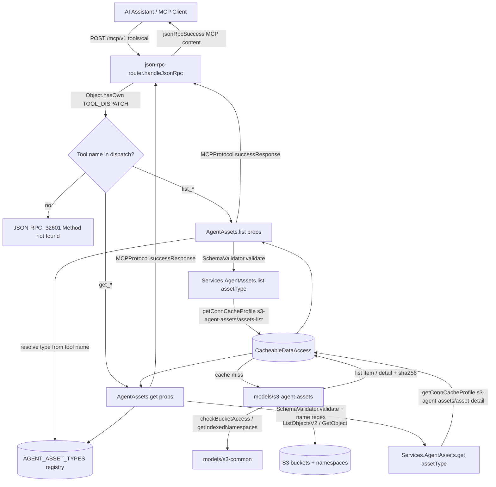
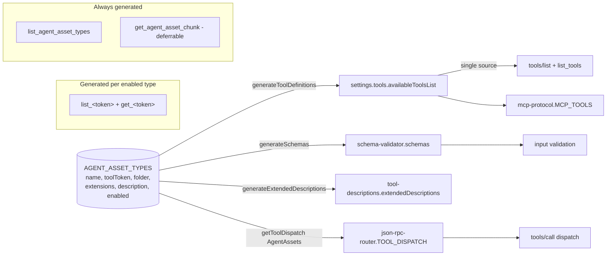

# Design Document

## Overview

**Agent Assets MCP Tools** adds a read-only, registry-driven family of MCP tools to the
Atlantis MCP Server's `read-function` Lambda. The tools let AI assistants discover and
retrieve example Kiro "agent assets" — steering documents, hooks, and `AGENTS.md` files
today, with `skills` and future types addable through a single registry entry.

Assets are sourced from the same S3 buckets and namespaces already used for CloudFormation
templates and application starters, under a fixed prefix:
`{bucket}/{namespace}/utilities/v2/agent_assets/{type}/{filename}`. Each tool returns
content-identity metadata (`size`, `etag`, and — for `get_*` — `sha256`) so a calling agent
can compare its local files against the remote copies and pull updates without any
server-side compare operation.

The feature slots directly into the existing `read-function` MVC layers and reuses every
established mechanism rather than inventing new ones:

- **Router** (`utils/json-rpc-router.js`) — dispatches `tools/call` by tool name via the
  `TOOL_DISPATCH` map and formats MCP results; `tools/list` is served from
  `settings.tools.availableToolsList`.
- **Controller** (`controllers/agent-assets.js`, new) — validates input with
  `utils/schema-validator.js`, calls the service, and formats responses with
  `utils/mcp-protocol.js`, mirroring `controllers/templates.js` and `controllers/starters.js`.
- **Service** (`services/agent-assets.js`, new) — resolves the bucket set, sets the
  connection/cache profile from `config/connections.js`, and wraps the DAO call in
  `CacheableDataAccess.getData(...)`, mirroring `services/templates.js` and
  `services/starters.js`.
- **DAO** (`models/s3-agent-assets.js`, new) — lists and reads objects from S3 with
  brown-out support and content-identity metadata, mirroring `models/s3-templates.js` and
  `models/s3-starters.js`.
- **Registry** (`config/agent-asset-types.js`, new) — the single `AGENT_ASSET_TYPES`
  definition that generates tool definitions, input schemas, extended descriptions, and
  dispatch entries for every enabled type.

Consistent with `AGENTS.md`, this feature adds **no new AWS infrastructure or IAM** to the
stack template. It reuses the configured S3 buckets (`ATLANTIS_S3_BUCKETS`, default
`63klabs`), the existing outbound access, and admin-managed permissions. Publishing assets
to S3 is owned by the source repository (`63Klabs/atlantis-with-kiro-ai`) and is out of
scope here.

### Design Goals

1. **DRY and expandable** — one registry entry adds a fully working `list_<token>` /
   `get_<token>` pair with no edits to the generic controller, service, or DAO
   (Requirement 5).
2. **Faithful to existing patterns** — reuse the connection/cache-profile,
   `CacheableDataAccess`, `SchemaValidator`, `MCPProtocol`, `ContentChunker`, and
   `ContentSizer` conventions already used by templates and starters.
3. **Non-invasive** — extract the shared S3 helpers into a common module for the new DAO
   **without modifying** the existing template and starter DAOs (Requirement 5.6).
4. **Secure by default** — validated names, prefix-scoped key construction, untrusted-content
   handling, built-in crypto for SHA-256, and no secret logging (Requirement 7).

## Architecture

### Layer Placement

The feature adds one module per existing layer plus a registry and a shared S3 helper. No
layer is restructured; each new module follows the interface and error conventions of its
sibling modules.

```
read-function/
├── config/
│   ├── agent-asset-types.js     # NEW: AGENT_ASSET_TYPES registry + generators
│   ├── connections.js           # EDIT: add 's3-agent-assets' (+ 'agent-asset-chunks')
│   ├── settings.js              # EDIT: merge generated tool defs into availableToolsList
│   └── tool-descriptions.js     # EDIT: merge generated extended descriptions
├── controllers/
│   ├── agent-assets.js          # NEW: generic list/get/listTypes/getChunk wrappers
│   └── index.js                 # EDIT: export AgentAssets
├── services/
│   ├── agent-assets.js          # NEW: generic list/get/listTypes/getChunk (cached)
│   └── index.js                 # EDIT: export AgentAssets
├── models/
│   ├── s3-agent-assets.js       # NEW: generic list/get DAO
│   ├── s3-common.js             # NEW: shared checkBucketAccess + getIndexedNamespaces
│   └── index.js                 # EDIT: export S3AgentAssets (and S3Common)
└── utils/
    ├── json-rpc-router.js       # EDIT: merge generated dispatch; get_* size-aware summary
    └── schema-validator.js      # EDIT: merge generated per-type schemas
```

### Request Flow

Every agent-asset tool call flows through the same layers as existing tools. The generic
controller resolves the asset **type** from the tool name (`props.bodyParameters.tool`,
which the router already sets), so all `list_*` tools share one controller function and all
`get_*` tools share another.



### Registry-Driven Tool Generation

The registry is the single source of truth. Generator functions iterate the enabled entries
once and produce the artifacts each wiring point consumes. Adding a type (or enabling
`skills`) is a one-entry change; the generic glue below picks it up automatically, satisfying
Requirement 5.2 and 5.4.



Because `tools/list` (router) and `list_tools` (controller) both read
`settings.tools.availableToolsList`, and `MCPProtocol.MCP_TOOLS` aliases the same array,
injecting the generated definitions at that one point makes the tools discoverable
everywhere. Disabled entries (e.g. `skills`) are excluded from every generated artifact, so
`tools/call` for `list_skills`/`get_skills` falls through to the router's
`Method not found` path (Requirements 5.5, 6.4, 6.5).

### Registry Validation and Initialization

`config/agent-asset-types.js` validates the registry when the module loads (during config
initialization). Each entry must declare all five required non-empty fields — `name`,
`toolToken`, `folder`, `extensions` (a non-empty array), and `description` — and no two
entries may share the same `name`, `toolToken`, or `folder`. If validation fails, the module
throws an `Error` that names the offending entry, failing initialization so that **no**
agent-asset tools are exposed (Requirement 5.7). Because the read-function's Jest suite
exercises the registry (Requirement 11), a malformed registry is caught in CI before it can
reach production.

## Components and Interfaces

### 1. Registry — `config/agent-asset-types.js`

The registry declares the asset types and exposes pure generator/lookup helpers. It has no
dependency on `settings.js`, `schema-validator.js`, or the router, so the wiring points can
depend on it without a cycle.

```javascript
/**
 * @typedef {Object} AgentAssetType
 * @property {string} name         - Canonical type identifier (e.g. 'steering')
 * @property {string} toolToken    - Tool-name token (e.g. 'steering' -> list_steering/get_steering)
 * @property {string} folder       - S3 subfolder under the agent_assets prefix
 * @property {string[]} extensions - Allowed file extensions (e.g. ['.md'])
 * @property {string} description  - Short human-readable description
 * @property {boolean} [enabled]   - Defaults to true; false hides the type's tools
 */

const AGENT_ASSET_TYPES = [
  { name: 'steering',  toolToken: 'steering',  folder: 'steering',  extensions: ['.md'],          description: '...' },
  { name: 'hooks',     toolToken: 'hooks',     folder: 'hooks',     extensions: ['.kiro.hook', '.json'], description: '...' },
  { name: 'agents-md', toolToken: 'agents_md', folder: 'agents_md', extensions: ['.md'],          description: '...' },
  { name: 'skills',    toolToken: 'skills',    folder: 'skills',    extensions: ['.md'],          description: '...', enabled: false }
];
```

Exported interface:

| Function | Returns | Purpose |
|----------|---------|---------|
| `getEnabledTypes()` | `AgentAssetType[]` | Entries where `enabled !== false` |
| `getTypeByToolToken(token)` | `AgentAssetType \| null` | Lookup for controller type resolution |
| `getTypeByName(name)` | `AgentAssetType \| null` | Lookup by canonical name |
| `resolveTypeFromToolName(toolName)` | `AgentAssetType \| null` | Strips `list_`/`get_` prefix, resolves via `toolToken` |
| `generateToolDefinitions()` | `ToolDefinition[]` | `list_<token>` + `get_<token>` per enabled type, plus `list_agent_asset_types` (and deferrable `get_agent_asset_chunk`) |
| `generateSchemas()` | `Object.<string, Object>` | JSON-schema per generated tool name |
| `generateExtendedDescriptions()` | `Object.<string, string>` | Markdown description per generated tool name |
| `getToolDispatch(controller)` | `Object.<string, Function>` | Maps each generated tool name to the controller wrapper |
| `validateRegistry()` | `void` (throws) | Enforces required fields + uniqueness (Requirement 5.7) |

`validateRegistry()` runs once at module load. Generated input schemas reuse the exact
parameter shapes already used by the template tools: the `name` parameter uses
`{ type: 'string', minLength: 1, maxLength: 255, pattern: '^[^/\\\\]+$' }` (Requirement 7.1),
`namespace` uses `{ type: 'string', pattern: '^[a-z0-9][a-z0-9-]*$', maxLength: 63 }`, and
`s3Buckets` uses `{ type: 'array', items: { type: 'string', minLength: 3, maxLength: 63 }, minItems: 1 }`,
all with `additionalProperties: false` (Requirement 7.2).

### 2. Shared S3 Helper — `models/s3-common.js`

Requirement 5.6 asks for the shared helpers to live in a common module consumed by the new
DAO, **without modifying** the existing template and starter DAOs. Both existing DAOs today
declare their own private `checkBucketAccess(bucketName)` and `getIndexedNamespaces(bucketName)`
(verified in `models/s3-templates.js` and `models/s3-starters.js`). This module provides
behavior-equivalent implementations for the agent-asset DAO and leaves the existing DAOs
untouched, so their current unit tests continue to pass.

```javascript
/**
 * Check whether a bucket permits agent-asset access.
 * Behavior-equivalent to the existing template/starter DAO helper.
 * @param {string} bucketName
 * @returns {Promise<boolean>}
 */
async function checkBucketAccess(bucketName) { /* ... */ }

/**
 * Discover indexed namespaces (root-level prefixes) for a bucket.
 * Uses ListObjectsV2Command with Delimiter '/' and maps CommonPrefixes,
 * matching the existing DAO helper.
 * @param {string} bucketName
 * @returns {Promise<string[]>}
 */
async function getIndexedNamespaces(bucketName) { /* ... */ }

module.exports = { checkBucketAccess, getIndexedNamespaces };
```

`s3-common.js` uses `AWS.s3.client` from `@63klabs/cache-data` and logs failures via
`utils/error-handler.js` `logS3Error(...)`, consistent with `s3-templates.js`.

> Note: This introduces a small, intentional duplication with the private helpers in the two
> existing DAOs. The requirement explicitly prioritizes not modifying those DAOs (to keep
> their tests green) over eliminating the duplication. A future refactor may migrate the
> template and starter DAOs onto `s3-common.js`, but that is out of scope here.

### 3. Data Access Object — `models/s3-agent-assets.js`

Generic DAO providing `list(connection, options)` and `get(connection, options)` that accept
the asset type through `connection.parameters.assetType` and derive all type-specific behavior
(`folder`, `extensions`) from the registry entry (Requirement 5.3). Signatures and the
brown-out/return shape mirror `models/s3-templates.js`.

```javascript
/**
 * List assets of a type across configured buckets/namespaces (brown-out).
 * connection.host       : string[]  (bucket set, priority order)
 * connection.path       : string    (basePath, e.g. 'utilities/v2/agent_assets')
 * connection.parameters : { assetType: string, namespace?: string }
 * @returns {Promise<{ assets: Object[], errors?: Object[], partialData: boolean }>}
 */
async function list(connection, options = {}) { /* ... */ }

/**
 * Get one asset by name; first occurrence in bucket-then-namespace order.
 * connection.parameters : { assetType, name, namespace? }
 * @returns {Promise<Object|null>}  // null when not found in any read source
 */
async function get(connection, options = {}) { /* ... */ }
```

DAO behavior details:

- **Prefix + direct-children listing** — builds prefix
  `{namespace}/{basePath}/{folder}/` and calls `ListObjectsV2Command` with `Delimiter: '/'`
  so only objects directly under the prefix are returned; nested-subfolder objects appear as
  `CommonPrefixes` and are ignored (Requirement 1.1). The placeholder key equal to the prefix
  itself is excluded.
- **Extension filter** — keeps only objects whose filename ends with one of the type's
  configured `extensions`; excludes all others (Requirement 1.5).
- **Deterministic order** — iterates buckets in `connection.host` order, then namespaces in
  indexed-priority order, and sorts each namespace's matched filenames ascending before
  appending, so identical inputs yield identical output (Requirement 1.6).
- **Deduplication** — keeps the first occurrence of each `name` (bucket-then-namespace
  priority) and discards later duplicates (Requirement 1.4), mirroring
  `deduplicateStarters`/`deduplicateTemplates`.
- **Content identity** — for `get`, fetches the object with `GetObjectCommand`, reads the
  exact bytes via `Body.transformToByteArray()`, computes `sha256` with the Node built-in
  `crypto` module (`crypto.createHash('sha256').update(buffer).digest('hex')`, lowercase hex),
  sets `size` from the byte length / `ContentLength`, `etag` from the S3 `ETag`, and
  `content` from the UTF-8 decoding of those exact bytes (Requirements 2.1–2.3, 3.2, 3.4).
- **Brown-out** — a bucket lacking access is skipped with a warning and an `errors` entry
  (Requirement 4.2); a bucket/namespace read failure is logged via `logS3Error`, recorded in
  `errors`, and sets `partialData: true` while other sources continue (Requirement 4.8).

Exported for testing: `list`, `get`, `deduplicateAssets`, `filterByExtension`,
`buildAssetKey`, `computeSha256`, `parseAssetMetadata`.

### 4. Service — `services/agent-assets.js`

Generic business logic with pass-through caching, mirroring `services/templates.js`.

```javascript
async function list(options)     // { assetType, s3Buckets?, namespace? }
async function get(options)      // { assetType, name, s3Buckets?, namespace? } -> throws ASSET_NOT_FOUND
async function listTypes()       // enabled types + per-type asset counts (Requirement 6.3)
async function getChunk(options) // deferrable (Requirement 9)
```

Service behavior details:

- **Connection/cache profile** — `list` uses
  `Config.getConnCacheProfile('s3-agent-assets', 'assets-list')`; `get` uses
  `('s3-agent-assets', 'asset-detail')`. Fails fast if the profile is missing, exactly like
  the templates service.
- **Bucket resolution + strict validation** — defaults to `Config.settings().s3.buckets`
  when no `s3Buckets` filter is given (Requirement 4.1). When a filter is provided, it is
  checked against the configured list; if **any** requested bucket is not configured, the
  service throws a validation error naming the invalid bucket(s) and performs no S3 read
  (Requirement 4.6). (This is stricter than the templates service, which silently filters,
  and is required by AC 4.6.)
- **Cache keys** — sets `conn.host = bucketsToSearch` and
  `conn.parameters = { assetType, namespace }` (list) or `{ assetType, name, namespace }`
  (get). `CacheableDataAccess` keys the entry on the bucket set + parameters, so requests
  differing in any component cache separately and identical requests are served from cache
  without new S3 calls (Requirements 8.2, 8.3). `get` appends the asset identity to
  `cacheProfile.pathId` for log clarity, mirroring the templates service.
- **Fetch wrapper** — the cache-miss `fetchFunction` calls `Models.S3AgentAssets.list/get`
  and wraps the result with `ApiRequest.success({body})` / `ApiRequest.error({body})`
  depending on the presence of `errors`, identical to the templates/starters services.
- **Not-found** — when the DAO returns `null` for `get`, the service builds the available
  names by calling `list({ assetType, s3Buckets, namespace })`, attaches them to an error
  with `code = 'ASSET_NOT_FOUND'` and `availableAssets = [...]`, and throws it (Requirement
  2.4). Available names come from the successfully read sources; an empty list is returned
  when none are available.
- **listTypes** — iterates `getEnabledTypes()`, calls `list` per type (cache-backed), and
  returns `[{ name, toolToken, folder, description, assetCount }]`, mirroring the templates
  `listCategories` count pattern (Requirement 6.3).

### 5. Controller — `controllers/agent-assets.js`

Generic MCP request handlers. Type resolution comes from the tool name the router places in
`props.bodyParameters.tool`.

```javascript
async function list(props)      // resolve type -> validate -> Services.AgentAssets.list
async function get(props)       // resolve type -> validate (incl. name regex) -> Services.AgentAssets.get
async function listTypes(props) // Services.AgentAssets.listTypes
async function getChunk(props)  // deferrable (Requirement 9), mirrors Templates.getChunk
```

Controller behavior details:

- Resolves the type with `AgentAssetTypes.resolveTypeFromToolName(props.bodyParameters.tool)`.
  If the tool name does not resolve to an enabled type (defense in depth — the router already
  gates unknown tools), it returns an `INVALID_INPUT` MCP error.
- Validates input via `SchemaValidator.validate(toolName, input)` and returns
  `MCPProtocol.errorResponse('INVALID_INPUT', { errors }, toolName)` on failure — this also
  enforces the `name` regex and rejects unknown properties before any S3 read (Requirements
  7.1, 7.2, 7.7).
- On success returns `MCPProtocol.successResponse(toolName, result)`.
- Catches `ASSET_NOT_FOUND` (returns `MCPProtocol.errorResponse('ASSET_NOT_FOUND', { message, availableAssets }, toolName)`)
  and the strict-bucket validation error (returns `INVALID_INPUT`); any other error becomes
  `INTERNAL_ERROR`. This mirrors the `TEMPLATE_NOT_FOUND`/`STARTER_NOT_FOUND` handling in the
  existing controllers.

### 6. Tool Generation and Dispatch Wiring

Four existing modules gain a single generic hook that consumes the registry:

1. **`config/settings.js`** — `availableToolsList` becomes
   `[ ...existingTools, ...AgentAssetTypes.generateToolDefinitions() ]`. Because
   `MCPProtocol.MCP_TOOLS` and the `Tools.list` controller both read this array, the new
   tools appear in `tools/list` and `list_tools` with their descriptions and input schemas
   (Requirement 6.1).
2. **`utils/schema-validator.js`** — `schemas` becomes
   `{ ...existingSchemas, ...AgentAssetTypes.generateSchemas() }`, so each generated tool has
   input validation (Requirements 7.1, 7.2, 7.7).
3. **`config/tool-descriptions.js`** — `extendedDescriptions` merges
   `AgentAssetTypes.generateExtendedDescriptions()`; the router and `Tools.list` already swap
   in extended descriptions at response time.
4. **`utils/json-rpc-router.js`** — `TOOL_DISPATCH` becomes
   `{ ...existingDispatch, ...AgentAssetTypes.getToolDispatch(Controllers.AgentAssets) }`.
   All `list_<token>` map to `Controllers.AgentAssets.list`, all `get_<token>` to
   `Controllers.AgentAssets.get`, plus `list_agent_asset_types` →
   `Controllers.AgentAssets.listTypes` and (deferrable) `get_agent_asset_chunk` →
   `Controllers.AgentAssets.getChunk`. Unknown/disabled tool names continue to hit the
   existing `Object.hasOwn(TOOL_DISPATCH, toolName)` guard and return `-32601`
   (Requirements 6.2, 6.4, 5.5).

The generic controller/service/DAO are never edited when a type is added — only the registry
array changes (Requirement 5.4).

### 7. `list_agent_asset_types` and `get_agent_asset_chunk`

- **`list_agent_asset_types`** (always generated) — no required parameters; returns the
  enabled types with per-type asset counts via `Services.AgentAssets.listTypes()`
  (Requirement 6.3).
- **`get_agent_asset_chunk`** (deferrable, Requirement 9) — mirrors `Templates.getChunk`:
  fetches the full asset, serializes it, chunks with `ContentChunker.chunk`, and returns the
  requested zero-based `chunkIndex` with `totalChunks`. An out-of-range index returns
  `INVALID_CHUNK_INDEX` with the valid range. This tool and the size-aware `get_*` summary
  can be delivered after the core tools; current assets fit well under the threshold.

## Data Models

### Asset List Item (returned by `list_*`)

Each element of the `assets` array (Requirements 1.2, 3.1):

```javascript
{
  name: "product-guidelines.md",                 // filename, no path separators
  type: "steering",                              // registry canonical name
  namespace: "atlantis",                         // namespace of the retained source
  bucket: "63klabs",                             // bucket of the retained source
  s3Path: "s3://63klabs/atlantis/utilities/v2/agent_assets/steering/product-guidelines.md",
  size: 4096,                                     // object size in bytes
  etag: "\"9b2cf...\"",                          // S3 ETag (non-empty)
  lastModified: "2026-05-01T12:00:00.000Z"        // S3 LastModified
}
```

### Asset Detail (returned by `get_*`)

Superset of the list item, adding `content` and `sha256` (Requirements 2.1, 2.2, 3.2):

```javascript
{
  name: "product-guidelines.md",
  type: "steering",
  namespace: "atlantis",
  bucket: "63klabs",
  s3Path: "s3://63klabs/atlantis/utilities/v2/agent_assets/steering/product-guidelines.md",
  size: 4096,
  etag: "\"9b2cf...\"",
  sha256: "e3b0c44298fc1c149afbf4c8996fb92427ae41e4649b934ca495991b7852b855",  // lowercase hex over exact bytes
  lastModified: "2026-05-01T12:00:00.000Z",
  content: "# Product Guidelines\n..."           // verbatim UTF-8 of the exact object bytes
}
```

### S3 Key Layout

```
{bucket}/{namespace}/utilities/v2/agent_assets/{folder}/{filename}
```

- `basePath` (`settings.s3.agentAssetPrefix`) = `utilities/v2/agent_assets`.
- `{folder}` comes from the registry entry (`steering`, `hooks`, `agents_md`, `skills`).
- The key is always built by appending the validated `name` to the fixed
  `{namespace}/{basePath}/{folder}/` prefix, so the resulting key can never escape the prefix
  (Requirements 4.7, 7.3).

### `list_agent_asset_types` Result

```javascript
{
  types: [
    { name: "steering",  toolToken: "steering",  folder: "steering",  description: "...", assetCount: 7 },
    { name: "hooks",     toolToken: "hooks",     folder: "hooks",     description: "...", assetCount: 3 },
    { name: "agents-md", toolToken: "agents_md", folder: "agents_md", description: "...", assetCount: 1 }
  ]
}
```

### Response Envelope: `partialData` and `errors`

`list_*` responses carry the same brown-out envelope as templates/starters (Requirement 4.8):

```javascript
{
  assets: [ /* ... */ ],
  errors: [ { source: "bucketB/nsX", sourceType: "s3", error: "AccessDenied", timestamp: "..." } ], // present only on failure
  partialData: true   // true when any source failed
}
```

### Error Shapes

| Code | When | Payload |
|------|------|---------|
| `INVALID_INPUT` | Schema validation fails: missing/invalid `name`, `name` with `/`/`\`, >255 chars, unknown property, malformed `namespace`/`s3Buckets`; or an `s3Buckets` filter naming unconfigured buckets (Requirements 7.7, 4.6) | `{ message, errors: [...] }` (and, for bad buckets, the invalid bucket names) |
| `ASSET_NOT_FOUND` | `get_*` name not found in any successfully read source (Requirement 2.4) | `{ message, availableAssets: string[] }` (empty array when none available) |
| `INVALID_CHUNK_INDEX` | `get_agent_asset_chunk` `chunkIndex < 0` or `>= totalChunks` (Requirement 9.3, deferrable) | `{ message, validRange: { min: 0, max: totalChunks - 1 } }` |
| `INTERNAL_ERROR` | Unexpected failure | `{ message }` (no internal details or stack) |

For large `get_*` responses (deferrable Requirement 9.1), the summary payload adds
`contentTruncated: true` and `totalChunks` (an integer ≥ 1), mirroring the `get_template`
summary produced in `json-rpc-router.js`.

## Caching

Caching reuses the `CacheableDataAccess` pass-through pattern and the production-vs-test TTL
convention already established in `config/connections.js`
(`IS_PRODUCTION = DebugAndLog.isProduction()`, `TTL_NON_PROD = IS_PRODUCTION ? 3600 : 60`).

A new `s3-agent-assets` connection is added with two cache profiles (Requirement 8.1):

```javascript
{
  name: 's3-agent-assets',
  host: "",                                  // set dynamically to the bucket set in the service
  path: settings.s3.agentAssetPrefix,        // 'utilities/v2/agent_assets' — namespace prepended in DAO
  cache: [
    {
      profile: 'assets-list',
      overrideOriginHeaderExpiration: true,
      // Production: 1 hour (>= 3600, Requirement 8.4); Test: TTL_NON_PROD = 60 (<= 300, Requirement 8.5)
      defaultExpirationInSeconds: IS_PRODUCTION ? (60 * 60) : TTL_NON_PROD,
      expirationIsOnInterval: false,
      headersToRetain: '',
      hostId: 's3-agent-assets',
      pathId: 'list',
      encrypt: false
    },
    {
      profile: 'asset-detail',
      overrideOriginHeaderExpiration: true,
      // Production: 24 hours (>= 3600, Requirement 8.4); Test: TTL_NON_PROD = 60 (<= 300, Requirement 8.5)
      defaultExpirationInSeconds: IS_PRODUCTION ? (24 * 60 * 60) : TTL_NON_PROD,
      expirationIsOnInterval: false,
      headersToRetain: '',
      hostId: 's3-agent-assets',
      pathId: 'detail',
      encrypt: false
    }
  ]
}
```

- **Pass-through keys** — `assets-list` is keyed by asset type + bucket set + namespace;
  `asset-detail` adds the asset name (Requirements 8.2, 8.3). The service supplies these via
  `conn.host` (bucket set) and `conn.parameters` (type/name/namespace), matching how the
  templates service composes cache keys.
- **TTL convention** — production TTLs follow the template profiles (list 1 hour, detail 24
  hours; both ≥ 3600, Requirement 8.4); test TTLs use `TTL_NON_PROD = 60` seconds
  (< production and ≤ 300, Requirement 8.5).
- **Chunk cache (deferrable)** — `get_agent_asset_chunk` will use a dedicated internal
  `agent-asset-chunks` / `chunk-data` connection with a TTL ≤ `asset-detail`, mirroring the
  existing `template-chunks` connection.

## Security

Security follows the repository's secure-coding steering and `AGENTS.md` least-privilege
guardrails.

- **Name validation and path-traversal rejection** — every `get_*` `name` must match
  `^[^/\\]+$` and be 1–255 characters; validation runs in `SchemaValidator` before any S3
  access, so a name containing `/` or `\` is rejected up front (Requirements 7.1, 7.7). This
  reuses the exact pattern already used by `get_template` in `schema-validator.js`.
- **Prefix-scoped key construction** — S3 keys are built only by appending the validated
  `name` to the fixed `{namespace}/{basePath}/{folder}/` prefix; no user input can produce a
  key outside that prefix (Requirements 4.7, 7.3).
- **Bucket allow-listing** — reads occur only against buckets in
  `Config.settings().s3.buckets`; an `s3Buckets` filter naming any unconfigured bucket is
  rejected before any read (Requirements 4.1, 4.6). Buckets lacking the
  `atlantis-mcp:Allow=true` tag are skipped (brown-out) via `checkBucketAccess`
  (Requirement 4.2).
- **Untrusted content** — asset `content` is returned verbatim as text and is never executed
  or evaluated by the server (Requirement 7.4). Downstream consumers must treat it as
  untrusted, consistent with the general handling of external content.
- **Built-in crypto, no shell** — `sha256` is computed with the Node.js built-in `crypto`
  module over the exact object bytes; no shell is invoked and no third-party hashing library
  is added (Requirements 7.5, 2.3), consistent with `AGENTS.md`'s "use built-in crypto"
  guidance.
- **No secret logging** — logging uses `DebugAndLog` / `ErrorHandler.logS3Error` with bucket,
  key, and error message only; credentials, tokens, and signing keys are never logged
  (Requirement 7.6).
- **No new infrastructure or IAM** — the feature reuses existing buckets, outbound access,
  and admin-managed IAM, adding nothing to the stack template (Requirements 4, 10.6).

## Correctness Properties

*A property is a characteristic or behavior that should hold true across all valid executions of a system — essentially, a formal statement about what the system should do. Properties serve as the bridge between human-readable specifications and machine-verifiable correctness guarantees.*

The following properties are derived from the acceptance-criteria prework and consolidated to
remove redundancy. Each is a universally quantified statement intended for property-based
testing with mocked S3, and each references the requirements it validates. Properties P1–P14
cover the core feature; P15 covers the deferrable large-asset handling of Requirement 9.

### Property 1: Listing includes exactly the direct, extension-matching objects

*For any* set of S3 objects under a type's prefix, `list` returns exactly those objects that
are **direct children** of `{namespace}/utilities/v2/agent_assets/{folder}/` **and** whose
filename ends with one of the type's configured `extensions`, and excludes every nested-subfolder
object, non-matching-extension object, and the prefix placeholder.

**Validates: Requirements 1.1, 1.5**

### Property 2: List-item completeness

*For any* asset returned by `list`, the item includes `name`, `type`, `namespace`, `bucket`,
`s3Path`, a numeric `size`, a non-empty `etag`, and `lastModified`, each reflecting the
retained source object.

**Validates: Requirements 1.2, 3.1**

### Property 3: Priority-order deduplication and selection

*For any* asset `name` that appears in more than one bucket or namespace, `list` retains only
the first occurrence in configured-bucket order then indexed-namespace priority order (discarding
all later occurrences), and `get` returns that same first-occurrence source.

**Validates: Requirements 1.4, 2.2**

### Property 4: Deterministic ordering and full namespace coverage

*For any* source layout, `list` (when no namespace is supplied) searches all indexed namespaces
across the configured buckets and returns results ordered by bucket order, then namespace
priority, then ascending `name`, so that identical inputs always produce identically ordered
output regardless of S3 discovery order.

**Validates: Requirements 1.6, 4.4**

### Property 5: Namespace scoping

*For any* request that supplies a `namespace`, every returned asset originates from that single
namespace and no other namespace is read.

**Validates: Requirements 4.3**

### Property 6: Bucket scoping and invalid-filter rejection

*For any* request, every S3 read targets only buckets present in `settings.s3.buckets`; when an
`s3Buckets` filter lists only configured buckets the search is restricted to exactly that subset;
and when the filter names any unconfigured bucket the request is rejected with a validation error
identifying the invalid bucket(s) and performs no S3 read.

**Validates: Requirements 4.1, 4.5, 4.6**

### Property 7: Prefix-scoped key construction

*For any* validated `name`, `namespace`, and registered type, the constructed S3 key equals
`{namespace}/utilities/v2/agent_assets/{folder}/{name}` and therefore always begins with the
fixed `{namespace}/utilities/v2/agent_assets/{folder}/` prefix, referencing no location outside it.

**Validates: Requirements 4.7, 7.3**

### Property 8: Complete, verbatim asset detail

*For any* stored asset, `get` returns exactly one detail object whose `content` is byte-identical
to the object's stored bytes and which includes `name`, `type`, `namespace`, `bucket`, `s3Path`,
`size`, `etag`, `sha256`, and `lastModified`.

**Validates: Requirements 2.1, 3.2**

### Property 9: SHA-256 correctness and stability

*For any* object byte content, the returned `sha256` equals the lowercase hexadecimal SHA-256
digest of those exact bytes computed independently, and repeated reads of unchanged bytes yield
an identical `sha256`.

**Validates: Requirements 2.3, 3.4**

### Property 10: Brown-out and partial data

*For any* set of sources in which some buckets lack access or some reads fail, `list` skips the
inaccessible/failed sources, records each in the `errors` array, sets `partialData: true`, and
still returns the assets from all remaining successful sources.

**Validates: Requirements 4.2, 4.8**

### Property 11: Input validation before any S3 read

*For any* tool input that violates the schema — a missing `name`, a `name` containing `/` or `\`,
a `name` longer than 255 characters, an unknown property, or a malformed `namespace` or
`s3Buckets` value — the tool returns a validation error identifying the rejected parameter and
performs no S3 read.

**Validates: Requirements 7.1, 7.2, 7.7**

### Property 12: Registry-driven tool generation

*For any* registry, tool generation produces exactly one `list_<toolToken>` and one
`get_<toolToken>` tool — each with an input schema, a non-empty description, and a JSON-RPC
dispatch entry — for every enabled entry, and produces no list/get tools for any disabled or
absent entry; adding or enabling a single entry adds only that entry's two tools and alters no
other tool definition.

**Validates: Requirements 5.2, 5.4, 5.5, 6.1, 6.5**

### Property 13: Registry validation

*For any* registry entry that is missing a required field (`name`, `toolToken`, `folder`, a
non-empty `extensions`, or `description`) or that duplicates another entry's `name`, `toolToken`,
or `folder`, registry validation throws an error identifying the offending entry, and no
agent-asset tools are exposed.

**Validates: Requirements 5.7**

### Property 14: Unknown and disabled tool dispatch

*For any* tool name that is not present in the enabled agent-asset tool set (including the tools
of a disabled type such as `skills`), the router returns a JSON-RPC "method not found" error
identifying the requested name and invokes no controller wrapper.

**Validates: Requirements 6.4, 5.5**

### Property 15: Chunk round-trip and index bounds (deferrable — Requirement 9)

*For any* asset content, requesting `get_agent_asset_chunk` for every index from `0` through
`totalChunks - 1` in order returns chunks that concatenate to reconstruct the complete content,
and any `chunkIndex` that is negative or `>= totalChunks` returns an `INVALID_CHUNK_INDEX` error
whose valid range is `0` through `totalChunks - 1`.

**Validates: Requirements 9.1, 9.2, 9.3, 9.4**

### Criteria Covered by Non-Property Tests

The following criteria are validated by unit, integration, or configuration tests rather than
property tests (per the prework classification):

- **Example / unit**: empty listing returns success (1.3); `ASSET_NOT_FOUND` with available names
  (2.4); latest-version-only `GetObject` (2.5); shipped registry shape (5.1);
  `list_agent_asset_types` counts (6.3); `s3-common` helper behavior equivalence (5.6).
- **Integration**: `tools/call` dispatch returns MCP content for `list_*` and `get_*` (6.2, 11.4);
  pass-through cache hit/miss behavior for list and get (8.2, 8.3); `tools/list` includes every
  generated tool (11.4).
- **Smoke / config**: `s3-agent-assets` profiles resolve with numeric TTLs (8.1); production TTLs
  ≥ 3600 (8.4); test TTLs ≤ 300 and below production (8.5).
- **Not automatically testable (review-verified)**: absence of a server-side compare tool (3.3);
  generic-layer structure (5.3); no-exec/eval of content (7.4); built-in-crypto/no-shell (7.5);
  no-secret-logging (7.6); documentation content (10.1–10.5); no new infrastructure/IAM (10.6);
  test-layout conventions (11.1–11.3, 11.5).

## Error Handling

Error handling reuses `utils/error-handler.js` and `utils/mcp-protocol.js` and mirrors the
templates/starters controllers.

- **Input validation errors** — `SchemaValidator.validate(toolName, input)` runs first in every
  controller method. On failure the controller returns
  `MCPProtocol.errorResponse('INVALID_INPUT', { message, errors }, toolName)` and performs no
  service or S3 call. This covers missing/invalid `name`, path separators, over-length names,
  unknown properties, and malformed `namespace`/`s3Buckets` (Requirements 7.1, 7.2, 7.7).
- **Invalid bucket filter** — when an `s3Buckets` filter names an unconfigured bucket, the service
  throws a validation error listing the invalid bucket(s); the controller maps it to
  `INVALID_INPUT` and no S3 read occurs (Requirement 4.6).
- **Asset not found** — the service throws an error with `code = 'ASSET_NOT_FOUND'` and
  `availableAssets`; the controller returns
  `MCPProtocol.errorResponse('ASSET_NOT_FOUND', { message, availableAssets }, toolName)`
  (Requirement 2.4). This mirrors `TEMPLATE_NOT_FOUND`/`STARTER_NOT_FOUND`.
- **Brown-out (bucket access / read failure)** — the DAO catches per-bucket and per-namespace
  failures, logs them via `ErrorHandler.logS3Error(...)` (bucket, key, message only — no secrets),
  records `{ source, sourceType: 's3', error, timestamp }` in `errors`, sets `partialData: true`,
  and continues with the remaining sources so a successful partial result is still returned
  (Requirements 4.2, 4.8). Cache-miss `fetchFunction` wraps a result containing `errors` with
  `ApiRequest.error({ body })` so error-bearing responses follow the same cache path as templates.
- **Path traversal** — rejected by schema validation before any key construction or S3 access
  (Requirements 7.1, 7.3); as defense in depth, keys are only ever built by appending the
  validated `name` to the fixed prefix.
- **Invalid chunk index (deferrable)** — `get_agent_asset_chunk` returns
  `INVALID_CHUNK_INDEX` with `validRange: { min: 0, max: totalChunks - 1 }` for out-of-range
  indices, cached like the template-chunk error via `ApiRequest.success` (Requirement 9.3).
- **Unexpected errors** — caught in the controller and returned as `INTERNAL_ERROR` with a
  sanitized message and no stack trace or internal detail, consistent with the existing
  controllers and the router's `-32603` catch-all.
- **Unknown/disabled tools** — handled by the router's existing
  `Object.hasOwn(TOOL_DISPATCH, toolName)` guard, returning JSON-RPC `-32601` without invoking a
  controller (Requirements 6.4, 5.5).

## Testing Strategy

Testing follows the read-function's existing Jest layout and the repository's dual
(unit + property) approach. All new tests are Jest `*.test.js` files placed under
`tests/unit/<layer>/` for per-layer unit and property tests and `tests/integration/` for
cross-layer tests (Requirement 11.1). Property tests use **fast-check** (already used across the
repo, e.g. `tests/property/*.property.test.js` and `tests/unit/models/s3-starters-property.test.js`);
property-based testing is **not** implemented from scratch.

### Property-Based Tests

- One property-based test implements each correctness property (P1–P15).
- Each property test runs a **minimum of 100 iterations** (fast-check `numRuns: 100`), except
  where repository steering caps expensive suites — this feature's property tests operate on
  mocked S3 and pure logic, so 100 iterations is inexpensive and is the default here.
- Each property test is tagged with a comment referencing its design property, in the format:
  **Feature: agent-asset-tools, Property {number}: {property text}**.
- S3 is mocked (no live AWS): the `@63klabs/cache-data` `AWS.s3` getter is stubbed following the
  repository's getter-mocking guidance (`jest.spyOn(tools.default.AWS, 's3', 'get')`), or the DAO's
  exported pure helpers (`deduplicateAssets`, `filterByExtension`, `buildAssetKey`, `computeSha256`,
  `parseAssetMetadata`) are exercised directly for the pure-logic properties. `sha256` is verified
  against an independent Node `crypto` computation over the same generated bytes.

Property-to-location map (indicative):

| Property | Primary test location |
|----------|-----------------------|
| P1, P2, P3, P4, P5, P8, P9, P10 | `tests/unit/models/s3-agent-assets.property.test.js` |
| P6, P11 | `tests/unit/services/agent-assets.property.test.js`, `tests/unit/controllers/agent-assets.property.test.js` |
| P7 | `tests/unit/models/s3-agent-assets.property.test.js` |
| P12, P13 | `tests/unit/config/agent-asset-types.property.test.js` |
| P14 | `tests/property/agent-asset-dispatch.property.test.js` (router) |
| P15 (deferrable) | `tests/unit/controllers/agent-assets-chunk.property.test.js` |

### Unit Tests (examples, edge, and error cases)

Focused example-based unit tests, avoiding over-testing what the property tests already cover:

- **DAO** (`tests/unit/models/s3-agent-assets-dao.test.js`) — empty listing → empty list, no error
  (1.3); latest-version `GetObject` with no `VersionId` (2.5); representative brown-out example.
- **Service** (`tests/unit/services/agent-assets.test.js`) — `ASSET_NOT_FOUND` includes available
  names and the empty-names case (2.4); `list_agent_asset_types` counts (6.3); invalid-bucket
  rejection example (4.6).
- **Controller** (`tests/unit/controllers/agent-assets-controller.test.js`) — validation-failure →
  `INVALID_INPUT`; not-found → `ASSET_NOT_FOUND`; success envelope shape.
- **Registry** (`tests/unit/config/agent-asset-types.test.js`) — shipped registry satisfies the
  required shape (5.1); `skills` is disabled and generates no tools (5.5); a synthetic added entry
  generates exactly its two tools (5.4).
- **Shared helper** (`tests/unit/models/s3-common.test.js`) — `checkBucketAccess` and
  `getIndexedNamespaces` behave equivalently to the existing DAO helpers (5.6); existing
  `s3-templates`/`s3-starters` DAO suites remain unchanged and green (5.6, 11.5).
- **Config** (`tests/unit/config/connections.test.js` additions) — `s3-agent-assets` resolves both
  profiles with numeric TTLs (8.1); production TTLs ≥ 3600 (8.4); test TTLs ≤ 300 and below
  production (8.5).

### Integration Tests

Cross-layer tests under `tests/integration/` with mocked S3 (Requirement 11.4):

- **Router / MCP** (`tests/integration/agent-assets-integration.test.js`) — every generated
  agent-asset tool appears in `tools/list` with a description and input-schema object (6.1);
  `tools/call` for a `list_*` tool returns the mocked assets (6.2); `tools/call` for a `get_*` tool
  returns content equal to the mocked bytes with `sha256` equal to the SHA-256 of those bytes
  (2.1, 2.3, 6.2); an unknown/disabled tool returns `-32601` (6.4, 5.5).
- **Caching** (`tests/integration/agent-assets-caching.test.js`) — repeated identical `list_*`/`get_*`
  requests are served from cache without new S3 reads, and requests differing in any key component
  are cached separately (8.2, 8.3).

### Verification and CI

All new and existing Jest suites must pass with zero failures before the change is considered
complete (Requirement 11.5). The read-function suite is run per function via its own
`package.json`/`jest.config.js` under the multi-src buildspec loop, matching the repository's
CI/CD gate. Property and DAO tests use mocked S3 only — no live AWS calls — and clean up mocks in
`afterEach` per the repository's test-isolation guidance.

## Deferrable Scope (Requirement 9)

Requirement 9 (large-asset handling) may be delivered **after** the core tools; current assets fit
well under the 50,000-byte threshold. The core delivery includes the six per-type tools
(`list_steering`/`get_steering`, `list_hooks`/`get_hooks`, `list_agents_md`/`get_agents_md`), the
`list_agent_asset_types` tool, the registry, the shared S3 helper, caching, and Properties P1–P14.
The deferrable slice adds:

- The size-aware `get_*` summary in `json-rpc-router.js` (mirroring the `get_template` summary:
  `contentTruncated: true`, `totalChunks`, retrieval hint) using `ContentSizer.measure`.
- The `get_agent_asset_chunk` tool (mirroring `Templates.getChunk` with `ContentChunker.chunk`) and
  its `agent-asset-chunks` internal cache connection.
- Property P15 and the chunk-related unit tests.

Because the summary/chunk wiring reuses the exact `ContentSizer`/`ContentChunker` utilities and the
established chunk-cache pattern, it can be added without changing the registry-driven core.

## Requirements Traceability

| Requirement | Covered by |
|-------------|-----------|
| 1. List assets of a type | DAO `list`; Properties P1–P5; unit (1.3) |
| 2. Retrieve a single asset | DAO `get`; Properties P3, P8, P9; unit (2.4, 2.5) |
| 3. Client-side comparison support | List/detail data models; Properties P2, P8, P9; review (3.3) |
| 4. S3 sourcing (buckets + namespaces) | DAO + service; Properties P5, P6, P7, P10 |
| 5. Registry-driven DRY design | Registry + generic layers + `s3-common`; Properties P12, P13; unit (5.1, 5.6) |
| 6. MCP protocol integration | Router dispatch + generation; Properties P12, P14; integration (6.2); unit (6.3) |
| 7. Input validation and security | SchemaValidator + Security section; Properties P7, P11; review (7.4–7.6) |
| 8. Caching | `s3-agent-assets` connection; integration (8.2, 8.3); config tests (8.1, 8.4, 8.5) |
| 9. Large-asset handling (deferrable) | Size-aware summary + `get_agent_asset_chunk`; Property P15 |
| 10. Documentation and configuration | Docs updates + CHANGELOG (review-verified) |
| 11. Testing and verification | Property, unit, and integration suites; CI gate |
