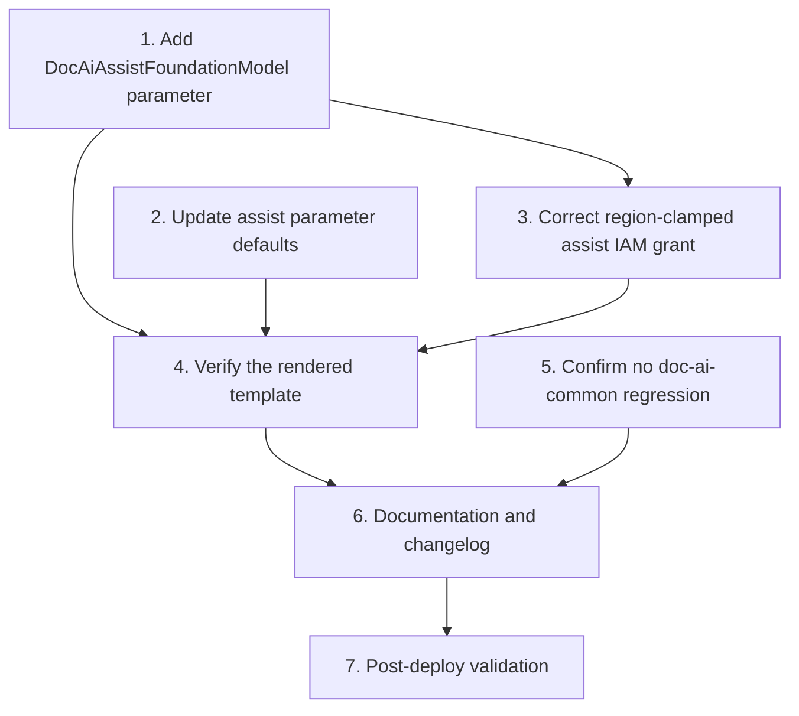

# Implementation Plan: Region-Portable Bedrock Assist Model Invocation

## Overview

Requirements source: [`bugfix.md`](./bugfix.md). Design: [`design.md`](./design.md).

This is a configuration + IAM-only fix. No application code (`assist-provider.js`,
`retrieval-strategy.js`, `embedding-provider.js`, `settings.js`,
`documentation.js`) is modified. All template edits are in
`application-infrastructure/template.yml`.

## Tasks

- [x] 1. Add the `DocAiAssistFoundationModel` parameter
  - In the `Parameters` section of `application-infrastructure/template.yml`,
    add `DocAiAssistFoundationModel` (Type: String, Default:
    `amazon.nova-micro-v1:0`) directly after `DocAiAssistModel`.
  - Reuse the same `AllowedPattern`/`ConstraintDescription` as `DocAiAssistModel`
    (`^[a-zA-Z0-9][a-zA-Z0-9._:-]{0,127}$`).
  - Description: the plain Bedrock foundation-model ID the assist inference
    profile routes to; used only for the destination-region IAM grant and
    ignored when `DocAiAssistProfileRegions` is empty.
  - _Design: Parameter Changes_

- [x] 2. Update the assist parameter defaults for out-of-the-box US portability
  - [x] 2.1 Change `DocAiAssistModel` Default from `amazon.nova-micro-v1:0` to
        `us.amazon.nova-micro-v1:0`, and update its Description to state it is
        the invoke ID (a Geo cross-region inference profile by default) passed
        to `DOC_AI_ASSIST_MODEL` and used for the inference-profile ARN.
        _Requirements: bugfix.md 2.1, 2.2_
  - [x] 2.2 Change `DocAiAssistProfileRegions` Default from `""` to
        `us-east-1,us-east-2,us-west-2` (Geo-US destinations), and refresh its
        Description to reference `DocAiAssistFoundationModel` as the plain FM the
        profile routes to.
        _Requirements: bugfix.md 2.1_

- [x] 3. Correct the region-clamped assist IAM grant (`ReadDocAiPolicy`)
  - In the `HasDocAiAssistProfileRegions` non-empty branch, statement
    `Sid: BedrockInvokeAssistModelRegionClamped`, change the resource from
    `arn:aws:bedrock:*::foundation-model/${DocAiAssistModel}` to
    `arn:aws:bedrock:*::foundation-model/${DocAiAssistFoundationModel}`.
  - Leave `BedrockInvokeAssistInferenceProfile` keyed on `${DocAiAssistModel}`
    (the profile ID) and leave the empty-branch plain-FM statement unchanged.
  - Update the adjacent `# >!` comments to reflect that the profile ARN uses the
    invoke ID and the clamped ARN uses the plain foundation-model parameter.
  - Confirm `DocIndexerDocAiPolicy` needs NO change (indexer never invokes assist).
  - _Design: IAM Changes; Secondary Defect; Requirements: bugfix.md 2.1, 2.2, 3.3_

- [x] 4. Verify the rendered template
  - [x] 4.1 Run `sam validate` (and cfn-lint if configured) on
        `application-infrastructure/template.yml`; resolve any errors.
  - [x] 4.2 With default parameters, confirm `ReadDocAiPolicy` renders an
        `inference-profile/us.amazon.nova-micro-v1:0` grant plus a region-clamped
        `foundation-model/amazon.nova-micro-v1:0` grant with `aws:RequestedRegion`
        = `us-east-1,us-east-2,us-west-2`.
  - [x] 4.3 With `DocAiAssistProfileRegions=""`, confirm the empty branch renders
        the single in-region `foundation-model/${DocAiAssistModel}` grant and no
        inference-profile/region-clamped statements (backward-compat escape hatch).
  - [x] 4.4 Confirm `DOC_AI_ASSIST_MODEL` on the read-function resolves to
        `us.amazon.nova-micro-v1:0` under default parameters.
  - _Requirements: bugfix.md 2.1, 3.2, 3.3; Design: Verification Plan_

- [ ] 5. Confirm no behavioral regression in the doc-ai-common layer
  - Run the existing Jest suites for the `doc-ai-common` layer (assist-provider,
    retrieval-strategy, embedding-provider) with `npm run test:all` per the
    project's test rules. No code changed, so all must pass unchanged; the
    graceful-degrade tests confirm bugfix.md 3.1 is preserved.
  - _Requirements: bugfix.md 3.1, 3.2, 3.3_

- [ ] 6. Documentation and changelog
  - [ ] 6.1 Ensure the three assist parameter descriptions in `template.yml` are
        accurate and mutually consistent (invoke ID vs plain FM vs profile
        regions).
  - [ ] 6.2 Add a `Fixed` entry under `v0.0.6 (unreleased)` in `CHANGELOG.md`
        referencing this spec, noting the new Geo-US inference-profile default
        for the assist model and the corrected cross-region assist IAM grant.
  - [ ] 6.3 If DEPLOYMENT.md / docs document `DocAi*` parameters, update them for
        the new `DocAiAssistFoundationModel` parameter and changed defaults.
  - _Design: Documentation / Changelog_

- [ ] 7. Post-deploy validation (us-east-2)
  - After deploy, issue a `semantic-assisted` `search_documentation` request and
    confirm re-ranked results are returned with no `doc_ai_bedrock_model_unavailable`
    ERROR line and no assist re-rank WARN degrade in the read-function logs.
  - _Requirements: bugfix.md 2.2_

## Task Dependency Graph



```json
{
  "waves": [
    { "id": 0, "tasks": ["1", "2.1", "2.2", "5"] },
    { "id": 1, "tasks": ["3"] },
    { "id": 2, "tasks": ["4.1", "4.2", "4.3", "4.4"] },
    { "id": 3, "tasks": ["6.1", "6.2", "6.3"] },
    { "id": 4, "tasks": ["7"] }
  ]
}
```

Notes on ordering:

- Tasks 1, 2, and 3 are all edits to `application-infrastructure/template.yml`.
  Task 3 depends on Task 1 because it references the new
  `DocAiAssistFoundationModel` parameter.
- Task 4 (template verification) depends on the template edits in Tasks 1-3.
- Task 5 (regression check) is independent of the template edits and can run in
  parallel.
- Task 6 (docs/changelog) should follow the verified changes.
- Task 7 (post-deploy validation) is the final step after deployment.

## Notes

- Scope is strictly configuration + IAM. No application/Lambda source code is
  modified in this fix.
- The empty-string `DocAiAssistProfileRegions` value remains a supported
  backward-compatibility escape hatch that falls back to a single in-region
  plain foundation-model grant.
- All resource naming and IAM scoping continues to follow the least-privilege
  and `Prefix-ProjectId-StageId-*` conventions defined for the repository.
