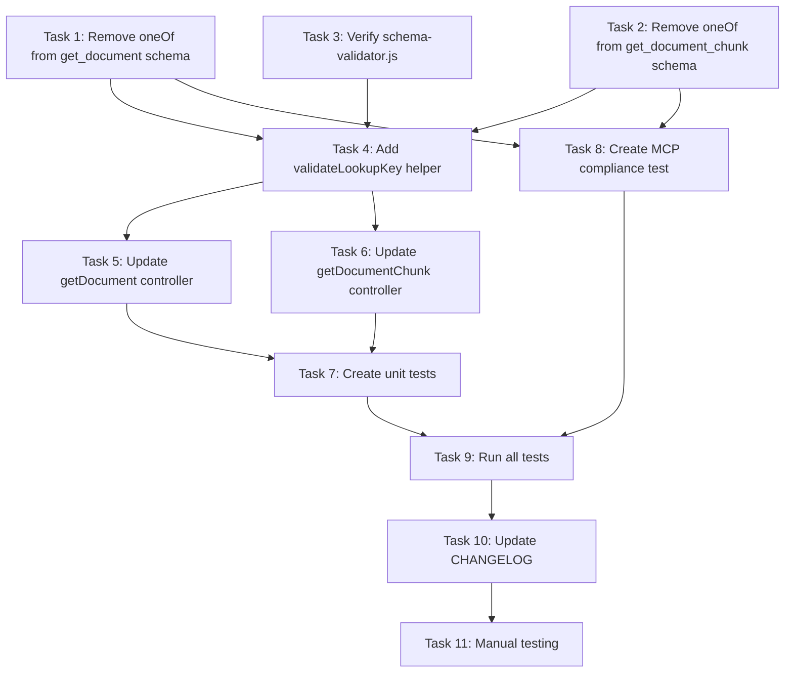

# Implementation Plan: Fix MCP Schema Validation Error

## Overview

This implementation plan addresses the MCP schema validation error by removing `oneOf` constraints from tool schemas and moving the exactly-one-of validation logic to the controller layer. The MCP protocol does not support `oneOf`, `allOf`, or `anyOf` at the schema root level, so we must enforce the "exactly one lookup key" constraint programmatically.

The implementation maintains backward compatibility and API behavior while ensuring MCP schema compliance.

## Tasks

- [x] 1. Update config/settings.js - Remove oneOf from get_document schema
- [x] 2. Update config/settings.js - Remove oneOf from get_document_chunk schema
- [x] 3. Verify schema-validator.js doesn't have oneOf-specific logic
- [x] 4. Add validateLookupKey helper function to controllers/documentation.js
- [x] 5. Update DocumentationController.getDocument to use validateLookupKey
- [x] 6. Update DocumentationController.getDocumentChunk to use validateLookupKey
- [x] 7. Create unit tests for lookup key validation
- [x] 8. Create MCP schema compliance test
- [x] 9. Run all existing tests to verify backward compatibility
- [x] 10. Update CHANGELOG.md
- [x] 11. Manual testing - verify MCP server starts without errors

## Task Details

#### Task 1: Update config/settings.js - Remove oneOf from get_document schema

**File**: `application-infrastructure/src/lambda/read-function/config/settings.js`

**Line**: ~378-398

**Changes**:
- Remove the `oneOf` array from the `inputSchema`
- Remove the comment about "Exactly one lookup key"
- Keep both `filePath` and `hash` as optional properties
- Keep `additionalProperties: false`

**Before**:
```javascript
{
  name: 'get_document',
  description: '...',
  inputSchema: {
    type: 'object',
    properties: {
      filePath: { ... },
      hash: { ... }
    },
    // >! Exactly one lookup key: supplying both is ambiguous and is rejected.
    oneOf: [
      { required: ['filePath'] },
      { required: ['hash'] }
    ]
  }
}
```

**After**:
```javascript
{
  name: 'get_document',
  description: '...',
  inputSchema: {
    type: 'object',
    properties: {
      filePath: { ... },
      hash: { ... }
    },
    additionalProperties: false
  }
}
```

#### Task 2: Update config/settings.js - Remove oneOf from get_document_chunk schema

**File**: `application-infrastructure/src/lambda/read-function/config/settings.js`

**Line**: ~401-427

**Changes**:
- Remove the `oneOf` array from the `inputSchema`
- Remove the comment about "Same exactly-one lookup key rule"
- Keep `chunkIndex` in `required` array
- Keep both `filePath` and `hash` as optional properties
- Keep `additionalProperties: false`

**Before**:
```javascript
{
  name: 'get_document_chunk',
  description: '...',
  inputSchema: {
    type: 'object',
    properties: {
      filePath: { ... },
      hash: { ... },
      chunkIndex: { ... }
    },
    required: ['chunkIndex'],
    // >! Same exactly-one lookup key rule as get_document.
    oneOf: [
      { required: ['filePath'] },
      { required: ['hash'] }
    ]
  }
}
```

**After**:
```javascript
{
  name: 'get_document_chunk',
  description: '...',
  inputSchema: {
    type: 'object',
    properties: {
      filePath: { ... },
      hash: { ... },
      chunkIndex: { ... }
    },
    required: ['chunkIndex'],
    additionalProperties: false
  }
}
```

#### Task 3: Verify schema-validator.js doesn't have oneOf-specific logic

**File**: `application-infrastructure/src/lambda/read-function/utils/schema-validator.js`

**Action**: Read the file and check for any special handling of `oneOf` for document tools. If found, remove it.

#### Task 4: Add validateLookupKey helper function to controllers/documentation.js

**File**: `application-infrastructure/src/lambda/read-function/controllers/documentation.js`

**Location**: Add near the top of the file, after imports and before class definition

**Code**:
```javascript
/**
 * Validate that exactly one of filePath or hash is provided.
 * 
 * The MCP protocol does not support oneOf at the schema root level, so this
 * validation must be done programmatically in the controller.
 * 
 * @param {string|undefined} filePath - File path lookup key
 * @param {string|undefined} hash - Hash lookup key
 * @throws {Error} When neither or both parameters are provided
 * @private
 */
function validateLookupKey(filePath, hash) {
  const hasFilePath = filePath !== undefined && filePath !== null && filePath !== '';
  const hasHash = hash !== undefined && hash !== null && hash !== '';
  
  if (!hasFilePath && !hasHash) {
    throw new Error('Exactly one of filePath or hash is required');
  }
  
  if (hasFilePath && hasHash) {
    throw new Error('Cannot specify both filePath and hash - provide exactly one');
  }
}
```

#### Task 5: Update DocumentationController.getDocument to use validateLookupKey

**File**: `application-infrastructure/src/lambda/read-function/controllers/documentation.js`

**Method**: `static async getDocument(props, response)`

**Changes**: Add validation call immediately after extracting parameters

**Code**:
```javascript
static async getDocument(props, response) {
  const timer = new Timer("DocumentationController.getDocument", true);
  
  try {
    const { filePath, hash } = props;
    
    // >! Validate exactly-one-of constraint (MCP schema cannot enforce this)
    validateLookupKey(filePath, hash);
    
    // ... rest of existing implementation
  } catch (error) {
    // ... existing error handling
  } finally {
    timer.stop();
  }
}
```

#### Task 6: Update DocumentationController.getDocumentChunk to use validateLookupKey

**File**: `application-infrastructure/src/lambda/read-function/controllers/documentation.js`

**Method**: `static async getDocumentChunk(props, response)`

**Changes**: Add validation call immediately after extracting parameters

**Code**:
```javascript
static async getDocumentChunk(props, response) {
  const timer = new Timer("DocumentationController.getDocumentChunk", true);
  
  try {
    const { filePath, hash, chunkIndex } = props;
    
    // >! Validate exactly-one-of constraint (MCP schema cannot enforce this)
    validateLookupKey(filePath, hash);
    
    // ... rest of existing implementation
  } catch (error) {
    // ... existing error handling
  } finally {
    timer.stop();
  }
}
```

#### Task 7: Create unit tests for lookup key validation

**File**: `application-infrastructure/src/lambda/read-function/tests/unit/controllers/documentation-lookup-key-validation.jest.mjs`

**Content**: Test all validation scenarios for both methods

**Test Cases**:
1. getDocument with filePath only → success
2. getDocument with hash only → success
3. getDocument with neither → error
4. getDocument with both → error
5. getDocumentChunk with filePath + chunkIndex → success
6. getDocumentChunk with hash + chunkIndex → success
7. getDocumentChunk with neither filePath nor hash → error
8. getDocumentChunk with both filePath and hash → error

#### Task 8: Create MCP schema compliance test

**File**: `application-infrastructure/src/lambda/read-function/tests/unit/config/mcp-schema-compliance.jest.mjs`

**Content**: Verify no tool schemas use oneOf/allOf/anyOf at top level

**Test Case**:
```javascript
describe('MCP Schema Compliance', () => {
  it('should not use oneOf/allOf/anyOf at top level in any tool schema', () => {
    const tools = settings.tools.availableToolsList;
    
    tools.forEach((tool, index) => {
      expect(tool.inputSchema.oneOf).toBeUndefined();
      expect(tool.inputSchema.allOf).toBeUndefined();
      expect(tool.inputSchema.anyOf).toBeUndefined();
    });
  });
});
```

#### Task 9: Run all existing tests to verify backward compatibility

**Action**: Run the full test suite to ensure no regressions

**Commands**:
```bash
cd application-infrastructure/src/lambda/read-function
npm test
```

**Verification**:
- All existing tests pass
- No new test failures
- Coverage maintained

#### Task 10: Update CHANGELOG.md

**File**: `CHANGELOG.md`

**Section**: `v0.0.6 (unreleased)` → `### Fixed`

**Entry**:
```markdown
### Fixed
- **MCP Schema Compliance** [Spec: 0-0-6-fix-mcp-schema-oneof](../.kiro/specs/0-0-6-fix-mcp-schema-oneof/) — Fixed MCP server startup error "input_schema does not support oneOf, allOf, or anyOf at the top level" by removing `oneOf` constraints from `get_document` and `get_document_chunk` tool schemas and moving the exactly-one-of validation logic to the controller layer; validation behavior unchanged
```

#### Task 11: Manual testing - verify MCP server starts without errors

**Action**: Start the MCP server and verify it initializes successfully

**Verification**:
1. MCP server starts without schema validation errors
2. Test `get_document` with valid `filePath`
3. Test `get_document` with valid `hash`
4. Test `get_document` with neither parameter → expect error
5. Test `get_document` with both parameters → expect error
6. Repeat for `get_document_chunk`

## Acceptance Criteria

- [x] MCP server starts without "oneOf/allOf/anyOf at the top level" error
- [x] `get_document` validates exactly-one-of constraint correctly
- [x] `get_document_chunk` validates exactly-one-of constraint correctly
- [x] All existing tests pass
- [x] New validation tests pass
- [x] CHANGELOG.md updated
- [x] No breaking changes to API behavior

## Notes

### MCP Schema Constraints

The MCP protocol specification restricts the use of JSON Schema composition keywords (`oneOf`, `allOf`, `anyOf`) at the root level of tool input schemas. This is documented in the [Model Context Protocol Schema Specification](https://spec.modelcontextprotocol.io/specification/2024-11-05/server/utilities/schema/).

**Why This Matters:**
- MCP servers that violate this constraint fail to start with a schema validation error
- The constraint exists to ensure consistent parameter validation across different MCP client implementations
- Validation logic that would normally be expressed via `oneOf` must be implemented in the controller layer

### Validation Strategy

The exactly-one-of constraint (requiring either `filePath` OR `hash`, but not both) is moved from the JSON schema to the controller:

1. **Schema Level**: Both parameters are optional in the JSON schema
2. **Controller Level**: The `validateLookupKey()` helper enforces the mutual exclusivity
3. **Error Handling**: Same error messages and behavior as before

This approach maintains the same API contract while complying with MCP schema requirements.

### Testing Strategy

Two types of tests validate this implementation:

1. **Unit Tests**: Test the validation logic directly with all edge cases
2. **Schema Compliance Test**: Automated check to prevent future `oneOf` usage

### Backward Compatibility

This change is **fully backward compatible**:
- API behavior unchanged (still requires exactly one lookup key)
- Error messages unchanged
- Response format unchanged
- Only internal implementation detail changes

## Task Dependency Graph

### Wave Definitions

```json
{
  "waves": [
    {
      "wave": 1,
      "tasks": [1, 2, 3],
      "description": "Schema analysis and preparation",
      "parallelizable": true,
      "dependencies": []
    },
    {
      "wave": 2,
      "tasks": [4],
      "description": "Add validation helper function",
      "parallelizable": false,
      "dependencies": [1, 2, 3]
    },
    {
      "wave": 3,
      "tasks": [5, 6],
      "description": "Update controller methods",
      "parallelizable": true,
      "dependencies": [4]
    },
    {
      "wave": 4,
      "tasks": [7, 8],
      "description": "Create unit tests and compliance tests",
      "parallelizable": true,
      "dependencies": [5, 6]
    },
    {
      "wave": 5,
      "tasks": [9],
      "description": "Run full test suite",
      "parallelizable": false,
      "dependencies": [7, 8]
    },
    {
      "wave": 6,
      "tasks": [10],
      "description": "Update documentation",
      "parallelizable": false,
      "dependencies": [9]
    },
    {
      "wave": 7,
      "tasks": [11],
      "description": "Manual testing and verification",
      "parallelizable": false,
      "dependencies": [10]
    }
  ],
  "criticalPath": [1, 4, 5, 7, 9, 10, 11],
  "estimatedDuration": "2-3 hours"
}
```

### Visual Dependency Graph



**Critical Path**: T1/T2 → T4 → T5/T6 → T7 → T9 → T10 → T11

**Parallel Work Opportunities**:
- Tasks 1, 2, and 3 can be done simultaneously
- Tasks 5 and 6 can be done simultaneously after Task 4
- Tasks 7 and 8 can be done simultaneously after their dependencies

**Estimated Timeline**: 2-3 hours total
- Schema changes (T1-T3): 30 minutes
- Controller updates (T4-T6): 45 minutes
- Testing (T7-T9): 45 minutes
- Documentation and manual testing (T10-T11): 30 minutes
