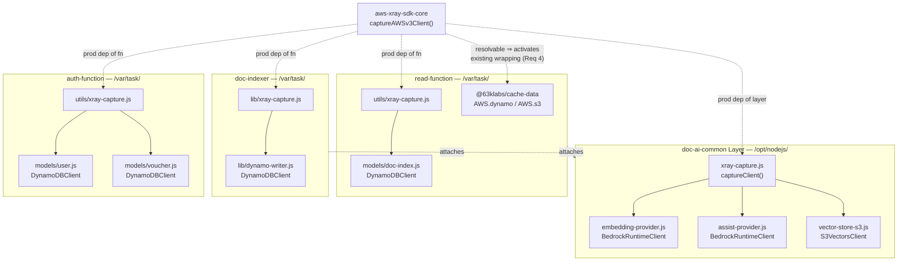
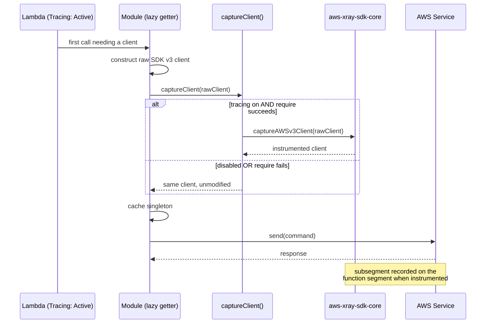

# Design Document

## Overview

This design closes the X-Ray downstream-instrumentation gap described in `requirements.md`. The single root cause — no `captureAWSv3Client()` wrapping reaches any AWS SDK v3 client — is addressed with three coordinated changes:

1. **A conditional capture helper** applied at every in-scope client-construction point, so DynamoDB, S3 Vectors, and Bedrock calls record Downstream_Subsegments (Requirements 1, 2, 3, 8).
2. **Declaring `aws-xray-sdk-core` as a production dependency** of each function and the layer that needs it, which both enables the new helper and activates `@63klabs/cache-data`'s already-correct wrapping (Requirements 4, 6).
3. **Attaching the X_Ray_Write_Policy** to the two Lambda_Execution_Roles that lack it (Requirement 5).

### Verification findings that shaped this design

Four investigation results materially changed the design. Each is load-bearing.

#### Finding 1 — `CACHE_DATA_AWS_X_RAY_ON` is already set on the Read_Function

Requirement 4 depends on cache-data's wrapping activating. That wrapping is gated on **two** conditions, not one. From `@63klabs/cache-data@1.3.11`, `src/lib/tools/AWS.classes.js`:

```javascript
const USE_XRAY = isTrue(process.env?.CacheData_AWSXRayOn) || isTrue(process.env?.CACHE_DATA_AWS_X_RAY_ON);

let AWSXRay = null;
let xrayInitialized = false;
const initializeXRay = () => {
	if (!xrayInitialized && USE_XRAY) {   // <-- gate 1: env var
		try {
			AWSXRay = require("aws-xray-sdk-core");   // <-- gate 2: module resolvable
			/* ...captureHTTPsGlobal... */
		} catch (error) {
			AWSXRay = null;                            // <-- swallowed
		}
		xrayInitialized = true;
	}
	return AWSXRay;
};
```

`template.yml` line 821 already sets `CACHE_DATA_AWS_X_RAY_ON: true` in the `ReadLambdaFunction` `Environment.Variables` block. **Gate 1 is satisfied; only gate 2 fails.** Installing the package is therefore sufficient for Requirement 4 — no template environment change is needed for it.

> **Important**: this is the reverse of the risk flagged during planning. Had the env var been unset, installing the package alone would not have activated cache-data's wrapping. It is set, and the design depends on it. If a future change removes it, Requirement 4 silently regresses. Acceptance criterion 4.1 is therefore covered by a test that asserts on the resolvability of the dependency, and the template line carries a comment (see Components) explaining that cache-data reads it.

The Auth_Function also depends on cache-data but does **not** set this variable, and cache-data's `AWS` helper is not on its instrumented call paths (its DynamoDB access is via directly constructed clients, covered by Requirement 3.3). No env var is added to the Auth_Function: Requirement 6.1 limits changes to what this feature needs, and Requirement 4 scopes cache-data-mediated tracing to the Read_Function only.

#### Finding 2 — the layer's `node_modules` extracts to `/opt/node_modules`, not `/opt/nodejs/node_modules`

This determines whether a single layer-only install can serve every function, and the answer is **no**.

`DocAiCommonLayer` sets `ContentUri: src/lambda/layers/doc-ai-common/`, and that directory holds `node_modules` as a **sibling** of `nodejs/`:

```
src/lambda/layers/doc-ai-common/
├── nodejs/            -> extracts to /opt/nodejs/
│   ├── embedding-provider.js
│   ├── assist-provider.js
│   └── vector-store-s3.js
└── node_modules/      -> extracts to /opt/node_modules/     (NOT /opt/nodejs/node_modules)
```

Two different resolution mechanisms are in play, and conflating them is the trap:

| Requiring file | Location at runtime | Can resolve `/opt/node_modules/*`? | Why |
|---|---|---|---|
| Layer module (e.g. `vector-store-s3.js`) | `/opt/nodejs/` | **Yes** | Node's directory walk-up from `/opt/nodejs/` checks `/opt/nodejs/node_modules`, then `/opt/node_modules`, then `/node_modules` |
| Function code (e.g. `doc-index.js`) | `/var/task/` | **No** | Walk-up from `/var/task/` reaches `/var/task/node_modules`, `/var/node_modules`, `/node_modules` — never `/opt`. Lambda compensates by adding `/opt/nodejs/node_modules` to `NODE_PATH`, but this layer has no such directory |
| `@63klabs/cache-data` | `/var/task/node_modules/@63klabs/cache-data/` | **No** | Same walk-up as function code |

This is why the layer's existing `@aws-sdk/client-s3vectors` production dependency works today: `vector-store-s3.js` lives at `/opt/nodejs/` and walks up to `/opt/node_modules`.

**Consequence**: installing `aws-xray-sdk-core` only in the layer would instrument Bedrock and S3 Vectors but leave Requirements 3.1, 3.2, 3.3 and all of Requirement 4 unmet, because neither function code nor cache-data can resolve it. Per-function installation is required. Restructuring the layer to `nodejs/node_modules` to enable `NODE_PATH` sharing is explicitly rejected — it would change how the layer's existing dependency resolves for no benefit to cache-data, which can never see `/opt` regardless.

#### Finding 3 — cache-data wraps the raw client, then builds the document client

Resolving the wrap-ordering question for the three DynamoDB sites. From `AWS.classes.js` (lines 244–246):

```javascript
client: (DynamoDBDocumentClient.from(
	(AWS.#XRayOn) ? AWSXRay.captureAWSv3Client(new DynamoDBClient({ region: AWS.REGION }))
	: new DynamoDBClient({ region: AWS.REGION })) ),
```

The capture wrapper is applied to the **raw `DynamoDBClient`**, and `DynamoDBDocumentClient.from()` is then called on the wrapped client. This design mirrors that ordering for all three DynamoDB sites, because:

- `captureAWSv3Client()` instruments a client by adding middleware to that client's `middlewareStack`. `DynamoDBDocumentClient.from(client)` returns a document client that layers marshalling on top of, and delegates transmission to, the supplied client — so the X-Ray middleware remains in the stack that actually issues the request.
- The document client is not itself a plain service client, and wrapping both it and the underlying client risks duplicate subsegments — the same hazard AWS documents for mixing `captureAWS` with `captureAWSClient` in the [X-Ray SDK for Node.js AWS SDK client guidance](https://docs.aws.amazon.com/xray/latest/devguide/xray-sdk-nodejs-awssdkclients.html).
- Mirroring cache-data keeps one wrapping idiom across the codebase.

*Content was rephrased for compliance with licensing restrictions.*

#### Finding 4 — V3 subsegments carry no resource names

Per the same AWS guidance, instrumenting SDK **v3** clients yields less detail than v2: subsegments record the operation and request ID but not the DynamoDB table name, S3 bucket/key, or queue name, so the trace map shows a generic per-service node rather than a discrete node per named resource.

*Content was rephrased for compliance with licensing restrictions.*

This is an expectation-setting point, not a defect. Requirements 1, 2, and 3 ask for calls to appear as Downstream_Subsegments in the service map and timeline, which is satisfied. Operators should not expect per-table nodes. This is recorded so it is not later filed as a bug.

### What this design does not change

- No change to request handling, response shape, or downstream call semantics (Requirement 7.1).
- No IAM change beyond the two X_Ray_Write_Policy attachments (Requirement 5.4).
- No AWS SDK v3 client is promoted from `devDependencies` to `dependencies`; the SDK stays runtime-provided (Requirement 6.3).
- `cleanup-function` and `s3-vectors-provisioner` receive **no** instrumentation and **no** new dependency; the Cleanup_Function's role gains only the X_Ray_Write_Policy (Requirements 5.5, 6.1).
- No modification to `@63klabs/cache-data`. Its wrapping logic is already correct.

## Architecture

### Instrumentation topology



The Auth_Function does not attach the layer (verified: `DocAiCommonLayer` is referenced only at `template.yml` lines 787 and 1326, in the Read_Function and Doc_Indexer respectively). This is the reason the helper is not a single shared module — see the next section.

### Code-sharing decision

Requirement 8 requires the **Bedrock and S3 Vectors** instrumentation to live once in the shared layer rather than being duplicated per consuming function. It does not require the DynamoDB instrumentation to be shared, and the DynamoDB sites span three functions of which one cannot see the layer at all.

The `atlantis-multi-resource-src` steering forbids shared source directories: code used by multiple functions must be a Lambda Layer or a published package.

Three options were considered:

| Option | Satisfies Req 8 | Serves auth-function | Verdict |
|---|---|---|---|
| **A. Helper in layer + a small local helper per function** | Yes — layer clients use the layer copy | Yes | **Recommended** |
| B. Helper only in the layer; functions require `/opt/nodejs/xray-capture` by absolute path | Yes | **No** — auth-function does not attach the layer | Rejected |
| C. Publish the helper as an npm package | Yes | Yes | Rejected — disproportionate |

**Recommendation: Option A.**

- The layer copy (`nodejs/xray-capture.js`) is the single implementation for Bedrock and S3 Vectors, satisfying Requirements 8.1 and 8.2 exactly as written.
- Each function gets its own copy inside its own self-contained directory. This is not a shared source directory: nothing is required across function boundaries, and the steering's isolation rule is upheld.
- Option B fails outright for the Auth_Function. It is also fragile for the Read_Function: `doc-index.js` is on the non-AI hot path, and making it depend on `/opt/nodejs` would couple core DynamoDB access to layer presence and to the `DOC_AI_LAYER_PATH` test override that `services/documentation.js` and `lib/index-builder.js` use.
- Option C would introduce a package release cycle and version-skew surface for roughly twenty lines of code.

**Tradeoff, stated plainly**: Option A duplicates a small, stable function across four locations (the layer plus three functions). If its semantics ever change, four files must change together. This is accepted because the helper is deliberately tiny and its contract is pinned by the property tests defined below, which are replicated per location. The alternative — a shared source directory — is prohibited, and the alternatives that avoid duplication either do not work (B) or are disproportionate (C).

### Activation gate

The helper must decide whether to wrap. Two candidate signals were evaluated:

| Signal | Set when | Available at module load | Verdict |
|---|---|---|---|
| `CACHE_DATA_AWS_X_RAY_ON` / `CacheData_AWSXRayOn` | Configured in `template.yml` | Yes | **Recommended** |
| `_X_AMZN_TRACE_ID` | Per invocation, by the Lambda runtime | **No** | Rejected as the gate |
| `AWS_XRAY_DAEMON_ADDRESS` | Set by the runtime when tracing is active | Yes | Rejected as the gate |

**Recommendation: mirror cache-data's env-var convention** (`CacheData_AWSXRayOn` or `CACHE_DATA_AWS_X_RAY_ON`, accepting `true`/`"true"`/`1`/`"1"`).

Reasoning:

- One variable then governs both cache-data's wrapping and this feature's wrapping in the Read_Function, so tracing cannot be half-enabled in a way that is confusing to diagnose. Finding 1 shows the variable is already set there.
- It is deterministic and inspectable in the template, unlike runtime-only signals.
- `_X_AMZN_TRACE_ID` is populated per invocation and is absent during the INIT phase. Gating on it would make instrumentation depend on *when* a client happens to be constructed — precisely the inconsistency that the Auth_Function's module-load-time construction would expose.
- `AWS_XRAY_DAEMON_ADDRESS` is an implementation detail of the runtime rather than an application configuration surface, and keying off it would diverge from the repo's existing convention.

The Doc_Indexer and Auth_Function do not currently set this variable, so they need it added to their `Environment.Variables` for Requirements 1, 2, and 3.2/3.3 to take effect. This is an environment-variable addition, not an IAM change, so it does not conflict with Requirement 5.4.

Because the gate is configuration rather than a live-tracing signal, a misconfiguration (variable true while tracing is off) could otherwise produce X-Ray context-missing errors. Requirement 7.2 forbids instrumentation-caused errors, so `AWS_XRAY_CONTEXT_MISSING: IGNORE_ERROR` is set alongside it on each instrumented function. This is a defensive default, not a functional requirement.

### Request flow with instrumentation active



## Components and Interfaces

### Component 1: `captureClient()` helper

One implementation, replicated to four locations:

| Location | Consumers |
|---|---|
| `src/lambda/layers/doc-ai-common/nodejs/xray-capture.js` | `embedding-provider.js`, `assist-provider.js`, `vector-store-s3.js` |
| `src/lambda/read-function/utils/xray-capture.js` | `models/doc-index.js` |
| `src/lambda/doc-indexer/lib/xray-capture.js` | `lib/dynamo-writer.js` |
| `src/lambda/auth-function/utils/xray-capture.js` | `models/user.js`, `models/voucher.js` |

```javascript
'use strict';

/**
 * Conditional AWS X-Ray instrumentation for AWS SDK v3 clients.
 *
 * Applies `captureAWSv3Client()` when X-Ray tracing is enabled and the X-Ray SDK is
 * resolvable, and otherwise returns the supplied client untouched. The unwrapped
 * fallback is what keeps behavior identical when tracing is off and lets test doubles
 * continue to intercept calls.
 *
 * @module xray-capture
 */

/**
 * Can a value be considered true? Accepts `true`, `1`, `"1"`, and `"true"` (any case).
 *
 * @param {boolean|number|string|null|undefined} value - Value to interpret.
 * @returns {boolean} Whether the value should be treated as true.
 * @example
 * isTrue('TRUE'); // true
 * isTrue('0');    // false
 */
const isTrue = (value) => (
	value !== null && typeof value !== 'undefined' &&
	(value === true || value === 1 || value === '1' ||
		(typeof value === 'string' && value.toLowerCase() === 'true'))
);

// >! Mirrors the gate used by @63klabs/cache-data (AWS.classes.js) so a single env var
// >! controls X-Ray wrapping for both cache-data's clients and this project's clients.
// >! Read once at module load: the value is static configuration, not per-invocation state.
const USE_XRAY = isTrue(process.env?.CacheData_AWSXRayOn)
	|| isTrue(process.env?.CACHE_DATA_AWS_X_RAY_ON);

// >! Declared before captureClient() so the marker is initialized when the function runs.
// >! Symbol.for keeps the marker shared even if two copies of this helper are loaded.
/** @type {symbol} Marks an already-instrumented client instance. */
const CAPTURED = Symbol.for('atlantisMcp.xrayCaptured');

/** @type {?object} Resolved X-Ray SDK, or null when disabled/unavailable. */
let AWSXRay = null;
/** @type {boolean} Whether resolution has been attempted (success or failure). */
let xrayInitialized = false;

/**
 * Resolve the X-Ray SDK once, tolerating absence.
 *
 * @private
 * @returns {?object} The X-Ray SDK module, or null when disabled or unresolvable.
 */
const initializeXRay = () => {
	if (!xrayInitialized && USE_XRAY) {
		try {
			// >! The Lambda managed Node.js runtime does NOT provide aws-xray-sdk-core; it
			// >! ships as a production dependency. require() is wrapped so that a missing or
			// >! broken module degrades to no instrumentation instead of failing the request
			// >! (Requirement 7.2).
			AWSXRay = require('aws-xray-sdk-core');
		} catch (error) {
			AWSXRay = null;
		}
		xrayInitialized = true;
	}
	return AWSXRay;
};

/**
 * Wrap an AWS SDK v3 client with X-Ray capture when tracing is enabled and available.
 *
 * Returns the input client unchanged when tracing is disabled, when the X-Ray SDK cannot
 * be loaded, when `client` is not an instrumentable object, or when `client` has already
 * been instrumented.
 *
 * @param {object} client - An AWS SDK v3 client exposing `send()`.
 * @returns {object} The instrumented client, or the original client unchanged.
 * @example
 * const { captureClient } = require('./xray-capture');
 * const ddb = DynamoDBDocumentClient.from(captureClient(new DynamoDBClient({})));
 */
function captureClient(client) {
	// >! Never let instrumentation break the caller. Any failure path returns the original
	// >! client so downstream calls proceed exactly as they did before this feature.
	try {
		if (!client || typeof client !== 'object') { return client; }
		if (client[CAPTURED] === true) { return client; }   // >! idempotence guard

		const xray = initializeXRay();
		if (!xray || typeof xray.captureAWSv3Client !== 'function') { return client; }

		const captured = xray.captureAWSv3Client(client);
		if (!captured || typeof captured !== 'object') { return client; }

		// >! Mark the instance so a second call cannot add a second middleware and emit
		// >! duplicate subsegments. Non-enumerable so it cannot leak into serialization or
		// >! alter object shape for callers and assertions.
		Object.defineProperty(captured, CAPTURED, {
			value: true, enumerable: false, writable: false, configurable: true
		});
		return captured;
	} catch (error) {
		return client;
	}
}

module.exports = { captureClient };
```

Interface contract:

| Aspect | Guarantee |
|---|---|
| Signature | `captureClient(client: object): object` |
| Tracing enabled + SDK resolvable | Returns an instrumented client whose `send()` records a Downstream_Subsegment |
| Tracing disabled | Returns **the same object reference** |
| SDK unresolvable | Returns **the same object reference** |
| Called twice on one client | Second call is a no-op returning the same instrumented client |
| Throws | Never |

Returning the identical reference on the disabled path is the mechanism behind Requirement 7.3: a Test_Double passed in comes straight back out, so existing mocks intercept unchanged.

### Component 2: Layer client-construction sites

All three are already lazy getters, so instrumentation is a single-line change at each.

**`nodejs/embedding-provider.js`** (`#getClient()`, ~line 284). The region-override logic must be preserved bit for bit, and the existing test `tests/unit/embedding-provider-region.test.js` mocks `@aws-sdk/client-bedrock-runtime` and asserts on the config object passed to the constructor. Wrapping happens strictly **after** construction, so the constructor still receives exactly the same config object and that test continues to capture it:

```javascript
#getClient() {
	if (!this.#client) {
		// >! Region-selection logic is unchanged (Requirement 10.1 of the prior spec): the
		// >! config object passed to the constructor is byte-identical to before.
		// >! captureClient() wraps the CONSTRUCTED instance, so mocks of the constructor
		// >! still observe the same config argument.
		this.#client = captureClient(
			new BedrockRuntimeClient(this.region ? { region: this.region } : {})
		);
	}
	return this.#client;
}
```

Because that test's mock constructor returns `{ send: mockSend }` — a plain object, not a real client — the helper's `typeof client !== 'object'` and try/catch guards ensure it passes through harmlessly under test.

**`nodejs/assist-provider.js`** (`#getClient()`, ~line 415): same shape, no region override.

**`nodejs/vector-store-s3.js`** (`getS3VectorsClient()`, ~line 179): the existing `// >!` comment about default-provider-chain region resolution is retained verbatim, with the capture wrapper added around the construction.

### Component 3: Function client-construction sites

**`read-function/models/doc-index.js`** (`getDocClient()`, ~line 86) and **`doc-indexer/lib/dynamo-writer.js`** (`getDocClient()`, ~line 31) — both lazy getters already; apply the ordering from Finding 3:

```javascript
function getDocClient() {
	if (!docClient) {
		// >! Wrap the RAW DynamoDBClient, then build the document client from the wrapped
		// >! instance. The document client delegates transmission to this client, so the
		// >! X-Ray middleware is in the stack that issues the request. Mirrors cache-data's
		// >! AWS.classes.js. Do NOT also wrap the document client — that risks duplicate
		// >! subsegments.
		const client = captureClient(new DynamoDBClient({}));
		docClient = DynamoDBDocumentClient.from(client, {
			marshallOptions: { removeUndefinedValues: true }
		});
	}
	return docClient;
}
```

The existing `setDocClient()` test seam is untouched, so `aws-sdk-client-mock`-based tests keep working.

### Component 4: Auth_Function — convert module-load construction to lazy getters

`models/user.js` (~line 21) and `models/voucher.js` (~line 20) construct their clients at **module top level**, at `require()` time:

```javascript
const client = new DynamoDBClient({});
const docClient = DynamoDBDocumentClient.from(client);
```

**Recommendation: convert both to the lazy-getter pattern used everywhere else, with a `setDocClient()` test seam — do not instrument in place.**

Reasoning:

1. **Testability, and Requirement 9 depends on it.** Module-load construction runs during `require()`, so there is no point at which a test can arrange state and then observe the construction, and no seam to inject a Test_Double. Requirement 9.1 and 9.2 demand tests for both the wrapped and unwrapped paths at *each* instrumented site; with module-load construction the only way to retest under different env is repeated module-registry resets, which is markedly more brittle than calling a getter.
2. **Instrumenting at INIT is semantically wrong.** Module load happens in the INIT phase, before any invocation and therefore before any X-Ray segment exists. Wrapping a client there is not itself an error, but it makes the gate's correctness depend on construction timing and is exactly the case where a runtime-signal gate (`_X_AMZN_TRACE_ID`) would silently fail. Constructing lazily means the client is created inside an invocation, where a segment exists.
3. **Consistency.** Four of the six in-scope sites are already lazy getters. Converting the remaining two yields one pattern, one test approach, and one review idiom.
4. **Cold-start cost.** Neither DAO is needed on every Auth_Function path; deferring construction avoids the client-initialization cost on invocations that never touch DynamoDB.

**Tradeoff**: this is a larger diff than a one-line wrap. Every in-module reference to `docClient` must become `getDocClient()`, and missing one would leave a `ReferenceError` after the top-level binding is removed. The risk is real but bounded and mechanical: it is confined to two files, caught immediately by the existing Auth_Function unit suite, and the added `setDocClient()` seam makes those tests stronger than before. Instrumenting in place would keep the diff smaller while leaving both files untestable in the way Requirement 9 requires — so the smaller diff is the worse trade.

Resulting shape for each file:

```javascript
/** @type {DynamoDBDocumentClient|null} Lazily constructed document client. */
let docClient = null;

/**
 * Get or create the DynamoDB Document Client singleton.
 *
 * @returns {DynamoDBDocumentClient} The shared document client.
 * @example
 * const result = await getDocClient().send(new GetCommand(params));
 */
function getDocClient() {
	if (!docClient) {
		// >! Construct on first use, inside an invocation, so an X-Ray segment exists when
		// >! the client is instrumented. Wrap the raw client before DynamoDBDocumentClient.from().
		docClient = DynamoDBDocumentClient.from(captureClient(new DynamoDBClient({})));
	}
	return docClient;
}

/**
 * Override the document client (test seam).
 *
 * @param {?DynamoDBDocumentClient} client - Client instance, or `null` to reset.
 * @returns {void}
 */
function setDocClient(client) {
	docClient = client;
}
```

`marshallOptions` is intentionally omitted here to match each file's current `DynamoDBDocumentClient.from(client)` call exactly; behavior must not change (Requirement 7.1).

### Component 5: Dependency declarations

Per Requirements 6.1 and 6.2, `aws-xray-sdk-core` is added as a **production** dependency to exactly the four packages that construct or mediate an instrumented client, pinned to an exact version per the secure-coding steering:

| Package | Add dependency | Why |
|---|---|---|
| `read-function/package.json` | **Yes** | `doc-index.js` (Req 3.1) **and** cache-data resolution (Req 4.1) |
| `auth-function/package.json` | **Yes** | `user.js`, `voucher.js` (Req 3.3) |
| `doc-indexer/package.json` | **Yes** | `dynamo-writer.js` (Req 3.2) |
| `layers/doc-ai-common/package.json` | **Yes** | Bedrock + S3 Vectors (Reqs 1, 2) |
| `cleanup-function/package.json` | No | No instrumented client (Req 6.1); needs IAM only (Req 5.5) |
| `s3-vectors-provisioner/package.json` | No | Out of scope per requirements Scope section |

```json
"dependencies": {
  "aws-xray-sdk-core": "3.12.0"
}
```

The exact version is written without a range so builds are reproducible and a compromised or breaking upstream release cannot enter silently. `3.12.0` matches the major line cache-data expects (`^3.12.0`); the precise latest 3.x patch should be confirmed at implementation time. Because cache-data declares it only under `devDependencies`, there is no version conflict — npm never installs cache-data's dev tree.

The buildspec confirms production placement is required and sufficient. Both loops install with `--omit=dev`:

```
line  80:  npm install --omit=dev      # functions
line 112:  npm install --omit=dev      # layers
```

A `devDependencies` entry would be omitted from every deployed artifact — the exact mistake that produced Manifestation B in cache-data (Requirement 6, Note).

The layer's `package.json` carries a `"//"` note explaining why `@aws-sdk/client-s3vectors` is a bundled production dependency. That note is extended to cover the X-Ray SDK, keeping the rationale next to the declaration.

**Bundle-size impact.** The package is added to three function packages and one layer. `aws-xray-sdk-core` is a small library but pulls a handful of transitive dependencies, so the increase is a few hundred kilobytes to low single-digit megabytes per artifact rather than tens of megabytes. **This has not been measured in this repository** — no `node_modules` copy exists to size (verified: `aws-xray-sdk-core` is absent from all six packages). Implementation should record the actual delta after the first install. The increase is expected to sit far below the Lambda unzipped-package limit and is unavoidable given Finding 2: there is no placement that serves both function code and cache-data from a single copy.

### Component 6: IAM — X_Ray_Write_Policy attachments

Requirements 5.1–5.3 are satisfied by attaching the AWS-managed policy to the two roles that lack it. Verified current state:

| Role | Line | Has `ManagedPolicyArns`? | Action |
|---|---|---|---|
| `AuthLambdaExecutionRole` | ~1117 | **No block at all** | Add block with the X-Ray policy |
| `CleanupExecutionRole` | ~1244 | **No block at all** | Add block with the X-Ray policy |
| `DocIndexerExecutionRole` | ~1391 | Yes — X-Ray only | None |
| `S3VectorsProvisionerRole` | ~1493 | Yes — X-Ray only, with comment | None |
| `ReadLambdaExecutionRole` | ~1788 | Yes — Insights + X-Ray + `!If` | None |

Both target roles need a **new** `ManagedPolicyArns` block inserted between `AssumeRolePolicyDocument` and `Policies`. Per Requirement 5.3 this uses the AWS-managed policy rather than a custom inline policy, mirroring the three roles that already have it. Neither target role carries Lambda Insights or a conditional import, so each gets a single-entry block — the `ReadLambdaExecutionRole`'s richer list is deliberately **not** replicated, and no uniform style is imposed.

`AuthLambdaExecutionRole`:

```yaml
      AssumeRolePolicyDocument:
        Statement:
        - Effect: Allow
          Principal:
            Service: [lambda.amazonaws.com]
          Action: sts:AssumeRole
      # X-Ray write only. Globals sets Tracing: Active for every function in this stack,
      # so this role needs write permission to emit its own segment. Narrowly-scoped
      # AWS-managed policy already used by the Read, DocIndexer, and Provisioner roles.
      ManagedPolicyArns:
        - 'arn:aws:iam::aws:policy/AWSXRayDaemonWriteAccess'
      Policies:
      - PolicyName: AuthLambdaResourceAccessPolicies
```

`CleanupExecutionRole`:

```yaml
      AssumeRolePolicyDocument:
        Statement:
        - Effect: Allow
          Principal:
            Service: [lambda.amazonaws.com]
          Action: sts:AssumeRole
      # X-Ray write only. The Cleanup Lambda is out of scope for downstream-subsegment
      # instrumentation (it calls only SSM and Cognito), but Tracing: Active still applies,
      # so it needs this to emit its own function segment (Requirement 5.5).
      ManagedPolicyArns:
        - 'arn:aws:iam::aws:policy/AWSXRayDaemonWriteAccess'
      Policies:
      - PolicyName: CleanupLambdaResourceAccessPolicies
```

Both use two-space list indentation under `ManagedPolicyArns` and single-quoted ARNs, matching the surrounding roles. No other IAM statement, action, or resource is touched (Requirement 5.4).

### Component 7: Template environment variables

| Function | `CACHE_DATA_AWS_X_RAY_ON` | `AWS_XRAY_CONTEXT_MISSING` |
|---|---|---|
| `ReadLambdaFunction` | Already `true` (line 821) — unchanged | Add `IGNORE_ERROR` |
| `DocIndexerFunction` | **Add** `true` | Add `IGNORE_ERROR` |
| `AuthLambdaFunction` | **Add** `true` | Add `IGNORE_ERROR` |
| `CleanupFunction` | No | No |
| `S3VectorsProvisionerFunction` | No | No |

```yaml
          # X-Ray downstream tracing. Read by BOTH @63klabs/cache-data's AWS helper and
          # this project's xray-capture helper; removing it disables downstream
          # subsegments for DynamoDB/S3/Bedrock/S3 Vectors even though Tracing stays Active.
          CACHE_DATA_AWS_X_RAY_ON: true
          # >! Defensive: if tracing is ever off while the flag above is true, treat a
          # >! missing X-Ray context as a no-op instead of an error (Requirement 7.2).
          AWS_XRAY_CONTEXT_MISSING: IGNORE_ERROR
```

The Read_Function's existing line gains the explanatory comment so a future maintainer does not delete a variable that two independent consumers depend on.

## Data Models

This feature introduces no persisted data and no changes to any request or response schema. There are no API surface changes, so `template-openapi-spec.yml` is unaffected.

Two structures matter.

### Instrumentation decision inputs

| Field | Type | Source | Purpose |
|---|---|---|---|
| `CacheData_AWSXRayOn` | `string` | `template.yml` env | Gate (alternate name) |
| `CACHE_DATA_AWS_X_RAY_ON` | `string` | `template.yml` env | Gate (canonical in this stack) |
| `AWS_XRAY_CONTEXT_MISSING` | `string` | `template.yml` env | Consumed by the X-Ray SDK |
| `aws-xray-sdk-core` resolvability | `boolean` | `require()` outcome | Second gate |
| `client` | `object` | Caller | Client to wrap |
| `Symbol.for('atlantisMcp.xrayCaptured')` | `boolean` | Set by helper | Idempotence marker |

### Downstream_Subsegment (produced, not stored)

Recorded by the X-Ray SDK on the function segment. Shape per the AWS guidance cited in Finding 4:

| Field | Notes |
|---|---|
| `name` | Service name, e.g. `DynamoDB`, `S3`, `Bedrock Runtime` |
| `namespace` | `aws` |
| `aws.operation` | e.g. `Query`, `PutItem`, `InvokeModel` |
| `aws.request_id` | Service request ID |
| `http.response.status` | HTTP status |
| Resource names | **Not populated for SDK v3** (Finding 4) — no per-table/per-bucket nodes |

This project neither reads nor asserts on emitted subsegment contents; tests assert that the wrapper was applied, not what X-Ray writes.

## Correctness Properties

*A property is a characteristic or behavior that should hold true across all valid executions of a system — essentially, a formal statement about what the system should do. Properties serve as the bridge between human-readable specifications and machine-verifiable correctness guarantees.*

Randomized property-based testing applies narrowly but genuinely here. The `captureClient()` helper is the one pure function this feature introduces whose behavior varies meaningfully across an open input space (any client-shaped object, crossed with any X-Ray failure mode). Everything else — per-site wrapping, IAM attachments, dependency placement — is a fixed structural fact with a single code path, where randomized generation would add cost without exploring anything. Those are covered by example and table-driven tests in the Testing Strategy below.

The three properties are replicated for each of the four helper copies (layer, read-function, doc-indexer, auth-function), since Option A duplicates the implementation and each copy must independently satisfy the contract.

### Property 1: Disabled tracing preserves client identity

*For any* client-shaped object, when the X-Ray gate is disabled, `captureClient()` returns the identical object reference it was given.

Reference identity is the strongest available formulation: if callers receive the exact object they passed in, no downstream behavior can differ from pre-feature behavior, and any Test_Double necessarily continues to intercept calls unchanged.

**Validates: Requirements 7.1, 7.3**

### Property 2: Instrumentation never breaks the caller

*For any* client-shaped object and *for any* X-Ray failure mode — the module failing to load, `captureAWSv3Client` being absent, throwing, or returning `null` or a non-object — `captureClient()` completes without throwing and returns an object exposing a callable `send()`.

The failure space is combinatorial (client shapes × failure modes) and easy to under-enumerate by hand, which is what makes randomized generation worth its cost here.

**Validates: Requirements 7.1, 7.2**

### Property 3: Instrumentation is idempotent

*For any* client-shaped object, with the X-Ray gate enabled, applying `captureClient()` twice produces the same result as applying it once: the second call does not throw and does not apply a second capture wrapper.

This guards against duplicate subsegments — the hazard AWS documents for mixing capture styles (Finding 3) — and covers the enabled path, which Properties 1 and 2 do not.

**Validates: Requirements 1.1, 1.2, 2.1, 3.1, 3.2, 3.3**

## Error Handling

The governing rule is Requirement 7: instrumentation must never change outcomes. Every failure mode degrades to an unwrapped client.

| Failure | Detection | Handling | Observable effect |
|---|---|---|---|
| `require('aws-xray-sdk-core')` throws | try/catch in `initializeXRay()` | `AWSXRay = null`; attempt marked complete so it is not retried per call | No subsegments; calls proceed normally (Req 7.2) |
| Gate env var absent or falsy | `USE_XRAY` false | `require()` never attempted | Same object returned (Req 7.1) |
| `captureAWSv3Client` missing from module | `typeof !== 'function'` | Return original client | No subsegments |
| `captureAWSv3Client` throws | try/catch in `captureClient()` | Return original client | No subsegments |
| Returns `null`/non-object | Return-value check | Return original client | No subsegments |
| `client` is `null`/non-object (e.g. a bare `{ send }` mock) | Guard at entry | Return input as-is | Existing mocks unaffected |
| Already-instrumented client | `Symbol.for` marker | Return as-is | No duplicate subsegments |
| Tracing off but gate true | Not detected by helper | `AWS_XRAY_CONTEXT_MISSING: IGNORE_ERROR` | Context-missing suppressed (Req 7.2) |
| Role missing X-Ray write permission | Not detectable in-process | Fixed by Requirement 5 attachments | Segments silently dropped before the fix |

Two deliberate choices:

- **Failures are silent, not logged.** A per-call log on a missing X-Ray SDK would fire on every invocation and add noise to CloudWatch for a condition that is a deployment-configuration issue, not a runtime fault. The dependency-declaration tests (Requirement 6.2) are the correct detection point, and they run before deployment. This mirrors cache-data's swallowed catch — which caused Manifestation B — but the risk that made silence dangerous there is removed here by making the declaration itself a tested invariant.
- **Resolution is attempted once.** `xrayInitialized` latches even on failure, so a missing module costs one failed `require()` per container rather than one per client construction.

## Testing Strategy

Per the `test-requirements` steering, all new tests are Jest. Per `test-execution-monitoring`, no test shells out to `npm test` or spawns a test runner; every test in this feature is in-process with mocked modules, so no child-process timeouts are needed.

Existing commands:

```bash
# doc-ai-common layer
cd application-infrastructure/src/lambda/layers/doc-ai-common && node ./node_modules/jest/bin/jest.js

# read-function
cd application-infrastructure/src/lambda/read-function && node --experimental-vm-modules ./node_modules/jest/bin/jest.js
```

`auth-function` and `doc-indexer` follow their own existing local Jest invocations.

### Unit tests — per-site wrapping (Requirements 9.1, 9.2)

For each of the six instrumented construction sites, an enabled-path and a disabled-path test:

| Site | Enabled assertion | Disabled assertion |
|---|---|---|
| `embedding-provider.js` | `captureAWSv3Client` called with the constructed instance | Not called; client identity preserved |
| `assist-provider.js` | Same | Same |
| `vector-store-s3.js` | Same | Same |
| `read-function/models/doc-index.js` | Called with the **raw** `DynamoDBClient`; `DynamoDBDocumentClient.from` receives the wrapped client | Not called; `from` receives the raw client |
| `doc-indexer/lib/dynamo-writer.js` | Same, and `marshallOptions` still passed unchanged | Same |
| `auth-function/models/user.js`, `voucher.js` | Same ordering assertion | Same |

Because the gate is read at module load, each test must control `process.env` **before** requiring the module under test, then reset the module registry:

```javascript
describe('doc-index X-Ray instrumentation', () => {
  const ORIGINAL_ENV = process.env;

  beforeEach(() => {
    jest.resetModules();
    // >! The gate is evaluated at module load, so env must be set before require() and
    // >! the registry reset between cases; otherwise a cached module leaks its gate state.
    process.env = { ...ORIGINAL_ENV };
  });

  afterEach(() => {
    process.env = ORIGINAL_ENV;
    jest.restoreAllMocks();
  });
});
```

Three regression guards accompany these:

1. **`embedding-provider-region.test.js` must keep passing unmodified.** It mocks `@aws-sdk/client-bedrock-runtime` and captures the config passed to the constructor. Wrapping occurs after construction, so the captured argument is unchanged. A dedicated assertion re-confirms the region override still reaches the constructor as `{ region }` when set and `{}` when unset.
2. **Test seams still bypass construction.** For each site with a `setDocClient()` / `setS3VectorsClient()` seam, injecting a double returns it untouched (Requirement 7.3).
3. **Auth_Function refactor safety.** The existing Auth_Function DAO suite must pass without modification beyond the new seam, proving no former `docClient` reference was missed during the lazy-getter conversion.

Per the `test-harness-for-private-classes-and-methods` steering, any getter-valued property that needs mocking uses `jest.spyOn(obj, 'prop', 'get')`. The Bedrock clients here live behind private `#getClient()` methods, so they are exercised through the public methods that call them rather than mocked directly.

### Randomized property tests (Properties 1–3)

`fast-check` is already a devDependency of all four packages. No property-based testing is implemented from scratch.

- Minimum **100 iterations** per property (`{ numRuns: 100 }`). These are pure in-memory functions with no child processes and no AWS calls, so the iteration-limiting rule for expensive tests does not apply.
- Each test is tagged with a comment referencing its design property, in the form **Feature: 0-0-6-xray-downstream-tracing — Property {number} ({property title}): {property text}**.
- Each correctness property is implemented by a **single** property-based test per helper copy.
- Generators produce arbitrary client-shaped objects: `{ send: fn }` plus randomized extra keys, nested values, and edge cases (frozen objects, objects with `null` prototype, objects carrying a `middlewareStack`).
- Seeds are logged via `verbose: true` so a failure is reproducible.

```javascript
// Feature: 0-0-6-xray-downstream-tracing — Property 1 (disabled tracing preserves client
// identity): for any client-shaped object, when the X-Ray gate is disabled,
// captureClient() returns the identical object reference.
it('returns the identical reference when tracing is disabled', () => {
  fc.assert(
    fc.property(arbitraryClient(), (client) => {
      const { captureClient } = loadHelper({ CACHE_DATA_AWS_X_RAY_ON: 'false' });
      // >! Identity, not deep equality: only the same reference guarantees that test
      // >! doubles keep intercepting and that no downstream behavior can differ.
      expect(captureClient(client)).toBe(client);
    }),
    { numRuns: 100, verbose: true }
  );
});
```

### Table-driven structural tests

Three tests, each iterating a finite enumerated set rather than randomized inputs.

**Dependency declarations (Requirements 6.1, 6.2, 6.3)** — the highest-value regression guard in this feature, because a `devDependencies` placement fails silently at runtime after a green build:

| Package | `aws-xray-sdk-core` in `dependencies` | In `devDependencies` |
|---|---|---|
| `read-function` | Required | Must be absent |
| `auth-function` | Required | Must be absent |
| `doc-indexer` | Required | Must be absent |
| `layers/doc-ai-common` | Required | Must be absent |
| `cleanup-function` | Must be absent | Must be absent |
| `s3-vectors-provisioner` | Must be absent | Must be absent |

The same test asserts no `@aws-sdk/*` package has moved into `dependencies`, with the documented exception of the layer's and the provisioner's pre-existing `@aws-sdk/client-s3vectors` (Requirement 6.3).

**IAM attachments (Requirements 5.1, 5.2, 5.3, 5.5)** — parse `template.yml` and assert every one of the five Lambda_Execution_Roles carries `arn:aws:iam::aws:policy/AWSXRayDaemonWriteAccess` in `ManagedPolicyArns`, and that no role gains an inline statement containing `xray:` actions (Requirement 5.3).

**Shared-layer structure (Requirements 8.1, 8.2)** — assert all three layer modules import the same `nodejs/xray-capture` module, and that no function-local duplicate of the Bedrock or S3 Vectors wrapping exists.

### Integration and manual verification

| Criterion | Verification |
|---|---|
| 4.1 | Automated: dependency declared and `require.resolve` succeeds from the read-function root |
| 4.2 | Manual, post-deploy: confirm DynamoDB and S3 subsegments from cache-data-mediated calls appear in the X-Ray trace map. cache-data's internal wrapping is third-party and already tested upstream; this design only guarantees its two enabling conditions |
| 5.4 | Code review of the change set — a "no other change" constraint cannot be expressed as a test |
| 1.x, 2.x, 3.x end-to-end | Manual, post-deploy: exercise a documentation search and an indexer run, then confirm DynamoDB, S3, Bedrock, and S3 Vectors nodes appear. Per Finding 4, expect generic per-service nodes, **not** per-table or per-bucket nodes |

### Explicitly not tested

- Whether X-Ray itself emits well-formed subsegments — AWS-owned behavior.
- cache-data's internal `#XRayOn` branch — third-party private state; reaching into it would couple this project's tests to another package's internals.
- Subsegment payload contents — this project neither reads nor asserts on them.

### Pre-merge gate

Both suites must pass in every touched package before merge, and the full suite runs in CI:

```bash
cd application-infrastructure/src/lambda/layers/doc-ai-common && node ./node_modules/jest/bin/jest.js
cd application-infrastructure/src/lambda/read-function && node --experimental-vm-modules ./node_modules/jest/bin/jest.js
cd application-infrastructure/src/lambda/auth-function && node ./node_modules/jest/bin/jest.js
cd application-infrastructure/src/lambda/doc-indexer && node ./node_modules/jest/bin/jest.js
```

### Documentation updates

Per `AGENTS.md` section 9, on completion: `CHANGELOG.md` (v0.0.6 entry), `ARCHITECTURE.md` (instrumentation topology and the `/opt/node_modules` resolution constraint from Finding 2), and `docs/admin-ops` (that `CACHE_DATA_AWS_X_RAY_ON` gates downstream subsegments and that SDK v3 traces show generic per-service nodes). No `docs/end-user` change: there is no user-visible behavior change.
