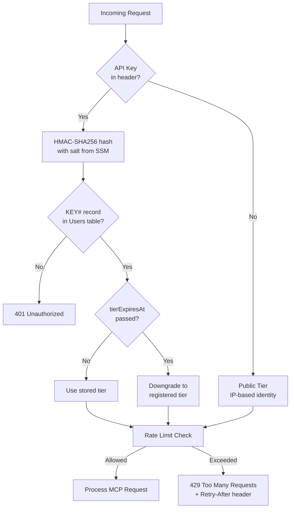
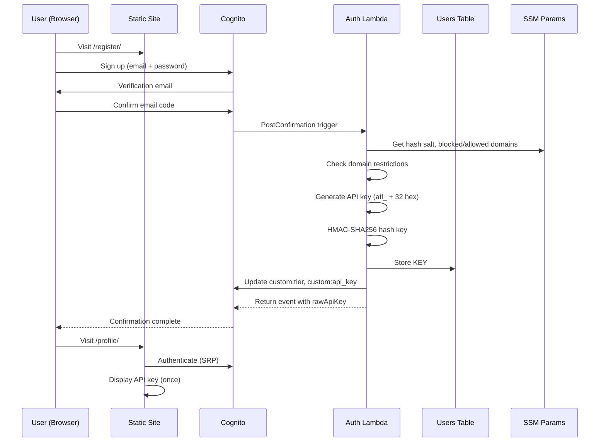

# Architecture

The Atlantis MCP Server is a serverless application that exposes Atlantis platform resources (CloudFormation templates, starter code, documentation) to AI assistants via the [Model Context Protocol](https://modelcontextprotocol.io/) (MCP). It is built entirely on AWS managed services and deployed through the Atlantis CI/CD pipeline.

## High-Level Architecture

```
┌──────────────────┐
│   AI Assistant   │
│  (Claude, etc.)  │
└────────┬─────────┘
         │  JSON-RPC 2.0 over HTTPS
         ▼
┌──────────────────┐
│   API Gateway    │  ── OpenAPI 3.0 spec, CORS, request validation
│   (REST API)     │
└────┬─────────┬───┘
     │         │
     │ POST    │ POST /auth/key/regenerate
     │ /mcp/v1 │ POST /auth/voucher/redeem
     │         │ GET  /auth/profile
     ▼         ▼
┌──────────┐ ┌──────────┐       ┌──────────────────┐
│  Read    │ │  Auth    │──────►│  Cognito         │
│  Lambda  │ │  Lambda  │       │  User Pool       │
└──┬───────┘ └──┬───────┘       └──────────────────┘
   │            │
   │            ├──────────────►┌──────────────────┐
   │            │               │  DynamoDB        │
   ├────────────┼──────────────►│  (Users)         │
   │            │               └──────────────────┘
   │            │
   │            └──────────────►┌──────────────────┐
   │                            │  SSM Parameter   │
   ├───────────────────────────►│  Store           │
   │                            └──────────────────┘
   │
   ├───────────────────────────►┌──────────────────┐
   │                            │  DynamoDB        │
   │                            │  (Sessions)      │
   │                            └──────────────────┘
   │
   ├───────────────────────────►┌──────────────────┐
   │                            │  DynamoDB        │
   │                            │  (DocIndex)      │
   │                            └──────────────────┘
   │
   ├───────────────────────────►┌──────────────────┐
   │                            │  S3 Buckets      │
   │                            │  (Templates &    │
   │                            │   Starters)      │
   │                            └──────────────────┘
   │
   ├───────────────────────────►┌──────────────────┐
   │                            │  GitHub API      │
   │                            └──────────────────┘
   │
   └───────────────────────────►┌──────────────────┐
                                │  DynamoDB + S3   │
                                │  (Cache-Data)    │
                                └──────────────────┘


┌──────────────────┐       ┌──────────────────┐
│  EventBridge     │──────►│  Doc Indexer     │
│  (Cron Schedule) │       │  Lambda          │
└──────────────────┘       └───┬────┬─────────┘
                               │    │
                               │    └────────► ┌──────────────────┐
                               │               │  GitHub API      │
                               │               └──────────────────┘
                               │
                               └─────────────► ┌──────────────────┐
                                               │  DynamoDB        │
                                               │  (DocIndex)      │
                                               └──────────────────┘


┌──────────────────┐       ┌──────────────────┐
│  Cognito         │──────►│  Auth Lambda     │  Post-Confirmation trigger
│  (Post-Confirm)  │       │  (trigger mode)  │  generates API key + user record
└──────────────────┘       └──────────────────┘


┌──────────────────┐       ┌──────────────────┐       ┌──────────────────┐
│  CodeBuild       │──────►│  Post-Deploy     │──────►│  S3 Static       │
│  (Post-Deploy)   │       │  Scripts         │       │  Hosting Bucket  │
└──────────────────┘       └──────────────────┘       └──────────────────┘
```

## Core Components

### API Gateway

A single REST API (`WebApi`) with endpoints for MCP tool calls and authentication operations. The OpenAPI 3.0 specification (`template-openapi-spec.yml`) is embedded via `Fn::Transform` and defines request/response schemas, CORS configuration, and Lambda proxy integrations.

**Endpoints:**

| Method | Path | Lambda | Purpose |
|--------|------|--------|---------|
| POST | `/mcp/v1` | Read Lambda | MCP JSON-RPC 2.0 tool calls |
| POST | `/auth/key/regenerate` | Auth Lambda | Regenerate API key |
| POST | `/auth/voucher/redeem` | Auth Lambda | Redeem promotion voucher |
| GET | `/auth/profile` | Auth Lambda | Retrieve user profile |

### Read Lambda

The primary request handler. Receives all MCP tool calls through `POST /mcp/v1` and routes them internally based on the JSON-RPC `method` and tool name.

**Request lifecycle:**

```
┌─────────────────────────────────────────────────────────────────────┐
│                        Read Lambda Handler                          │
│                                                                     │
│  1. Cold Start Init                                                 │
│     Config.init() → Config.promise() → Config.prime()               │
│                                                                     │
│  2. Parse Request                                                   │
│     ClientRequest(event, context) → Response(clientRequest)         │
│                                                                     │
│  3. Authenticate                                                    │
│     AuthResolver.resolveAuth(event)                                 │
│     ├─ No key → public tier (IP-based identity)                     │
│     ├─ Valid key → authenticated tier from Users table              │
│     └─ Invalid key → 401 Unauthorized                               │
│                                                                     │
│  4. Rate Limit                                                      │
│     RateLimiter.checkRateLimit(event, limits, authInfo)             │
│     ├─ Allowed → add rate-limit headers, continue                   │
│     └─ Exceeded → 429 Too Many Requests + Retry-After               │
│                                                                     │
│  5. Route & Process                                                 │
│     Routes.process(clientRequest, response)                         │
│     └─ JSON-RPC router → Controller → Service → Model               │
│                                                                     │
│  6. Finalize                                                        │
│     response.finalize() → API Gateway proxy response                │
└─────────────────────────────────────────────────────────────────────┘
```

**Internal structure (MVC-like):**

```
src/lambda/read/
├── index.js              # Handler entry point
├── config/               # Settings, connections, tool descriptions, validations
├── routes/               # JSON-RPC method routing
├── controllers/          # Tool dispatch: templates, starters, documentation, validation, updates
├── services/             # Business logic: template resolution, doc search, naming validation
├── models/               # Data access: S3, GitHub API, DynamoDB DocIndex
├── utils/                # Cross-cutting: auth-resolver, rate-limiter, json-rpc-router,
│                         #   content-chunker, error-handler, mcp-protocol, naming-rules
└── views/                # Response formatting (mcp-response)
```

**MCP tools served:**

| Tool | Controller | Description |
|------|-----------|-------------|
| `list_templates` | templates | List CloudFormation templates by category |
| `get_template` | templates | Retrieve full template content (with chunking for large templates) |
| `list_template_versions` | templates | Version history for a template |
| `check_template_updates` | updates | Check for newer template versions |
| `list_categories` | templates | List available template categories |
| `list_starters` | starters | List application starter repositories |
| `get_starter_info` | starters | Detailed starter metadata |
| `search_documentation` | documentation | Search indexed documentation |
| `validate_naming` | validation | Validate resource names against Atlantis conventions |
| `recommend` | documentation | Content recommendations for a documentation page |

### Auth Lambda

Handles server-side authentication operations. Dual-purpose: responds to Cognito triggers and API Gateway proxy events.

**Event routing:**

```
┌─────────────────────────────────────────────────────────────────────┐
│                        Auth Lambda Handler                          │
│                                                                     │
│  Event Detection:                                                   │
│  ├─ triggerSource === 'PostConfirmation_ConfirmSignUp'              │
│  │   └─ handlers/post-confirmation.js                               │
│  │       ├─ Check blocked/allowed email domains                     │
│  │       ├─ Check blocked/allowed countries                         │
│  │       ├─ Generate API key (atl_ + 32 hex chars)                  │
│  │       ├─ HMAC-SHA256 hash with salt from SSM                     │
│  │       ├─ Store KEY#<hash> record in Users table                  │
│  │       ├─ Update Cognito custom:tier and custom:api_key           │
│  │       └─ Return raw key (displayed once to user)                 │
│  │                                                                  │
│  ├─ httpMethod + path (API Gateway proxy)                           │
│  │   └─ routes/index.js → route dispatcher                          │
│  │       ├─ POST /auth/key/regenerate                               │
│  │       │   └─ handlers/key-regenerate.js                          │
│  │       │       ├─ Validate JWT from Authorization header          │
│  │       │       ├─ Delete old KEY# record                          │
│  │       │       ├─ Generate new API key + hash                     │
│  │       │       ├─ Store new KEY# record                           │
│  │       │       └─ Return new raw key                              │
│  │       │                                                          │
│  │       ├─ POST /auth/voucher/redeem                               │
│  │       │   └─ handlers/voucher-redeem.js                          │
│  │       │       ├─ Validate JWT                                    │
│  │       │       ├─ Look up VOUCHER#<code> record                   │
│  │       │       ├─ Validate expiry, max uses, target tier          │
│  │       │       ├─ Increment voucher currentUses                   │
│  │       │       ├─ Update user tier + tierExpiresAt                │
│  │       │       └─ Return updated tier info                        │
│  │       │                                                          │
│  │       └─ GET /auth/profile                                       │
│  │           └─ handlers/profile.js                                 │
│  │               ├─ Validate JWT                                    │
│  │               ├─ Query Users table by email (GSI)                │
│  │               ├─ Compute effective tier (check expiry)           │
│  │               ├─ Look up rate limit usage from Sessions table    │
│  │               └─ Return profile + usage + rate limit info        │
│  │                                                                  │
│  └─ Unrecognized → 400 error                                        │
└─────────────────────────────────────────────────────────────────────┘
```

**Internal structure:**

```
src/lambda/auth/
├── index.js              # Handler entry point (event type detection + CORS)
├── handlers/
│   ├── post-confirmation.js   # Cognito trigger: key generation, domain checks
│   ├── key-regenerate.js      # API: regenerate API key
│   ├── voucher-redeem.js      # API: redeem promotion voucher
│   └── profile.js             # API: get user profile + usage stats
├── routes/
│   └── index.js               # Path-based route dispatcher
└── utils/
    ├── api-key.js             # Key generation (atl_ + 32 hex) and HMAC-SHA256 hashing
    ├── dynamo-client.js       # Users table CRUD + voucher lookups
    ├── jwt-validator.js       # Cognito JWT validation (JWKS fetch + signature verify)
    ├── rate-limit-config.js   # Tier-based rate limit configuration
    └── window-calculator.js   # Time window math for rate limit display
```

### Doc Indexer Lambda

A scheduled Lambda triggered by EventBridge (daily in production, weekly in test). Operates independently from the Read and Auth Lambdas.

**Pipeline:**

```
EventBridge Schedule
        │
        ▼
┌─────────────────────────────────────────────────────────────────────┐
│                     Doc Indexer Lambda                              │
│                                                                     │
│  index-builder.js (orchestrator)                                    │
│  ├─ github-client.js → Fetch repo archives from configured orgs     │
│  ├─ archive-processor.js → Extract files from tar.gz archives       │
│  ├─ file-filter.js → Select indexable files by extension/path       │
│  ├─ Extractors (per file type):                                     │
│  │   ├─ markdown.js → Headings, sections, content                   │
│  │   ├─ cloudformation.js → Parameters, resources, outputs          │
│  │   ├─ jsdoc.js → Function signatures, descriptions                │
│  │   └─ python.js → Docstrings, function definitions                │
│  ├─ hasher.js → Content hashing for change detection                │
│  └─ dynamo-writer.js → Batch write index entries to DocIndex table  │
└─────────────────────────────────────────────────────────────────────┘
```

## Authentication and Access Tiers

The application implements a four-tier access model. Authentication is opt-in: requests without an API key are served at the public tier.



### Tier Definitions

| Tier | Identity | Rate Limit | Window | How to Obtain |
|------|----------|-----------|--------|---------------|
| **public** | Client IP | 50 requests | 60 min | Default (no key) |
| **registered** | Cognito sub | 100 requests | 60 min | Free registration + email verification |
| **paid** | Cognito sub | 3,000 requests | 1,440 min (24h) | Voucher code redemption |
| **private** | Cognito sub | 6,000 requests | 1,440 min (24h) | Allowed domain auto-promotion or admin |

### API Key Format

- Format: `atl_` + 32 random hex characters (e.g., `atl_a1b2c3d4...`)
- Stored as HMAC-SHA256 hash in DynamoDB (raw key never persisted)
- Sent via `Authorization: Bearer atl_...` or `X-API-Key: atl_...` header
- Displayed to user exactly once at registration; can be regenerated

### Registration Flow



### SSM Parameters for Authentication

| Parameter | Purpose | Default |
|-----------|---------|---------|
| `Mcp_ApiKeyHashSalt` | HMAC key for API key hashing | Auto-generated 256-bit hex |
| `Mcp_AllowedPrivateDomains` | Email domains for auto private tier | `BLANK` |
| `Mcp_BlockedEmailDomains` | Blocked email domains | `BLANK` |
| `Mcp_AllowedEmailDomains` | Allowed email domains (allowlist) | `BLANK` (all allowed) |
| `Mcp_BlockedCountries` | Blocked country codes (ISO 3166-1 alpha-2) | `BLANK` |
| `Mcp_AllowedCountries` | Allowed country codes | `BLANK` (all allowed) |

## Data Stores

### DynamoDB Tables

```
┌─────────────────────────────────────────────────────────────────────┐
│  Users Table (Prefix-ProjectId-StageId-Users)                       │
│  Billing: PAY_PER_REQUEST                                           │
│                                                                     │
│  Partition Key: pk (String)                                         │
│  GSI: email-index (email → all attributes)                          │
│  TTL: ttl                                                           │
│                                                                     │
│  Record Types:                                                      │
│  ├─ KEY#<hmac_sha256_hash>                                          │
│  │   { email, tier, cognitoSub, createdAt, tierExpiresAt }          │
│  └─ VOUCHER#<code>                                                  │
│      { targetTier, durationDays, maxUses, currentUses,              │
│        expiresAt, createdBy }                                       │
└─────────────────────────────────────────────────────────────────────┘

┌─────────────────────────────────────────────────────────────────────┐
│  Sessions Table (Prefix-ProjectId-StageId-sessions)                 │
│  Billing: PAY_PER_REQUEST                                           │
│                                                                     │
│  Partition Key: pk (String)                                         │
│  TTL: ttl                                                           │
│                                                                     │
│  Stores per-client rate limit counters with atomic updates.         │
│  Key format: hashed client identifier + time window.                │
│  TTL auto-cleans expired windows.                                   │
└─────────────────────────────────────────────────────────────────────┘

┌─────────────────────────────────────────────────────────────────────┐
│  DocIndex Table (Prefix-ProjectId-StageId-DocIndex)                 │
│  Billing: PAY_PER_REQUEST                                           │
│                                                                     │
│  Partition Key: pk (String)                                         │
│  Sort Key: sk (String)                                              │
│  TTL: ttl                                                           │
│                                                                     │
│  Stores indexed documentation: main index entries, search           │
│  keywords, section content, and version pointers.                   │
│  Populated by the Doc Indexer Lambda on schedule.                   │
└─────────────────────────────────────────────────────────────────────┘

┌──────────────────────────────────────────────────────────────────────┐
│  Cache-Data Table (cross-stack import: Prefix-CacheDataDynamoDbTable)│
│                                                                      │
│  Shared caching layer from @63klabs/cache-data package.              │
│  DynamoDB stores cache metadata; S3 stores large cached responses.   │
│  Imported via CloudFormation cross-stack references.                 │
└──────────────────────────────────────────────────────────────────────┘
```

### S3 Buckets

- **Template/Starter Buckets** — Source of truth for CloudFormation templates and starter code archives. Configured via `AtlantisS3Buckets` parameter. Must have `atlantis-mcp:Allow=true` tag.
- **Cache-Data Bucket** — Stores large cached responses (cross-stack import from `@63klabs/cache-data` storage stack).
- **Static Hosting Bucket** — Hosts the documentation site and authentication pages. Populated by the post-deploy pipeline.

### SSM Parameter Store

Stores sensitive configuration as SecureString parameters:
- GitHub API token
- Cache encryption key
- API key hash salt (`Mcp_ApiKeyHashSalt`)
- Domain and country restriction lists
- Cognito User Pool ID (for Auth Lambda API endpoints)

### Cognito User Pool

Per-stage user pool managing registration, email verification, and authentication.

- Username attribute: email
- Auto-verified: email
- Custom attributes: `custom:tier` (string), `custom:api_key` (string, stores hash)
- Password policy: 8+ chars, uppercase, lowercase, number, symbol
- Client: no secret (browser SDK), SRP auth + refresh token flows
- Post-Confirmation trigger: Auth Lambda

## Static Site

The static documentation site is hosted on S3 and includes both generated API documentation and authentication pages.

```
Static Site Structure:
├── index.html                    # Landing page with "Manage Account" link
├── css/index.css                 # Shared styles
├── register/index.html           # Cognito sign-up form
├── login/index.html              # Cognito sign-in form
├── profile/index.html            # User profile, API key display, voucher redemption
├── docs/
│   ├── index.html                # Documentation index
│   └── rate-limits/index.html    # Rate limit tiers documentation
├── api-docs/                     # Generated Redoc API reference (from OpenAPI spec)
└── [topic]/                      # Generated HTML from Markdown docs (tools, integration, etc.)
```

The authentication pages use the `amazon-cognito-identity-js` browser SDK loaded from CDN. Rate limit values and other configuration are injected at deploy time from `settings.json` via token replacement in the post-deploy scripts.

## Post-Deploy Pipeline

After the CloudFormation stack deploys, a separate CodeBuild project runs the post-deploy buildspec to generate and publish the static documentation site.

```
┌──────────────────────────────────────────────────────────────────────┐
│  01-export-api-spec.sh                                               │
│  Query CloudFormation for the REST API ID, then export the resolved  │
│  OpenAPI 3.0 spec from API Gateway as JSON                           │
└────────┬─────────────────────────────────────────────────────────────┘
         ▼
┌──────────────────────────────────────────────────────────────────────┐
│  02-generate-api-docs.sh                                             │
│  Resolve $ref pointers in the exported spec and generate a           │
│  single-page Redoc HTML site                                         │
└────────┬─────────────────────────────────────────────────────────────┘
         ▼
┌──────────────────────────────────────────────────────────────────────┐
│  03-generate-markdown-docs.sh                                        │
│  Convert end-user Markdown docs (tools, integration, use-cases,      │
│  troubleshooting) to HTML via Pandoc                                 │
└────────┬─────────────────────────────────────────────────────────────┘
         ▼
┌──────────────────────────────────────────────────────────────────────┐
│  04-consolidate-and-deploy.sh                                        │
│  Merge API docs, Markdown HTML, static assets, and auth pages into   │
│  a final directory. Apply settings.json token replacement. Sync to   │
│  S3 for static hosting.                                              │
└──────────────────────────────────────────────────────────────────────┘
         │
         ▼
┌──────────────────┐
│  S3 Static       │  Published documentation site + auth pages
│  Hosting Bucket  │
└──────────────────┘
```

## Build Pipeline

The main build (`buildspec.yml`) runs during the CodePipeline deploy phase:

1. **Install** — Node.js + Python runtimes, npm dependencies, pip dependencies for build scripts
2. **Pre-build** — Run tests for all Lambda functions, create SSM parameters (hash salt, domain lists) if they don't exist
3. **Build** — Package Lambda functions, run `sam build`
4. **Post-build** — SAM package and prepare artifacts

SSM parameters are created using the `generate-put-ssm.py` build script, which only writes parameters that don't already exist (no overwrites).

## Environment Strategy

| Branch | StageId | DeployEnvironment | Characteristics |
|--------|---------|-------------------|-----------------|
| test   | test    | TEST              | Immediate deploys, short log retention, verbose logging, no alarms/dashboards |
| beta   | beta    | PROD              | Gradual deploys, long log retention, alarms, dashboards |
| main   | prod    | PROD              | Gradual deploys, long log retention, alarms, dashboards |

Production environments use CodeDeploy gradual deployment (`Linear10PercentEvery3Minutes` by default) with automatic rollback on CloudWatch alarm triggers.

### Conditional Resources (PROD only)

- CloudWatch Alarms: Read Lambda errors, Read Lambda latency, API Gateway errors, Doc Indexer errors
- SNS Topics: Email notifications on alarm triggers
- CloudWatch Dashboard: Operational visibility across all components

## Monitoring

### CloudWatch Alarms (Production)

| Alarm | Metric | Threshold | Period |
|-------|--------|-----------|--------|
| Read Lambda Errors | Errors (Sum) | > 1 | 15 min |
| Read Lambda Latency | Duration (Avg) | > 5,000 ms | 5 min (2 eval periods) |
| API Gateway Errors | Errors (Sum) | > 1 | 15 min |
| Doc Indexer Errors | Errors (Sum) | > 1 | 15 min |

### Observability

- **X-Ray Tracing** — Enabled for API Gateway and Lambda functions in non-DEV environments
- **Lambda Insights** — CloudWatch Lambda Insights layer on Read Lambda and Doc Indexer
- **Structured Logging** — JSON-formatted logs with level, event, and context fields
- **API Gateway Logging** — Access logs (JSON format) and execution logs (optional, admin-enabled)

## Resource Naming

All resources follow the Atlantis naming convention:

```
<Prefix>-<ProjectId>-<StageId>-<ResourceId>
```

S3 buckets include AccountId and Region (and optionally, an Organization Prefix) for global uniqueness. S3 Account Regional Namespaces are preferred. See the `validate_naming` MCP tool for programmatic validation of resource names.

## Dependencies

### Runtime

- **Node.js 24.x** — Lambda runtime for all three functions
- **@63klabs/cache-data** — Shared caching layer (DynamoDB + S3)
- **AWS SDK v3** — DynamoDB, SSM, Cognito, S3 clients (available in Lambda runtime)
- **amazon-cognito-identity-js** — Browser SDK for static site authentication pages (CDN)

### Build/Deploy

- **AWS SAM** — CloudFormation transform for serverless resources
- **Pandoc** — Markdown to HTML conversion for documentation
- **Redoc** — OpenAPI spec to HTML documentation (CDN, no CLI install)
- **Python 3** — Build scripts for SSM parameter creation and template configuration
