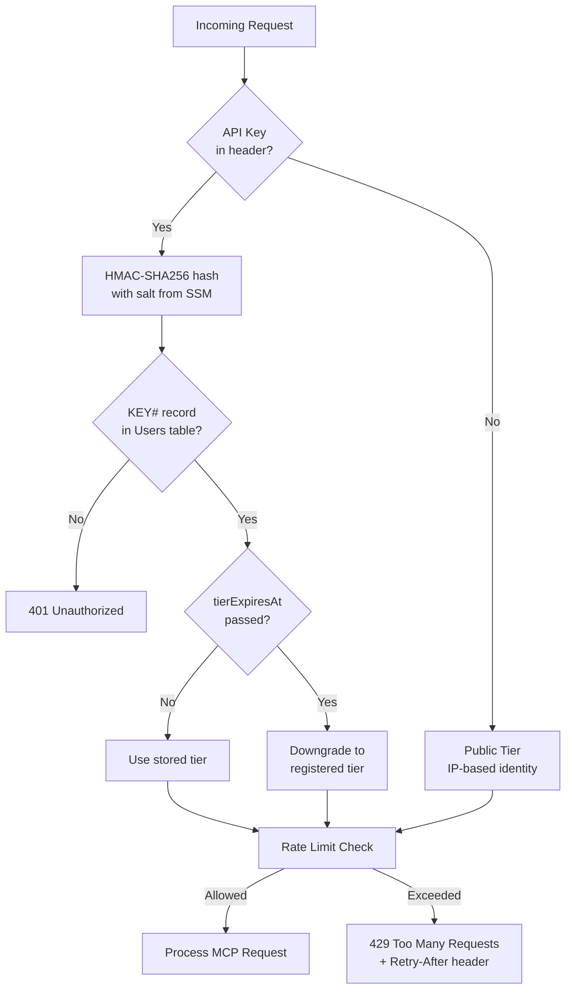
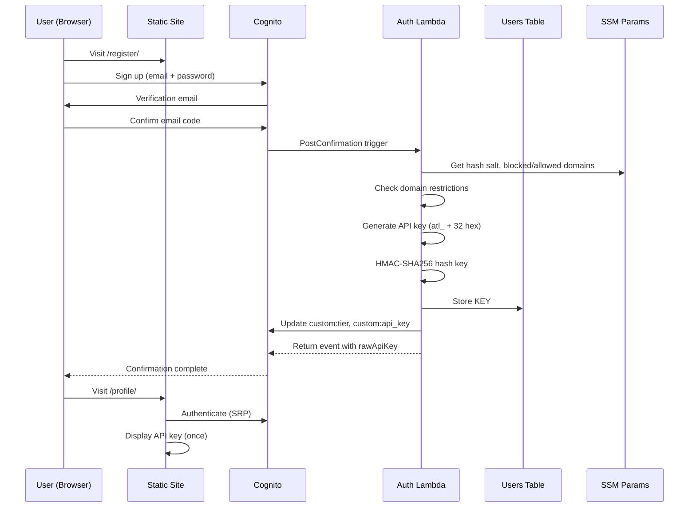
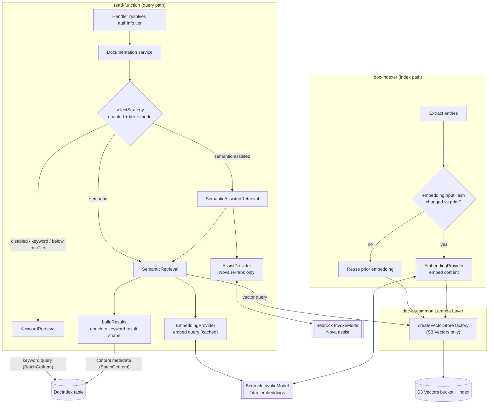

# Architecture

The Atlantis MCP Server is a serverless application that exposes 63Klabs Atlantis DevOps Platform resources (CloudFormation templates, starter code, documentation) to AI assistants via the [Model Context Protocol](https://modelcontextprotocol.io/) (MCP). It is built entirely on AWS managed services and deployed through the Atlantis CI/CD pipeline.

## High-Level Architecture

```
┌──────────────────┐
│   AI Assistant   │
│  (Claude, etc.)  │
└────────┬─────────┘
         │  JSON-RPC 2.0 over HTTPS
         ▼
┌──────────────────┐
│   API Gateway    │  ── OpenAPI 3.0 spec, CORS, request validation
│   (REST API)     │
└────┬─────────┬───┘
     │         │
     │ POST    │ POST /auth/key/regenerate
     │ /mcp/v1 │ POST /auth/voucher/redeem
     │         │ GET  /auth/profile
     ▼         ▼
┌──────────┐ ┌──────────┐       ┌──────────────────┐
│  Read    │ │  Auth    │──────►│  Cognito         │
│  Lambda  │ │  Lambda  │       │  User Pool       │
└──┬───────┘ └──┬───────┘       └──────────────────┘
   │            │
   │            ├──────────────►┌──────────────────┐
   │            │               │  DynamoDB        │
   ├────────────┼──────────────►│  (Users)         │
   │            │               └──────────────────┘
   │            │
   │            └──────────────►┌──────────────────┐
   │                            │  SSM Parameter   │
   ├───────────────────────────►│  Store           │
   │                            └──────────────────┘
   │
   ├───────────────────────────►┌──────────────────┐
   │                            │  DynamoDB        │
   │                            │  (Sessions)      │
   │                            └──────────────────┘
   │
   ├───────────────────────────►┌──────────────────┐
   │                            │  DynamoDB        │
   │                            │  (DocIndex)      │
   │                            └──────────────────┘
   │
   ├───────────────────────────►┌──────────────────┐
   │                            │  S3 Buckets      │
   │                            │  (Templates &    │
   │                            │   Starters)      │
   │                            └──────────────────┘
   │
   ├───────────────────────────►┌──────────────────┐
   │                            │  GitHub API      │
   │                            └──────────────────┘
   │
   └───────────────────────────►┌──────────────────┐
                                │  DynamoDB + S3   │
                                │  (Cache-Data)    │
                                └──────────────────┘


┌──────────────────┐       ┌──────────────────┐
│  EventBridge     │──────►│  Doc Indexer     │
│  (Cron Schedule) │       │  Lambda          │
└──────────────────┘       └───┬────┬─────────┘
                               │    │
                               │    └────────► ┌──────────────────┐
                               │               │  GitHub API      │
                               │               └──────────────────┘
                               │
                               └─────────────► ┌──────────────────┐
                                               │  DynamoDB        │
                                               │  (DocIndex)      │
                                               └──────────────────┘


┌──────────────────┐       ┌──────────────────┐
│  Cognito         │──────►│  Auth Lambda     │  Post-Confirmation trigger
│  (Post-Confirm)  │       │  (trigger mode)  │  generates API key + user record
└──────────────────┘       └──────────────────┘


┌──────────────────┐       ┌──────────────────┐       ┌──────────────────┐
│  CodeBuild       │──────►│  Post-Deploy     │──────►│  S3 Static       │
│  (Post-Deploy)   │       │  Scripts         │       │  Hosting Bucket  │
└──────────────────┘       └──────────────────┘       └──────────────────┘
```

## Core Components

### API Gateway

A single REST API (`WebApi`) with endpoints for MCP tool calls and authentication operations. The OpenAPI 3.0 specification (`template-openapi-spec.yml`) is embedded via `Fn::Transform` and defines request/response schemas, CORS configuration, and Lambda proxy integrations.

**Endpoints:**

| Method | Path | Lambda | Purpose |
|--------|------|--------|---------|
| POST | `/mcp/v1` | Read Lambda | MCP JSON-RPC 2.0 tool calls |
| POST | `/auth/key/regenerate` | Auth Lambda | Regenerate API key |
| POST | `/auth/voucher/redeem` | Auth Lambda | Redeem promotion voucher |
| GET | `/auth/profile` | Auth Lambda | Retrieve user profile |

### Read Lambda

The primary request handler. Receives all MCP tool calls through `POST /mcp/v1` and routes them internally based on the JSON-RPC `method` and tool name.

**Request lifecycle:**

```
┌─────────────────────────────────────────────────────────────────────┐
│                        Read Lambda Handler                          │
│                                                                     │
│  1. Cold Start Init                                                 │
│     Config.init() → Config.promise() → Config.prime()               │
│                                                                     │
│  2. Parse Request                                                   │
│     ClientRequest(event, context) → Response(clientRequest)         │
│                                                                     │
│  3. Authenticate                                                    │
│     AuthResolver.resolveAuth(event)                                 │
│     ├─ No key → public tier (IP-based identity)                     │
│     ├─ Valid key → authenticated tier from Users table              │
│     └─ Invalid key → 401 Unauthorized                               │
│                                                                     │
│  4. Rate Limit                                                      │
│     RateLimiter.checkRateLimit(event, limits, authInfo)             │
│     ├─ Allowed → add rate-limit headers, continue                   │
│     └─ Exceeded → 429 Too Many Requests + Retry-After               │
│                                                                     │
│  5. Route & Process                                                 │
│     Routes.process(clientRequest, response)                         │
│     └─ JSON-RPC router → Controller → Service → Model               │
│                                                                     │
│  6. Finalize                                                        │
│     response.finalize() → API Gateway proxy response                │
└─────────────────────────────────────────────────────────────────────┘
```

**Internal structure (MVC-like):**

```
src/lambda/read-function/
├── index.js              # Handler entry point
├── config/               # Settings, connections, tool descriptions, validations
├── routes/               # JSON-RPC method routing
├── controllers/          # Tool dispatch: templates, starters, documentation, validation, updates
├── services/             # Business logic: template resolution, doc search, naming validation
├── models/               # Data access: S3, GitHub API, DynamoDB DocIndex
├── utils/                # Cross-cutting: auth-resolver, rate-limiter, json-rpc-router,
│                         #   content-chunker, error-handler, mcp-protocol, naming-rules
└── views/                # Response formatting (mcp-response)
```

**MCP tools served:**

| Tool | Controller | Description |
|------|-----------|-------------|
| `list_templates` | templates | List CloudFormation templates by category |
| `get_template` | templates | Retrieve full template content (with chunking for large templates) |
| `list_template_versions` | templates | Version history for a template |
| `check_template_updates` | updates | Check for newer template versions |
| `list_categories` | templates | List available template categories |
| `list_starters` | starters | List application starter repositories |
| `get_starter_info` | starters | Detailed starter metadata |
| `search_documentation` | documentation | Search indexed documentation |
| `get_document` | documentation | Retrieve the full stored source file behind a search result (storage-only; never fetches from GitHub) |
| `get_document_chunk` | documentation | Retrieve one chunk of a large document (parity with `get_template_chunk`) |
| `validate_naming` | validation | Validate resource names against Atlantis conventions |
| `recommend` | documentation | Content recommendations for a documentation page |
| `list_agent_assets` | agent-assets | List Kiro agent assets (steering, hooks, AGENTS.md), optionally filtered by `assetType` |
| `get_agent_asset` | agent-assets | Retrieve one agent asset's full content by `assetType` and `name` |
| `list_agent_asset_types` | agent-assets | List the enabled agent-asset types with per-type asset counts |
| `get_agent_asset_chunk` | agent-assets | Retrieve one chunk of a large agent asset (parity with `get_template_chunk`) |

### Auth Lambda

Handles server-side authentication operations. Dual-purpose: responds to Cognito triggers and API Gateway proxy events.

**Event routing:**

```
┌─────────────────────────────────────────────────────────────────────┐
│                        Auth Lambda Handler                          │
│                                                                     │
│  Event Detection:                                                   │
│  ├─ triggerSource === 'PostConfirmation_ConfirmSignUp'              │
│  │   └─ handlers/post-confirmation.js                               │
│  │       ├─ Check blocked/allowed email domains                     │
│  │       ├─ Check blocked/allowed countries                         │
│  │       ├─ Generate API key (atl_ + 32 hex chars)                  │
│  │       ├─ HMAC-SHA256 hash with salt from SSM                     │
│  │       ├─ Store KEY#<hash> record in Users table                  │
│  │       ├─ Update Cognito custom:tier and custom:api_key           │
│  │       └─ Return raw key (displayed once to user)                 │
│  │                                                                  │
│  ├─ httpMethod + path (API Gateway proxy)                           │
│  │   └─ routes/index.js → route dispatcher                          │
│  │       ├─ POST /auth/key/regenerate                               │
│  │       │   └─ handlers/key-regenerate.js                          │
│  │       │       ├─ Validate JWT from Authorization header          │
│  │       │       ├─ Delete old KEY# record                          │
│  │       │       ├─ Generate new API key + hash                     │
│  │       │       ├─ Store new KEY# record                           │
│  │       │       └─ Return new raw key                              │
│  │       │                                                          │
│  │       ├─ POST /auth/voucher/redeem                               │
│  │       │   └─ handlers/voucher-redeem.js                          │
│  │       │       ├─ Validate JWT                                    │
│  │       │       ├─ Look up VOUCHER#<code> record                   │
│  │       │       ├─ Validate expiry, max uses, target tier          │
│  │       │       ├─ Increment voucher currentUses                   │
│  │       │       ├─ Update user tier + tierExpiresAt                │
│  │       │       └─ Return updated tier info                        │
│  │       │                                                          │
│  │       └─ GET /auth/profile                                       │
│  │           └─ handlers/profile.js                                 │
│  │               ├─ Validate JWT                                    │
│  │               ├─ Query Users table by email (GSI)                │
│  │               ├─ Compute effective tier (check expiry)           │
│  │               ├─ Look up rate limit usage from Sessions table    │
│  │               └─ Return profile + usage + rate limit info        │
│  │                                                                  │
│  └─ Unrecognized → 400 error                                        │
└─────────────────────────────────────────────────────────────────────┘
```

**Internal structure:**

```
src/lambda/auth-function/
├── index.js              # Handler entry point (event type detection + CORS)
├── handlers/
│   ├── post-confirmation.js   # Cognito trigger: key generation, domain checks
│   ├── key-regenerate.js      # API: regenerate API key
│   ├── voucher-redeem.js      # API: redeem promotion voucher
│   └── profile.js             # API: get user profile + usage stats
├── routes/
│   └── index.js               # Path-based route dispatcher
└── utils/
    ├── api-key.js             # Key generation (atl_ + 32 hex) and HMAC-SHA256 hashing
    ├── dynamo-client.js       # Users table CRUD + voucher lookups
    ├── jwt-validator.js       # Cognito JWT validation (JWKS fetch + signature verify)
    ├── rate-limit-config.js   # Tier-based rate limit configuration
    └── window-calculator.js   # Time window math for rate limit display
```

### Doc Indexer Lambda

A scheduled Lambda triggered by EventBridge (daily in production, weekly in test). Operates independently from the Read and Auth Lambdas.

**Pipeline:**

```
EventBridge Schedule
        │
        ▼
┌─────────────────────────────────────────────────────────────────────┐
│                     Doc Indexer Lambda                              │
│                                                                     │
│  index-builder.js (orchestrator)                                    │
│  ├─ github-client.js → Fetch repo archives from configured orgs     │
│  ├─ archive-processor.js → Extract files from tar.gz archives       │
│  ├─ file-filter.js → Select indexable files by extension/path       │
│  ├─ Extractors (per file type):                                     │
│  │   ├─ markdown.js → Headings, sections, content                   │
│  │   ├─ cloudformation.js → Parameters, resources, outputs          │
│  │   ├─ jsdoc.js → Function signatures, descriptions                │
│  │   └─ python.js → Docstrings, function definitions                │
│  ├─ hasher.js → Content hashing for change detection                │
│  └─ dynamo-writer.js → Batch write index entries to DocIndex table  │
└─────────────────────────────────────────────────────────────────────┘
```

## Agent Asset Tools (Registry-Driven)

A read-only family of MCP tools, served by the Read Lambda, that let AI assistants discover and retrieve example Kiro "agent assets" — steering documents, hooks, and `AGENTS.md` files today, with `skills` shipped disabled and future types addable later. Assets are sourced from the same S3 buckets and namespace layout already used for templates and starters (`{bucket}/{namespace}/utilities/v2/agent_assets/{folder}/{filename}`), adding no new AWS infrastructure or IAM.

Rather than one tool pair per asset type, the feature exposes a **fixed** set of generic tools — `list_agent_assets`, `get_agent_asset`, `list_agent_asset_types`, and `get_agent_asset_chunk` — that take the asset type as an `assetType` parameter, mirroring how `list_templates`/`get_template` take a `category` parameter. The full set of accepted `assetType` values is generated from a single registry, `config/agent-asset-types.js`'s `AGENT_ASSET_TYPES` array. Each entry declares `name` (the `assetType` enum value), `toolToken`, `folder` (the S3 subfolder), `extensions` (allowed file extensions), a `description`, and an optional `enabled` flag (`skills` ships with `enabled: false`). `validateRegistry()` runs once at module load and fails initialization fast — exposing no agent-asset tools — if any entry is missing a required field or duplicates another entry's `name`, `toolToken`, or `folder`.

```
AGENT_ASSET_TYPES registry
  │
  ├─ generateToolDefinitions() / generateSchemas() / generateExtendedDescriptions() / getToolDispatch()
  │     merged into: config/settings.js, utils/schema-validator.js,
  │                  config/tool-descriptions.js, utils/json-rpc-router.js
  │
  ▼
controllers/agent-assets.js  (list / get / listTypes / getChunk — validates input, resolves assetType)
  ▼
services/agent-assets.js     (caching via CacheableDataAccess, strict assetType/bucket validation)
  ▼
models/s3-agent-assets.js    (S3 DAO: list/get, extension filtering, dedup, SHA-256)
  ▼
S3 buckets: {namespace}/utilities/v2/agent_assets/{folder}/{filename}
```

Adding a new asset type — or enabling the shipped-but-disabled `skills` type — requires **only a new entry in `AGENT_ASSET_TYPES`** (or removing/flipping its `enabled: false`). The new `name` automatically becomes an accepted `assetType` value for the existing `list_agent_assets`/`get_agent_asset` tools; no new tool is created, and the generic controller, service, and DAO logic (which all operate over whatever the registry currently contains) require no changes. See the [developer guide](docs/developer/agent-asset-tools.md) for the step-by-step procedure.

Large assets degrade gracefully like large templates: `get_agent_asset` responses over the configured size threshold return a `contentTruncated: true` summary with a `totalChunks` count, and `get_agent_asset_chunk` retrieves the content incrementally by zero-based `chunkIndex` — the same `ContentSizer`/`ContentChunker` pattern used by `get_template`/`get_template_chunk`.

## Authentication and Access Tiers

The application implements a four-tier access model. Authentication is opt-in: requests without an API key are served at the public tier.



### Tier Definitions

| Tier | Identity | Rate Limit | Window | How to Obtain |
|------|----------|-----------|--------|---------------|
| **public** | Client IP | 50 requests | 60 min | Default (no key) |
| **registered** | Cognito sub | 100 requests | 60 min | Free registration + email verification |
| **paid** | Cognito sub | 3,000 requests | 1,440 min (24h) | Voucher code redemption |
| **private** | Cognito sub | 6,000 requests | 1,440 min (24h) | Allowed domain auto-promotion or admin |

### API Key Format

- Format: `atl_` + 32 random hex characters (e.g., `atl_a1b2c3d4...`)
- Stored as HMAC-SHA256 hash in DynamoDB (raw key never persisted)
- Sent via `Authorization: Bearer atl_...` or `X-API-Key: atl_...` header
- Displayed to user exactly once at registration; can be regenerated

### Registration Flow



### SSM Parameters for Authentication

| Parameter | Purpose | Default |
|-----------|---------|---------|
| `Mcp_ApiKeyHashSalt` | HMAC key for API key hashing | Auto-generated 256-bit hex |
| `Mcp_AllowedPrivateDomains` | Email domains for auto private tier | `BLANK` |
| `Mcp_BlockedEmailDomains` | Blocked email domains | `BLANK` |
| `Mcp_AllowedEmailDomains` | Allowed email domains (allowlist) | `BLANK` (all allowed) |
| `Mcp_BlockedCountries` | Blocked country codes (ISO 3166-1 alpha-2) | `BLANK` |
| `Mcp_AllowedCountries` | Allowed country codes | `BLANK` (all allowed) |

## Data Stores

### DynamoDB Tables

```
┌─────────────────────────────────────────────────────────────────────┐
│  Users Table (Prefix-ProjectId-StageId-Users)                       │
│  Billing: PAY_PER_REQUEST                                           │
│                                                                     │
│  Partition Key: pk (String)                                         │
│  GSI: email-index (email → all attributes)                          │
│  TTL: ttl                                                           │
│                                                                     │
│  Record Types:                                                      │
│  ├─ KEY#<hmac_sha256_hash>                                          │
│  │   { email, tier, cognitoSub, createdAt, tierExpiresAt }          │
│  └─ VOUCHER#<code>                                                  │
│      { targetTier, durationDays, maxUses, currentUses,              │
│        expiresAt, createdBy }                                       │
└─────────────────────────────────────────────────────────────────────┘

┌─────────────────────────────────────────────────────────────────────┐
│  Sessions Table (Prefix-ProjectId-StageId-sessions)                 │
│  Billing: PAY_PER_REQUEST                                           │
│                                                                     │
│  Partition Key: pk (String)                                         │
│  TTL: ttl                                                           │
│                                                                     │
│  Stores per-client rate limit counters with atomic updates.         │
│  Key format: hashed client identifier + time window.                │
│  TTL auto-cleans expired windows.                                   │
└─────────────────────────────────────────────────────────────────────┘

┌─────────────────────────────────────────────────────────────────────┐
│  DocIndex Table (Prefix-ProjectId-StageId-DocIndex)                 │
│  Billing: PAY_PER_REQUEST                                           │
│                                                                     │
│  Partition Key: pk (String)                                         │
│  Sort Key: sk (String)                                              │
│  TTL: ttl                                                           │
│                                                                     │
│  Stores indexed documentation: main index entries, search           │
│  keywords, per-section metadata, per-file document bodies, and      │
│  version pointers. Populated by the Doc Indexer Lambda on schedule. │
└─────────────────────────────────────────────────────────────────────┘

┌──────────────────────────────────────────────────────────────────────┐
│  Cache-Data Table (cross-stack import: Prefix-CacheDataDynamoDbTable)│
│                                                                      │
│  Shared caching layer from @63klabs/cache-data package.              │
│  DynamoDB stores cache metadata; S3 stores large cached responses.   │
│  Imported via CloudFormation cross-stack references.                 │
└──────────────────────────────────────────────────────────────────────┘
```

#### DocIndex Table Item Shapes

The DocIndex table is single-table design: every item type shares the table but is distinguished by its `pk`/`sk` prefix.

| Item | `pk` | `sk` | Notes |
|------|------|------|-------|
| Content metadata | `content:{hash}` | `v:{version}:metadata` | One per indexed section. `hash` = SHA-256(contentPath) truncated to 16 hex. Carries `title`, `excerpt`, `type`, `subType`, `repository`, `owner`, `keywords`, plus `githubUrl`, `repositoryType`, `namespace`, and `documentHash` (each `null` when not derivable). |
| Document body | `document:{fileHash}` | `content` | One per source **file** (not per section), version-less. `fileHash` = SHA-256(`{org}/{repo}/{filePath}`) truncated to 16 hex. Holds the raw file text plus `githubUrl`/`repositoryType`/`namespace`/`repository`/`owner`. Upserted on every build with a refreshed 7-day TTL; a file no longer present in a build simply expires via TTL (no orphan-delete pass). Read by the `get_document`/`get_document_chunk` tools. |
| Search keyword | `search:{keyword}` | `v:{version}:{hash}` | One per keyword per section, with a pre-computed `relevanceScore`/`typeWeight` and (as of this change) the section's `type`/`subType`, enabling filter push-down before metadata is fetched. |
| Main index | `mainindex:{version}` | `entries` / `entries:{n}` | Chunked manifest of all indexed content paths for a version. |
| Version pointer | `version:pointer` | `active` | Points to the currently active index version; optionally carries embedding model/dimensions when semantic indexing is enabled. |

The former per-section, per-version body item (`content:{hash}` / `v:{version}:content`) no longer exists — it had no reader and duplicated storage across versions. Source bodies are now stored once per file under the version-less `document:{fileHash}` key described above.

### S3 Buckets

- **Template/Starter Buckets** — Source of truth for CloudFormation templates and starter code archives. Configured via `AtlantisS3Buckets` parameter. Must have `atlantis-mcp:Allow=true` tag.
- **Cache-Data Bucket** — Stores large cached responses (cross-stack import from `@63klabs/cache-data` storage stack).
- **Static Hosting Bucket** — Hosts the documentation site and authentication pages. Populated by the post-deploy pipeline.

### SSM Parameter Store

Stores sensitive configuration as SecureString parameters:
- GitHub API token
- Cache encryption key
- API key hash salt (`Mcp_ApiKeyHashSalt`)
- Domain and country restriction lists
- Cognito User Pool ID (for Auth Lambda API endpoints)

### Cognito User Pool

Per-stage user pool managing registration, email verification, and authentication.

- Username attribute: email
- Auto-verified: email
- Custom attributes: `custom:tier` (string), `custom:api_key` (string, stores hash)
- Password policy: 8+ chars, uppercase, lowercase, number, symbol
- Client: no secret (browser SDK), SRP auth + refresh token flows
- Post-Confirmation trigger: Auth Lambda

## Documentation Semantic Search (Bedrock-assisted)

An optional enhancement to the `search_documentation` tool that augments the existing keyword search with Amazon Bedrock semantic retrieval, returning results ranked by meaning rather than exact keyword overlap. It **augments retrieval only** — it never composes answers or synthesizes prose, so it does not supplant the calling agent's reasoning.

The feature **defaults OFF**. When disabled, `search_documentation` behaves byte-for-byte as the current keyword-only implementation: the shared layer is never loaded and no Bedrock or vector clients are constructed. When enabled, it is gated to the paid and private tiers by default (configurable), and the tool name and response contract are unchanged for all callers. Any failure on the semantic path transparently falls back to keyword search.

Operator enablement (parameters, Bedrock model access, region prerequisites) is documented in [DEPLOYMENT.md](DEPLOYMENT.md#enabling-documentation-semantic-search); the retrieval internals and extension points are documented in the [developer guide](docs/developer/documentation-semantic-search.md).



### Shared Layer (doc-ai-common)

Shared abstractions ship in a single Lambda Layer (`DocAiCommonLayer`, named `<Prefix>-<ProjectId>-<StageId>-DocAiCommon`) attached to **both** the Read Lambda (query path) and the Doc Indexer Lambda (index path), so the code lives once instead of being duplicated per function. The layer is code only — it has no standing cost and no IAM — so it is attached unconditionally; the `EnableDocAi` condition gates only the billable resources and permissions. At runtime its `nodejs/` contents are extracted to `/opt/nodejs/`. It bundles exactly one production dependency, `@aws-sdk/client-s3vectors` (the S3 Vectors client is too new to be guaranteed in the `nodejs24.x` runtime); every other AWS SDK v3 client is provided by the runtime.

| Module (`nodejs/`) | Component(s) | Responsibility |
|--------------------|--------------|----------------|
| `embedding-provider.js` | `EmbeddingProvider` | Wraps Bedrock `InvokeModel` for Amazon Titan Text Embeddings V2 (`{ inputText, dimensions, normalize: true }`); input truncation to a token budget; lazy client; typed errors |
| `vector-store.js` | `VectorStore`, `createVectorStore` | Storage-agnostic interface plus a factory that always returns `S3VectorStore` (S3 Vectors is the sole backend); typed errors |
| `vector-store-s3.js` | `S3VectorStore` | Maps upsert/query onto the S3 Vectors data plane; metadata filter translation |
| `retrieval-strategy.js` | `KeywordRetrieval`, `SemanticRetrieval`, `SemanticAssistedRetrieval`, `FallbackRetrieval`, `selectStrategy` | Retrieval strategy family, tier-gated selection, and the keyword-fallback wrapper |
| `assist-provider.js` | `AssistProvider` | Wraps Bedrock `InvokeModel` for Amazon Nova Micro; re-rank only (returns an index ordering), never synthesizes prose; deterministic (`temperature: 0`) |

### Query Path (Read Lambda)

The caller's tier is threaded from authentication through to strategy selection: `Routes.process(clientRequest, response, authInfo)` → `json-rpc-router.handleJsonRpc(clientRequest, authInfo)` → `handleToolsCall` sets `props.authInfo` → the documentation controller reads `props.authInfo.tier` → the documentation service calls `selectStrategy({ config, tier, strategies })`. Only the documentation tool consumes the tier today; other tools ignore `props.authInfo`.

`selectStrategy` chooses the semantic path only when the feature is enabled, the retrieval mode is not `keyword`, and the caller's tier rank is at or above `minTier`; otherwise it returns the keyword strategy unchanged. An unknown or missing tier ranks as `public` (fail-secure). When a semantic primary is chosen it is wrapped in a `FallbackRetrieval` so any semantic-path error is logged and degraded to keyword search.

`SemanticRetrieval` embeds the query with `EmbeddingProvider` (caching the vector by normalized query, model, and dimensions to avoid repeat Bedrock calls), queries the active index version through the `VectorStore`, and maps the ranked hits back to the existing result shape via an injected `buildResults`. `buildResults` fetches the same content metadata the keyword path uses (`Models.DocIndex.getContentMetadataByHashes`, keyed by `content:{hash}`) via the shared `batchGetMetadata` helper (chunked `BatchGetItem`, bounded `UnprocessedKeys` retry — see [Batched Metadata Retrieval](#batched-metadata-retrieval) below), so semantic and keyword results are indistinguishable in shape; the cosine `score` becomes `relevanceScore`. Results are cached through the existing `documentation-index` cache profile, with a cache-key discriminator (`mode|tier` when enabled, `keyword` when disabled) so a paid/private semantic hit is never served to a below-tier keyword caller.

#### Batched Metadata Retrieval

Both the keyword path (`queryIndex`) and the semantic/assisted enrichment path (`getContentMetadataByHashes`) fetch content metadata through a shared `batchGetMetadata(tableName, version, hashes)` helper in `read-function/models/doc-index.js` instead of one serial `GetItem` per hash. The helper builds `content:{hash}/v:{version}:metadata` keys, chunks them at the 100-key `BatchGetItem` limit, issues chunks in parallel, and retries only `UnprocessedKeys` with a bounded number of attempts and exponential backoff (never an unbounded loop). Because `BatchGetItem` can return items out of order or omit missing keys, both callers re-sort by their pre-fetch ranking (relevance score or vector rank) after the fetch, so a hash with no stored metadata (e.g. a superseded or partial index) is simply omitted rather than failing the request.

For the keyword path, `type`/`subType` filters are pushed down onto the ranked hash set — using `type`/`subType` now carried on each `search:{keyword}` entry — *before* the `batchGetMetadata` call, so a filtered query reads fewer metadata items without changing which results are returned versus post-fetch filtering. After enrichment, an `EXACT_PHRASE_BOOST` (20, matching the indexer's former `SCORE_WEIGHTS.exactPhrase`) is added to any candidate whose `title` or `excerpt` contains the normalized full query phrase, and candidates are re-sorted by final relevance descending — this changes ordering only, never membership, and never affects the semantic path. The search envelope also gains two additive, optional fields: `availableFilters` (distinct `type`/`subType` values with counts over the matched set) and a "narrow by type/subType" nudge appended to `suggestions` once `totalResults` is large.

### Index Path (Doc Indexer)

When the feature is enabled, after extraction the indexer computes an `embeddingInput` (title + excerpt + content, truncated) and an `embeddingInputHash` per entry. If a prior-version vector exists with the same `embeddingInputHash`, model, and dimensions, the embedding is reused (no Bedrock call); otherwise the entry is embedded via `EmbeddingProvider`. Vectors are upserted to the configured store, and the index version metadata records the embedding model and dimensions used. When the feature is disabled, the entire embedding phase is skipped and the indexer behaves exactly as it does today.

### Configuration Axes and Layered Fallback

One configuration axis selects retrieval behavior (mirrored to the Read Lambda settings and the Doc Indexer settings loader so the two functions stay in lockstep):

- **Retrieval mode** (`DOC_AI_RETRIEVAL_MODE`): `keyword` | `semantic` | `semantic-assisted`. Defaults to `keyword`.

S3 Vectors is the sole vector-store backend — there is no vector-store selection axis or setting. Fallback is layered and never fails the request: a semantic error degrades to keyword search; an assist-model error in `semantic-assisted` mode degrades to plain semantic results. Settings validation warns and applies documented defaults rather than throwing.

### S3 Vectors Provisioning

Semantic and semantic-assisted retrieval use a single S3 Vectors vector bucket and index. S3 Vectors has no native CloudFormation resource type, so the vector bucket and index are provisioned by a Lambda-backed custom resource (`Custom::S3VectorIndex`, resource `DocAiVectorIndex`) whose handler (`S3VectorsProvisioner`) owns the full create/update/delete lifecycle. The index is created with the `cosine` distance metric and the configured dimension (both immutable — a change forces index replacement). All S3 Vectors infrastructure — the provisioner function, its role and log group, and the custom resource — is gated by the `EnableDocAiIsTrue` condition, so a default (disabled) deploy creates no AI resources. There is no DynamoDB vector-store backend; the DocIndex table stores keyword search entries, per-section metadata, and per-file document bodies only (see [Data Stores](#data-stores)).

Runtime IAM is delivered as two condition-gated policies with no wildcards: `ReadDocAiPolicy` grants the Read Lambda `bedrock:InvokeModel` on the specific embedding and assist model ARNs plus `s3vectors:QueryVectors` on the one resolved index ARN; `DocIndexerDocAiPolicy` grants the Doc Indexer `bedrock:InvokeModel` on the embedding model ARN plus `s3vectors:PutVectors`/`GetVectors`/`ListVectors`/`DeleteVectors` on that index ARN. When the feature is disabled, neither policy exists.

### Cross-Region Bedrock Access

The two Bedrock model types reach other regions differently because embedding models and assist models have different cross-region capabilities. The embedding client (Titan v2) can be pinned to a fixed alternate region via `DocAiEmbeddingRegion` (env var `DOC_AI_EMBEDDING_REGION`), which overrides the Lambda's deployment region and is used when the embedding model is not available where the stack is deployed. Embedding models cannot use Bedrock cross-region inference profiles, so this hard client-side region pin is the only cross-region option for embeddings; the embedding-model IAM ARN in both policies follows the same region. The assist model instead uses AWS server-side cross-region routing through an inference profile: when `DocAiAssistProfileRegions` is set, `DocAiAssistModel` holds an inference-profile id and `ReadDocAiPolicy` grants the inference-profile ARN plus the assist foundation model restricted to the listed regions via the `aws:RequestedRegion` condition key (no client-side region override). See DEPLOYMENT.md for parameter and region-availability guidance.

### Observability

When enabled, CloudWatch metric filters on the Read Lambda log group publish usage/cost signal to the `<Prefix>-<ProjectId>/DocAi` namespace: `SemanticAssistedUsageCount` and `SemanticAssistedUsageS3Vectors` (both track the same events, since S3 Vectors is the sole backend), and `SemanticDegradeCount` (assist re-rank fell back to plain semantic). A `SemanticAssistedUsageDynamoDb` filter also exists but never matches now that the DynamoDB vector-store backend has been removed. The `DOC_AI_USAGE` usage line is emitted at INFO level (visible in production); the degrade line is WARN level. These filters are gated by `EnableDocAiIsTrue`, so nothing is created when the feature is off.

## Static Site

The static documentation site is hosted on S3 and includes both generated API documentation and authentication pages.

```
Static Site Structure:
├── index.html                    # Landing page with "Manage Account" link
├── css/index.css                 # Shared styles
├── register/index.html           # Cognito sign-up form
├── login/index.html              # Cognito sign-in form
├── profile/index.html            # User profile, API key display, voucher redemption
├── docs/
│   ├── index.html                # Documentation index
│   └── rate-limits/index.html    # Rate limit tiers documentation
├── api-docs/                     # Generated Redoc API reference (from OpenAPI spec)
└── [topic]/                      # Generated HTML from Markdown docs (tools, integration, etc.)
```

The authentication pages use the `amazon-cognito-identity-js` browser SDK loaded from CDN. Rate limit values and other configuration are injected at deploy time from `settings.json` via token replacement in the post-deploy scripts.

## Post-Deploy Pipeline

After the CloudFormation stack deploys, a separate CodeBuild project runs the post-deploy buildspec to generate and publish the static documentation site.

```
┌──────────────────────────────────────────────────────────────────────┐
│  01-export-api-spec.sh                                               │
│  Query CloudFormation for the REST API ID, then export the resolved  │
│  OpenAPI 3.0 spec from API Gateway as JSON                           │
└────────┬─────────────────────────────────────────────────────────────┘
         ▼
┌──────────────────────────────────────────────────────────────────────┐
│  02-generate-api-docs.sh                                             │
│  Resolve $ref pointers in the exported spec and generate a           │
│  single-page Redoc HTML site                                         │
└────────┬─────────────────────────────────────────────────────────────┘
         ▼
┌──────────────────────────────────────────────────────────────────────┐
│  03-generate-markdown-docs.sh                                        │
│  Convert end-user Markdown docs (tools, integration, use-cases,      │
│  troubleshooting) to HTML via Pandoc                                 │
└────────┬─────────────────────────────────────────────────────────────┘
         ▼
┌──────────────────────────────────────────────────────────────────────┐
│  04-consolidate-and-deploy.sh                                        │
│  Merge API docs, Markdown HTML, static assets, and auth pages into   │
│  a final directory. Apply settings.json token replacement. Sync to   │
│  S3 for static hosting.                                              │
└──────────────────────────────────────────────────────────────────────┘
         │
         ▼
┌──────────────────┐
│  S3 Static       │  Published documentation site + auth pages
│  Hosting Bucket  │
└──────────────────┘
```

## Build Pipeline

The main build (`buildspec.yml`) runs during the CodePipeline deploy phase:

1. **Install** — Node.js + Python runtimes, npm dependencies, pip dependencies for build scripts
2. **Pre-build** — Run tests for all Lambda functions, create SSM parameters (hash salt, domain lists) if they don't exist
3. **Build** — Package Lambda functions, run `sam build`
4. **Post-build** — SAM package and prepare artifacts

SSM parameters are created using the `generate-put-ssm.py` build script, which only writes parameters that don't already exist (no overwrites).

## Environment Strategy

| Branch | StageId | DeployEnvironment | Characteristics |
|--------|---------|-------------------|-----------------|
| test   | test    | TEST              | Immediate deploys, short log retention, verbose logging, no alarms/dashboards |
| beta   | beta    | PROD              | Gradual deploys, long log retention, alarms, dashboards |
| main   | prod    | PROD              | Gradual deploys, long log retention, alarms, dashboards |

Production environments use CodeDeploy gradual deployment (`Linear10PercentEvery3Minutes` by default) with automatic rollback on CloudWatch alarm triggers.

### Conditional Resources (PROD only)

- CloudWatch Alarms: Read Lambda errors, Read Lambda latency, API Gateway errors, Doc Indexer errors
- SNS Topics: Email notifications on alarm triggers
- CloudWatch Dashboard: Operational visibility across all components

## Monitoring

### CloudWatch Alarms (Production)

| Alarm | Metric | Threshold | Period |
|-------|--------|-----------|--------|
| Read Lambda Errors | Errors (Sum) | > 1 | 15 min |
| Read Lambda Latency | Duration (Avg) | > 5,000 ms | 5 min (2 eval periods) |
| API Gateway Errors | Errors (Sum) | > 1 | 15 min |
| Doc Indexer Errors | Errors (Sum) | > 1 | 15 min |

### Observability

- **X-Ray Tracing** — Enabled for API Gateway and Lambda functions environments
- **Lambda Insights** — CloudWatch Lambda Insights layer enabled on all Lambda functions environments
- **Structured Logging** — JSON-formatted logs with level, event, and context fields
- **API Gateway Logging** — Access logs (JSON format) and execution logs (optional, admin-enabled)

### X-Ray Downstream Tracing

`Tracing: Active` (see Observability above) makes every Lambda function emit its own X-Ray segment, but that alone does not capture the calls a function makes to downstream AWS services — DynamoDB, S3, Bedrock, S3 Vectors. Downstream visibility requires explicitly wrapping each AWS SDK v3 client with `captureAWSv3Client()` from `aws-xray-sdk-core`, a package the Lambda managed Node.js runtime does not provide; it must be declared as a production dependency wherever it's used.

**Helper duplication, not sharing.** A single `captureClient()` helper — it applies `captureAWSv3Client()` when tracing is enabled and the X-Ray SDK is resolvable, and otherwise returns the client unchanged — is implemented once and deliberately copied to four locations rather than consolidated into one shared module:

```
src/lambda/layers/doc-ai-common/nodejs/xray-capture.js   (embedding-provider.js, assist-provider.js, vector-store-s3.js)
src/lambda/read-function/utils/xray-capture.js           (models/doc-index.js)
src/lambda/doc-indexer/lib/xray-capture.js                (lib/dynamo-writer.js)
src/lambda/auth-function/utils/xray-capture.js            (models/user.js, models/voucher.js)
```

It is duplicated because the Auth Lambda does not attach `DocAiCommonLayer` (only the Read Lambda and Doc Indexer do), so a layer-only helper can never reach it, and the `atlantis-multi-resource-src` steering forbids a shared source directory across function boundaries — code shared across functions must ship as a Lambda Layer or a published package, neither of which fits a ~20-line helper needed by a function that doesn't already consume the layer. The Bedrock and S3 Vectors instrumentation still lives once in the shared layer for its two actual consumers (Read Lambda and Doc Indexer); only the DynamoDB-facing copies in each function are replicated.

**Why a layer-only install of a shared dependency doesn't work.** The `doc-ai-common` layer's `ContentUri` is `src/lambda/layers/doc-ai-common/`, and that directory holds `node_modules/` as a **sibling** of `nodejs/`, not nested inside it. At runtime this extracts to `/opt/node_modules` — **not** `/opt/nodejs/node_modules`:

```
src/lambda/layers/doc-ai-common/
├── nodejs/            → extracts to /opt/nodejs/
│   ├── embedding-provider.js
│   ├── assist-provider.js
│   └── vector-store-s3.js
└── node_modules/      → extracts to /opt/node_modules/   (NOT /opt/nodejs/node_modules)
```

Layer code itself (running from `/opt/nodejs/`) can resolve `/opt/node_modules` through Node's normal directory walk-up (`/opt/nodejs/node_modules` → `/opt/node_modules` → `/node_modules`). But function code (running from `/var/task/`) and any dependency loaded through `/var/task/node_modules` — including `@63klabs/cache-data` — can never resolve anything under `/opt`, because Lambda only adds `/opt/nodejs/node_modules` to `NODE_PATH`, and this layer's `node_modules` directory isn't structured that way. Consequently, a layer-only install of `aws-xray-sdk-core` would instrument the Bedrock/S3 Vectors clients but leave every function-level DynamoDB client — and `@63klabs/cache-data`'s own X-Ray wrapping — uninstrumented. `aws-xray-sdk-core` is therefore declared as a **production** dependency in each of the four `package.json` files that need it (`read-function`, `auth-function`, `doc-indexer`, `layers/doc-ai-common`), not just the layer.

See [Spec: 0-0-6-xray-downstream-tracing](.kiro/specs/0-0-6-xray-downstream-tracing/) for full design detail, including the `captureClient()` contract and its correctness properties.

## Resource Naming

All resources follow the Atlantis naming convention:

```
<Prefix>-<ProjectId>-<StageId>-<ResourceId>
```

S3 buckets include AccountId and Region (and optionally, an Organization Prefix) for global uniqueness. S3 Account Regional Namespaces are preferred. See the `validate_naming` MCP tool for programmatic validation of resource names.

## Dependencies

### Runtime

- **Node.js 24.x** — Lambda runtime for all three functions
- **@63klabs/cache-data** — Shared caching layer (DynamoDB + S3)
- **AWS SDK v3** — DynamoDB, SSM, Cognito, S3 clients (available in Lambda runtime)
- **amazon-cognito-identity-js** — Browser SDK for static site authentication pages (CDN)

### Build/Deploy

- **AWS SAM** — CloudFormation transform for serverless resources
- **Pandoc** — Markdown to HTML conversion for documentation
- **Redoc** — OpenAPI spec to HTML documentation (CDN, no CLI install)
- **Python 3** — Build scripts for SSM parameter creation and template configuration

## Operating Cost Estimate

This section estimates the monthly operating cost of the full Atlantis MCP Server application stack. All resources use serverless, pay-per-use pricing with no fixed infrastructure costs. The application can sit completely idle at zero cost.

Prices are for **us-east-1** (N. Virginia). Other regions may vary by up to 25%. Estimates exclude data transfer out, which is negligible for API-only workloads.

### Service Pricing Reference

| Service | Pricing (us-east-1) | Free Tier |
|---------|---------------------|-----------|
| API Gateway (REST) | $3.50 / 1M requests | 1M requests/month (12 months) |
| Lambda requests | $0.20 / 1M requests | 1M requests/month (always free) |
| Lambda compute (ARM) | $0.0000133334 / GB-second | 400K GB-seconds/month (always free) |
| DynamoDB on-demand reads | $0.25 / 1M read request units | 25 RRU/month (always free) |
| DynamoDB on-demand writes | $1.25 / 1M write request units | 25 WRU/month (always free) |
| DynamoDB storage | $0.25 / GB-month | 25 GB (always free) |
| DynamoDB Streams (Lambda trigger) | **Free** | GetRecords invoked by Lambda are not charged |
| SSM Parameter Store (standard) | **Free** | No charge for standard parameters or API calls |
| Cognito User Pool | **Free** up to 50,000 MAUs | 50K MAUs (always free, Lite plan) |
| CloudWatch Logs ingestion | $0.50 / GB | 5 GB/month (always free) |
| CloudWatch Logs storage | $0.03 / GB-month | 5 GB (always free) |
| CloudWatch Alarms | $0.10 / standard alarm | 10 alarms (always free) |
| EventBridge scheduled rules | **Free** | All default bus rules are free |
| X-Ray traces | $5.00 / 1M traces recorded | 100K traces/month (always free) |
| S3 storage (static site) | $0.023 / GB-month | 5 GB (12 months) |

Sources: [API Gateway](https://aws.amazon.com/api-gateway/pricing/), [Lambda](https://aws.amazon.com/lambda/pricing/), [DynamoDB](https://aws.amazon.com/dynamodb/pricing/), [SSM](https://aws.amazon.com/systems-manager/pricing/), [Cognito](https://aws.amazon.com/cognito/pricing/), [CloudWatch](https://aws.amazon.com/cloudwatch/pricing/)

### Application Resources Inventory

| Resource | Type | Billing Model |
|----------|------|---------------|
| WebApi | API Gateway REST API | Per request |
| ReadLambdaFunction | Lambda (1024 MB, ARM, 10s timeout) | Per request + duration |
| AuthLambdaFunction | Lambda (512 MB, ARM, 10s timeout) | Per request + duration |
| CleanupFunction | Lambda (256 MB, ARM, 30s timeout) | Per request + duration |
| DocIndexerFunction | Lambda (1024 MB, ARM, 900s timeout) | Per request + duration |
| UsersTable | DynamoDB (on-demand, GSI, TTL, Streams) | Per read/write |
| DynamoDbSessions | DynamoDB (on-demand, TTL) | Per read/write |
| DocIndexTable | DynamoDB (on-demand, TTL) | Per read/write |
| Cache-Data table + S3 | DynamoDB + S3 (cross-stack) | Per read/write + storage |
| CognitoUserPool | Cognito User Pool | Per MAU |
| SSM Parameters (~8) | SSM Parameter Store (standard) | Free |
| CloudWatch Log Groups (5) | CloudWatch Logs | Per GB ingested |
| CloudWatch Alarms (4) | CloudWatch Alarms (PROD only) | Per alarm |
| EventBridge Rule (1) | EventBridge scheduled rule | Free |
| S3 Static Site | S3 + CloudFront (separate stack) | Storage + transfer |

### Scenario 1: Minimal Use — Test Instance at Rest

A test environment with no traffic. The Doc Indexer runs weekly. No users are registered. This represents the baseline cost of having the stack deployed.

**Assumptions:**
- 0 API requests
- Doc Indexer runs 4 times/month (weekly), ~60 seconds each at 1024 MB
- 0 registered users (no Cognito MAUs)
- DynamoDB tables exist but have no traffic
- No CloudWatch Alarms (TEST environment)
- Minimal log output (~1 KB per indexer run)

| Component | Calculation | Cost |
|-----------|-------------|------|
| API Gateway | 0 requests | $0.00 |
| Lambda — Read, Auth, Cleanup | 0 invocations | $0.00 |
| Lambda — Doc Indexer | 4 invocations × 60s × 1 GB = 240 GB-seconds | $0.00 (free tier) |
| DynamoDB — all tables | ~4 writes + ~4 reads (indexer) | $0.00 (free tier) |
| DynamoDB storage | < 1 MB across all tables | $0.00 (free tier) |
| Cognito | 0 MAUs | $0.00 |
| SSM Parameter Store | Standard params, ~4 reads | $0.00 |
| CloudWatch Logs | < 10 KB total | $0.00 (free tier) |
| CloudWatch Alarms | Not created in TEST | $0.00 |
| EventBridge rule | 1 scheduled rule | $0.00 |
| S3 static site | < 10 MB | $0.00 (free tier) |
| **Total** | | **$0.00 / month** |

The entire application stack costs nothing at rest. Every service is either always-free or within the free tier.

### Scenario 2: Production — 1,000,000 MCP Requests per Month

A production environment serving 1M MCP tool calls per month from AI assistants, plus authentication traffic and background indexing.

**Assumptions:**
- 1,000,000 POST /mcp/v1 requests (Read Lambda)
- 10,000 auth requests (key regeneration, profile, voucher — Auth Lambda)
- Doc Indexer runs daily (30 invocations/month), ~120 seconds each
- 500 registered users, 100 monthly active (Cognito MAUs)
- ~100 TTL-expired user records/month (Cleanup Lambda)
- Average Read Lambda duration: 500 ms at 1024 MB
- Average Auth Lambda duration: 200 ms at 512 MB
- Average log output: ~2 KB per Read Lambda invocation, ~1 KB per Auth invocation
- DynamoDB: each MCP request does ~2 reads (auth lookup + cache check) and ~1 write (session counter); cache misses trigger additional reads/writes
- 50% cache hit rate — 500K requests served from cache, 500K trigger origin fetches with cache writes

| Component | Calculation | Monthly Cost |
|-----------|-------------|-------------|
| **API Gateway** | 1,010,000 requests × $3.50/1M | $3.54 |
| **Lambda — Read** | 1M invocations × $0.20/1M | $0.20 |
| | 1M × 0.5s × 1 GB = 500K GB-sec × $0.0000133334 | $6.67 |
| **Lambda — Auth** | 10K invocations | $0.00 |
| | 10K × 0.2s × 0.5 GB = 1K GB-sec | $0.01 |
| **Lambda — Cleanup** | ~10 invocations (batches of 10) | $0.00 |
| **Lambda — Doc Indexer** | 30 × 120s × 1 GB = 3,600 GB-sec | $0.05 |
| **DynamoDB reads** | ~3M RRUs (auth + cache + sessions + doc search) | $0.75 |
| **DynamoDB writes** | ~1.5M WRUs (sessions + cache writes + indexer) | $1.88 |
| **DynamoDB storage** | ~2 GB across all tables (cache, users, sessions, index) | $0.50 |
| **Cognito** | 100 MAUs (under 50K free tier) | $0.00 |
| **SSM Parameter Store** | Standard params, cached reads | $0.00 |
| **CloudWatch Logs** | ~2 GB ingestion (Read Lambda dominant) | $1.00 |
| | ~2 GB storage (90-day retention) | $0.06 |
| **CloudWatch Alarms** | 4 standard alarms × $0.10 | $0.40 |
| **X-Ray** | ~1M traces (under free tier + sampling) | $0.00 |
| **EventBridge** | 1 scheduled rule | $0.00 |
| **S3 static site** | ~50 MB storage | $0.00 |
| **Total (before free tier)** | | **~$15.06 / month** |

### Free Tier Impact

The always-free tier significantly reduces costs, especially for Lambda and DynamoDB:

| Free Tier Credit | Savings |
|-----------------|---------|
| Lambda: 1M requests free | −$0.20 |
| Lambda: 400K GB-seconds free | −$5.33 |
| DynamoDB: 25 RRU + 25 WRU capacity (always free) | −$0.50 (est.) |
| DynamoDB: 25 GB storage free | −$0.50 |
| CloudWatch Logs: 5 GB ingestion free | −$1.00 |
| CloudWatch: 10 alarms free | −$0.40 |
| **Total free tier savings** | **−$7.93** |

### Cost Summary

| Scenario | Monthly Cost | Annual Cost |
|----------|-------------|-------------|
| Test instance at rest | $0.00 | $0.00 |
| 1M requests (with always-free tier) | ~$7.13 | ~$85.56 |
| 1M requests (no free tier) | ~$15.06 | ~$180.72 |

### Cost Breakdown by Service (1M Requests, Before Free Tier)

```
API Gateway     ████████████████████████  $3.54  (23%)
Lambda compute  ████████████████████████████████████████████  $6.93  (46%)
DynamoDB        █████████████████████  $3.13  (21%)
CloudWatch Logs ███████  $1.06  (7%)
CloudWatch Alarms ██  $0.40  (3%)
```

Lambda compute is the largest cost driver, followed by API Gateway and DynamoDB. The serverless architecture means costs scale linearly with traffic and drop to zero when idle.

### Cost Optimization Notes

- **API Gateway** is the single most expensive per-request component at $3.50/1M. Migrating to an HTTP API ($1.00/1M) would cut this cost by 71%, but HTTP APIs lack some REST API features used by this application (request validation, OpenAPI integration).
- **Lambda ARM (Graviton)** is already selected, saving 20% over x86 compute pricing.
- **DynamoDB on-demand** is cost-effective for unpredictable traffic. For sustained high-volume workloads, provisioned capacity with auto-scaling could reduce DynamoDB costs by 5–7x.
- **Cache-Data layer** reduces origin fetches to S3 and GitHub, keeping Lambda duration and DynamoDB reads lower than they would be without caching.
- **CloudWatch Logs** costs can be reduced by lowering log verbosity in production (already configured: INFO level in PROD vs DEBUG in TEST).
- **Cognito** is effectively free for this application's scale. The 50,000 MAU free tier far exceeds expected usage.
