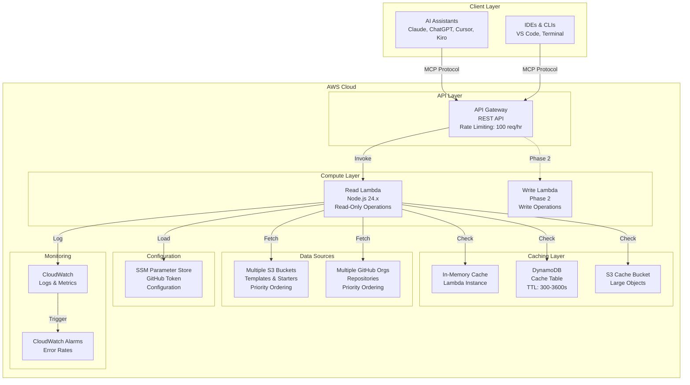
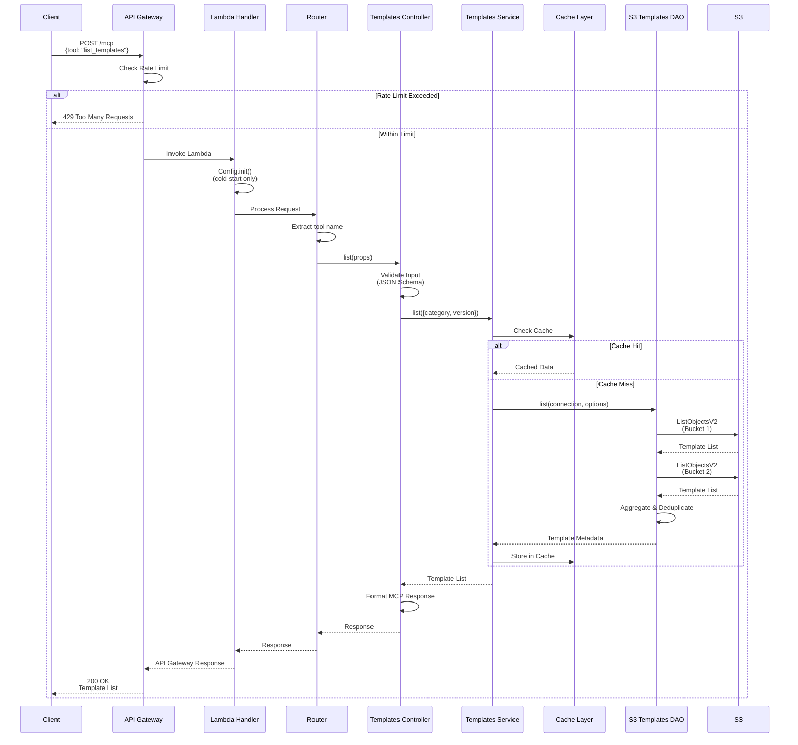
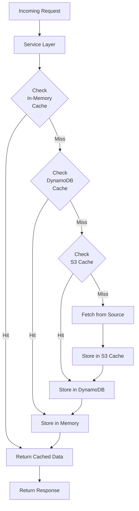
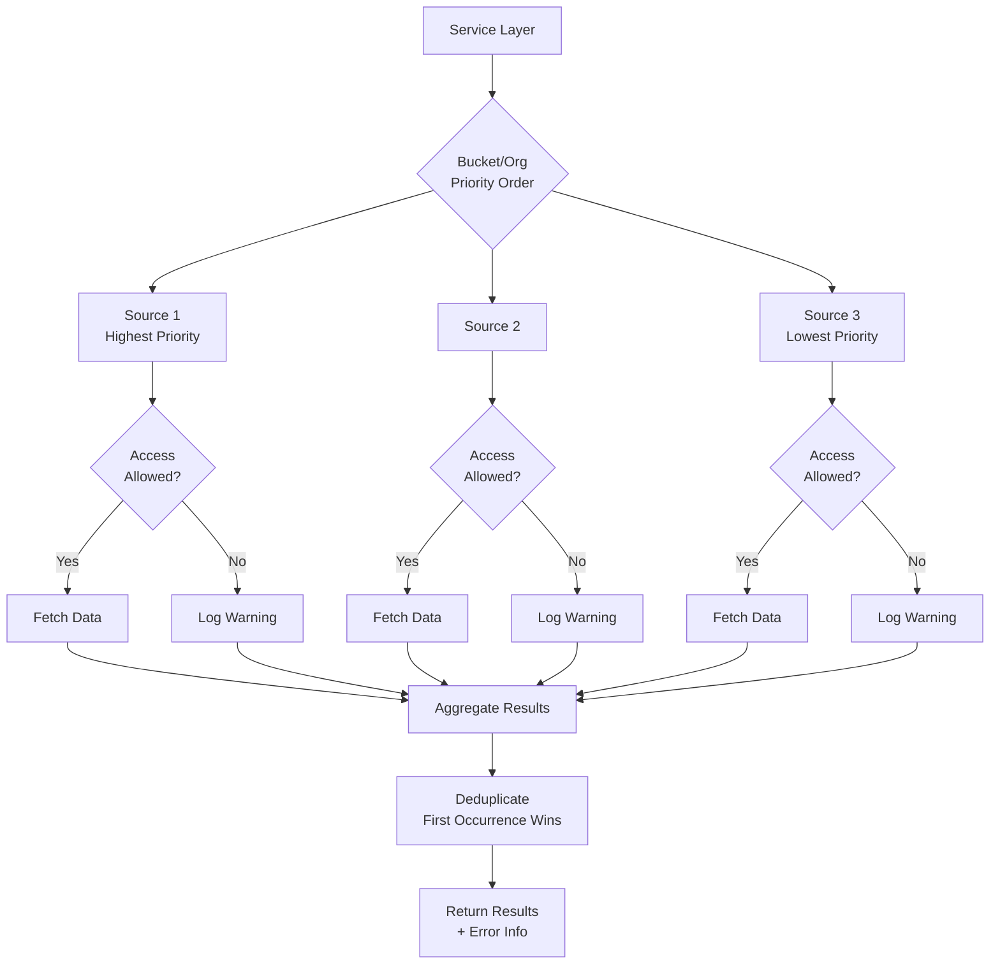
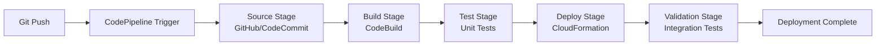
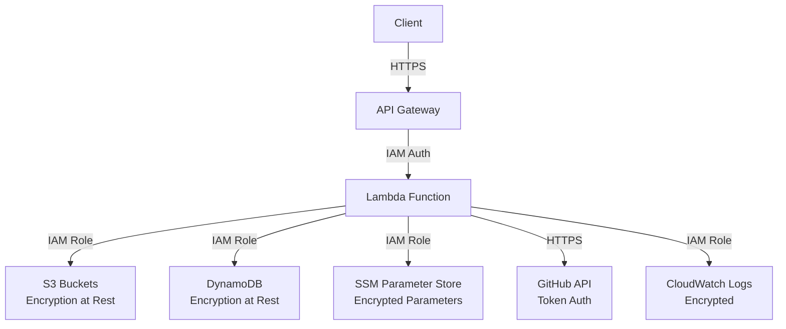

# Architecture Documentation

## Overview

The Atlantis MCP Server is a serverless application that provides AI-assisted development capabilities for the 63Klabs Atlantis Templates and Scripts Platform. It follows a layered architecture pattern with clear separation of concerns.

## High-Level Architecture



## Component Architecture

### Lambda Function Structure

```
application-infrastructure/
├── src/
│   └── lambda/
│       ├── read/                          # Phase 1: Read-Only Operations
│       │   ├── index.js                   # Lambda handler entry point
│       │   ├── package.json               # Dependencies
│       │   ├── config/                    # Configuration management
│       │   │   ├── index.js               # Config initialization
│       │   │   ├── connections.js         # Cache-data connections
│       │   │   └── settings.js            # Application settings
│       │   ├── routes/                    # Request routing
│       │   │   └── index.js               # Route dispatcher
│       │   ├── controllers/               # Request handlers
│       │   │   ├── templates.js           # Template operations
│       │   │   ├── starters.js            # Starter operations
│       │   │   ├── documentation.js       # Documentation search
│       │   │   ├── validation.js          # Naming validation
│       │   │   └── updates.js             # Update checking
│       │   ├── services/                  # Business logic + caching
│       │   │   ├── templates.js           # Template service
│       │   │   ├── starters.js            # Starter service
│       │   │   ├── documentation.js       # Documentation service
│       │   │   └── validation.js          # Validation service
│       │   ├── models/                    # Data access objects
│       │   │   ├── s3-templates.js        # S3 template DAO
│       │   │   ├── s3-starters.js         # S3 starter DAO
│       │   │   ├── github-api.js          # GitHub API DAO
│       │   │   └── doc-index.js           # Documentation index DAO
│       │   ├── views/                     # Response formatting
│       │   │   └── mcp-response.js        # MCP protocol formatter
│       │   └── utils/                     # Utilities
│       │       ├── mcp-protocol.js        # MCP protocol helpers
│       │       ├── schema-validator.js    # JSON Schema validation
│       │       ├── naming-rules.js        # Naming convention rules
│       │       ├── error-handler.js       # Error handling
│       │       └── rate-limiter.js        # Rate limiting logic
│       └── write/                         # Phase 2: Write Operations
│           └── .gitkeep                   # Placeholder
```

### Layer Responsibilities

#### 1. Handler Layer (`index.js`)
- **Purpose**: Lambda entry point
- **Responsibilities**:
  - Cold start initialization
  - Config.init() invocation
  - Request delegation to router
  - Top-level error handling
  - API Gateway response formatting

#### 2. Routing Layer (`routes/`)
- **Purpose**: Request routing
- **Responsibilities**:
  - Extract MCP tool name from request
  - Route to appropriate controller
  - Handle 404 (unknown tools)
  - Handle 405 (unsupported methods)

#### 3. Controller Layer (`controllers/`)
- **Purpose**: Request handling and orchestration
- **Responsibilities**:
  - Input validation (JSON Schema)
  - Parameter extraction
  - Service orchestration
  - Error handling
  - Response formatting

#### 4. Service Layer (`services/`)
- **Purpose**: Business logic and caching
- **Responsibilities**:
  - Implement caching with cache-data
  - Define fetch functions for cache misses
  - Transform DAO data into business objects
  - Aggregate data from multiple sources
  - Handle cache invalidation

#### 5. Model Layer (`models/`)
- **Purpose**: Data access
- **Responsibilities**:
  - S3 API calls
  - GitHub API calls
  - Data parsing and transformation
  - Retry logic
  - Pagination handling
  - Brown-out support

#### 6. View Layer (`views/`)
- **Purpose**: Response formatting
- **Responsibilities**:
  - Format responses per MCP protocol
  - Include tool descriptions
  - Add usage examples
  - Format error responses

#### 7. Utility Layer (`utils/`)
- **Purpose**: Shared utilities
- **Responsibilities**:
  - MCP protocol helpers
  - JSON Schema validation
  - Naming convention validation
  - Error handling utilities
  - Rate limiting logic

## Data Flow Diagrams

### Request Flow: list_templates



### Caching Flow



### Multi-Source Data Aggregation



## Deployment Architecture

### CloudFormation Stack Structure

```
Atlantis MCP Server Stack
├── API Gateway
│   ├── REST API
│   ├── Usage Plan (Rate Limiting)
│   └── API Key (Optional)
├── Lambda Functions
│   ├── Read Function
│   │   ├── Execution Role
│   │   ├── Environment Variables
│   │   └── Layers (if needed)
│   └── Write Function (Phase 2)
├── DynamoDB
│   └── Cache Table
│       ├── TTL Enabled
│       └── On-Demand Billing
├── S3
│   └── Cache Bucket
│       ├── Lifecycle Rules
│       └── Encryption
├── CloudWatch
│   ├── Log Groups
│   ├── Alarms
│   └── Dashboards
└── IAM Roles
    ├── Lambda Execution Role
    ├── CloudFormation Service Role
    └── CodeBuild Service Role
```

### CI/CD Pipeline



## Security Architecture

### IAM Permissions Model

**Read Lambda Permissions** (Least Privilege):
- S3: GetObject, ListBucket, GetObjectVersion
- DynamoDB: GetItem, PutItem, Query, Scan
- SSM: GetParameter
- CloudWatch: PutMetricData, CreateLogStream, PutLogEvents

**Write Lambda Permissions** (Phase 2):
- All Read permissions
- S3: PutObject, DeleteObject
- DynamoDB: UpdateItem, DeleteItem
- CodeCommit: CreateRepository, PutFile
- Additional permissions as needed

### Data Flow Security



## Scalability Considerations

### Lambda Concurrency
- **Reserved Concurrency**: Not set (uses account default)
- **Provisioned Concurrency**: Not used (cold starts acceptable)
- **Expected Load**: Low to moderate (100 req/hr per IP)

### Caching Strategy
- **In-Memory**: Lambda instance lifetime (minutes)
- **DynamoDB**: 5-60 minutes (configurable per resource type)
- **S3**: Large objects, longer TTL (60+ minutes)

### Rate Limiting
- **API Gateway**: 100 requests/hour per IP (configurable)
- **GitHub API**: Respect X-RateLimit-* headers
- **Fallback**: Return cached data when rate limited

## Monitoring and Observability

### CloudWatch Metrics
- Lambda invocations, duration, errors, throttles
- API Gateway requests, latency, 4xx/5xx errors
- DynamoDB read/write capacity, throttles
- Custom metrics: cache hit rate, source failures

### CloudWatch Logs
- Lambda execution logs (structured JSON)
- API Gateway access logs
- Error logs with stack traces
- Request/response logging (sanitized)

### CloudWatch Alarms
- Lambda error rate > 5%
- API Gateway 5xx error rate > 1%
- Lambda duration > 25 seconds
- DynamoDB throttling events

## Performance Characteristics

### Expected Latencies
- **Cache Hit**: 50-200ms
- **Cache Miss (S3)**: 500-2000ms
- **Cache Miss (GitHub)**: 1000-5000ms
- **Cold Start**: 2000-5000ms

### Optimization Strategies
- Multi-tier caching (memory, DynamoDB, S3)
- Parallel source fetching
- Lazy loading of documentation index
- Connection pooling (AWS SDK v3)
- Minimal dependencies

## Related Documentation

- [Lambda Function Structure](./lambda-structure.md)
- [Caching Strategy](./caching-strategy.md)
- [Brown-Out Support](./brown-out-support.md)
- [Namespace Discovery](./namespace-discovery.md)
- [Template Versioning](./template-versioning.md)
- [Testing Procedures](./testing.md)
