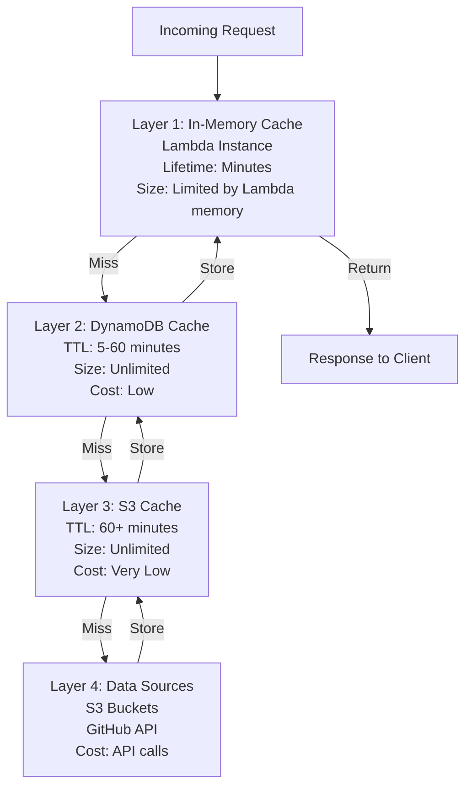

# Caching Strategy and TTL Configuration

## Overview

The Atlantis MCP Server implements a sophisticated multi-tier caching strategy using the @63klabs/cache-data package. This document details the caching architecture, TTL configuration, cache key generation, and best practices for maintaining optimal cache performance.

## Multi-Tier Caching Architecture

### Cache Hierarchy



### Layer Characteristics

| Layer | Storage | Lifetime | Capacity | Latency | Cost |
|-------|---------|----------|----------|---------|------|
| **L1: In-Memory** | Lambda RAM | Container lifetime (minutes) | ~100MB | <10ms | Free |
| **L2: DynamoDB** | DynamoDB Table | Configurable TTL (5-60 min) | Unlimited | 10-50ms | Low |
| **L3: S3** | S3 Bucket | Configurable TTL (60+ min) | Unlimited | 50-200ms | Very Low |
| **L4: Source** | S3/GitHub | N/A | N/A | 500-5000ms | API calls |

## Cache-Data Integration

### CacheableDataAccess Pattern

The service layer uses cache-data's `CacheableDataAccess.getData()` for transparent caching:

```javascript
const { cache: { CacheableDataAccess } } = require('@63klabs/cache-data');

const list = async (options = {}) => {
  // Get connection and cache profile
  const { conn, cacheProfile } = Config.getConnCacheProfile(
    's3-templates', 
    'templates-list'
  );
  
  // Configure connection for cache key
  conn.host = bucketsToSearch;
  conn.parameters = { category, version, versionId };
  
  // Define fetch function for cache miss
  const fetchFunction = async (connection, opts) => {
    return await Models.S3Templates.list(connection, opts);
  };
  
  // Cache-data handles all cache layers automatically
  const result = await CacheableDataAccess.getData(
    cacheProfile,
    fetchFunction,
    conn,
    {}
  );
  
  return result.body;
};
```

### How It Works

1. **Cache Key Generation**: cache-data generates a unique key from connection properties
2. **L1 Check**: Checks in-memory cache first
3. **L2 Check**: If L1 miss, checks DynamoDB
4. **L3 Check**: If L2 miss, checks S3
5. **Source Fetch**: If all miss, calls fetchFunction
6. **Cascade Store**: Stores result in L3 → L2 → L1
7. **Return**: Returns cached or fresh data

## TTL Configuration

### Default TTL Values

Configured in `src/lambda/read/config/settings.js`:

```javascript
const settings = {
  ttl: {
    // Template resources
    fullTemplateContent: parseInt(process.env.TTL_FULL_TEMPLATE_CONTENT) || 3600,      // 1 hour
    templateVersionHistory: parseInt(process.env.TTL_TEMPLATE_VERSION_HISTORY) || 3600, // 1 hour
    templateUpdates: parseInt(process.env.TTL_TEMPLATE_UPDATES) || 3600,                // 1 hour
    templateList: parseInt(process.env.TTL_TEMPLATE_LIST) || 1800,                      // 30 minutes
    
    // Starter resources
    appStarterList: parseInt(process.env.TTL_APP_STARTER_LIST) || 1800,                 // 30 minutes
    
    // GitHub resources
    githubRepoList: parseInt(process.env.TTL_GITHUB_REPO_LIST) || 1800,                 // 30 minutes
    
    // S3 resources
    s3BucketList: parseInt(process.env.TTL_S3_BUCKET_LIST) || 1800,                     // 30 minutes
    
    // Metadata resources
    namespaceList: parseInt(process.env.TTL_NAMESPACE_LIST) || 1800,                    // 30 minutes
    categoryList: parseInt(process.env.TTL_CATEGORY_LIST) || 1800,                      // 30 minutes
    
    // Documentation resources
    documentationIndex: parseInt(process.env.TTL_DOCUMENTATION_INDEX) || 3600           // 1 hour
  }
};
```

### TTL Guidelines by Resource Type

| Resource Type | Default TTL | Rationale | Adjustable? |
|--------------|-------------|-----------|-------------|
| **Full Template Content** | 3600s (1h) | Templates change infrequently | Yes |
| **Template Version History** | 3600s (1h) | Version history is immutable | Yes |
| **Template Updates** | 3600s (1h) | Update checks can be cached | Yes |
| **Template List** | 1800s (30m) | Lists change more frequently | Yes |
| **App Starter List** | 1800s (30m) | Starters added occasionally | Yes |
| **GitHub Repo List** | 1800s (30m) | Repos added occasionally | Yes |
| **S3 Bucket List** | 1800s (30m) | Buckets rarely change | Yes |
| **Namespace List** | 1800s (30m) | Namespaces rarely change | Yes |
| **Category List** | 1800s (30m) | Categories rarely change | Yes |
| **Documentation Index** | 3600s (1h) | Documentation changes infrequently | Yes |

### Adjusting TTL Values

TTL values can be adjusted via CloudFormation parameters:

```yaml
# template.yml
Parameters:
  TTLFullTemplateContent:
    Type: Number
    Default: 3600
    Description: TTL for full template content in seconds
    
  TTLTemplateList:
    Type: Number
    Default: 1800
    Description: TTL for template list in seconds
```

Then set as environment variables:

```yaml
Environment:
  Variables:
    TTL_FULL_TEMPLATE_CONTENT: !Ref TTLFullTemplateContent
    TTL_TEMPLATE_LIST: !Ref TTLTemplateList
```

## Cache Key Generation

### Connection Properties

Cache keys are generated from connection properties:

```javascript
const conn = {
  host: ['bucket1', 'bucket2'],           // Array of buckets
  path: 'templates/v2',                   // S3 prefix
  parameters: {                           // Query parameters
    category: 'storage',
    version: 'v1.2.3',
    versionId: 'abc123'
  }
};
```

### Cache Key Format

cache-data generates keys like:

```
{hostId}:{pathId}:{parameterHash}
```

Example:
```
s3-templates:templates-list:sha256({"category":"storage","version":"v1.2.3"})
```

### Cache Key Best Practices

1. **Include All Filter Parameters**: Ensure parameters that affect results are in cache key
2. **Use Arrays for Multi-Source**: Use array for host when searching multiple buckets/orgs
3. **Consistent Ordering**: cache-data handles parameter ordering automatically
4. **Avoid Sensitive Data**: Don't include credentials or tokens in cache keys

## Cache Profile Configuration

### Profile Structure

Defined in `src/lambda/read/config/connections.js`:

```javascript
const cacheProfiles = {
  'templates-list': {
    hostId: 's3-templates',
    pathId: 'templates-list',
    profile: 'default',
    overrideOriginHeaderExpiration: false,
    defaultExpirationInSeconds: settings.ttl.templateList,
    expirationIsOnInterval: false,
    headersToRetain: '',
    hostEncryption: 'public'
  },
  
  'template-detail': {
    hostId: 's3-templates',
    pathId: 'template-detail',
    profile: 'default',
    overrideOriginHeaderExpiration: false,
    defaultExpirationInSeconds: settings.ttl.fullTemplateContent,
    expirationIsOnInterval: false,
    headersToRetain: 'etag,last-modified',
    hostEncryption: 'public'
  },
  
  'github-repos': {
    hostId: 'github-api',
    pathId: 'repos-list',
    profile: 'default',
    overrideOriginHeaderExpiration: true,  // Ignore GitHub cache headers
    defaultExpirationInSeconds: settings.ttl.githubRepoList,
    expirationIsOnInterval: false,
    headersToRetain: 'x-ratelimit-remaining,x-ratelimit-reset',
    hostEncryption: 'public'
  }
};
```

### Profile Properties

| Property | Purpose | Values |
|----------|---------|--------|
| **hostId** | Identifies the data source | 's3-templates', 'github-api', 'doc-index' |
| **pathId** | Identifies the operation | 'templates-list', 'template-detail', 'repos-list' |
| **profile** | Cache profile name | 'default', 'aggressive', 'conservative' |
| **overrideOriginHeaderExpiration** | Ignore source cache headers | true/false |
| **defaultExpirationInSeconds** | TTL in seconds | 300-3600+ |
| **expirationIsOnInterval** | Align expiration to intervals | true/false |
| **headersToRetain** | Headers to cache | Comma-separated list |
| **hostEncryption** | Encryption classification | 'public', 'private', 'sensitive' |

## Cache Invalidation

### Automatic Invalidation

cache-data automatically invalidates cache entries when:
- TTL expires (DynamoDB TTL attribute)
- Manual invalidation via cache-data API
- Cache storage limits reached (LRU eviction)

### Manual Invalidation

For immediate cache invalidation:

```javascript
const { cache: { Cache } } = require('@63klabs/cache-data');

// Invalidate specific cache entry
await Cache.delete({
  hostId: 's3-templates',
  pathId: 'templates-list',
  parameters: { category: 'storage' }
});

// Invalidate all entries for a host
await Cache.deleteByHost('s3-templates');

// Invalidate all entries for a path
await Cache.deleteByPath('templates-list');
```

### When to Invalidate

Manual invalidation is typically not needed because:
- TTLs are short enough for most use cases
- Data sources change infrequently
- Stale data is acceptable for read-only operations

Consider manual invalidation for:
- Emergency updates to templates
- Critical bug fixes in documentation
- Major platform changes

## Cache Performance Monitoring

### Key Metrics

Track these metrics to optimize caching:

1. **Cache Hit Rate**: Percentage of requests served from cache
2. **Cache Miss Rate**: Percentage of requests requiring source fetch
3. **Average Latency by Layer**: L1, L2, L3, Source
4. **Cache Size**: Memory, DynamoDB, S3 usage
5. **Eviction Rate**: How often cache entries are evicted

### CloudWatch Metrics

```javascript
// Log cache performance
const logCachePerformance = (cacheHit, layer, duration) => {
  DebugAndLog.info('Cache performance', {
    cacheHit,
    layer,
    duration,
    timestamp: Date.now()
  });
  
  // Emit custom metric
  await cloudwatch.putMetricData({
    Namespace: 'AtlantisMCP/Cache',
    MetricData: [{
      MetricName: 'CacheHitRate',
      Value: cacheHit ? 1 : 0,
      Unit: 'None',
      Dimensions: [{
        Name: 'Layer',
        Value: layer
      }]
    }]
  });
};
```

### Optimization Targets

| Metric | Target | Action if Below Target |
|--------|--------|------------------------|
| **Overall Cache Hit Rate** | >80% | Increase TTLs, review cache key strategy |
| **L1 Hit Rate** | >50% | Increase Lambda memory, optimize data structures |
| **L2 Hit Rate** | >30% | Review DynamoDB TTL settings |
| **Average Latency** | <500ms | Optimize cache key generation, reduce data size |

## Downstream Caching Support

### HTTP Cache Headers

The MCP server includes cache headers for downstream caching:

```javascript
// In response
{
  statusCode: 200,
  headers: {
    'Cache-Control': 'public, max-age=1800',
    'ETag': '"abc123def456"',
    'Last-Modified': 'Wed, 29 Jan 2026 12:00:00 GMT',
    'Expires': 'Wed, 29 Jan 2026 12:30:00 GMT'
  },
  body: JSON.stringify(data)
}
```

### Cache-Control Directives

| Directive | Purpose | When to Use |
|-----------|---------|-------------|
| **public** | Allow shared caches | All read-only responses |
| **private** | Only client caching | User-specific data (Phase 2) |
| **max-age=N** | Cache for N seconds | Match internal TTL |
| **no-cache** | Revalidate before use | Frequently changing data |
| **no-store** | Don't cache | Sensitive data (Phase 2) |

## Cache Storage Limits

### Lambda In-Memory Cache

- **Limit**: Lambda memory allocation (default 512MB)
- **Strategy**: LRU eviction when limit reached
- **Optimization**: Cache only frequently accessed data

### DynamoDB Cache

- **Limit**: No practical limit (on-demand billing)
- **Strategy**: TTL-based expiration
- **Optimization**: Set appropriate TTLs to control costs

### S3 Cache

- **Limit**: No practical limit
- **Strategy**: Lifecycle policies for old objects
- **Optimization**: Use S3 Intelligent-Tiering

## Cache Warming

### Cold Start Cache Warming

On Lambda cold start, optionally pre-warm cache:

```javascript
const Config = {
  async init() {
    // ... other initialization
    
    // Pre-warm cache with frequently accessed data
    if (process.env.CACHE_WARMING_ENABLED === 'true') {
      await warmCache();
    }
  }
};

const warmCache = async () => {
  // Fetch and cache category list
  await Services.Templates.listCategories();
  
  // Fetch and cache namespace list
  await Services.Templates.listNamespaces();
  
  // Don't block on warming
  DebugAndLog.info('Cache warming completed');
};
```

### When to Use Cache Warming

**Use cache warming when**:
- Cold starts are frequent
- First request latency is critical
- Warming data is small and frequently accessed

**Don't use cache warming when**:
- Cold start time is already acceptable
- Warming data is large
- Data changes frequently

## Troubleshooting Cache Issues

### Issue: Low Cache Hit Rate

**Symptoms**: Most requests fetch from source

**Possible Causes**:
1. TTLs too short
2. Cache keys not consistent
3. High request diversity (many unique queries)
4. Cache eviction due to memory limits

**Solutions**:
1. Increase TTLs for stable data
2. Review cache key generation logic
3. Increase Lambda memory allocation
4. Optimize data structures to reduce size

### Issue: Stale Data

**Symptoms**: Users see outdated information

**Possible Causes**:
1. TTLs too long
2. Source data changed but cache not invalidated
3. Clock skew between systems

**Solutions**:
1. Reduce TTLs for frequently changing data
2. Implement manual invalidation for critical updates
3. Use NTP for time synchronization

### Issue: High Cache Storage Costs

**Symptoms**: Unexpected DynamoDB or S3 costs

**Possible Causes**:
1. TTLs too long
2. Large objects cached unnecessarily
3. High request diversity creating many cache entries

**Solutions**:
1. Reduce TTLs to increase turnover
2. Implement size limits for cached objects
3. Review cache key strategy to reduce unique entries
4. Enable S3 lifecycle policies

### Issue: Cache Inconsistency

**Symptoms**: Different results for same query

**Possible Causes**:
1. Cache key not including all relevant parameters
2. Race conditions during cache updates
3. Multiple Lambda instances with different in-memory caches

**Solutions**:
1. Review cache key generation to include all parameters
2. Use DynamoDB conditional writes for consistency
3. Accept eventual consistency for in-memory cache

## Best Practices

### DO

✅ Use cache-data's CacheableDataAccess for all external data access
✅ Set TTLs based on data change frequency
✅ Include all filter parameters in cache keys
✅ Monitor cache hit rates and adjust TTLs accordingly
✅ Use appropriate cache profiles for different data types
✅ Log cache performance metrics
✅ Test cache behavior under load

### DON'T

❌ Cache sensitive data without encryption
❌ Set TTLs longer than data staleness tolerance
❌ Bypass cache for frequently accessed data
❌ Include credentials or tokens in cache keys
❌ Assume cache is always available (handle cache failures)
❌ Cache data that changes more frequently than TTL
❌ Ignore cache performance metrics

## Configuration Examples

### Conservative Caching (Shorter TTLs)

```javascript
ttl: {
  fullTemplateContent: 1800,      // 30 minutes
  templateList: 900,               // 15 minutes
  githubRepoList: 600,             // 10 minutes
  documentationIndex: 1800         // 30 minutes
}
```

**Use when**: Data changes frequently, freshness is critical

### Aggressive Caching (Longer TTLs)

```javascript
ttl: {
  fullTemplateContent: 7200,      // 2 hours
  templateList: 3600,              // 1 hour
  githubRepoList: 3600,            // 1 hour
  documentationIndex: 7200         // 2 hours
}
```

**Use when**: Data changes infrequently, performance is critical

### Balanced Caching (Default)

```javascript
ttl: {
  fullTemplateContent: 3600,      // 1 hour
  templateList: 1800,              // 30 minutes
  githubRepoList: 1800,            // 30 minutes
  documentationIndex: 3600         // 1 hour
}
```

**Use when**: Balance between freshness and performance

## Related Documentation

- [Architecture Overview](./architecture.md)
- [Lambda Function Structure](./lambda-structure.md)
- [Performance Optimization](./performance.md)
- [Troubleshooting Guide](../troubleshooting/README.md)
